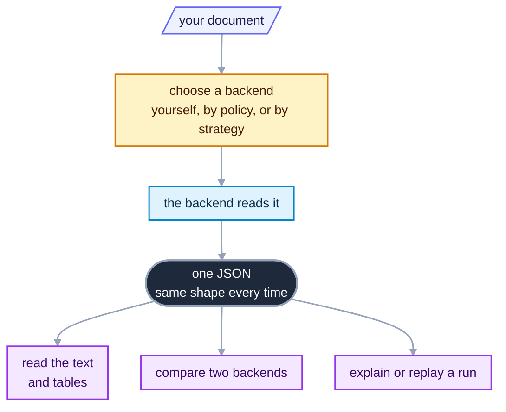

# OpenReading: one JSON over every document parser

[](https://github.com/multiversal-ventures/openreading-core/actions/workflows/ci.yml)
[](#status-and-versioning)
[](pyproject.toml)
[](LICENSE)

OpenReading hands your document to a backend and gives you back one JSON whose shape does not
depend on the backend. A backend is the parser that does the reading, such as PyMuPDF on your
machine or Reducto's hosted API.

OpenReading is a library and a command you run on your own machine. It is not a hosted service, a
user interface, or a model. If you call one parser and want its native output, call that parser
directly. OpenReading earns its place when you switch, compare, or route between parsers.

## What it does

Whichever backend reads your document, you get one shape that you can read, compare, or use to
replay the run.



**The problem.** Every document parser has its own API and its own output shape. Swapping one
parser for another means rewriting the code that reads its result. Comparing two parsers on your
own documents is guesswork, because their outputs do not line up. Some documents, such as a
medical record, must never leave the building at all.

**What you get.** You send one request and read one JSON, whichever parser did the work. That JSON
is the envelope, and it has the same shape for every backend, so code written against one backend
works against all of them. A backend that cannot fill a field leaves it out rather than inventing
a value. You can ask for four things.

- **[parse](src/openreading/cli/README.md)**: you have a document and want its text, its tables,
  and where each block sits on the page. One command returns one JSON.
- **[compare](src/openreading/comparison/README.md)**: you have two backends and want to know where
  their readings of your documents differ. You get a one-word verdict, `equivalent`, `mixed`, or
  `divergent`, and a list of findings naming each difference, for example a table one backend lost.
  Compare picks no winner unless you name one output as the baseline. When you want a ranking,
  `leaderboard` ranks backends against documents you labeled, which means a small `case.json` of
  expected values beside each one ([Evals](src/openreading/evals/README.md), OpenReading's benchmark
  harness).
- **[route](src/openreading/router/README.md)**: some documents may only go to vendors that meet
  a policy. A policy is a short JSON file that lists what a backend must guarantee before it may
  run. The router applies it and drops every failing backend before anything runs.
- **[strategy](src/openreading/strategies/README.md)**: you want a cheap backend first and a
  stronger one only when the first result falls short. A strategy is a named plan that decides
  for you. Each run leaves a trace of which backends ran and why. `explain` prints that trace, and
  `replay` re-runs its decisions against the same document and config.

**What you need.** Bring a backend and a document it can read. Each backend declares its formats,
such as PDF, images, office files, HTML and EPUB.
[The adapter catalog](src/openreading/adapters/README.md) lists the formats per backend. An adapter
is the package that wraps one backend. The router skips a backend that cannot read your file and
records the drop as `unsupported_format`. PyMuPDF and Tesseract run locally with no key, while a
hosted backend needs your vendor key. If you have no document to hand, two synthetic ones ship in
[`examples/`](examples/README.md) and every parse on this page runs against them.

## Install

Four lines give you a working install with two local backends and no API keys. You need `git` and
[`uv`](https://docs.astral.sh/uv/), which fetches Python 3.11+ itself. The Tesseract OCR engine is a
separate system binary, needed only for the `tesseract` backend, and the next section installs it.
Python 3.11+ with `pip` also works. Nothing is on PyPI yet, so install from the clone.

```bash
git clone https://github.com/multiversal-ventures/openreading-core
cd openreading-core
uv sync --all-extras --dev       # every backend extra + the dev tools (same as `make sync`)
uv run openreading backends      # one row per backend, with a CONFIGURED column and the variables each backend still needs
```

Without uv, run `python3 -m venv .venv && .venv/bin/pip install -e '.[pymupdf,tesseract,server]'`
and type `.venv/bin/openreading …` wherever this page says `uv run openreading …`. In that venv,
`openreading backends` marks a hosted backend as missing an extra rather than a variable.

### The two local backends

Neither local backend calls anyone, so nothing you parse with them leaves your machine.

- **PyMuPDF** reads a PDF's own text layer. `uv sync` installs it, and there is nothing else to set
  up. It is the only copyleft component here, dual licensed as AGPL-3.0 or an Artifex commercial
  licence. Its own `[pymupdf]` extra keeps it separate, so you can leave it out. Its own docs are at
  [pymupdf.readthedocs.io](https://pymupdf.readthedocs.io/en/latest/installation.html).
- **Tesseract** renders each page to a bitmap and runs OCR over the pixels. That is what you need
  when a document is a scan or a photograph with no text layer. `uv sync` installs the Python
  wrapper. The OCR engine is a separate system binary you install once: `brew install tesseract`
  on macOS, `sudo apt install tesseract-ocr` on Debian or Ubuntu. Windows and other distributions
  are covered by
  [the Tesseract install guide](https://tesseract-ocr.github.io/tessdoc/Installation.html), and
  each extra language is its own `traineddata` package, such as `tesseract-lang` or
  `tesseract-ocr-deu`.

`uv run openreading backends` is how you check, and both local rows should read `yes` under
CONFIGURED once the OCR binary is installed. A missing engine shows up in the MISSING column by
name rather than as a crash later:

```text
BACKEND                        TYPE               CONFIGURED  MISSING
tesseract                      oss_library        no          tesseract binary (brew install tesseract / apt install tesseract-ocr)
```

## Your first parse

Your first JSON is one command away, because the document is already in the clone.
[`examples/`](examples/README.md) holds two synthetic one-page bank statements, with an invented
name, an invented bank and invented balances. Each has a header, an account block, a balance
summary and a dated transaction table. Parse the January one with PyMuPDF:

```bash
uv run openreading parse examples/john_smith_1000_2026_01.pdf --backend pymupdf > pymupdf.json
```

**You should see** one stderr line from PyMuPDF itself, suggesting the `pymupdf_layout` package for
better page layout analysis. It is not an error, and it does not reach your JSON. Here is
`pymupdf.json`, trimmed to the keys you read first (numbers rounded):

```json
{ "schema_version": "0.3", "status": { "state": "succeeded" },
  "backend": { "id": "pymupdf", "type": "oss_library", "output_paradigm": ["block_tree"] },
  "document": { "page_count": 1,
    "text": "First National Bank\n1000 Junction Highway, Kerrville, TX 78028\nACCOUNT STATEMENT\nAccount Holder:\nJohn Smith\n…",
    "markdown": "First National Bank\n\n1000 Junction Highway, Kerrville, TX 78028 ACCOUNT STATEMENT\n\nAccount Holder:\n\n…",
    "pages": [ { "page_number": 1, "width": 612.0, "height": 792.0, "unit": "pdf_point",
      "blocks": [ { "type": "text", "native_type": "text", "text": "First National Bank", "reading_order": 0,
        "bbox": { "x": 0.0588, "y": 0.0265, "w": 0.2085, "h": 0.0243, "page": 1,
                  "bbox_native": { "coords": [36.0, 21.02, 163.58, 40.3], "origin": "top_left", "unit": "pdf_point" } } } ] } ] },
  "usage": { "pages_processed": 1, "cost_basis": "infra_only" },
  "warnings": [ { "code": "confidence_unavailable", "field": "block_confidence",
                  "message": "PyMuPDF is a deterministic parser; per-element confidence does not exist" } ] }
```

That page has 21 blocks, and one is shown. `schema_version` names the JSON contract rather than the
package you installed, and [Status and versioning](#status-and-versioning) separates the two. The
listing omits `backend_raw` and `channel_provenance`, which
[`src/openreading/schemas/README.md`](src/openreading/schemas/README.md) describes. `backend_raw`
carries the backend's own response untouched, so a vendor field the envelope does not model is
still there. Every backend returns this shape. When a backend cannot produce a field, OpenReading
leaves it out and never invents one, because a made-up confidence looks like a measured one. It
names some of those gaps in `warnings[]`, as PyMuPDF does for confidence here, and leaves others
unannounced. A channel is one kind of output inside the envelope, such as plain text, tables, or
per-block confidence. `channel_provenance` lists the channels this run produced, so read it rather
than waiting for a warning ([The channel
contract](src/openreading/derive/README.md#which-signal-to-trust-when-a-channel-is-missing)).

Now read the same page the other way. Tesseract ignores the text layer, renders the page to a
150-DPI bitmap and OCRs it. That is the work it would do on a photograph of the same statement:

```bash
uv run openreading parse examples/john_smith_1000_2026_01.pdf --backend tesseract > tesseract.json
```
```json
{ "backend": { "id": "tesseract", "type": "oss_library", "output_paradigm": ["element_list"] },
  "document": { "page_count": 1,
    "pages": [ { "page_number": 1, "width": 1275.0, "height": 1650.0, "unit": "pixel",
      "blocks": [
        { "type": "text", "native_type": "line", "text": "First National Bank", "confidence": 0.96, "reading_order": 0, "text_type": "printed" },
        { "type": "text", "native_type": "line", "text": "; Account Hotder-",   "confidence": 0.0,  "reading_order": 3, "text_type": "printed" },
        { "type": "text", "native_type": "line", "text": "John Smith",          "confidence": 0.93, "reading_order": 4, "text_type": "printed" } ] } ] } }
```

Three things differ, and each one is the contract doing its job. The page is 1275×1650 `pixel`
rather than 612×792 `pdf_point`, because that is what Tesseract measured. The `bbox.x/y/w/h`
values stay page-relative fractions either way, so code that positions a block works against both.
Every block carries a `confidence`, and the envelope carries no `warnings[]` at all, because
Tesseract genuinely measures one per word. And OCR misread `Account Holder:` as
`; Account Hotder-` with `confidence: 0.0`, so it told you where it was unsure.

The guides under `src/openreading/` use a different, generated document, with tables, columns and
an image. Build it whenever a guide asks for `sample.pdf`:

```bash
uv run python -c 'from openreading.testing.sample_pdf import build_sample_pdf; open("sample.pdf","wb").write(build_sample_pdf())'
ls -l sample.pdf     # 8688 bytes: a title, two paragraphs, a 3×4 table, two columns, a tiny image
```

## Compare, route, strategy

**Compare.** Compare shows where two backends disagree on a document and names each difference.
You have both readings of the January statement already. Now ask what differs between them:

```bash
uv run openreading compare examples/john_smith_1000_2026_01.pdf --backends pymupdf,tesseract --format diffs
```
```
DIFF — pymupdf vs tesseract   (1 page(s))

① CONTENT — real text/values either side missed
   ✗ DIVERGENT   content shared by all: 0.98
   pymupdf:
     MISSED — 1 line(s) others have that pymupdf lacks:
        - ; Account Hotder-
     ONLY pymupdf — 1 line(s) no other backend captured — mostly readable text:
        + Account Holder:
   tesseract:
     MISSED — 1 line(s) others have that tesseract lacks:
        - Account Holder:
     ONLY tesseract — 1 line(s) no other backend captured — mostly readable text:
        + ; Account Hotder-
…
④ GRANULARITY
   pymupdf 21 blocks  ·  tesseract 26 blocks
```

The two agree on 98% of the page and disagree on one line. The report names that line on both
sides instead of handing you a score to go investigate. Compare does not know which backend is
right, so it does not claim to. You can still see at a glance that the OCR line is the mangled
one. `✗ DIVERGENT` labels the CONTENT section rather than the whole run. The run's one-word
verdict is `equivalent`, because one misread label is not enough to call a winner.
`--format diffs` is where the disagreement itself lives.

**Route.** Route decides which backends may see a sensitive document, and prints the plan before
anything runs. A bank statement is the everyday case. It names a person, an account and every place
they spent money, and plenty of teams may not ship one to an arbitrary vendor. `require_baa` keeps
out every vendor that does not publish a BAA, the HIPAA contract a vendor signs before handling
regulated data. `no_train_on_data` refuses vendors that train on what you send:

```bash
echo '{"require_baa": true, "no_train_on_data": true}' > phi.json
uv run openreading route examples/john_smith_1000_2026_01.pdf --policy phi.json
```
```json
{ "chosen": "pymupdf",
  "fallbacks": ["docling", "azure-document-intelligence", "google-document-ai", "tesseract", "qwen-vl", "anthropic-claude"],
  "dropped": { "reducto": { "stage": 1, "code": "no_baa", "reason": "require_baa set but hipaa_baa='tier_gated' and 'reducto' is not in baa_tier_confirmed" },
               "…": "7 more" },
  "terminal_reason": null }
```

That printed a plan and read nothing. Add `--run` to execute the chosen backend and get the
envelope back beside the plan. Reducto is dropped because its BAA is offered only on some tiers
and none is confirmed here. The three hosted vendors that survive each publish a BAA. That claim
comes from the backend's descriptor, its static self-description of formats, variables and
compliance posture. That is a vendor's advertised offer read on a date, not an agreement you hold,
so `require_baa` narrows the field without finishing the job. Confirm your own signed paperwork
before real data moves, and see [the catalog](src/openreading/adapters/README.md#catalog) for where
each claim came from. A BAA is a HIPAA control, and this example uses a bank statement because that
is the document this clone ships. A policy gates five things: the BAA, training on your data, the
data region, retention, and local-only execution. Descriptors also record `soc2`, `gdpr` and `pci`,
which no policy key reads
([Backend adapters](src/openreading/adapters/README.md#where-those-compliance-claims-come-from)).

The `fallbacks` list is the order a `--run` tries next if `pymupdf` fails. A dropped backend never
joins that list, because a fallback that readmits it would leak the statement silently. Your policy
file is the only thing that sets the eligible set, the backends allowed to run. Three of the
policy's keys widen that set on purpose, which
[Routing and keys](src/openreading/router/README.md#how-it-decides) names. A key the router does
not recognise is refused rather than ignored. That way a typo cannot leave you with a clean exit
code and no filter.

**Strategy.** A strategy gives you the cheap result when it is good enough and the stronger one
when it is not. It checks each output against quality gates. A gate is one test on a result, for
example whether the backend detected scanned pages. Four presets ship: `cost_saver`, `fast`,
`max_accuracy`, and `offline_first`. Run the last one and print its trace:

```bash
uv run openreading parse examples/john_smith_1000_2026_01.pdf --strategy offline_first > strat.json
uv run openreading explain strat.json
```
```
strategy offline_first  →  pymupdf (ok)
  root.steps[0]    pymupdf      succeeded                     41ms  $0
      scanned_pages_detected     obs=False thr=True  ok
      garbled                    obs=0.0189 thr=True  ok
      empty_pages_over           obs=0.0 thr=0.2  ok
      confidence_below           obs=None thr=0.6  skipped
```

The trace shows PyMuPDF ran, three gates passed, and the run stopped there, with no second backend
and no cost. The fourth gate is `skipped` rather than failed, because PyMuPDF reports no
confidence. A missing measurement never counts as a passing one. Timings vary between machines.
Write your own strategy with `uv run openreading strategy --help`. Set `OPENREADING_LEDGER` to a
directory before a long `--strategy` run and every step is journaled there, so an interruption
resumes instead of restarting. Without that variable nothing is written and there is nothing to
resume. A `--backend` run writes no journal, and a batch has no resume of its own. The
[run ledger](src/openreading/ledger/README.md) guide explains the journal.

**A folder at a time.** Point `parse` at a directory and it batches, which is how you run a whole
corpus rather than one file:

```bash
uv run openreading parse examples/ --backend pymupdf --jobs 2 > batch.json
```

Progress goes to stderr, one line per file, so `batch.json` stays pure JSON.

`batch.json` carries one entry per file under `items[]`, each with the source's path and SHA-256.
Its `summary` tells you at a glance whether the sweep went as expected, and the duration varies
between machines:

```json
{ "total": 3, "succeeded": 2, "failed": 0, "skipped": 1, "duration_ms": 82.0,
  "cost_bases": ["infra_only"], "pages_processed": 2, "backends": { "pymupdf": 2 } }
```

The total is three because `examples/README.md` is in that folder too. It is skipped with
`skip_reason: "unsupported_format"` rather than dropped in silence, so the count you get back
always accounts for every file you pointed at. `scripts/batch_demo.sh path/to/docs` runs the same
sweep with both local backends and compares the two corpora.

`parse` takes no `--policy`, so the command above runs with no compliance filter in force. A
corpus reaches the router's compliance filter two other ways: a `policy:` block in
`openreading.yaml` under `parse <dir> --strategy <name> --config openreading.yaml`, or
`openreading.run_batch(paths, policy={…})` from Python.
[Routing and keys](src/openreading/router/README.md#recipes) runs both.

## Bring your own key

A hosted backend works as soon as its vendor key is in `.env`. Without one, the command exits with
code 3 and names the variable:

```bash
uv run openreading parse examples/john_smith_1000_2026_01.pdf --backend reducto
# [reducto] missing required credentials/config: REDUCTO_API_KEY. Sign up / configure: https://platform.reducto.ai
```

To fix it, append the one key you hold to a fresh file with `echo 'REDUCTO_API_KEY=sk_…' >> .env`.
`uv run openreading backends` then shows `reducto … yes`. From then on every Reducto call is
billed to your account.

Never run `cp .env.example .env`. That file ships `DOCLING_SERVE_URL` and `QWEN_VL_ENDPOINT` with
values rather than blanks. A copy therefore marks `docling` and `qwen-vl` configured on a machine
where neither is running. The cost is a different data path rather than extra configuration. Under
a `require_local` policy the copy makes the router send your scan to `http://localhost:5001`, and
the envelope records `docling TerminalError (ConnectError)`. Without the copy the same command
records `docling skipped (missing_credentials)` and the document never reaches a socket.

Two things about that `echo`. `.env` is already in this repo's `.gitignore`, so the file you just
wrote inside a clone is not committed by accident. Your shell records the line itself, which puts
the key in `~/.zsh_history` or `~/.bash_history` in plain text. Prefix the command with a space if
your shell is set to skip those. You can also open `.env` in an editor and type the key there
instead.

## Python and HTTP

From Python or over HTTP you get the same shapes that the command line prints. PyMuPDF writes two
advisory lines to stdout as well, one before the first result line and one before the last.

```python
import openreading
doc = "examples/john_smith_1000_2026_01.pdf"
resp = openreading.run(doc, backend="pymupdf")                    # dict
print(resp["status"]["state"], resp["backend"]["id"])            # succeeded pymupdf
plan = openreading.route(doc, policy={"require_baa": True, "no_train_on_data": True})
print(plan.eligible_ids[0], plan.dropped["reducto"].code)        # pymupdf no_baa
delta = openreading.compare([resp, openreading.run(doc, backend="tesseract")])
print(delta["headline"]["verdict"])                              # equivalent
```
```bash
# document.path is refused over HTTP unless rooted (openreading.server docstring, "Security")
OPENREADING_SERVER_PATH_ROOT="$PWD" uv run openreading serve   # one terminal; listens on http://127.0.0.1:8787 ([server] extra, included above)
# in another terminal, from the same clone:
curl -s -X POST http://127.0.0.1:8787/v1/parse -H 'content-type: application/json' \
  -d '{"document": {"path": "'"$PWD"'/examples/john_smith_1000_2026_01.pdf"}, "backend": {"id": "pymupdf"}}' | head -c 80
# {"schema_version":"0.3","status":{"state":"succeeded"},"backend":{"id":"pymupdf"
curl -s http://127.0.0.1:8787/healthz     # {"status":"ok","version":"0.3.0"}
```

## Status and versioning

**Status: pre-release.** You can build on the JSON shape today, while CLI flags, the Python API
and the strategy grammar may still change before 1.0. The JSON Schemas are stable, pinned byte
for byte by `tests/test_schema_evolution.py`. Nothing is on PyPI and the repository has no git
tags, so install from a clone.

Five numbers travel with this project, and only one of them is the code you installed.

| Number | Where you read it | What it identifies | When it changes |
|---|---|---|---|
| `schema_version` `0.3` | every response envelope | the JSON contract that response obeys | a new version file lands in [`src/openreading/schemas/`](src/openreading/schemas/README.md) |
| package `0.3.0` | `uv run openreading --version`, `openreading.__version__`, `pyproject.toml` | the code you installed | the first tagged release, which has not happened |
| `"version": "0.3.0"` | `GET /healthz` on a running `openreading serve` | the package number of the process answering you | with the package number, never on its own |
| heading `[0.4.0]` | [`CHANGELOG.md`](CHANGELOG.md) | a development milestone merged to `main` | a milestone merges, so it runs ahead of the package number and meets it at the first tagged release |
| codename `Canon (v0.5)` | [`CHANGELOG.md`](CHANGELOG.md) | a branch that carried one body of work | never, because it is a label rather than a version |

Pin a commit SHA. None of the five numbers is a pin, because there are no git tags and no PyPI
release. A SHA is the only way to name the exact code you tested.

## Where the docs are

Because each package directory carries one guide, every question below leads to one guide or one
command.

| You want to know… | Run / open |
|---|---|
| **the full documentation, every guide, and how an agent uses it** | [`src/openreading/README.md`](src/openreading/README.md), then `uv run openreading --help` and `uv run openreading <cmd> --help` for every flag |
| what the shipped example documents contain and where they came from | [`examples/README.md`](examples/README.md) |
| each backend's variables and compliance posture, and the env-var precedence rules | [`src/openreading/adapters/README.md`](src/openreading/adapters/README.md), then `uv run python -m pydoc openreading.credentials` |
| the exact JSON shapes (the contract) | [`src/openreading/schemas/README.md`](src/openreading/schemas/README.md), then the `*.json` files beside it |
| how to cascade backends under quality gates, race them, or compare them from one file | [Strategies](src/openreading/strategies/README.md) |
| what differs between two backends' readings of the same document | [Compare](src/openreading/comparison/README.md) |
| which backends a compliance policy allows, and where each key comes from | [Routing and keys](src/openreading/router/README.md) |
| how to run a folder of documents and read one result | [Batch runs](src/openreading/batch/README.md) |
| how to resume an interrupted run, replay one offline, or erase what it recorded | [The run ledger](src/openreading/ledger/README.md) |
| how to put the same engine behind an HTTP API on your own machine | [The HTTP server](src/openreading/server/README.md) |
| how to score and rank backends on documents you labeled | [Evals](src/openreading/evals/README.md) |
| every command, its flags, and the exit code your script branches on | [The command line](src/openreading/cli/README.md) |
| why a response leaves a field out instead of inventing it | [The channel contract](src/openreading/derive/README.md) |
| the Python API, every reference section, and how to add a backend | `uv run python -m pydoc openreading`, then the same command with `.<module>` appended. For a new backend, `uv run python -m pydoc openreading.adapters`, then `scripts/new_adapter.py` |
| the checks a change must pass | `make verify` runs lint, types, pytest at a 91% coverage floor, and the schema and smoke checks. `uv run pytest -m "not live" --collect-only` prints the offline test count. |

## Contributing · Security · License

[`CONTRIBUTING.md`](CONTRIBUTING.md) · [`SECURITY.md`](SECURITY.md) ·
[`AGENTS.md`](AGENTS.md), the conventions humans and agents both follow · Apache-2.0
([`LICENSE`](LICENSE)). The `[pymupdf]` extra is the one copyleft component, as the Install section
says.

`openreading-core` is the engine itself: the schemas, every backend adapter, the compliance-first
router, strategies, compare, batch, the ledger, the local server, and the benchmark harness.
[`AGENTS.md`](AGENTS.md) states which additions belong in this repository and which do not.
