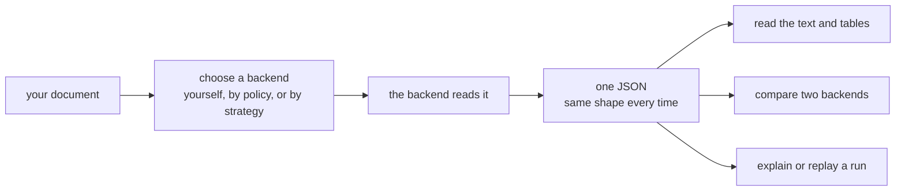

# OpenReading

[](https://github.com/multiversal-ventures/openreading-core/actions/workflows/ci.yml)


OpenReading hands your document to a backend and gives you back one JSON whose shape does not
depend on the backend. A backend is the parser that does the reading, such as PyMuPDF on your
machine or Reducto's hosted API.

## What it does

Whichever backend reads your document, you get one shape that you can read, compare, or replay.



**The problem.** Every document parser has its own API and its own output shape. Swapping one
parser for another means rewriting the code that reads its result. Comparing two parsers on your
own documents is guesswork, because their outputs do not line up. Some documents, such as a
medical record, must never leave the building at all.

**What you get.** You send one request and read one JSON, whichever parser did the work. The
JSON has the same keys for every backend, so code written against one backend works against all
of them. You can ask for four things, each of which answers a problem you already have.

- **[parse](src/openreading/cli/README.md)**: you have a document and want its text, its tables,
  and where each block sits on the page. One command returns one JSON.
- **[compare](src/openreading/comparison/README.md)**: you have two backends and want to know
  which one reads your documents better. You get a verdict naming what differs, for example a
  table that one backend lost.
- **[route](src/openreading/router/README.md)**: some documents may only go to vendors that meet
  a policy. A policy is a short JSON file that lists what a backend must guarantee before it may
  run. The router applies it and drops every failing backend before anything runs.
- **[strategy](src/openreading/strategies/README.md)**: you want a cheap backend first and a
  stronger one only when the first result falls short. A strategy is a named plan that decides
  for you. Each run leaves a trace of which backends ran and why, for you to print or replay.

**What you need.** Bring a backend and a document it can read. Each backend declares its formats,
such as PDF, images, office files, HTML and EPUB.
[The adapter catalog](src/openreading/adapters/README.md) lists the formats per backend. The
router skips a backend that cannot read your file and records the drop as `unsupported_format`.
PyMuPDF and Tesseract run locally with no key, while a hosted backend needs your vendor key.
OpenReading is not a hosted service, a UI, or a model.

## Install

Two commands give you a working install with two local backends and no API keys. You need `git`,
the `tesseract` binary (`brew install tesseract` or `apt install tesseract-ocr`), and
[`uv`](https://docs.astral.sh/uv/), which fetches Python 3.11+ itself. Python 3.11+ with `pip`
also works. Nothing is on PyPI yet, so install from the clone.

```bash
git clone https://github.com/multiversal-ventures/openreading-core
cd openreading-core
uv sync --all-extras --dev       # every backend extra + the dev tools (same as `make sync`)
uv run openreading backends      # one row per backend: pymupdf and tesseract yes; hosted backends no, most naming the var they need
```

Without uv, run `python3 -m venv .venv && .venv/bin/pip install -e '.[pymupdf,tesseract,server]'`
and type `.venv/bin/openreading …` wherever this page says `uv run openreading …`. In that venv,
`openreading backends` marks a hosted backend as missing an extra rather than a variable.

## Your first parse

Your first JSON is three commands away. If the `tesseract` row says `no` under MISSING, install
the binary now. Generate a two-page sample document, or copy any PDF of your own to `sample.pdf`,
then parse it:

```bash
uv run python -c 'from openreading.testing.sample_pdf import build_sample_pdf; open("sample.pdf","wb").write(build_sample_pdf())'
ls -l sample.pdf     # 8688 bytes: a title, two paragraphs, a 3×4 table, two columns, a tiny image
uv run openreading parse sample.pdf --backend pymupdf > pymupdf.json
```

You should see one stderr line, `Consider using the pymupdf_layout package …`. That is PyMuPDF's
advice, not an error. Here is `pymupdf.json`, trimmed to the keys you read first (numbers rounded):

```json
{ "schema_version": "0.3", "status": { "state": "succeeded" },
  "backend": { "id": "pymupdf", "type": "oss_library", "output_paradigm": ["block_tree"] },
  "document": { "page_count": 2,
    "text": "OpenReading Test Document\nThis is the first paragraph rendered at twelve points. …",
    "markdown": "# OpenReading Test Document\n\n…| Region | Units | Revenue |\n| --- | --- | --- |\n| North | 120 | 4400 |…",
    "pages": [ { "page_number": 1, "width": 612.0, "height": 792.0, "unit": "pdf_point",
      "blocks": [ { "type": "title", "text": "OpenReading Test Document", "reading_order": 0,
        "bbox": { "x": 0.1176, "y": 0.0739, "w": 0.4323, "h": 0.0347, "page": 1,
                  "bbox_native": { "coords": [72.0, 58.5, 336.56, 85.98], "origin": "top_left", "unit": "pdf_point" } } } ] } ] },
  "warnings": [ { "code": "confidence_unavailable", "field": "block_confidence",
                  "message": "PyMuPDF is a deterministic parser; per-element confidence does not exist" } ] }
```

This listing omits `usage`, `backend_raw` and `channel_provenance`, which
[`src/openreading/schemas/README.md`](src/openreading/schemas/README.md) describes. Every backend
returns this shape. When a backend cannot produce a field, OpenReading leaves it out and names it
in `warnings[]`. It never invents one, because a made-up confidence looks like a measured one.

## Compare, route, strategy

**Compare.** Compare tells you which backend read a document better and what the other missed.
Parse the same sample with Tesseract, then ask what differs. You should see this, abbreviated:

```bash
uv run openreading parse sample.pdf --backend tesseract > tesseract.json
uv run openreading compare sample.pdf --backends pymupdf,tesseract --format diffs
```
```
DIFF — pymupdf vs tesseract   (2 page(s))
① CONTENT — real text/values either side missed
   ✔ EQUIVALENT   content shared by all: 1.00  ·  0 real misses
② TABLES — 1 table(s)
   table counts differ: {'pymupdf': 1, 'tesseract': 0}
…
```

Both backends got every word, while OCR lost the table's structure. If you see the line
`[tesseract] tesseract failed: tesseract is not installed…` (exit 3), install the binary.

**Route.** Route hands a sensitive document only to backends that meet your policy. The sample
stands in for a medical record. `require_baa` demands a BAA, which is the HIPAA contract a vendor
signs before handling health data. `no_train_on_data` refuses vendors that train on what you send:

```bash
echo '{"require_baa": true, "no_train_on_data": true}' > phi.json
uv run openreading route sample.pdf --policy phi.json
```
```json
{ "chosen": "pymupdf",
  "fallbacks": ["docling", "azure-document-intelligence", "google-document-ai", "tesseract", "qwen-vl", "anthropic-claude"],
  "dropped": { "reducto": { "stage": 1, "code": "no_baa", "reason": "require_baa set but hipaa_baa='tier_gated' and 'reducto' is not in baa_tier_confirmed" },
               "…": "5 more" },
  "terminal_reason": null }
```

Reducto is dropped because its BAA is offered only on some tiers and none is confirmed here. The
`fallbacks` list is the order OpenReading tries next if `pymupdf` fails. A dropped backend never
joins that list, because a fallback that readmits it would leak the record silently.

**Strategy.** A strategy gives you the cheap result when it is good enough and the stronger one
when it is not. It checks each output against quality gates. A gate is one test on a result, for
example whether the backend detected scanned pages. Four presets ship: `cost_saver`, `fast`,
`max_accuracy`, and `offline_first`. Run the last one and print its trace:

```bash
uv run openreading parse sample.pdf --strategy offline_first > strat.json
uv run openreading explain strat.json
```
```
strategy offline_first  →  pymupdf (ok)
  root.steps[0]    pymupdf      succeeded                     66ms  $0
      scanned_pages_detected     obs=False thr=True  ok
      …
```

The trace shows PyMuPDF ran, the scanned-pages gate passed, and the run stopped there. Timings
vary between machines. Write your own strategy with `uv run openreading strategy --help`. An
interrupted run resumes from its journal, which records every step so far. The
[run ledger](src/openreading/ledger/README.md) guide explains it.

## Bring your own key

A hosted backend works as soon as its vendor key is in `.env`. Without one, the command exits with
code 3 and names the variable:

```bash
uv run openreading parse sample.pdf --backend reducto
# [reducto] missing required credentials/config: REDUCTO_API_KEY. Sign up / configure: https://platform.reducto.ai
```

To fix it, run `echo 'REDUCTO_API_KEY=sk_…' > .env` rather than copying `.env.example`, because
that file pre-fills two localhost endpoints. Then `uv run openreading backends` shows
`reducto … yes`. From then on every Reducto call is billed to your account.

## Python and HTTP

From Python or over HTTP you get the same shapes that the command line prints.

```python
import openreading
resp = openreading.run("sample.pdf", backend="pymupdf")          # dict
print(resp["status"]["state"], resp["backend"]["id"])            # succeeded pymupdf
plan = openreading.route("sample.pdf", policy={"require_baa": True, "no_train_on_data": True})
print(plan.eligible_ids[0], plan.dropped["reducto"].code)        # pymupdf no_baa
delta = openreading.compare([resp, openreading.run("sample.pdf", backend="tesseract")])
print(delta["headline"]["verdict"])                              # mixed
```
```bash
uv run openreading serve         # one terminal; listens on http://127.0.0.1:8787 ([server] extra, included above)
curl -s -X POST http://127.0.0.1:8787/v1/parse -H 'content-type: application/json' \
  -d '{"document": {"path": "'"$PWD"'/sample.pdf"}, "backend": {"id": "pymupdf"}}' | head -c 80   # another
# {"schema_version":"0.3","status":{"state":"succeeded"},"backend":{"id":"pymupdf"
curl -s http://127.0.0.1:8787/healthz     # {"status":"ok","version":"0.3.0"}
```

## Status and versioning

**Status: pre-release.** You can build on the JSON shape today, while CLI flags, the Python API
and the strategy grammar may still change before 1.0. The JSON Schemas are stable, pinned byte
for byte by `tests/test_schema_evolution.py`. The package version is `0.3.0` in `pyproject.toml`
and `openreading.__version__`. It is not on PyPI and has no git tags yet, so install from a
clone. [`CHANGELOG.md`](CHANGELOG.md) records development milestones. Its newest heading,
`0.4.0`, is a milestone label, not a published release. The two numbers meet when the first
release is tagged.

## Where the docs are

Because each package directory carries one guide, every question below leads to one guide or one
command.

| You want to know… | Run / open |
|---|---|
| **the full documentation, every guide, and how an agent uses it** | [`src/openreading/README.md`](src/openreading/README.md), then `uv run openreading --help` and `uv run openreading <cmd> --help` for every flag |
| each backend's variables and compliance posture, and the env-var precedence rules | [`src/openreading/adapters/README.md`](src/openreading/adapters/README.md), then `uv run python -m pydoc openreading.credentials` |
| the exact JSON shapes (the contract) | [`src/openreading/schemas/README.md`](src/openreading/schemas/README.md), then the `*.json` files beside it |
| strategies · compare · routing and keys · batch · the ledger · the server · evals · the CLI · the channel contract | [Strategies](src/openreading/strategies/README.md) · [Compare](src/openreading/comparison/README.md) · [Routing and keys](src/openreading/router/README.md) · [Batch runs](src/openreading/batch/README.md) · [The run ledger](src/openreading/ledger/README.md) · [The HTTP server](src/openreading/server/README.md) · [Evals](src/openreading/evals/README.md) · [The command line](src/openreading/cli/README.md) · [The channel contract](src/openreading/derive/README.md). The docs home links them all. |
| the Python API, every reference section, and how to add a backend | `uv run python -m pydoc openreading`, then the same command with `.<module>` appended. For a new backend, `uv run python -m pydoc openreading.adapters`, then `scripts/new_adapter.py` |
| the test gate | `make verify` runs lint, types, pytest at a 91% coverage floor, and the schema and smoke checks. `uv run pytest -m "not live" --collect-only` prints the offline test count. |

## Contributing · Security · License

[`CONTRIBUTING.md`](CONTRIBUTING.md) · [`SECURITY.md`](SECURITY.md) · Apache-2.0
([`LICENSE`](LICENSE)). The `[pymupdf]` extra is the only AGPL-3.0 component, kept separate so
that you can leave it out.
