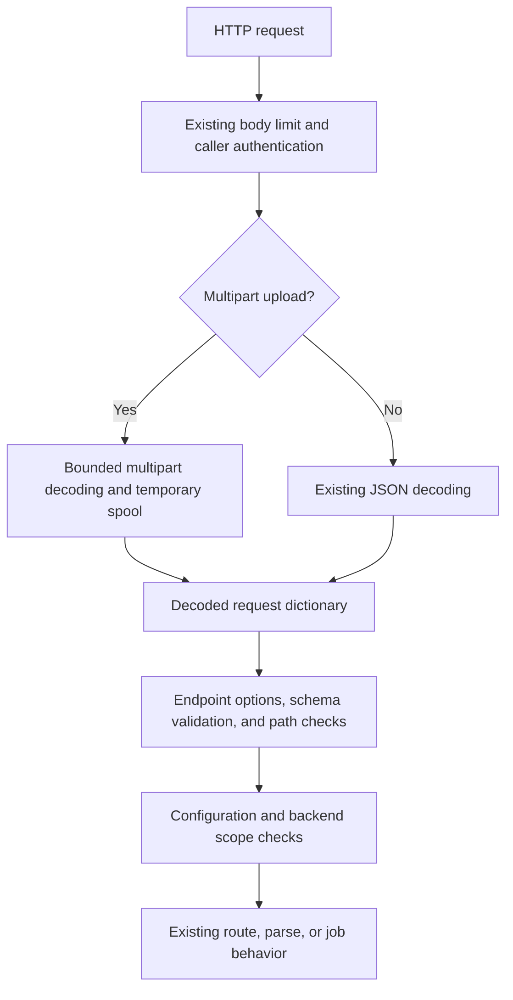

# HTTP file uploads

**Status:** proposed, not built. **Revision:** 1. **Date:** 2026-09-09.

You submit client files through existing HTTP endpoints while preserving OpenReading's internal request and response contracts.
The [product spec](../product/specs/http-file-uploads.product-spec.md) owns goals, release scope, and acceptance criteria AC-1 through AC-14.
This record defines the proposed implementation boundary for review, and this branch adds no runtime behavior.

## 1. Decision and alternatives

Accept `multipart/form-data` alongside JSON on `/v1/parse`, `/v1/route`, and `/v1/jobs`, with exactly one uploaded document per request.
An ingress decoder converts multipart content into the existing request before normal validation and execution.
Ingress is the boundary where HTTP content becomes an OpenReading request, before any backend receives it.
A backend is a processing implementation called through an adapter, such as the current Docling HTTP adapter.
A descriptor is that adapter's static declaration of capabilities, configuration, and the document formats it accepts.
Each backend reads the formats its descriptor claims in the [adapter catalog](../src/openreading/adapters/README.md).

| Approach | Benefit | Decision |
|---|---|---|
| Multipart on existing endpoints | Existing options and results apply to ordinary file uploads. | Recommended for this release. |
| Separate `/v1/upload` parse endpoint | A dedicated route can expose simple form parameters. | Rejected because execution and documentation would acquire a parallel entry point. |
| Persistent `/v1/files` upload service | Clients can upload once and reference a stored file. | Deferred because identifiers require retention, ownership, deletion, and storage contracts. |
| Client base64 helpers only | The server needs no new encoding support. | Rejected because curl and browser callers still need custom encoding logic. |

Multipart is an HTTP representation, so it adds no new source variant to `DocumentInput` or the vendored request schema.
The resulting request still contains exactly one source, represented by `document.bytes_base64`, before entering existing execution.

## 2. Current implementation boundaries

This design was checked against repository commit `de0e905`, including server handlers and the vendored request version 0.3.
These references identify implementation seams rather than documenting a second copy of their full behavior.

| Existing seam | Consequence for implementation |
|---|---|
| `openreading.server.app.parse` decodes JSON directly. | Use the same transport decoder as other single-document handlers. |
| `_parse_request` serves route and job submission. | Keep schema validation and path checks shared after decoding. |
| Parse removes `keep_candidates` before schema validation. | Preserve that parse-only extension without accepting it on route or jobs. |
| `_BodyLimitMiddleware` bounds raw incoming bytes. | Preserve its declared-length fast path and make streamed overflow return a reliable 413. |
| `_gate_document_path` controls server filesystem access. | Multipart produces bytes and never needs this opt-in path permission. |
| `api._MAX_DOWNLOAD_BYTES` defines the 100 MiB document ceiling. | Reuse its value rather than introducing an independently maintained upload ceiling. |
| `openreading.derive.mime.resolve_mime_type` owns type resolution. | Call it with explicit metadata and content rather than adding extension tables. |
| `DoclingAdapter.submit` forwards bytes with a filename. | Preserve the upload filename to avoid its `doc.pdf` fallback. |
| The `server` extra contains FastAPI and Uvicorn. | Add the multipart parser there and in development dependencies during implementation. |

## 3. Multipart wire contract

The top-level content type must identify `multipart/form-data` with a valid boundary when using the upload representation.
The request contains exactly two parts, and either part may appear first in the transmitted body.

| Part | Kind | Required content |
|---|---|---|
| `file` | File part with a filename | One nonempty binary document, subject to the file-size ceiling. |
| `request` | Form field without a filename | One UTF-8 JSON object containing existing request options. |

The `request` part may have `application/json` or a text content type, but its content is always parsed as JSON.
An omitted metadata charset means UTF-8, and an explicitly different charset produces an HTTP 400 error.
Invalid UTF-8 must fail before any parser fallback can silently reinterpret the metadata bytes as another encoding.
A metadata file can be sent with curl's `request=<options.json` syntax, which creates a field without a filename.
Sending `request=@options.json` creates another file part and is rejected with an explanatory HTTP 400 error.

Both part names are case-sensitive, and duplicates are rejected instead of choosing the first or last value.
Unknown parts, multiple file parts, missing parts, and empty file contents are also HTTP 400 errors.
The `request` part stays mandatory rather than defaulting to a null backend, because an omitted part and a forgotten part look identical on the wire.
Duplicate keys inside the multipart JSON field decode exactly as they do in a JSON body, so one decoder serves both encodings.
The source-exclusivity rules below catch an ambiguous document source after decoding, whichever encoding carried it.

The JSON object keeps the existing `backend` object requirement and all other supported request fields.
For example, `{"backend":{"id":null}}` requests the existing configured default behavior without an upload-specific backend choice.
`/v1/jobs` keeps refusing a null backend identifier with its existing 400, because a job record needs a named backend or strategy.

`request.document` may be absent or contain only `mime_type` and `password`, subject to their existing schema types.
The fields `path`, `url`, `bytes_base64`, and `file_id` are prohibited there, even when their values are null.
The `filename` field is also prohibited there because the file part supplies the single authoritative upload name.
Unknown document fields are rejected rather than removed, preserving the existing strict request-shape validation contract.

| Metadata example | Outcome |
|---|---|
| `{"backend":{"id":"docling"}}` | Build the document from uploaded bytes and the file-part metadata. |
| `{"backend":{},"document":{"password":"example"}}` | Retain the password for normal downstream handling. |
| `{"backend":{},"document":{"path":"/tmp/report.docx"}}` | Return 400 because a multipart upload already supplies its document source. |
| `{"backend":{},"document":{"filename":"different.docx"}}` | Return 400 because the filename must come from the file part. |
| `{"backend":{},"unexpected":true}` | Return 400 through existing request-schema validation. |

The parse-only `keep_candidates` option retains its existing behavior when supplied in the multipart request field.
Its extraction stays in the parse handler, and sibling endpoints continue rejecting it through their existing validation.

## 4. Filename and MIME handling

The decoder derives a basename from the uploaded filename, treating both slash styles as directory separators.
For example, `C:\fakepath\report.docx` and `/home/user/report.docx` both become the metadata value `report.docx`.
Unicode characters and spaces are preserved, and the basename must fit within 255 UTF-8 bytes.
Treating a backslash as a separator drops a Unix name that contains one, which is accepted so a browser `fakepath` prefix never reaches metadata.
This bound keeps retained filename metadata small independently of the larger multipart request-body size limit.
An empty basename, `.` or `..`, or a basename containing control characters produces HTTP 400.
The filename is metadata only and never controls a temporary path or an output destination.

MIME type selection uses the following precedence before invoking the shared resolver for any remaining inference:

1. A supplied `request.document.mime_type` is the existing explicit override and retains its current semantics.
2. A specific file-part content type becomes the explicit hint when the request supplies none.
3. Missing types and `application/octet-stream` defer to the shared resolver using bytes and the sanitized filename.

The file-part content type is reduced to its media type before use, without charset parameters.
The shared resolver keeps its current byte-sniffing and filename fallback behavior, including an unknown result when neither resolves.
The upload decoder adds no document-format allowlist or format conversion, and it never assumes that unknown content is PDF.

## 5. Processing and ownership

The decoder belongs in a focused server module, provisionally `openreading.server.uploads`, with no dependency on adapters.
It uses Starlette's multipart support backed by `python-multipart`, avoiding a new hand-written MIME parser.
Framework upload handling provides temporary spooling, but resource limits remain OpenReading's explicit responsibility.
[Starlette request documentation](https://starlette.dev/requests/) describes the upload object and the distinction between field limits and file storage.

Decode one request dictionary, then retain the existing schema validator and Pydantic model validation in their current order.
For multipart, build `document.bytes_base64` from uploaded bytes and release temporary upload resources before downstream execution.
Downstream code receives a normal request, so no job retains an `UploadFile` object or a temporary filesystem path.

Do not broaden `_parse_request` into backend dispatch, configuration resolution, or candidate-retention behavior during this change.
Share transport decoding across handlers while preserving each endpoint's existing responsibilities and response construction paths.

The middleware order remains CORS, raw body limit, and caller authentication before handler-level decoding starts.
CORS is the browser-origin policy, and configured origins must still receive headers on upload errors.
An oversized declared body can return 413 before authentication, while an ordinary unauthorized request returns 401 without parsing uploads.
Backend scope validation remains before any adapter dispatch, including named strategy leaves and configured default chains.

No backend receives file content until the complete multipart structure and assembled request have passed validation.
For example, a valid file followed by an unexpected third part must fail without any backend call.

## 6. Limits and failure cleanup

| Resource | Proposed limit | Enforcement |
|---|---|---|
| Entire HTTP body | Existing `OPENREADING_MAX_BODY_BYTES`, default 150 MiB | Count raw received bytes, including framing and headers inside the body. |
| Uploaded file | Existing document ceiling, currently 100 MiB | Verify actual parsed size and bound reads before base64 allocation. |
| `request` field | 1 MiB in UTF-8 bytes | Bound the field during parsing and before JSON decoding. |
| File count | One | Configure parser limits and reject duplicates explicitly. |
| Metadata field count | One | Configure parser limits and inspect every parsed field. |
| Retained filename | 255 UTF-8 bytes | Validate the basename before constructing document metadata. |

The raw body limit bounds temporary disk consumption during parsing, even before the file-size check becomes available.
The document-size check must run before reading an entire spooled file into memory or constructing its base64 representation.
A file over the document ceiling but under the body ceiling spools completely before refusal, so one such request can cost up to the full body limit in temporary disk.
No unbounded `request.body()` call may precede multipart parsing, and `Content-Length` alone never establishes actual received size.

The raw body limiter records overflow independently from downstream handler exceptions and returns the existing 413 envelope.
Its receive wrapper must stop exposing bytes after the ceiling, including when declared length understates the actual body.
On overflow, let downstream cleanup unwind before emitting the single error response, without forwarding a competing handler error.
No success response may be sent for an incomplete upload, and no second response may follow the chosen 413.

This tightens shared streamed-overflow behavior for JSON too, as explicitly allowed by the product acceptance criteria.
Existing declared-length precedence and CORS behavior remain covered by their current tests alongside the new streaming cases.

Starlette's field-size option does not cap uploaded file bytes, so it cannot replace either byte-count check.
Implementation must inspect the supported parser version and verify its cleanup behavior when parsing exits exceptionally.
An upload context manager alone may not cover a disconnect before a complete form object exists.
Close partially created spool files explicitly on parser failures, size failures, cancellation, disconnect, and filesystem errors.

Temporary files use generated names and normal restricted temporary-file permissions, with no destination derived from client metadata.
A failure to create or write temporary storage returns a sanitized HTTP 500 without dispatching a backend.
Upload bodies, document passwords, and full multipart fields must not appear in diagnostic logs or parser error messages.
Release verification must include a malformed password-bearing metadata field and confirm that the error response never echoes its contents.

Peak memory per upload is several times the file size: the raw bytes, their base64 text, the decoded copy in `api.run_request`, and a backend payload that encodes them again.
The server README documents that multiplier under Operations, because the receive-time spool does not lower it.
This design promises bounded ingestion per request, rather than constant-memory execution or a new global concurrency controller.
Existing explicitly enabled ledger behavior and backend retention remain outside the lifetime of the upload spool.

## 7. Endpoint behavior and errors

| Situation | HTTP status and behavior |
|---|---|
| Valid multipart parse | Existing response schema and parse status behavior. |
| Valid multipart route | Existing routing response without backend execution. |
| Valid multipart job submission | Existing terminal response or 202 pending job behavior. |
| Malformed multipart, metadata, or assembled request | 400 with `error.category = bad_request`. |
| Body, file, or metadata byte ceiling exceeded | 413 with `error.category = terminal` and `backend_code = doc_too_large`. |
| Missing or invalid configured caller authentication | Existing 401 unauthorized envelope. |
| Backend scope violation | Existing 403 scope-denied envelope before backend dispatch. |
| Unknown backend, missing configuration, or execution failure | Existing endpoint-specific mapping, without upload-specific replacement statuses. |
| Multipart sent to `/v1/batch` or another JSON-only endpoint | Existing 400 rejection with no partial upload execution. |

Part count and filename-length violations are shape failures returning 400, whereas the three byte ceilings return 413.
The 413 message names the exceeded resource and configured limit without echoing uploaded content or passwords.
The metadata ceiling keeps `doc_too_large` rather than introducing a new backend code, and its message names the `request` field as the exceeded resource.
An upload size exception must survive handler validation wrappers instead of becoming a generic 400.

Dispatch to multipart decoding only for the parsed `multipart/form-data` media type, with case-insensitive media-type matching.
Other content types keep existing JSON decoding behavior, including existing callers that omit a JSON content-type header.
No new 415 status or global strict-content-type requirement is introduced as part of this release.

Job submission consumes the upload before responding, and its existing store retains the same slim request representation.
Uploading through `/v1/jobs` does not turn an inline backend into a background worker or a durable queue.
Docling can therefore finish during submission under the adapter's existing inline behavior, even when using the jobs endpoint.

The existing idempotency key is forwarded unchanged, with tests covering parse-cache equivalence after upload normalization.
The feature adds no resumable transfer, persistent deduplication, or guarantee that retries after disconnect avoid duplicate processing.
Existing execution deadlines are unchanged, and receive-time limits remain the deployed HTTP server or proxy's responsibility.

## 8. Folder and batch boundary

A folder is a client selection operation, so enumeration happens on the machine containing its files.
The server receives individual documents without learning a directory it could traverse on that client's behalf.
The product recipe demonstrates serial uploads with a local relative-path mapping and separate outcomes for every file.

The mapping preserves complete relative filenames before appending `.response.json`, so duplicate basenames never overwrite each other.
For example, `a/report.docx` maps to `a/report.docx.response.json`, with the output root outside the input tree.
The recipe skips hidden entries and symlinks, retains failed HTTP bodies, and reports transport and local-read failures separately.
It sorts selected files by relative path, continues after failures, and ends with totals and a nonzero failure exit.
No automatic retries are included, because a failed connection does not establish whether document processing already occurred.

The recipe ships as a standard-library Python script, provisionally `scripts/upload_folder.py`, because the client machine has Python and curl but no OpenReading install.
It copies the traversal rules of `openreading.batch.sources` (bytewise relative-path order, hidden entries and symlinks skipped) without importing them, and its docstring names that module as the reference.
Tests under `tests/` run the script against a temporary directory for AC-10, and the server README shows its invocation.
This release adds no supported remote-client API surface, and the script is a documented recipe rather than a public module.
If a later remote CLI is approved, reuse the intake implementation wherever its local-source contract applies.

A future multipart `/v1/batch` extension needs a manifest mapping each uploaded part to a document and stable item identity.
That proposal must settle aggregate limits, duplicate relative paths, upfront scope checks, and per-item results before implementation.
Its completion cannot be inferred from the single-document upload support described in this release scope.

Archives are passed as one opaque document when submitted, without server-side extraction or automatic folder interpretation.
Do not add an archive endpoint or shared filesystem mounts to make ordinary client directory iteration possible.

## 9. Schema, packaging, and documentation

No existing vendored request or response schema changes, because binary ingress normalizes into the existing bytes source.
The transport's strict part rules live next to the server decoder and in generated HTTP documentation.
The three handlers take a raw `Request` today, so the generated OpenAPI describes no request body for them at all.
Implementation adds an `openapi_extra` request body per handler that advertises both `application/json` and `multipart/form-data`, including examples.
The multipart body defines a binary `file` and JSON-text `request`, with metadata rules matching this record.

Derive request-option descriptions from the vendored schema where practical, without maintaining another independent catalog of processing fields.
The multipart metadata object is a transport input and becomes a schema-valid request only after document insertion.
OpenAPI tests must detect missing encodings, wrong required parts, and drift from the canonical request fields.

Add `python-multipart` to the server extra and development dependencies, then update the lockfile during implementation.
Choose and verify supported minimum parser and framework versions against the streaming and cleanup acceptance tests.
An installation test must exercise those supported versions, since a lockfile alone cannot constrain downstream package installations.
FastAPI's [forms and files documentation](https://fastapi.tiangolo.com/tutorial/request-forms-and-files/) identifies the multipart parser dependency and the form-field transport requirement.

Update `openreading.server` for the public contract and `openreading.server.app` for body-limit behavior and environment-variable semantics.
The new decoder module documents metadata precedence, source exclusivity, spooling ownership, and parser failure handling at their implementation sites.
Update the existing server README walkthrough with single-file and folder examples, plus reachable-host and bearer-auth guidance.
Update the "HTTP status codes" ladder in the `openreading.server` docstring for upload 400 cases and reliable streamed 413 behavior.
Add `OPENREADING_MAX_BODY_BYTES` to `.env.example`, because the server section there documents every other limit and omits this one today.

Re-run affected walkthrough commands from a fresh checkout, keeping synthetic inputs and response evidence suitable for public review.
If the hosted tutorial changes, update its sources and run its validation within `openreading-web`, without introducing a core dependency.
Add a CHANGELOG entry when the feature actually ships, rather than announcing unimplemented support on this branch.

## 10. Verification matrix

| Test group | Required proof | Product criteria |
|---|---|---|
| Canonical input parity | Equivalent requests for direct, default, and configured strategy execution. Preserve meaningful outputs while excluding measured timing and generated identifiers. | AC-1, AC-2, AC-5 |
| Multipart structure | Both part orders, duplicate names and JSON keys, unknown parts, missing boundary, truncated final boundary, invalid UTF-8, non-object JSON, and empty files. | AC-3, AC-5 |
| Document metadata | Exact byte preservation, Unicode and spaced names, path stripping, source conflicts, passwords, MIME precedence, and unknown MIME fallback. | AC-4, AC-5 |
| Endpoints | Route never executes. Jobs cover inline completion, pending retrieval after the upload object closes, and the existing 400 for a null backend. Parse preserves `keep_candidates`. | AC-2, AC-6 |
| Authorization | Configured auth rejects before upload parsing. Named, default, and strategy scopes prevent forbidden dispatch. CORS covers error responses. | AC-7 |
| Resource boundaries | Tiny injected caps cover exact limits and one-byte-over failures. Streamed and understated-length overflow emits exactly one 413. Rewrite `test_chunked_body_over_cap_is_cut_off` to assert 413 rather than any non-200 status. | AC-8 |
| Cleanup | Force disk spooling and fail during parsing, writing, validation, cancellation, disconnect, and execution. Assert all owned file descriptors close. | AC-9 |
| Folder recipe | Temporary directory covers duplicate basenames, nested paths, spaces, Unicode, hidden entries, symlinks, unreadable files, and a failed upload. | AC-10 |
| Packaging and docs | Server-extra installation imports multipart support. Base installation stays separate. OpenAPI and walkthrough examples match actual behavior. | AC-11, AC-12 |
| Compatibility | Existing JSON matrix, path-root restrictions, batch results, job ownership, and idempotency behavior remain covered. | AC-2, AC-13 |
| Docling | A mocked HTTP client captures DOCX bytes and filename. A synthetic live example preserves paragraph and table content with honest geometry. | AC-4, AC-14 |

The first upload test must fail against the current implementation before any multipart decoder is written.
For each repaired regression, break the fix, observe the focused failure, and restore implementation before completing verification.
Offline HTTP tests use ASGI transport and mocked adapters, with no live Docling process or network dependency.
Live validation is a keyed test in the `make verify-live` lane, gated on `DOCLING_SERVE_URL`, that records the Docling Serve version with its evidence.

## 11. Future implementation sequence and release gate

A gate is a required check before release, and the existing offline `make verify` command remains that check.
The following steps identify future implementation boundaries for review rather than authorizing code on this specification branch.

1. Add failing transport and parity tests, then introduce shared decoding with the server-only parser dependency.
2. Implement filename, metadata, and source rules while preserving endpoint-specific options and existing schema validation.
3. Make streamed body failures deterministic and verify cleanup across every parser and handler exit path.
4. Complete route and job integration tests, scope regressions, and the mocked Docling document-transfer demonstration.
5. Publish OpenAPI and walkthrough updates, then validate the folder recipe and supported dependency installations.
6. Run `make verify`, then `make verify-live` with `DOCLING_SERVE_URL` set for the synthetic Docling proof, then the fresh-checkout walkthrough.

No multipart batch extension, backend addition, dependency bundling, or container startup behavior belongs in those implementation steps.
Release requires every acceptance criterion, the unchanged 94 percent coverage floor, and the complete offline verification gate.
If live Docling exposes unrelated adapter defects, report them explicitly and resolve required blockers before claiming the demonstrated workflow works.
Move durable facts into owning docstrings and walkthroughs, then delete both proposal files and their discovery markers.
