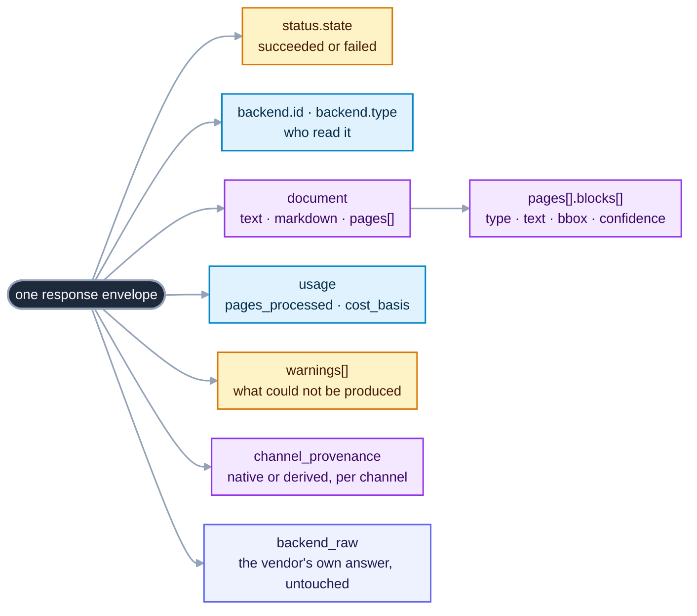
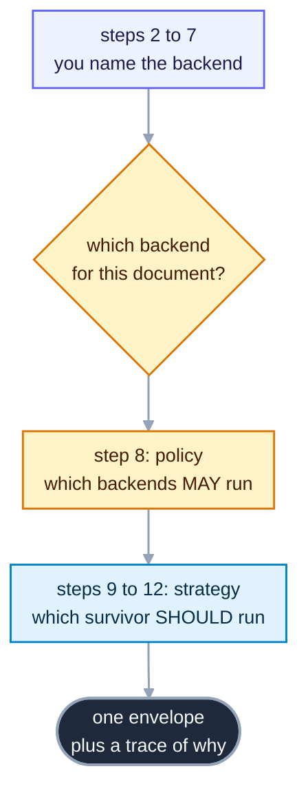
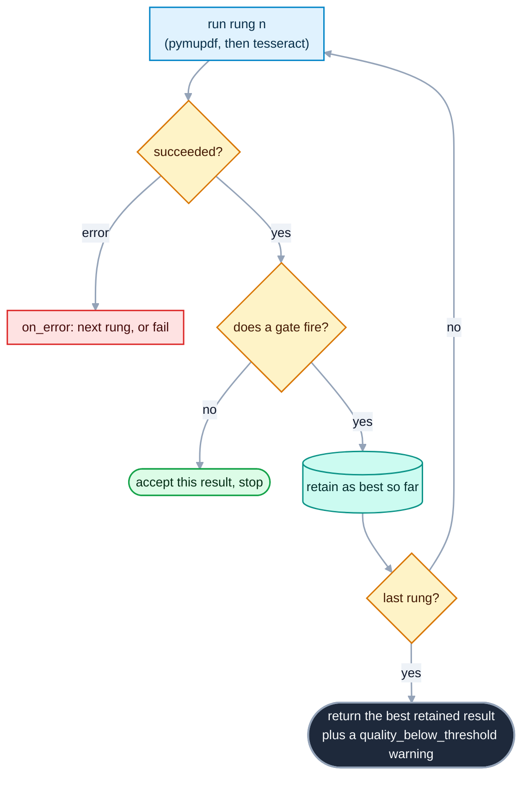

# OpenReading tutorial: from one command to a policy-aware, self-escalating pipeline

<sub>[Root README](../README.md) · [Docs home](../src/openreading/README.md) · [What these documents are](README.md)</sub>

> **What you get.** By the end of this page you will have parsed five real documents, watched two
> backends disagree on the same page, written an `openreading.yaml` that keeps a document on your
> own machine, built a strategy that escalates a scan to OCR by itself, run a whole folder in one
> command, and served the same engine over HTTP.

Everything here runs with two backends that need no key, no account, and no network. A backend is
the thing that does the reading, such as PyMuPDF on your machine or Reducto's hosted API. The two
local ones are PyMuPDF, which lifts a PDF's own text layer, and Tesseract, which renders each page
to a bitmap and runs OCR over the pixels. Every hosted backend is optional, and
[step 14](#14-bring-your-own-key) shows how to add one when you want it.

The documents are the ones already in this folder. They are three United States tax forms and two
synthetic bank statements, and [`examples/README.md`](README.md) says where each came from. The
tax forms carry invented names and amounts. One of them is a scan with no text at all, and that
one document is the reason the second half of this page exists.

---

## Index

| # | Step | What you learn | Needs |
|---|---|---|---|
| 1 | [Install and check your machine](#1-install-and-check-your-machine) | `backends`, the CONFIGURED column | nothing |
| 2 | [Your first parse](#2-your-first-parse) | `parse --backend`, stdout vs stderr | nothing |
| 3 | [Reading the envelope](#3-reading-the-envelope) | the one JSON shape, channels, provenance | `jq` |
| 4 | [The CLI is its own manual](#4-the-cli-is-its-own-manual) | `help`, `<cmd> --help`, `pydoc` | nothing |
| 5 | [The same page, read two ways](#5-the-same-page-read-two-ways) | PyMuPDF against Tesseract | tesseract |
| 6 | [Where two backends disagree](#6-where-two-backends-disagree) | `compare`, verdicts, findings | tesseract |
| 7 | [The document that defeats one backend](#7-the-document-that-defeats-one-backend) | why `succeeded` is not enough | tesseract |
| 8 | [Your first openreading.yaml](#8-your-first-openreadingyaml-a-policy) | the `policy:` block, `route` | nothing |
| 9 | [Your first strategy](#9-your-first-strategy-try-and-escalate_when) | `try:`, `escalate_when:`, escalation | tesseract |
| 10 | [Reading the trace](#10-reading-the-trace-with-explain) | `explain`, gates, observed against threshold | tesseract |
| 11 | [Racing and judging](#11-racing-and-judging-race-and-compare) | `race:`, `compare:`, `--keep-candidates` | tesseract |
| 12 | [What Plain compiles to](#12-what-plain-compiles-to) | longhand, predicates, `strategy plan` | nothing |
| 13 | [A whole folder at once](#13-a-whole-folder-at-once) | batch mode, `--jobs`, `--save-dir` | tesseract |
| 14 | [Bring your own key](#14-bring-your-own-key) | `.env`, hosted backends, cost | a vendor account |
| 15 | [Serving the same engine](#15-serving-the-same-engine) | `openreading serve`, the HTTP endpoints | `[server]` extra |
| 16 | [When something stops](#16-when-something-stops) | exit codes, the run journal, resume | nothing |
| 17 | [Where to go next](#17-where-to-go-next) | the guide for each deeper question | nothing |
| A | [The whole file you built](#appendix-the-whole-openreadingyaml-you-built) | one `openreading.yaml` to keep | nothing |

Work from the root of your clone, because every command names a path under `examples/`. The clone
root ignores `*.json`, `*.yaml` and `*.pdf`, so nothing you write here shows up in `git status`.
[Step 17](#17-where-to-go-next) ends with the one command that deletes it all.

---

## 1. Install and check your machine

You need `git` and [`uv`](https://docs.astral.sh/uv/), which fetches Python 3.11 or newer itself.
Nothing is on PyPI yet, so install from a clone.

```bash
git clone https://github.com/multiversal-ventures/openreading-core
cd openreading-core
uv sync --all-extras --dev
```

Tesseract is a system binary rather than a Python package, and you install it once:

```bash
brew install tesseract           # macOS
sudo apt install tesseract-ocr   # Debian or Ubuntu
```

Now ask OpenReading what this machine can actually run:

```bash
uv run openreading backends
```

**You should see** one row per backend, and the two local rows saying `yes`:

```text
BACKEND                        TYPE               CONFIGURED  MISSING
anthropic-claude               hosted_api         no          ANTHROPIC_API_KEY, ANTHROPIC_MODEL
aws-textract                   hosted_api         no          AWS_ACCESS_KEY_ID, AWS_SECRET_ACCESS_KEY, ...
azure-document-intelligence    hosted_api         no          AZURE_DOCUMENT_INTELLIGENCE_KEY, ...
chunkr                         hosted_api         no          CHUNKR_API_KEY
docling                        oss_library        no          DOCLING_SERVE_URL
google-document-ai             hosted_api         no          GCP_PROJECT_ID, GCP_PROCESSOR_ID
google-gemini                  hosted_api         no          GEMINI_API_KEY
mistral-ocr                    hosted_api         no          MISTRAL_API_KEY
nuextract                      hosted_api         no          NUEXTRACT_API_KEY
open-ocr                       hosted_api         no          OPENOCR_API_KEY
pulse                          hosted_api         no          PULSE_API_KEY
pymupdf                        oss_library        yes         -
qwen-vl                        self_hosted_model  no          QWEN_VL_ENDPOINT
reducto                        hosted_api         no          REDUCTO_API_KEY
tesseract                      oss_library        yes         -
```

Every `no` in that table is a backend waiting for a key you have not brought yet. The MISSING
column names the exact variables, and [step 14](#14-bring-your-own-key) adds one. This tutorial
uses only the two `yes` rows, so you can read all seventeen steps before you sign up for anything.

If `tesseract` says `no`, its MISSING column names the binary rather than a variable:

```text
tesseract                      oss_library        no          tesseract binary (brew install tesseract / apt install tesseract-ocr)
```

CONFIGURED answers "could this run here". To ask "is it answering right now", probe one backend:

```bash
uv run openreading backends --check pymupdf
```
```text
BACKEND                        PROBE      STATUS                 MEASURED  LATENCY   DETAIL
pymupdf                        local      live                   yes       0ms       responding, the library imports and runs in this process
```

The same probe against a backend you hold no key for reports what is missing instead of failing:

```text
reducto                        none       not_configured         no        -         not configured: set REDUCTO_API_KEY
```

---

## 2. Your first parse

`parse` reads one document with one backend and prints one JSON envelope. The envelope is the
single response shape every backend returns. Start with the shortest document in the folder,
a one-page Schedule A:

```bash
uv run openreading parse examples/schedule_a_2024.pdf --backend pymupdf > sa.json
```

**You should see** one line on your terminal and nothing else:

```text
Consider using the pymupdf_layout package for a greatly improved page layout analysis.
```

That line is PyMuPDF's own advice, and it is not an error. It arrives on stderr, which is why the
redirect above left it on your screen and kept `sa.json` pure JSON. Three streams carry three kinds
of news, and the split is the same for every command:

| Stream | Carries | Read it with |
|---|---|---|
| stdout | the JSON envelope, and nothing else | `> out.json`, then `jq` |
| stderr | progress, backend chatter, error lines | `2> run.log` |
| exit code | whether a script should continue | `echo $?`, or [step 16](#16-when-something-stops) |

Confirm the run, then look at the shape:

```bash
jq -r '.status.state, .backend.id, .document.page_count' sa.json
```
```text
succeeded
pymupdf
1
```

---

## 3. Reading the envelope

Every backend fills the same envelope, so the code you write against one backend works against all
of them. Here is where each thing lives.



Read the top level first:

```bash
jq '{schema_version, status, backend, usage, warnings}' sa.json
```
```json
{
  "schema_version": "0.3",
  "status": { "state": "succeeded" },
  "backend": { "id": "pymupdf", "type": "oss_library", "output_paradigm": ["block_tree"] },
  "usage": { "pages_processed": 1, "cost_basis": "infra_only" },
  "warnings": [
    { "code": "confidence_unavailable",
      "message": "PyMuPDF is a deterministic parser; per-element confidence does not exist",
      "field": "block_confidence" }
  ]
}
```

`schema_version` names the JSON contract rather than the package you installed. `cost_basis` of
`infra_only` means this run charged nobody, because the work happened on your own machine.

That one warning is the contract at work. A channel is one named part of the response, such as
text, tables, or per-block confidence. PyMuPDF measures no confidence, so the envelope omits the
field and says why. It never invents a number, because a fabricated confidence is
indistinguishable from a measured one downstream.

Rather than waiting for a warning, read which channels this run actually produced:

```bash
jq '.channel_provenance' sa.json
```
```json
{ "markdown": "derived", "text": "native", "blocks": "native",
  "block_bbox": "native", "table_cells": "native" }
```

`native` means the backend produced it. `derived` means OpenReading built it from what the backend
gave. There is no `block_confidence` key at all, which is the direct answer to "can I trust a
confidence score from this run".

### Blocks, coordinates, and tables

A block is one unit of content on a page. Ask what this page is made of:

```bash
jq -r '.document.pages[0].blocks[] | "\(.type)  \(.native_type)  order=\(.reading_order)"' sa.json
```
```text
table  table  order=0
text  text  order=1
```

PyMuPDF read the whole Schedule A body as one table block and the footer as one text block. Every
block carries a bounding box in two forms:

```bash
jq '.document.pages[0].blocks[0].bbox | {x, y, w, h, page}' sa.json
```
```json
{ "x": 0.05841503267973856, "y": 0.04513888888888889,
  "w": 0.8829656862745098, "h": 0.8636363636363636, "page": 1 }
```

`x`, `y`, `w` and `h` are page-relative fractions, so `0.0584` means "5.84% of the page width from
the left edge". They mean the same thing whichever backend produced them, which is what lets one
piece of drawing code position blocks from any backend. Alongside them, `bbox.bbox_native` keeps
the backend's own numbers in the backend's own units, for when you need to go back to the source.

A table block carries the table itself. The `markdown` field on that block is the fastest way to
look at it:

```bash
jq -r '.document.pages[0].blocks[0].markdown' sa.json | head -4
```
```text
| SCHEDULE A<br>(Form 1040)<br>Department of the Treasury<br>Internal Revenue Service | Itemized Deductions<br>... | OMB No. 1545-0074 |  |
| --- | --- | --- | --- | --- | --- | --- |
|  |  |  |  |  | 2024<br>Attachment<br>Sequence No. 07 |  |
| Name(s) shown on Form 1040 or 1040-SR<br>Priya Rai |  |  |  | Your social security number<br>XXX-XX-XXXX |  |  |
```

That is a form laid out as a grid rather than a clean data table, and reading it back shows exactly
what a text-layer parser can and cannot recover. The values are invented, and the social security
number is printed as `XXX-XX-XXXX` in the file itself.

### Three documents, three shapes

Run the same command against the other two tax forms and count what comes back. The numbers below
are what PyMuPDF returns.

| Document | Pages | Characters | Blocks | Block types |
|---|---|---|---|---|
| `schedule_a_2024.pdf` | 1 | 4204 | 2 | 1 table, 1 text |
| `1040_2024.pdf` | 2 | 8857 | 6 | 6 tables |
| `1040-1988.pdf` | 5 | **8** | 5 | **5 images** |

Two of those documents are born-digital, meaning software wrote the text into the file. The third
is a scan. Five image blocks and eight characters across five pages is what a scan looks like from
inside the envelope, and [step 7](#7-the-document-that-defeats-one-backend) makes that the turning
point of this tutorial.

---

## 4. The CLI is its own manual

You do not have to come back to this page for a flag. The command line carries the manual, and
every page of it is generated from the same reference the maintainers read, so it cannot drift from
what the code does.

```bash
uv run openreading help                  # the topic index, grouped by what you want to do
uv run openreading help quickstart       # four commands, clone to JSON
uv run openreading help chaining         # which verb's output feeds which verb
uv run openreading help batch            # folders, globs, many files at once
uv run openreading help exit-codes       # every exit code and what caused it
uv run openreading parse --help          # one command: flags, examples, exits
uv run python -m pydoc openreading.cli   # the whole manual in source order
```

**You should see** an index grouped by intent rather than alphabetically:

```text
START HERE
  quickstart     four commands, from a clone to parsed JSON, with no key
  help           find a chapter, its aliases, or one command's flags
  output         what goes to stdout, what goes to stderr, what the code says
  chaining       which verb's output feeds which verb's input

DO ONE JOB
  batch          a folder, a glob, or many files as one run and one JSON
  compliance     say which backends may see a document, and see who was dropped
  cost           what a run charges you, before it starts charging you
  env            where keys come from, and every variable this CLI reads
  datasets       case.json inputs and expectations for calibration and scoring

WHEN SOMETHING STOPS
  exit-codes     every exit code, what caused it, and whether to retry
  signals        Ctrl-C, SIGTERM, and what a stopped run leaves behind
...
```

A chapter answers to the name you would reach for, so `help folder` and `help glob` both open the
batch chapter. Every `<command> --help` page ends with the same four things: examples you can
paste, the command that consumes this one's output, the exit codes this command can return, and
the chapter that goes deeper.

Try that now, because the rest of this tutorial assumes you can look a flag up yourself:

```bash
uv run openreading parse --help | tail -20
```

---

## 5. The same page, read two ways

Tesseract ignores the text layer entirely. It renders each page to a 150-DPI bitmap and reads the
pixels back, which is the work it would do on a photograph of the same form. Run it over the page
you already parsed:

```bash
uv run openreading parse examples/schedule_a_2024.pdf --backend tesseract > sa-ocr.json
```

That takes a second or two, because rendering and OCR are real work. Now put the two envelopes side
by side:

```bash
jq -r '"\(.backend.id): \(.document.pages[0].width)x\(.document.pages[0].height) \(.document.pages[0].unit), \(.document.pages[0].blocks|length) blocks"' sa.json sa-ocr.json
```
```text
pymupdf: 612.0x792.0 pdf_point, 2 blocks
tesseract: 1275.0x1650.0 pixel, 59 blocks
```

Three differences matter, and each one is the contract doing its job.

**The page is measured in different units.** PyMuPDF reports PDF points and Tesseract reports the
pixels it rasterized. The `bbox.x/y/w/h` fractions stay comparable either way, which is the point
of storing them as fractions.

**The granularity is different.** One backend returned two large blocks and the other returned
fifty-nine lines. Neither is wrong. `output_paradigm` in the envelope says which kind of answer a
backend gives, `block_tree` for PyMuPDF and `element_list` for Tesseract.

**Tesseract measures confidence and PyMuPDF does not.** Look at the OCR blocks:

```bash
jq -r '.document.pages[0].blocks[:6][] | "\(.confidence)  \(.text)"' sa-ocr.json
```
```text
0.92  SCHEDULE A Itemized Deductions OMB No. 1545-0074
0.89  (Form 1040) Attach to Form 1040 or 1040-SR. 2024
0.57  be Go to www.irs.gov/ScheduleA for instructions and the latest information.
0.28  Jepartment of the Treasury ‘Attachment
0.46  Internal Revenue Service | Caution: If you are claiming a net qualified disaster loss ...
0.91  Name(s) shown on Form 1040 or 1040-SR Your social security number
```

`Jepartment of the Treasury` at confidence `0.28` is OCR telling you where it struggled. That is
worth more than a clean-looking string with no number beside it. Confirm the channel rather than
the warning:

```bash
jq '.channel_provenance.block_confidence, (.warnings | length)' sa-ocr.json
```
```text
"native"
0
```

Tesseract produces confidence natively and owes no warning. PyMuPDF cannot and says so. The
envelope is the same shape in both cases, and the difference is visible instead of hidden.

---

## 6. Where two backends disagree

You have two readings of one page. `compare` names the differences rather than scoring them.

```bash
uv run openreading compare examples/schedule_a_2024.pdf --backends pymupdf,tesseract --format table
```

**You should see** a header, a per-channel verdict, and a list of findings:

```text
COMPARE — 2 subjects (pairwise)

SUBJECT             TYPE             PAGES BLOCKS  CHARS FIELDS      COST    TIME
pymupdf             oss_library          1      2   4204      0         -       -
tesseract           oss_library          1     59   3531      0         -       -

CONTENT: MIXED  (text:agree  table_cells:diverge)

text similarity: 0.52
block alignment: text_first/v1  unaligned=0.97

FINDINGS (60)
  [ warn] table_shape_mismatch  {pymupdf, tesseract}  — table counts differ: {'pymupdf': 1, 'tesseract': 0}
  [ info] block_unique p1  {pymupdf}  — only pymupdf has this table block  "SCHEDULE A (Form 1040) Department of the Treasury Internal …"
  ...
```

The verdict is one word, and there are three of them. `equivalent` means the backends agree on
every channel compared. `divergent` means they disagree on every one. `mixed`, which is what you
got here, means some channels agree and others do not:

```bash
uv run openreading compare examples/schedule_a_2024.pdf --backends pymupdf,tesseract | jq '.headline'
```
```json
{ "verdict": "mixed",
  "channels": { "text":        { "agreement": "agree",   "score": null, "detail": null },
                "table_cells": { "agreement": "diverge", "score": null, "detail": null } },
  "nondeterministic_subjects": [] }
```

`table_shape_mismatch` is the finding that matters on a tax form. PyMuPDF found one table and
Tesseract found none, because OCR reads lines of text and has no notion of a grid.

To see the disagreement line by line rather than as a list of findings, use `--format diffs`:

```bash
uv run openreading compare examples/schedule_a_2024.pdf --backends pymupdf,tesseract --format diffs
```
```text
DIFF — pymupdf vs tesseract   (1 page(s))

① CONTENT — real text/values either side missed
   ✗ DIVERGENT   content shared by all: 0.81
   pymupdf:
     MISSED — 12 line(s) others have that pymupdf lacks:
        - dAdd lines 5athrough5c . . . 5d| $12,949.54
        - 7 AddlinesS5eand6 . . . ln 7 | $7,894.21
        ...
     ONLY pymupdf — 6 line(s) no other backend captured — mostly readable text and garbled fragments:
        + Department of the Treasury
        + Sequence No. 07
        + XXX-XX-XXXX
        + $134,850.25
   tesseract:
     ...
```

Read the last two lines of that block carefully. `$134,850.25` is a figure only PyMuPDF recovered,
and Tesseract lost it. That is a concrete answer to "which backend should read my tax forms", on
your documents rather than on a vendor's benchmark.

Compare picks no winner, and that is deliberate. It has no idea what the page really says, so
claiming one would be a guess wearing a number. When you do want a ranking, `leaderboard` ranks
backends against documents you labeled ([Evals](../src/openreading/evals/README.md)).

Two more forms of the same command are worth knowing now:

```bash
uv run openreading parse examples/schedule_a_2024.pdf --backend pymupdf   > mu.json
uv run openreading parse examples/schedule_a_2024.pdf --backend tesseract > te.json
uv run openreading compare mu.json te.json --format table     # over saved files, runs nothing
```

Comparing saved envelopes runs no backend and costs nothing. The `--backends a,b` form runs each
backend named, and a hosted one bills your own key every time.

---

## 7. The document that defeats one backend

Now open the 1988 return. It is a five-page scan of a paper form, and it is the reason the rest of
this tutorial exists.

```bash
uv run openreading parse examples/1040-1988.pdf --backend pymupdf > scan-mu.json
jq -r '.status.state' scan-mu.json
```
```text
succeeded
```

The run succeeded. Now ask what it actually returned:

```bash
jq -r '.document.text | length' scan-mu.json
jq -r '[.document.pages[].blocks[].type] | @csv' scan-mu.json
```
```text
8
"image","image","image","image","image"
```

Eight characters over five pages, and every block is an image. **`succeeded` means the backend did
its job without erroring, and it never means the answer is useful.** PyMuPDF read the text layer
correctly. There is no text layer.

Tesseract has the opposite strengths, so point it at the same file. Five pages of OCR takes roughly
twenty seconds, and the exact time depends on your machine:

```bash
uv run openreading parse examples/1040-1988.pdf --backend tesseract > scan-ocr.json
jq -r '.document.text | length' scan-ocr.json
jq -r '.document.text | split("\n")[0]' scan-ocr.json
```
```text
19314
£1040 U'sindividualincome Tax koran 19S
```

Nineteen thousand characters instead of eight. The first line shows OCR being OCR, mangling the
form's stylized masthead into `£1040 U'sindividualincome Tax koran 19S`. The body reads far better
than the masthead does, and the tradeoff is exactly the one this tool exists to manage.

So you now have two backends and a real problem.

| | `1040_2024.pdf` and `schedule_a_2024.pdf` | `1040-1988.pdf` |
|---|---|---|
| PyMuPDF | exact text, tables, milliseconds | 8 characters, useless |
| Tesseract | OCR errors, no tables, seconds | the only thing that reads it |

Naming a backend per document by hand does not scale past a folder you can count. The next steps
build the thing that decides for you: first the rules about which backends may run at all, then the
plan that picks between the survivors.



---

## 8. Your first openreading.yaml: a policy

`openreading.yaml` is the only file you write. A policy is the block in it naming what a backend
must guarantee before it may read your documents. Compliance is a hard filter, and nothing later in
the file, no fallback and no strategy, can bring a dropped backend back.

A tax return is the everyday case for this. It carries a name, an address, a taxpayer
identification number and a full year of financial detail. Plenty of teams may not ship one to an
arbitrary vendor. Start with the strictest rule there is:

```yaml
version: 1
policy:
  require_local: true      # only backends that run on this machine may see the document
```

Save that as `openreading.yaml` in the clone root:

```bash
cat > openreading.yaml <<'YAML'
version: 1
policy:
  require_local: true
YAML
```

Now ask which backends survive. `route` prints the plan and reads nothing:

```bash
uv run openreading route examples/1040_2024.pdf
```
```json
{
  "chosen": "pymupdf",
  "fallbacks": ["docling", "tesseract", "qwen-vl"],
  "dropped": {
    "anthropic-claude": { "stage": 1, "code": "not_local",
                          "reason": "require_local set but backend is not fully local" },
    "aws-textract":     { "stage": 1, "code": "not_local", "reason": "..." },
    "reducto":          { "stage": 1, "code": "not_local", "reason": "..." }
  },
  "terminal_reason": null
}
```

Eleven hosted backends dropped, four local ones left, and no document was read. `chosen` is what
would run, and `fallbacks` is the order to try next if it fails. A dropped backend never joins that
list, because a fallback that readmits it would leak the return silently.

No flag named the policy. Every command finds `./openreading.yaml` in the directory you run it
from, which is why the same rules apply to `parse`, `compare`, `strategy` and the rest without you
repeating yourself.

### The nine keys

The whole policy grammar is nine keys, and a key the router does not recognise is refused rather
than ignored. A typo therefore cannot leave you with a clean exit code and no filter.

| Key | Value | What it does |
|---|---|---|
| `require_local` | `true` | keeps only backends that run entirely inside your environment |
| `require_baa` | `true` | keeps only vendors that publish a business associate agreement, the HIPAA contract for regulated data |
| `no_train_on_data` | `true` | drops vendors that train on your inputs without an opt-out |
| `data_region` | `"us"`, `"eu"`, … | keeps only vendors that process in that region |
| `max_retention` | `"zero"`, `"48h"`, … | keeps only vendors that hold your document no longer than this |
| `optimize_for` | `accuracy`, `cost`, `latency`, `offline` | reorders the survivors, and never changes the set |
| `allow_unverified_compliance` | `true` | admits a backend whose own disclosure is silent on the axis asked about, never one that says no |
| `train_optout_confirmed` | a list of backend ids | you attest that you applied that vendor's training opt-out yourself |
| `baa_tier_confirmed` | a list of backend ids | you attest that you hold a signed BAA with that vendor |

The last three widen the eligible set, and they are the only keys that can. Each one records a
fact about paperwork you arranged rather than a preference about a vendor, which is why a policy
never names a backend it likes.

Try a looser policy and watch the drop reasons change:

```bash
cat > openreading.yaml <<'YAML'
version: 1
policy:
  require_baa: true
  no_train_on_data: true
YAML
uv run openreading route examples/1040_2024.pdf | jq '.dropped | to_entries[] | "\(.key): \(.value.code)"' -r
```
```text
aws-textract: trains_on_data
chunkr: no_baa
google-gemini: no_baa
mistral-ocr: no_baa
nuextract: no_baa
open-ocr: no_baa
pulse: no_baa
reducto: no_baa
```

Each `reason` in the full output quotes the descriptor field it read, for example
`require_baa set but hipaa_baa='tier_gated' and 'reducto' is not in baa_tier_confirmed`. A
descriptor is a backend's static self-description of formats, variables and compliance posture.

> [!IMPORTANT]
> A descriptor records a vendor's advertised offer read on a date. It is not an agreement you
> hold. `require_baa` narrows the field, and confirming your own signed paperwork is still your
> job. [Routing and keys](../src/openreading/router/README.md) says where each claim came from.

Add `--run` to `route` when you want the chosen backend to execute and the envelope to come back
beside the plan. Until then, `route` is the cheapest question in the tool: it costs nothing, sends
nothing, and answers "who is even allowed to see this".

---

## 9. Your first strategy: `try` and `escalate_when`

A policy says who may run. A strategy says who should. It is a named plan in the same file, and
you invoke it by name.

Plain is the short form, and it has six keys in total: `try`, `race`, `compare`, `then`,
`escalate_when` and `max_time`. Here is the one that solves the problem from step 7. Replace your
`openreading.yaml` with this:

```yaml
version: 1

policy:
  require_local: true              # step 8: the hard filter, still in force

strategies:
  scan_aware:
    try: [pymupdf, tesseract]      # run in this order
    escalate_when: looks_bad       # move on when the quality probe distrusts a result
    max_time: "2m"                 # give up after this long, for the whole strategy
```

```bash
cat > openreading.yaml <<'YAML'
version: 1

policy:
  require_local: true

strategies:
  scan_aware:
    try: [pymupdf, tesseract]
    escalate_when: looks_bad
    max_time: "2m"
YAML
```

Check it before you run it. `strategy validate` reads the grammar, checks the file against the real
world, and explains each strategy back to you in English:

```bash
uv run openreading strategy validate
```
```text
  scan_aware: dialect: plain
      try: [pymupdf, tesseract]
      escalate_when: looks_bad
      max_time: 2m
    → Tries pymupdf, then tesseract, moving on when a step fails, or the result looks bad. Stops after 2m.

  what the words mean:
    looks bad       openreading's quality probe flags the result: garbled text, over 20% near-empty pages,
                    or an image-only page it got almost no text from
/…/openreading.yaml: OK (1 strategies)
```

That glossary is the file explaining itself, and it appears for whichever judgment words you used.
Now run it on the born-digital form, where the cheap backend is the right answer:

```bash
uv run openreading parse examples/1040_2024.pdf --strategy scan_aware > run-2024.json
jq -r '.backend.id, .orchestration.outcome' run-2024.json
```
```text
pymupdf
ok
```

One backend ran, and the document never reached OCR. Now the scan:

```bash
uv run openreading parse examples/1040-1988.pdf --strategy scan_aware > run-1988.json
jq -r '.backend.id, .document.text | length' run-1988.json
```
```text
tesseract
19314
```

**Nothing in that command named a backend.** The same strategy read one document with the fast
local parser and escalated the other to OCR, because the first result failed a quality check. That
is the whole idea, and the next step shows you exactly which check fired.

The four judgment words `escalate_when` accepts are these:

| Word | Fires when |
|---|---|
| `looks_bad` | OpenReading's own quality probe distrusts the result: garbled text, mostly-empty pages, or a text-layer read of a scan |
| `low_confidence` | the backend's own confidence falls below a threshold you give |
| `missing: [field]` | a typed field you asked for did not come back |
| `disagree` | parallel branches read the document differently |

You can combine them, and the gate fires when any one of them does:

```yaml
version: 1
strategies:
  careful:
    try: [pymupdf, tesseract]
    escalate_when:
      looks_bad: true
      low_confidence: 0.7
```

---

## 10. Reading the trace with `explain`

Every strategy run writes an `orchestration` block onto the envelope. That block is the trace, and
it records every attempt, every gate with its observed value and threshold, every backend dropped
by compliance, and every decision taken. `explain` renders it:

```bash
uv run openreading explain run-1988.json
```
```text
strategy scan_aware  →  tesseract (ok)
  root.steps[0]    pymupdf      quality_escalated             55ms  $0
      looks_bad
        scanned_pages_detected   obs=True thr=True  FIRED
        chars_per_page_below     obs=0.0 thr=100  FIRED
        garbled                  obs=None thr=True  skipped
        empty_pages_over         obs=1.0 thr=0.2  FIRED
  root.steps[1]    tesseract    succeeded                  20036ms  $0
```

Read it top to bottom. Timings vary between machines. PyMuPDF ran in 55 milliseconds and cost
nothing. The `looks_bad` word you
wrote became four separate checks, three of which fired: the pages are scans, the character count
per page is zero against a threshold of one hundred, and every page came back empty against a
threshold of twenty percent. So the document climbed a rung, and Tesseract answered in twenty
seconds.

The fourth row is the one worth studying. `garbled obs=None thr=True skipped` means the garble
score could not be measured on a result with no text. **A missing measurement never counts as a
passing one.** A gate that cannot be measured is recorded as `skipped`, because a fabricated
verdict would be indistinguishable from a real one.

Compare that with the born-digital form, where nothing fired:

```bash
uv run openreading explain run-2024.json
```
```text
strategy scan_aware  →  pymupdf (ok)
  root.steps[0]    pymupdf      succeeded                    351ms  $0
      looks_bad
        scanned_pages_detected   obs=False thr=True  ok
        chars_per_page_below     obs=4427.5 thr=100  ok
        garbled                  obs=0.0381 thr=True  ok
        empty_pages_over         obs=0.0 thr=0.2  ok
```

One rung, four checks, every one `ok`, and the walk stopped there. Tesseract never ran and the
document never left the fast path.

The escalation is also a warning on the envelope rather than an error, so a script can count it:

```bash
jq -c '[.warnings[].code]' run-1988.json
```
```text
["quality_escalated"]
```

This is the ladder a `try` with `escalate_when` walks, one rung at a time:



A result that fails a gate is kept rather than thrown away. When the rungs run out, the best
retained result comes back with `orchestration.outcome: degraded` and a `quality_below_threshold`
warning. Silence is never an outcome.

Two more verbs read the same trace. `replay` re-runs the document taking the choices the trace
logged, which is how you reproduce a run offline. `resume` picks an interrupted run back up, and
[step 16](#16-when-something-stops) arms it.

---

## 11. Racing and judging: `race` and `compare`

`try` is sequential. Two other Plain keys run backends at the same time.

```yaml
version: 1

policy:
  require_local: true

strategies:
  scan_aware:
    try: [pymupdf, tesseract]
    escalate_when: looks_bad
    max_time: "2m"

  quickest:
    race: [pymupdf, tesseract]      # both at once, first success wins, cancel the rest

  duel:
    compare: [pymupdf, tesseract]   # both at once, keep whichever passes more quality checks
```

Write that file, then validate it. `strategy list` shows your strategies next to the four presets
that ship with OpenReading:

```bash
uv run openreading strategy validate
uv run openreading strategy list
```
```text
PRESETS:
  cost_saver
  fast
  max_accuracy
  offline_first
STRATEGIES:  (from /…/openreading.yaml)
  duel
  quickest
  scan_aware
```

Run the race and read its trace:

```bash
uv run openreading parse examples/schedule_a_2024.pdf --strategy quickest > race.json
uv run openreading explain race.json
```
```text
strategy quickest  →  pymupdf (ok)
  root.parallel[0] pymupdf      succeeded                        -  $0
  root.parallel[1] tesseract    raced_lost                       -  $0
```

`raced_lost` means Tesseract was cancelled once PyMuPDF finished. A race has no gates, so no gate
rows appear. Use it when latency is what you are buying.

`compare:` runs both to completion and keeps the better one. Better means "passes more of the
default quality bundle", which asks four questions: is this a scan, is the text garbled, are too
many pages near-empty, and is the backend's own confidence low. None of the four checks the output
against what the document actually says, so two clean results tie. A tie goes to the cheaper
backend, and then to whichever you listed first.

The interesting flag here is `--keep-candidates`, which retains the loser so you can diff the pair
from one run:

```bash
uv run openreading parse examples/schedule_a_2024.pdf --strategy duel --keep-candidates > duel.json
uv run openreading explain duel.json
uv run openreading compare --from duel.json --format table | head -10
```
```text
strategy duel  →  pymupdf (ok)
  root.parallel[0] pymupdf      succeeded                        -  $0
  root.parallel[1] tesseract    judged_lost                      -  $0
```
```text
COMPARE — 2 subjects (pairwise)

SUBJECT             TYPE             PAGES BLOCKS  CHARS FIELDS      COST    TIME
pymupdf             oss_library          1      2   4204      0         -       -
tesseract           oss_library          1     59   3531      0         -       -

CONTENT: MIXED  (text:agree  table_cells:diverge)
```

That is the same comparison you ran by hand in step 6, from a single command. `judged_lost` is the
whole record of the choice, and `jq '.orchestration.decisions' duel.json` prints `[]`. A plain
quality-bundle selection leaves no decision record, so what you can audit is which backend won,
which lost, and under which category.

> [!WARNING]
> A `race:` and a `compare:` both start every backend listed. With local backends that costs
> nothing but CPU. With a hosted backend, every branch that runs is billed to your key, losers
> included. `usage.cost_usd` sums all of them.

The four presets are strategies you can run by name without writing a file at all:

| Preset | What it does |
|---|---|
| `offline_first` | never leaves the machine: PyMuPDF, then Tesseract, then Docling |
| `cost_saver` | local parse first, escalate to the router's best remaining pick only on bad quality |
| `fast` | race the two local parsers, keep the first success |
| `max_accuracy` | the best eligible backend, with a second opinion from the next best |

```bash
uv run openreading parse examples/1040-1988.pdf --strategy offline_first | jq -r '.backend.id'
uv run openreading strategy show offline_first        # what it actually says
```

---

## 12. What Plain compiles to

Plain is sugar. Underneath is the full grammar, and reading what your six-key strategy became is
how you learn the language you will eventually need.

```bash
uv run openreading strategy show scan_aware --longhand
```
```yaml
scan_aware:
  steps:
  - backend: pymupdf
    escalate_if:
      any_of:
      - all_of:
        - scanned_pages_detected: true
        - chars_per_page_below: 100
      - garbled: true
      - empty_pages_over: 0.2
  - backend: tesseract
  budget:
    max_duration: 2m
```

Four facts jump out of that listing.

**`looks_bad` is four predicates.** A predicate is one named check with a threshold, such as
`empty_pages_over: 0.2`. They sit under one `any_of`, so any one of them escalates.

**The scan pair is bound together.** `scanned_pages_detected` and `chars_per_page_below` sit under
an `all_of`, so a scan counts only when the page also came back near-empty. A scanned page that
still yielded plenty of text is not a failure.

**The gate hangs on `pymupdf` only.** Plain puts its gate on every rung but the last, so a Plain
cascade always accepts whatever its final backend returned. Write the gate on the last rung in
longhand and it does fire.

**`max_time` became a `budget:` on the root.** The budget covers the whole strategy rather than one
rung.

`strategy normalize` prints your entire file this way, which is the `docker compose config`
equivalent for strategies.

### Seeing the plan before you run it

`strategy plan` prints the pruned tree for one document under one policy, and executes nothing:

```bash
uv run openreading strategy plan examples/1040-1988.pdf --strategy scan_aware
```
```json
{
  "strategy": "scan_aware",
  "config_hash": "sha256:…",
  "eligible": ["pymupdf", "docling", "tesseract", "qwen-vl"],
  "dropped": [],
  "tree": { "steps": [ { "backend": "pymupdf", "escalate_if": { "any_of": ["…"] } },
                       { "backend": "tesseract" } ],
            "budget": { "max_duration": "2m" } }
}
```

`eligible` is what your `policy:` block left standing. Add a hosted backend to the `try:` list
while `require_local: true` is in force, and validation warns you before the plan prunes it:

```text
WARNING …:strategies.scan_aware.steps[1].backend: 'reducto' is filtered out by the policy
  (not_local). This step can never run in that compliance context. Remove it or relax the policy
```

That is the ordering rule of the whole system, stated by the tool itself. Compliance prunes the
tree before anything runs, and no rung, fallback or preset can put a dropped backend back.

### The advanced grammar in one paragraph

Longhand gives you five node kinds. A leaf runs one backend. `steps:` is a cascade that runs its
children in order. `parallel:` runs them at once and picks one, with `pick: fastest` or
`pick: best`. `route:` dispatches on facts known before parsing. `decide:` names a choice an LLM
may take, while the engine keeps a safe default. Beyond the nodes there are per-rung `on_error:`
handling, `budget:` and `limits:`, a `review_if:` gray band where accepting or escalating becomes
a decision rather than a rule, and `shadow: true` for a backend that runs and is recorded but is
never allowed to win.

Read the whole language when you need it, and not before:

```bash
uv run openreading strategy --help                              # the language, in one page
uv run python -m pydoc openreading.strategies.model             # the full grammar
uv run python -m pydoc openreading.strategies.plain             # every Plain word and what it desugars to
uv run python -m pydoc openreading.strategies.signals           # every threshold and where its default came from
uv run python -m pydoc openreading.strategies.presets           # the cookbook
```

`openreading.strategies.signals` is the one to read before you change a number. It gives each
signal's formula, the cut its default sits at, the field-tested source behind that cut, and the
failure that signal is known to have. It is what makes `garbled obs=0.0381 thr=True` readable.

When you would rather measure a threshold than pick one, `calibrate` runs your first rung over a
sample of your own documents and proposes an `escalate_if:` block. It never rewrites your file
([Strategies](../src/openreading/strategies/README.md)).

---

## 13. A whole folder at once

Point `parse` at a directory instead of a file. That one-argument difference is what turns on batch
mode, and it is the change most readers miss.

```bash
uv run openreading parse examples/ --backend pymupdf > batch.json
```

**You should see** one progress line per file on stderr, so `batch.json` stays pure JSON:

```text
[1/7] README.md skipped unsupported_format
[2/7] tutorial.md skipped unsupported_format
[3/7] 1040-1988.pdf succeeded
[4/7] 1040_2024.pdf succeeded
[5/7] john_smith_1000_2026_01.pdf succeeded
[6/7] john_smith_1000_2026_02.pdf succeeded
[7/7] schedule_a_2024.pdf succeeded
```

A folder comes back as one envelope holding one response per document, plus a summary:

```bash
jq '.summary' batch.json
```
```json
{ "total": 7, "succeeded": 5, "failed": 0, "skipped": 2,
  "duration_ms": 510.0, "cost_bases": ["infra_only"],
  "pages_processed": 10, "backends": { "pymupdf": 5 } }
```

Your `duration_ms` will differ, because it is wall-clock time on your machine.

The total is seven because this folder holds two markdown files as well as five PDFs. PyMuPDF does
not read `.md`, so each one is recorded with `skip_reason: "unsupported_format"` rather than
dropped in silence. **The count you get back always accounts for every file you pointed at.**

Each entry under `items[]` carries the source's path and its SHA-256, so a result can be traced
back to the exact bytes that produced it:

```bash
jq '.items[] | select(.source.relpath == "1040-1988.pdf") | {source, state, transport}' batch.json
```
```json
{ "source": { "filename": "1040-1988.pdf", "format": "pdf",
              "path": "examples/1040-1988.pdf", "relpath": "1040-1988.pdf",
              "size_bytes": 7384825,
              "sha256": "cd1ea6b0eb1cf4a9c24bcc0d7a45a0224626c1d463247ac0b86556318b3dbebc" },
  "state": "succeeded", "transport": "platform" }
```

A batch takes a strategy exactly as a single file does, which is the shape you would actually run
over a corpus. This one escalates only the scan, so it takes about as long as one OCR run:

```bash
uv run openreading parse examples/ --strategy scan_aware --jobs 4 > batch-strat.json
jq -r '.items[] | select(.state=="succeeded") | "\(.source.relpath)  \(.response.backend.id)"' batch-strat.json
```
```text
1040-1988.pdf  tesseract
1040_2024.pdf  pymupdf
john_smith_1000_2026_01.pdf  pymupdf
john_smith_1000_2026_02.pdf  pymupdf
schedule_a_2024.pdf  pymupdf
```

One command, five documents, and one of them routed to OCR on its own evidence. `explain` reads a
batch as well as a single run, naming each document as it goes:

```bash
uv run openreading explain batch-strat.json | head -20
```

Three flags matter once a folder gets real.

- `--jobs N` runs N documents at once. The default is 1, which is serial and safe against a
  vendor's rate limit. Concurrency changes how long a folder takes and never what it costs.
- `--save-dir DIR` also writes each successful response to `DIR/<relpath>.json`, which is what
  `compare` reads when you want a corpus-level verdict.
- `--max-items N` caps how many files a glob may expand to, at 200 by default, and exceeding it
  exits before anything runs.

Run two backends over the same folder, then compare the corpora. The Tesseract sweep OCRs the
five-page scan, so it takes about half a minute:

```bash
uv run openreading parse examples/ --backend pymupdf   > mu-corpus.json
uv run openreading parse examples/ --backend tesseract > te-corpus.json
uv run openreading compare mu-corpus.json te-corpus.json --format table
```
```text
CORPUS COMPARE: mu-corpus vs te-corpus
5 document(s): 2 equivalent · 1 divergent · 2 mixed · 0 unpaired

  [ divergent] 1040-1988.pdf
  [     mixed] 1040_2024.pdf
  [equivalent] john_smith_1000_2026_01.pdf
  [equivalent] john_smith_1000_2026_02.pdf
  [     mixed] schedule_a_2024.pdf

FINDINGS (across paired documents)
   553  block_unique
     2  table_shape_mismatch
     1  text_divergence
```

That is a per-document verdict over a whole corpus in one screen. The two bank statements come
back `equivalent`, the two born-digital tax forms `mixed` because only PyMuPDF found their tables,
and the scan `divergent` because the two backends read entirely different things from it.

Two batch results pair their documents by `relpath`, so name each run after the backend that
produced it. The labels in the report come from the filenames.

Your own documents belong in `samples/` at the clone root, which is gitignored for exactly that.
`scripts/batch_demo.sh` reads that folder by default, parses it with both local backends, and
compares the two runs.

---

## 14. Bring your own key

Everything so far ran on your machine. A hosted backend works as soon as its vendor key is in
`.env`, and the charge lands on your own account with that vendor. OpenReading stores no key and
keeps none between calls.

Ask for one you do not hold, and the command tells you exactly what is missing:

```bash
uv run openreading parse examples/schedule_a_2024.pdf --backend reducto
```
```text
[reducto] missing required credentials/config: REDUCTO_API_KEY. Sign up / configure: https://platform.reducto.ai
```

The exit code is 3, meaning "cannot run", and nothing was sent anywhere. To fix it, append the one
key you hold:

```bash
echo 'REDUCTO_API_KEY=sk_…' >> .env
chmod 600 .env
uv run openreading backends | grep reducto
```
```text
reducto                        hosted_api         yes         -
```

Three things about that command are worth knowing before you run it.

- **`.env` is already in this repository's `.gitignore`**, so a file you write inside a clone is not
  committed by accident.
- **Your shell records the line itself**, which puts the key in `~/.zsh_history` or
  `~/.bash_history` in plain text. Prefix the command with a space if your shell skips those, or
  open `.env` in an editor and type the key there instead.
- **Never run `cp .env.example .env`.** That file ships `DOCLING_SERVE_URL` and `QWEN_VL_ENDPOINT`
  with values rather than blanks, so a copy marks two backends configured on a machine where
  neither is running. Under a `require_local` policy the copy makes the router send your document
  to `http://localhost:5001` and record a connection error, where without the copy the same command
  records `docling skipped (missing_credentials)` and the document never reaches a socket.

[`.env.example`](../.env.example) is the per-variable reference, one commented block per backend
with the signup URL in its header:

```text
# --- reducto (signup: https://platform.reducto.ai) ---
# --- chunkr (signup: https://chunkr.ai) ---
# --- pulse (signup: https://www.runpulse.com) ---
# --- anthropic-claude (signup: https://console.anthropic.com) ---
# --- google-gemini (signup: https://aistudio.google.com/apikey) ---
# --- mistral-ocr (signup: https://console.mistral.ai/api-keys) ---
# --- aws-textract (signup: https://aws.amazon.com/textract/, BYO IAM, billed to your account) ---
# --- azure-document-intelligence (signup: https://azure.microsoft.com/products/ai-services/ai-document-intelligence) ---
# --- google-document-ai (signup: https://cloud.google.com/document-ai, BYO GCP project + ADC) ---
```

Two of the fifteen backends belong to no vendor. `docling` and `qwen-vl` are services you run
yourself, so their variables point at your own container or endpoint and there is no signup link.

Once a key is in place, a hosted backend is a name in the same places every other name goes:

```yaml
version: 1

policy:
  require_baa: true                # a hosted rung is allowed, but only a compliant one
  no_train_on_data: true

strategies:
  cheap_first:
    try: [pymupdf, reducto]        # local first, hosted only when the local read is bad
    escalate_when: looks_bad
```

Before you run something billable, ask what it would cost:

```bash
uv run openreading help cost
```

Two fields on the envelope answer the same question afterwards. `usage.cost_usd` totals every
attempt that ran, and `usage.cost_basis` says what that number is. `infra_only` means nobody
charged you. `estimated` means a published rate applied to a page count. `billed` means a figure
the vendor returned. Read the basis before you sum a run as spend.

Which variables a backend reads, and which one wins when two are set, is one command:

```bash
uv run python -m pydoc openreading.credentials
```

An `OPENREADING_<SLUG>_<KEY>` form beats the vendor's own variable, so
`OPENREADING_REDUCTO_API_KEY` beats `REDUCTO_API_KEY`. A `.env` file never overrides a variable
your shell already exported.

See [Backend adapters](../src/openreading/adapters/README.md) for the catalog, and
[Routing and keys](../src/openreading/router/README.md) for where each compliance claim came from.

---

## 15. Serving the same engine

`openreading serve` puts the same engine behind an HTTP API on your own machine. It is a process
you start, not a service anyone else runs for you. The `[server]` extra is included in the
`uv sync --all-extras --dev` from step 1.

Requests may name a local file by path only beneath a root you nominate, so set that root when you
start it:

```bash
OPENREADING_SERVER_PATH_ROOT="$PWD" uv run openreading serve
```
```text
[serve] listening on http://127.0.0.1:8787. Readiness: GET /healthz
INFO:     Application startup complete.
```

From another terminal in the same clone:

```bash
curl -s http://127.0.0.1:8787/healthz
```
```json
{"status":"ok","version":"0.3.0"}
```

```bash
curl -s -X POST http://127.0.0.1:8787/v1/parse \
  -H 'content-type: application/json' \
  -d '{"document": {"path": "'"$PWD"'/examples/schedule_a_2024.pdf"},
       "backend": {"id": "pymupdf"}}' | jq -r '.status.state, .backend.id'
```
```text
succeeded
pymupdf
```

That is the envelope from step 3, field for field, over HTTP. The policy question answers over
HTTP too, and `compliance` in the body does the work your `policy:` block did on the
command line:

```bash
curl -s -X POST http://127.0.0.1:8787/v1/route \
  -H 'content-type: application/json' \
  -d '{"document": {"path": "'"$PWD"'/examples/1040_2024.pdf"},
       "backend": {"id": "auto"},
       "compliance": {"require_local": true}}' | jq '{chosen, fallbacks}'
```
```json
{ "chosen": "pymupdf", "fallbacks": ["docling", "tesseract", "qwen-vl"] }
```

The endpoints you will use first:

| Endpoint | Does |
|---|---|
| `GET /healthz` | readiness, and the package version answering you |
| `GET /v1/backends` | the `backends` table as JSON, with `ready` per backend |
| `POST /v1/parse` | one document, one envelope; blocks until the result is ready |
| `POST /v1/batch` | many documents, one batch-result |
| `POST /v1/route` | the plan only, nothing executed |
| `POST /v1/compare` | a comparison report over envelopes you already have |
| `POST /v1/jobs`, `GET /v1/jobs/{id}` | start a long parse and poll it, instead of blocking |

Four things about the server differ from the CLI, and each one has a reason.

- **It never reads `./openreading.yaml` from its working directory.** A stray file next to a
  long-running process must not change which backends it may reach. Point it at a config
  explicitly, or send `compliance` in the request body.
- **`document.path` is refused unless `OPENREADING_SERVER_PATH_ROOT` is set**, and then only
  beneath that root. A request from elsewhere sends `bytes_base64` or a URL.
- **`POST /v1/batch` takes no `path`.** Each document is `bytes_base64`, `url` or `file_id`.
- **Credentials come from the server's own environment**, through the same broker as the CLI. A key
  never travels in a request body.

Authentication is off by default and on the moment you set `OPENREADING_API_KEYS`. Bind to
`127.0.0.1`, which is the default, until you have. `uv run openreading serve --help` documents
`--host`, `--port`, `--cors-origin` and `--env-file`, and
[The HTTP server](../src/openreading/server/README.md) covers jobs, webhooks, the status ladder and
the security rules in full.

The same three verbs are also a Python import, with no server in the way:

```python
import openreading

doc = "examples/schedule_a_2024.pdf"
resp = openreading.run(doc, backend="pymupdf")               # a dict, the same envelope
print(resp["status"]["state"], resp["backend"]["id"])        # succeeded pymupdf

plan = openreading.route(doc)                                # reads ./openreading.yaml
print(plan.eligible_ids[0])                                  # pymupdf

delta = openreading.compare([resp, openreading.run(doc, backend="tesseract")])
print(delta["headline"]["verdict"])                          # mixed
```

---

## 16. When something stops

The exit code is the stream a script reads. Branch on it before parsing anything.

| Code | Means | Typical cause here |
|---|---|---|
| `0` | success | anything above |
| `1` | unexpected error, or a batch where nothing succeeded | a bug, or an empty folder |
| `2` | usage | an unknown `--backend`, a path that does not exist, more files than `--max-items` |
| `3` | cannot run | a missing key, a refused feature, an unreadable config, a compliance refusal |
| `4` | `route` found no compliant backend; a batch was partial | a policy nothing satisfies, or one failed document |
| `5` | `compare` inputs are not valid responses | comparing the wrong files |
| `6` | interrupted and resumable | Ctrl-C during a strategy run with the journal armed |

Three failures you can reproduce right now, each exiting 3:

```bash
uv run openreading parse examples/README.md --backend pymupdf
# [pymupdf] unsupported_format: pymupdf does not read .md. It reads cbz, epub, mobi, pdf, svg, xps.

uv run openreading parse examples/schedule_a_2024.pdf --backend pymupdf --extract
# [pymupdf] unsupported feature (custom_schema_extraction): pymupdf cannot perform schema-driven
# field extraction; route to an extraction-capable backend (e.g. google-document-ai, reducto)

uv run openreading parse examples/schedule_a_2024.pdf --backend reducto
# [reducto] missing required credentials/config: REDUCTO_API_KEY. Sign up / configure: …
```

Each message names the thing that is missing rather than failing generically. The second one is
worth noticing: asking a backend for something it cannot do refuses the run instead of quietly
returning less than you asked for.

**Exit 0 is not the same as "everything was read."** On a batch, read `summary.failed` and
`summary.skipped`. On a strategy run, read `orchestration.outcome` and `warnings[]`.

### Making a long run resumable

Set `OPENREADING_LEDGER` to a directory and every step of a strategy run is journaled there. There
is no flag for this on purpose, because arming a journal writes document payloads to disk and that
is an environment decision rather than a per-run one.

```bash
export OPENREADING_LEDGER=./.openreading
uv run openreading parse examples/1040-1988.pdf --strategy scan_aware > run.json
ls .openreading
```
```text
<run-id>.header.json   <run-id>.jsonl   blobs/   keys/   retention/
```

Interrupt a run while that is armed, with Ctrl-C or a supervisor's SIGTERM, and the command exits 6
and prints a run id. Pick it back up with that id:

```bash
uv run openreading resume 7dbf6b71-adb5-4e90-9188-a184fdba9d05
```

Two limits are worth knowing before you rely on it. A `--backend` run journals nothing, because
only a strategy dispatch has decisions worth replaying. A batch prints no single run id, so
batch-level resume is out of scope. Without the variable set, nothing is written and there is
nothing to resume. [The run ledger](../src/openreading/ledger/README.md) covers retention, the
encryption of stored payloads, and erasing what a run recorded.

```bash
uv run openreading help signals      # Ctrl-C, SIGTERM, and what a stopped run leaves behind
uv run openreading help exit-codes   # every code, in full
```

---

## 17. Where to go next

You have now used every verb this tool has except the evaluation ones. Each question below leads to
one guide, and each guide demonstrates rather than restates.

| You want to… | Read |
|---|---|
| see all the documentation, and how an agent uses it | [Docs home](../src/openreading/README.md) |
| know what the example documents contain | [`examples/README.md`](README.md) |
| know the exact JSON shapes | [JSON Schemas](../src/openreading/schemas/README.md) |
| understand why a field is missing rather than invented | [The channel contract](../src/openreading/derive/README.md) |
| write a bigger strategy, or calibrate a threshold | [Strategies](../src/openreading/strategies/README.md) |
| read a compare report in full | [Compare](../src/openreading/comparison/README.md) |
| know where a compliance claim came from | [Routing and keys](../src/openreading/router/README.md) |
| add a backend's key, or pick a backend by format | [Backend adapters](../src/openreading/adapters/README.md) |
| run a folder or a glob properly | [Batch runs](../src/openreading/batch/README.md) |
| resume, replay, or erase a run | [The run ledger](../src/openreading/ledger/README.md) |
| deploy the HTTP API | [The HTTP server](../src/openreading/server/README.md) |
| rank backends on documents you labeled | [Evals](../src/openreading/evals/README.md) |
| look up any flag, ever | `uv run openreading help`, then `uv run openreading <cmd> --help` |
| add a backend of your own | `uv run python -m pydoc openreading.adapters`, then `scripts/new_adapter.py` |

Clean up everything this tutorial wrote:

```bash
rm -f openreading.yaml sa.json sa-ocr.json mu.json te.json scan-mu.json scan-ocr.json \
      run-2024.json run-1988.json race.json duel.json batch.json batch-strat.json \
      mu-corpus.json te-corpus.json run.json all.json
rm -rf .openreading
```

---

## Appendix: the whole `openreading.yaml` you built

One file, one policy, three strategies. This is the file steps 8 through 13 assembled.

```yaml
version: 1

# ── Compliance. A hard filter applied before anything runs. Nothing below can widen it. ──
policy:
  require_local: true              # only backends that run on this machine may see the document

# ── Strategies. Named plans over the backends the policy left standing. ──
strategies:

  # The workhorse. Cheap local parse first, OCR only when the first result cannot be trusted.
  scan_aware:
    try: [pymupdf, tesseract]
    escalate_when: looks_bad
    max_time: "2m"

  # Lowest latency. Both at once, first success wins, the loser is cancelled.
  quickest:
    race: [pymupdf, tesseract]

  # Both to completion, keep whichever passes more quality checks. Pair with --keep-candidates.
  duel:
    compare: [pymupdf, tesseract]
```

```bash
uv run openreading strategy validate                                    # is it well formed
uv run openreading strategy show scan_aware --longhand                  # what it compiles to
uv run openreading strategy plan examples/1040-1988.pdf --strategy scan_aware   # what it would do
uv run openreading parse examples/ --strategy scan_aware --jobs 4 > all.json    # do it
uv run openreading explain all.json                                     # why it did that
```

<sub>[Root README](../README.md) · [Docs home](../src/openreading/README.md) · [What these documents are](README.md)</sub>
