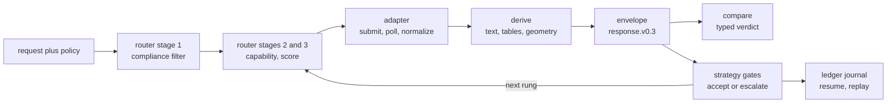

# OpenReading: one JSON over every document parser

<sub>Docs home · [The command line →](cli/README.md)</sub>

> **In one sentence.** OpenReading returns one JSON shape from every document parser, so switching,
> comparing, or routing between parsers never changes the code downstream.

## What OpenReading is

You have a folder of documents and more than one parser that could read them. A local library
handles documents made by software well, a hosted API reads scanned pages better, and each returns
its own JSON shape. When two parsers disagree on an invoice total, nothing shows you which fields
differ. Some documents carry data that only certain vendors may see, and nothing tracks that for
you.

OpenReading solves those problems with one request shape and one response shape over every parser. A
backend is one parser, whether a local library, a hosted API, or a self-hosted model you run. Every
backend returns the same JSON document, called the envelope, so you write the code that reads it
once. For example, `openreading parse sample.pdf --backend pymupdf` and the same command with
`--backend tesseract` print envelopes with identical field names. A channel is one kind of output
inside the envelope, such as plain text, tables, or per-block confidence. When a backend cannot
produce a channel, the envelope leaves it out and names it in `warnings[]` rather than inventing a
value. A compliance policy is a short list of rules about which backends may see a document. The
router applies that policy before anything runs, and no later step, fallback, or setting can bring a
dropped backend back.

To follow the guides you need the install from the root README and the `sample.pdf` it builds. Every
guide runs offline with the `pymupdf` and `tesseract` backends, and a step that needs a hosted key
says so in place. An agent uses the same surfaces today, and a native tool surface is [not
built](#not-built-yet).

| Job | CLI `openreading …` | API (Python `openreading.*`; HTTP `openreading serve`) | Agent branches on |
|---|---|---|---|
| `parse` | `parse doc.pdf --backend X` | `run()`, `run_batch()`; `POST /v1/parse`, `POST /v1/batch` | the exit code, then `status.state` and `warnings[]` |
| `compare` | `compare a.json b.json` | `compare()`; `POST /v1/compare` | `headline.verdict`: `equivalent`, `divergent`, `mixed` |
| `strategy` | `parse --strategy X`; `route doc.pdf --policy p.json` | `run(strategy=)`, `route()`; `backend.id "strategy:X"`; `POST /v1/route` | `orchestration.outcome`, `attempts[].category`, `decisions[]` |

Source: `src/openreading/__init__.py` (The 3x3). Live truth: `uv run python -m pydoc openreading`.

### The mechanisms

- **One envelope over every backend.** `response.v0.3` is the contract. Every surface validates
  against it before a result leaves the process. [JSON Schemas](schemas/README.md), [The channel
  contract](derive/README.md).
- **Typed compare verdicts.** `compare` reads saved envelopes and returns a `headline.verdict` plus
  a closed set of finding codes, meaning the list is fixed and an agent can switch on it
  exhaustively. For example, `divergent` means the backends disagree on every channel compared,
  such as the text and the table cells. It never runs a backend and never feeds the router.
  [Compare](comparison/README.md).
- **Replayable strategy traces.** A strategy is a tree of backends under quality gates, and a gate
  is a test on each result that decides whether to accept it or move on. Every attempt carries
  one category from a closed vocabulary. `explain` renders the trace, and `replay --trace`
  re-executes its decisions. [Strategies](strategies/README.md).
- **Compliance-first routing, never widened.** Stage 1 drops backends for policy, and stages 2 and
  3 only filter and reorder the survivors. An unverified claim, such as a vendor that lists no
  regions, counts as no. [Routing and keys](router/README.md).
- **Ledger resume.** With `OPENREADING_LEDGER` set, a strategy run journals every step, meaning it
  writes each step to disk as it completes. `resume <run_id>` replays the recorded steps and runs
  the rest. [The run ledger](ledger/README.md).
- **Batch to corpus.** A folder goes in and one `batch-result` comes out. Two of them compare into
  a per-document corpus verdict. [Batch runs](batch/README.md).
- **Measured leaderboards.** `leaderboard` ranks backends on a dataset you supply, through the same
  scorer `compare --truth` uses. [Evals](evals/README.md).

### One document's path

Every document follows the path below, whichever backend answers.



The router reads adapter descriptions only and never branches on backend type. `derive` computes
every derived channel once, deterministically, so a declared channel always has an implementation
or a warning. A strategy runs the router once per rung, and a rung is one step of a cascade. The
ledger journals each rung as it completes.

## The map

The table below tells you which guide answers which need and how long each takes to read. Every
guide runs offline with `pymupdf` and `tesseract`. A step that needs a hosted key is marked in
place and shows the shape, not a run.

| You want to… | Guide | Time |
|---|---|---|
| know what this is, where to go next, and how an agent uses it | this page | 5 min |
| script it from a shell or CI: stdout, exit codes, `.env` | [The command line](cli/README.md) | 5 min |
| pick a backend under a policy, see why one was dropped, bring a key | [Routing and keys](router/README.md) | 10 min |
| run backends in cascades or races under gates, then explain or replay the trace | [Strategies](strategies/README.md) | 20 min |
| learn which backend is better on your document, and what exactly differs | [Compare](comparison/README.md) | 15 min |
| parse a folder into one JSON, then compare two runs of it | [Batch runs](batch/README.md) | 8 min |
| resume, replay, or erase a run from its journal | [The run ledger](ledger/README.md) | 8 min |
| run the same engine over HTTP, with auth | [The HTTP server](server/README.md) | 10 min |
| understand why a field is absent rather than wrong | [The channel contract](derive/README.md) | 5 min |
| score backends on your own labeled documents | [Evals](evals/README.md) | 5 min |
| look up the exact JSON shapes and enums | [JSON Schemas](schemas/README.md) | lookup |
| look up a backend's variables, license, and compliance posture | [Backend adapters](adapters/README.md) | lookup |

Every guide has the same eight sections: what it gives you, mental model, walkthrough, recipes, how
it decides, reference, not built yet, see also. Reference truth stays in docstrings. `uv run python
-m pydoc openreading.<module>` prints a package's contract, and `uv run openreading <cmd> --help`
prints every flag. A guide demonstrates and points, and it never restates a docstring. The
maintenance rule is "Where a change gets documented" in [`AGENTS.md`](../../AGENTS.md).

## Using OpenReading from an agent

Everything an agent needs to act (succeed, retry, escalate, reject) is a typed field, not prose.

### Invoke it

From a shell, the exit code is the first branch. `3` means it cannot run, and stderr says why:

```bash
uv run openreading parse sample.pdf --backend reducto > out.json; echo "exit=$?"
```
```text
[reducto] missing required credentials/config: REDUCTO_API_KEY. Sign up / configure: https://platform.reducto.ai
exit=3
```

From Python, `run()` returns the envelope as a dict. `POST /v1/parse` returns the same envelope
over HTTP ([The HTTP server](server/README.md)). This run uses the `offline_first` preset, a
strategy that ships with the package, so the `orchestration` block is present. Printed values
appear as trailing comments:

```python
import openreading
resp = openreading.run("sample.pdf", strategy="offline_first")
state = resp["status"]["state"]
outcome = resp.get("orchestration", {}).get("outcome")
codes = [w["code"] for w in resp.get("warnings", [])]
print(state, outcome, codes)                                        # succeeded ok ['confidence_unavailable']
print([a["category"] for a in resp["orchestration"]["attempts"]])   # ['succeeded']
if state == "failed" or outcome == "degraded" or "quality_below_threshold" in codes:
    print("escalate")
else:
    print("consume", len(resp["document"]["text"]))                 # consume 336
```

### Branch on typed fields

The table below maps each signal an agent can read to the action it should take.

Source: `src/openreading/__init__.py` ("Let your agents decide", the triage playbook). Live truth:
`uv run python -m pydoc openreading`. If this table and that output disagree, the output is right.
Fix the table.

| Signal | Meaning | Action |
|---|---|---|
| `status.state` `succeeded` with no `orchestration`, or `orchestration.outcome` `ok` | clean parse | consume `document` / `typed_fields` |
| `orchestration.outcome` `degraded` plus warning `quality_below_threshold` | every rung gated; this is the best result kept, not a clean pass | escalate: a stronger backend, a `compare` strategy, or reject |
| `status.state` `partial` | some channels or pages made it, some did not | consume what is present; `warnings[]` names what is missing |
| warning `fallback_used` / `quality_escalated` | the named backend failed or gated, and another answered | consume; log the trail |
| warning `confidence_unavailable` | this backend never emits confidence: absence, not zero | do not gate on a number that is not there |
| error `timeout`, `rate_limited`, `provider_error` | transient | retry with backoff, or the next backend |
| error `invalid_input`, `auth` | terminal | fix the input or the key; retrying will not help |
| `ComplianceRefused` (HTTP 403, CLI exit 3) | policy forbids every eligible backend; fails closed | change the policy or the ask; never retry harder |
| `MissingCredentialsError` (HTTP 424, CLI exit 3) | names the exact env vars | provision keys |
| batch `status.state` `partial` (CLI exit 4) | per-item `state` and `skip_reason` say exactly what failed | retry the failed subset only |
| corpus verdict `divergent` | backends disagree on this document | route it through a `compare:` plus `then:` strategy |

### Read the trace

The trace tells an agent which vocabulary it can switch on exhaustively and which it must tolerate.

- `warnings[].code` is an open set, so switch on the codes you know and tolerate the rest.
- The strategy trace is closed, so an agent can switch on it exhaustively. Every attempt in
  `orchestration.attempts[]` carries one `category` from `openreading.strategies.trace.CATEGORIES`:
  `succeeded`, `skipped(missing_credentials)`, `skipped(circuit_open)`, `deadline_pruned`,
  `quality_escalated`, `review_escalated`, `raced_lost`, `judged_lost`, `shadow`, `merge_base`,
  `merge_source`, `decider_call`, `judge_call`.
- Each gate record carries `predicate`, `threshold`, `observed` and `fired`. A gate whose signal the
  backend cannot produce is recorded as `skipped: signal_unavailable`, never as passed.
- Compare verdicts and finding codes are closed too (`uv run python -m pydoc
  openreading.comparison`, Finding codes).

A strategy has three decision points: the gray band of a `review_if` gate, a `decide:` node, and
`pick: best` judging. The gray band is the range where a score falls between the accept and reject
thresholds. Every choice lands in `decisions[]` with a deterministic `decision_id`.
`openreading replay --trace out.json` re-executes them for audit. The engine enumerates the
candidates, and a decision cannot override compliance. Today every point resolves to the engine
default, because no LLM executor ships ([Not built yet](#not-built-yet)).

### Brief the model

`uv run python -m pydoc openreading` is the self-contained briefing for a model using the library.
Every backend id, flag and JSON shape in it comes from the vendored schemas. Feed it as the system
prompt. Its first screen looks like this, abbreviated:

```bash
uv run python -m pydoc openreading | head -40
```
```text
NAME
    openreading - OpenReading — one unified API for document processing.
…
    This docstring is the self-contained briefing for an LLM or agent USING the library. Every
    backend id, flag and JSON shape below is taken from the vendored schemas
…
```

An agent extending the library with a new backend reads `uv run python -m pydoc
openreading.adapters` instead.

## Not built yet

Nothing below exists in the package today. Each line names where the gap is recorded.

- `openreading mcp`, a native tool surface for agents, does not exist. Integrate through the CLI,
  Python dicts, or HTTP. The gap is recorded in the `openreading` package docstring (Known gaps)
  and `AGENTS.md` (Also here when built).
- `triage`, a verb that would apply the playbook above for you, does not exist. `uv run
  openreading --help` lists no such verb. The gap is recorded in `AGENTS.md` (Also here when
  built).
- The decider wire executor, the real LLM call behind `DeciderPort`, does not exist. Today every
  enabled decision point takes the engine default, traced as `decider_downgraded: unavailable`. The
  gap is recorded in `openreading.strategies.decider` (Status).
- Neither the intent schema with its routing mechanics nor the translation stage with its profile
  grammar is built. The gap is recorded in `AGENTS.md` (Also here when built).
- There is no closed registry for `warnings[].code` and no schema validation of the
  `orchestration` block's inner shape. The gap is recorded in the `openreading` package docstring
  (Known gaps).

<sub>Docs home · [The command line →](cli/README.md)</sub>
