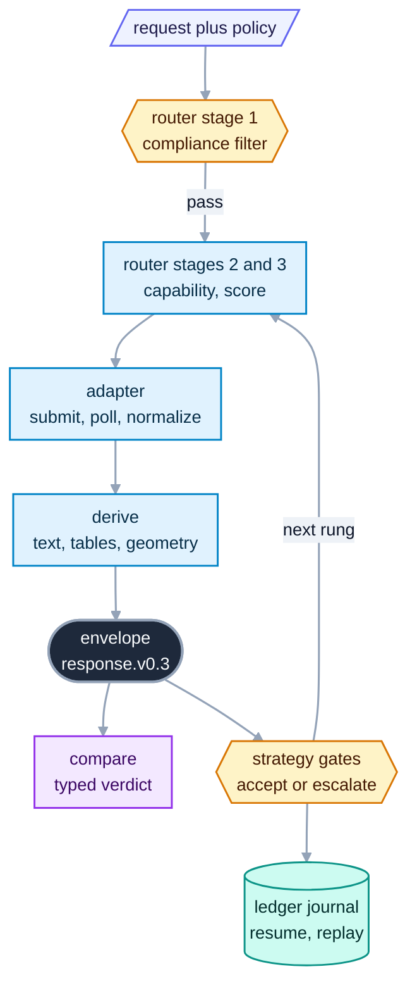

# OpenReading: an intelligent, policy-aware router for document processing

<sub>Docs home · [The command line →](cli/README.md)</sub>

> **In one sentence.** OpenReading runs your documents through the backends your rules allow, and
> returns one JSON shape whichever backend did the work, so switching, comparing, or routing between
> backends never changes the code downstream.

## What OpenReading is

You have a folder of documents and more than one parser that could read them. A local library
handles documents made by software well, a hosted API reads scanned pages better, and each returns
its own JSON shape. When two parsers disagree on an invoice total, nothing shows you which fields
differ. Some documents carry data that only certain vendors may see, and nothing tracks that for
you.

OpenReading solves those problems with one request shape and one response shape over every parser. A
backend is one parser, whether a local library, a hosted API, or a self-hosted model you run. Every
backend returns the same JSON document, called the envelope, so you write the code that reads it
once. For example, `openreading parse sample.pdf --backend pymupdf` and the same command with
`--backend tesseract` print envelopes with identical field names.

A channel is one kind of output inside the envelope, such as plain text, tables, or per-block
confidence. When a backend cannot produce a channel, the envelope leaves it out rather than
inventing a value. `channel_provenance` lists the channels this run did produce. A `warnings[]`
entry names some of those gaps and not others, so read provenance rather than waiting for a warning
([The channel contract](derive/README.md#which-signal-to-trust-when-a-channel-is-missing)).

A compliance policy is a short list of rules about which backends may see your documents. The
router is the step that picks a backend for each request. It applies that policy before anything
runs, and no later step, fallback, or setting can bring a dropped backend back.

To follow the guides you need the install from the [root README](../../README.md) and the
`sample.pdf` it builds. Every guide runs offline with the `pymupdf` and `tesseract` backends, and a
step that needs a hosted key says so in place. OpenReading has three surfaces, meaning three ways
to call the same engine: the command line, the Python API, and the HTTP server. An agent uses those
same surfaces today, and a native tool surface is [not built](#not-built-yet).

| Job | CLI `openreading …` | API (Python `openreading.*`; HTTP `openreading serve`) | Agent branches on |
|---|---|---|---|
| `parse` | `parse doc.pdf --backend X` | `run()`, `run_batch()`; `POST /v1/parse`, `POST /v1/batch` | the exit code, then `status.state` and `warnings[]` |
| `compare` | `compare a.json b.json` | `compare()`; `POST /v1/compare` | `headline.verdict`: `equivalent`, `divergent`, `mixed` |
| `strategy` | `parse --strategy X`; `route doc.pdf` | `run(strategy=)`, `route()`; `backend.id "strategy:X"`; `POST /v1/route` | `orchestration.outcome`, `attempts[].category`, `decisions[]` |
| `evals` | `benchmark run NAME --target backend:X`; `leaderboard DIR --backends X,Y` | CLI only | official reports or the ranked rows |

Source: `src/openreading/__init__.py` (The 3x3). Live truth: `uv run python -m pydoc openreading`.

### The mechanisms

Each mechanism below holds on every surface, and each links to the guide that demonstrates it.

- **One envelope over every backend.** `response.v0.3` is the contract. Every surface validates
  against it before a result leaves the process. [JSON Schemas](schemas/README.md), [The channel
  contract](derive/README.md).
- **Typed compare verdicts.** `compare` reads saved envelopes and returns a `headline.verdict` plus
  a closed set of finding codes. Closed means the list is fixed, so an agent can switch on it
  exhaustively. For example, `divergent` means the backends disagree on every channel compared,
  such as the text and the table cells. Over saved envelopes it runs no backend and costs nothing.
  The fan-out form, `compare doc.pdf --backends x,y,z`, is the exception: it runs every backend
  named, and each hosted one charges your own key. [Compare](comparison/README.md).
- **Replayable strategy traces.** A strategy is a tree of backends under quality gates. A gate is a
  test on each result that decides whether to accept it or move on. Every attempt carries
  one category from a closed vocabulary. `explain` renders the trace, and `replay --trace`
  re-executes its decisions. [Strategies](strategies/README.md).
- **Compliance-first routing, widened only by your policy.** The router picks a backend in three
  stages. Stage 1 drops backends for policy, and stages 2 and 3 only filter and reorder the
  survivors. An unverified claim, such as a vendor that lists no regions, counts as no. Your policy
  is the one thing that sets the eligible set, and exactly three of its keys enlarge it:
  `allow_unverified_compliance`, `baa_tier_confirmed` and `train_optout_confirmed`. Nothing after
  the policy enlarges it again. No fallback, named backend, or strategy step readmits a dropped
  vendor. A decider, the optional LLM call at a strategy's decision points, cannot readmit one
  either. [Routing and keys](router/README.md).
- **Ledger resume.** With `OPENREADING_LEDGER` set, a strategy run journals every step, meaning it
  writes each step to disk as it completes. `resume <run_id>` replays the recorded steps and runs
  the rest. [The run ledger](ledger/README.md).
- **Batch to corpus.** A corpus is a folder of documents you process as one job. A folder goes in
  and one `batch-result` comes out. Two of those results compare into one verdict per document.
  [Batch runs](batch/README.md).
- **Measured leaderboards.** `leaderboard` ranks backends on a dataset you supply, through the same
  scorer `compare --truth` uses. [Evals](evals/README.md).

### One document's path

Every document follows the path below, whichever backend answers.



An adapter is the package that wraps one backend and describes it to the router in a static
descriptor. The router reads those descriptions only and never branches on backend type. `derive`
computes every derived channel once, deterministically, so a declared channel always has an
implementation or a warning. A strategy runs the router once per rung, and a rung is one step in
the sequence of backends a strategy tries. The ledger journals each rung as it completes.

## The map

The table below tells you which guide answers which need and how long each takes to read.

| You want to… | Guide | Read time |
|---|---|---|
| know what this is, where to go next, and how an agent uses it | this page | 10 min |
| script it from a shell or CI: stdout, exit codes, `.env` | [The command line](cli/README.md) | 10 min |
| look up one CLI chapter without leaving the terminal | `uv run openreading help` lists the topics; `uv run openreading help batch` prints one | look up as needed |
| pick a backend under a policy, see why one was dropped, bring a key | [Routing and keys](router/README.md) | 10 min |
| run backends in cascades or races under gates, then explain or replay the trace | [Strategies](strategies/README.md) | 20 min |
| pick a gate threshold from documents you labeled, instead of guessing | [Strategies, step 8](strategies/README.md#8-ask-for-thresholds-from-a-sample) | 8 min |
| find **where** two backends disagree on your documents, when you have no labels to judge with | [Compare](comparison/README.md) | 15 min |
| parse a folder into one JSON, then compare two runs of it | [Batch runs](batch/README.md) | 8 min |
| resume, replay, or erase a run from its journal | [The run ledger](ledger/README.md) | 8 min |
| run the same engine over HTTP, with auth | [The HTTP server](server/README.md) | 10 min |
| understand why a field is absent rather than wrong | [The channel contract](derive/README.md) | 5 min |
| run a public benchmark, then rank backends on your labeled documents | [Evals](evals/README.md) | 10 min |
| decide whether to approve this for regulated data | [What this software protects, and what it does not](../../SECURITY.md#what-this-software-protects-and-what-it-does-not) | 10 min |
| look up the exact JSON shapes and enums | [JSON Schemas](schemas/README.md) | look up as needed |
| look up a backend's variables, license, and compliance posture | [Backend adapters](adapters/README.md) | look up as needed |
| call it from Python: `run()`, `route()`, `compare()`, `run_batch()`, and one exception type per condition | reference only: `uv run python -m pydoc openreading.api` | look up as needed |
| look up the pydantic models that mirror the schemas | reference only: `uv run python -m pydoc openreading.types` | look up as needed |
| look up how `openreading.yaml` is found, and the nine keys its `policy:` block takes | reference only: `uv run python -m pydoc openreading.config` | look up as needed |
| gate your own adapter against the conformance kit | reference only: `uv run python -m pydoc openreading.testing` | look up as needed |

### Every guide, by file

The same set as a reviewer's checklist, one row per file. The order is a reading order rather
than an alphabet: the front door, then this page, then one guide per surface, then the reference
pages you look things up in. Each guide stands alone and carries its own `See also` line, so
reading them out of order costs nothing.

| File | Guide | What is in it | Lines |
|---|---|---|---|
| [`README.md`](../../README.md) | The front door | Install, the four walkthroughs (parse, compare, route, strategy), and what this is not. | 529 |
| [`src/openreading/README.md`](README.md) | Docs home | This page. The map above, plus how an agent drives the engine. | 434 |
| [`src/openreading/cli/README.md`](cli/README.md) | The command line | One JSON envelope on stdout, everything else on stderr, and an exit code a script can branch on. | 454 |
| [`src/openreading/router/README.md`](router/README.md) | Routing and keys | Which backends a policy allows, why each was dropped, and how to write the `policy:` block. | 568 |
| [`src/openreading/strategies/README.md`](strategies/README.md) | Strategies | Cascades, races and gates in `openreading.yaml`, and the trace each run leaves. | 743 |
| [`src/openreading/batch/README.md`](batch/README.md) | Batch runs | A folder, a glob or several files as one `batch-result` envelope. | 400 |
| [`src/openreading/comparison/README.md`](comparison/README.md) | Compare | Where two backends disagree on one document, as a verdict plus findings. | 402 |
| [`src/openreading/evals/README.md`](evals/README.md) | Evals | Public benchmarks, and ranking backends on documents you labeled. | 713 |
| [`src/openreading/ledger/README.md`](ledger/README.md) | The run ledger | Resume after an interruption, replay offline, and crypto-shred what a run recorded. | 410 |
| [`src/openreading/server/README.md`](server/README.md) | The HTTP server | `openreading serve`: the same engine behind a local JSON API, with bearer auth. | 509 |
| [`src/openreading/adapters/README.md`](adapters/README.md) | Backend adapters | The catalog: each backend's formats, variables, price and compliance posture. | 378 |
| [`src/openreading/schemas/README.md`](schemas/README.md) | JSON Schemas | The contract every surface speaks, and how a version is cut. | 401 |
| [`src/openreading/derive/README.md`](derive/README.md) | The channel contract | Why a field is absent rather than wrong, and who computed it. | 280 |
| [`examples/README.md`](../../examples/README.md) | Example documents | The two synthetic bank statements the guides parse, and where they came from. | 96 |

Three more files sit at the repository root and are not guides. [`SECURITY.md`](../../SECURITY.md)
states what a compliance policy does and does not guarantee, and is the page to read before
approving this for regulated data. [`CHANGELOG.md`](../../CHANGELOG.md) carries every breaking
change with the reason for it. [`AGENTS.md`](../../AGENTS.md) is the contributor contract, and
explains why there is no `docs/` directory: documentation lives in the module docstring beside
the code, and each directory's `README.md` indexes those places rather than restating them.
The Evals and Compare rows sound alike and answer different questions. `compare` has no ground
truth, so it can only tell you which fields two backends read differently. `leaderboard` scores
each backend against documents you labeled yourself, so it is the only one that can say which
backend is right. Label first, run the leaderboard, then use compare to read the disagreements it
surfaces.

The Next arrow at the top and bottom of every guide follows this table's order.

The nine subsystem guides share one section order: what it gives you, mental model, walkthrough,
recipes, how it decides, reference, not built yet, see also. The command line and the HTTP server
add an Operations section to that order. [JSON Schemas](schemas/README.md) and [Backend
adapters](adapters/README.md) are lookup pages rather than walkthroughs, so they are organized as
tables. Every guide ends with a "Not built yet" section naming what is missing, then a "See also".
The two lookup pages add a "Maintenance" section for contributors after that. Reference truth stays
in docstrings. `uv run python -m pydoc openreading.<module>` prints a package's contract, and `uv
run openreading <cmd> --help` prints every flag. A guide demonstrates and points, and it never
restates a docstring. The maintenance rule is "Where a change gets documented" in
[`AGENTS.md`](../../AGENTS.md).

## Using OpenReading from an agent

Everything an agent needs to act (succeed, retry, escalate, reject) is a typed field, not prose.

### Invoke it

`uv run openreading backends` is how an agent learns which backends are usable. Its `CONFIGURED`
column is reliable. Its `MISSING` column is not a complete provisioning source. For
`anthropic-claude` and `aws-textract` it stays `-` even when they are unconfigured, so for those
two it names nothing to provision. The only way to discover their requirement is to attempt a
parse and read the error, which names the variable.

From a shell, the exit code is the first branch. `3` means it cannot run, and stderr says why:

```bash
uv run openreading parse sample.pdf --backend reducto > out.json; echo "exit=$?"
```
```text
[reducto] missing required credentials/config: REDUCTO_API_KEY. Sign up / configure: https://platform.reducto.ai
exit=3
```

`parse --backend <id>` names one backend directly, and the `policy:` block of your
`openreading.yaml` gates it like everything else. `route` prints that plan without running
anything. [Routing and keys](router/README.md) covers both. The single-document form, run for
real:

```bash
cat > openreading.yaml <<'YAML'
version: 1
policy:
YAML
uv run openreading route sample.pdf --run
```
```json
{ "chosen": "pymupdf",
  "fallbacks": ["docling", "azure-document-intelligence", "google-document-ai", "tesseract", "qwen-vl", "anthropic-claude"],
  "dropped": {},
               "…": "6 more" },
  "terminal_reason": null,
  "result": { "schema_version": "0.3", "status": { "state": "succeeded" }, "backend": { "id": "pymupdf", … } } }
```

From Python, `run()` returns the envelope as a dict. `POST /v1/parse` returns the same envelope
over HTTP ([The HTTP server](server/README.md)). This run uses the `offline_first` preset, a
strategy that ships with the package, so the `orchestration` block is present. Printed values
appear as trailing comments:

```python
import openreading
resp = openreading.run("sample.pdf", strategy="offline_first")
state = resp["status"]["state"]
outcome = resp.get("orchestration", {}).get("outcome")
codes = [w["code"] for w in resp.get("warnings", [])]
print(state, outcome, codes)                                        # succeeded ok ['confidence_unavailable']
print([a["category"] for a in resp["orchestration"]["attempts"]])   # ['succeeded']
if state == "failed" or outcome == "degraded" or "quality_below_threshold" in codes:
    print("escalate")
else:
    print("consume", len(resp["document"]["text"]))                 # consume 336
```

### Branch on typed fields

The three surfaces do not describe the same condition at the same resolution, so the first thing to
decide is which surface you call. Python raises a distinct exception type per condition and is the
only surface that separates all of them. HTTP returns a machine-readable `error.category`. The CLI
gives you an exit code. Exit `3` covers the six conditions in the `3` rows below, and their correct
actions disagree. [The command line](cli/README.md) lists every cause of exit `3`, not only these
six. An agent that must tell a compliance refusal from a rate limit cannot do it from the CLI.

Source: `src/openreading/__init__.py` ("Let your agents decide", the triage playbook),
`openreading.api` (Exceptions) and `openreading.server` (HTTP status codes). Live truth: `uv run
python -m pydoc openreading`. If this table and that output disagree, the output is right. Fix the
table.

| Condition | CLI | Python | HTTP | What to do |
|---|---|---|---|---|
| clean parse | exit `0`, `orchestration.outcome` `ok` or no `orchestration` | returns a dict | `200` | consume `document` / `typed_fields` |
| every rung gated, best result kept | exit `0`, `orchestration.outcome` `degraded` + warning `quality_below_threshold` | same dict | `200` | escalate: a stronger backend, a `compare` strategy, or reject. Exit `0` does not mean clean |
| the time budget ended the walk | exit `0`, `orchestration.outcome` `degraded` + warning `budget_exhausted` | same dict | `200` | do **not** escalate. Raise `budget.max_duration`, or accept the result |
| a rung gated and a later one answered | exit `0`, warning `quality_escalated` / `fallback_used` | same dict | `200` | consume, and log the trail. Unattended, alert on it: a permanent host fault looks like a one-off blip |
| some channels or pages missing | exit `0`, `status.state` `partial` | same dict | `200` | consume what is present. `warnings[]` names what is missing |
| this backend has no confidence to give | exit `0`, warning `confidence_unavailable` | same dict | `200` | do not gate on a number that is not there |
| the allow-list permits no registered backend | exit `3` from a `parse` run. `route` prints the empty chain and exits `4` | `ScopeRefused` | `403`, `error.category` `scope_denied` | widen `policy.backends`, or name a backend the list contains. **Never retry**, because nothing about a retry changes the answer |
| rate limit or deadline exhausted | exit `3` | `RetryableError` | `504`, `error.category` `retryable_exhausted` | retry later with backoff. Same CLI exit code as the row above, opposite action |
| a key is missing | exit `3` | `MissingCredentialsError` | `424`, `error.backend_code` `missing_credentials`, `missing_env[]` | provision the named vars |
| a key was found and rejected | exit `3` | `TerminalError` | `424`, `error.backend_code` `auth_rejected` | fix the key. Retrying will not help |
| the backend cannot do what you asked | exit `3` | `UnsupportedFeatureError` | `422`, `error.category` `unsupported_feature` | route to a capable backend |
| every backend in the plan failed | exit `3` | `PlanExhaustedError` | `502`, `error.category` `plan_exhausted`, `trail` | read `trail`. Each entry says why that rung failed |
| a batch had failures | exit `4`, `status.state` `partial` | dict, `items[].error.code` | `200` | retry the failed subset only. `items[].error.code` is the only error code you ever see |
| backends disagree on your documents | corpus verdict `divergent` | same | `200` | route it through a `compare:` plus `then:` strategy |

> [!IMPORTANT]
> Exit `0` does not mean the result is clean, and no exit code reports degradation.
> `orchestration.outcome` is the field that says so. A run where every rung gated still exits `0`
> with `status.state` `succeeded`. A CI gate written as `jq -e '.status.state == "succeeded"'`
> therefore passes a result this table tells you to escalate.

`timeout`, `rate_limited`, `provider_error`, `invalid_input`, `auth` and the five other `on_error:`
keys are **not** response values. They are `on_error:` map keys you write in `openreading.yaml`, a
config-authoring vocabulary, and no surface emits them. Reading an error is per surface, above and
in [`schemas/README.md`](schemas/README.md#reading-an-error). Inside a strategy trace,
`attempts[].code` carries the adapter's own failure code, such as `TesseractNotFoundError`. Branch
on that rather than on the attempt's `category`. `error(provider_error)` is the catch-all, and a
missing local binary lands there beside a genuine transient fault. The missing binary fails
identically forever, and the transient fault does not.

#### What is closed, and what only looks closed

An open set means new values will appear, so match the ones you know and tolerate the rest. A
closed set means you can switch on it exhaustively today. Nothing inside `orchestration` is closed
at the schema level. In `response.v0.3.json` the block is `additionalProperties: true` with zero
declared properties. Every closure below is a guarantee made by code, not one a validator will
enforce for you.

| Value | Open or closed | Where the set lives |
|---|---|---|
| `attempts[].category` | closed, 13 values | `openreading.strategies.trace.CATEGORIES`, a real `frozenset` |
| `headline.verdict`, finding codes | closed | `comparison-report.v0.2.json`, with live-truth commands in [Compare](comparison/README.md) |
| `document.pages[].blocks[].type` | closed, 22 values | `response.v0.3.json` |
| `orchestration.outcome` | closed in code, `ok` / `degraded` | a comment in `strategies/trace.py`. No schema enumerates it |
| `decisions[].downgraded` | closed in code, 9 values | `openreading.strategies.decider.DOWNGRADE_REASONS` |
| `decisions[].point` | **open** | four values ship (`decide`, `gate_band`, `judge`, `route`). A code comment names only the first three |
| `warnings[].code` | **open** | known codes listed in the `openreading.schemas` docstring (`warnings[]`) |
| `status.error.code` | **open**, and never populated on a single-document response | `response.v0.3.json` types it as a bare string |
| batch `items[].error.code` | **open** | the adapter's `backend_code`, else the Python exception class name |
| HTTP `error.category` | closed in code | the status ladder in the `openreading.server` docstring |

Live truth for the two frozensets:

```bash
uv run python -c "from openreading.strategies import trace, decider; print(len(trace.CATEGORIES), len(decider.DOWNGRADE_REASONS))"
```
```text
13 9
```

### Read the trace

No LLM executor ships today, so every decision point resolves to the engine default. Read this
section to understand a run you are auditing, not to configure a model. The gap is in [Not built
yet](#not-built-yet).

A strategy run carries an `orchestration` block recording why every backend ran or did not. The
open and closed register above says which of its fields you may switch on. Two details decide
whether an agent reads it correctly.

**A gate that could not be measured also reports `fired: false`.** Each gate record carries
`predicate`, `threshold`, `observed` and `fired`, plus `skipped` when the signal was unavailable.
The wire key is `skipped`, and its value is a reason string. Check `skipped` before you read
`fired`, because a missing measurement is never dressed up as a pass:

```bash
uv run openreading parse sample.pdf --strategy offline_first 2>/dev/null \
  | jq -c '.orchestration.attempts[0].gates[] | select(.skipped)'
```
```json
{"predicate":"confidence_below","threshold":0.6,"observed":null,"fired":false,"skipped":"signal_unavailable"}
```

**`decisions[]` is not a log of every choice.** It records only the decision points an LLM is
allowed to take over. Those are a `decide:` node and the gray band of a `review_if:` gate. A gray
band is the range where a score falls between the accept and reject thresholds. A plain `pick:
best` selection is neither, so it leaves no decision record and no quality number. It appears only
as the `judged_lost` category on the losing attempts. An `offline_first` run prints
`.orchestration.decisions` as `[]`, and that does not mean nothing was chosen.

A decision record carries `decision_id`, `node_path`, `label`, `point`, `eligible`, `chosen`,
`decider`, `config_hash`, `strategy` and `downgraded`. **`eligible` is the audit hook.** It is the
candidate list the engine enumerated, so a second agent can assert `chosen` is in `eligible` and
prove the choice was in bounds. The engine builds that list, and a decision cannot override
compliance.

The record below comes from step 7 of the [Strategies
walkthrough](strategies/README.md#7-declare-a-decision-point-run-it-without-an-llm-replay-it). Save
the `choose.yaml` shown there, then write the trace with `uv run openreading parse sample.pdf
--config choose.yaml --strategy choose > choose.json`.

```json
{"decision_id":"dp_fc18231afc32f40428df74a3fd","node_path":"root","label":"root","point":"decide",
 "eligible":["text_layer","ocr","otherwise"],"chosen":"otherwise","decider":"engine",
 "config_hash":"sha256:5d71bc90…","strategy":"choose","downgraded":"env_disabled"}
```

A `route:` node also appends to `decisions[]`, and its record is a different shape. `point` is
`route`, and `chosen` is an integer rule index or the string `default` when no rule matched. There
is no `decision_id`, `eligible` or `config_hash`. Test for the key before reading it.

**Replay needs the document and the config, not the trace alone.** `openreading replay --trace
out.json` exits `2`, because `replay` takes the document as a positional argument. Without
`--config` it then exits `3` unless an `openreading.yaml` sits in the working directory. The
working form names all three:

```bash
uv run openreading replay sample.pdf --config choose.yaml --trace choose.json > replay.json
jq -c '.orchestration.decisions[] | {point, chosen, decider, downgraded}' replay.json
```
```json
{"point":"decide","chosen":"otherwise","decider":"trace","downgraded":null}
```

The `decision_id` is byte-identical to the original run's, which is what makes an audit
reproducible. [Strategies](strategies/README.md#recipes) assembles these pieces into one recipe for
a second agent auditing the first.

### Brief the model

`uv run python -m pydoc openreading` prints the self-contained briefing for a model using the
library. Every backend id, flag and JSON shape in it comes from the vendored schemas. Feed the
`DESCRIPTION` section as the system prompt. That section is the briefing, and it runs to the
`PACKAGE CONTENTS` line. Everything after that line is `CLASSES`, `FUNCTIONS` and `DATA`, a
maintainer's reference for the exception types and the exported functions. A model does not need
it to drive the tool:

```bash
uv run python -m pydoc openreading | sed -n '1,6p'
```
```text
Help on package openreading:

NAME
    openreading - OpenReading: one unified API for document processing.

DESCRIPTION
```

Paths beginning `internal/` in that output name a private company repository, and so do ids of the
form `BL-*`, `AC-*` and `D-v*`. The briefing says so itself in its third paragraph. A model must
not cite either to a user as something they can open.

An agent extending the library with a new backend reads `uv run python -m pydoc
openreading.adapters` instead.

## Not built yet

Nothing below exists in the package today. Each line names where the gap is recorded.

- `openreading mcp`, a native tool surface for agents, does not exist. Integrate through the CLI,
  Python dicts, or HTTP. The gap is recorded in the `openreading` package docstring (Known gaps)
  and `AGENTS.md` (Also here when built), and designed in
  [design/agentic.md](../../design/agentic.md) with
  [its product spec](../../product/specs/agentic.product-spec.md).
- `triage`, a verb that would apply the playbook above for you, does not exist. `uv run
  openreading --help` lists no such verb. The gap is recorded in `AGENTS.md` (Also here when
  built) and designed alongside the tool surface in
  [design/agentic.md](../../design/agentic.md).
- The decider wire executor, the real LLM call behind `DeciderPort`, does not exist. Today every
  enabled decision point takes the engine default. The decision records
  `downgraded: unavailable` when `OPENREADING_LLM_DECIDER` is set and `downgraded: env_disabled`
  when it is not. The gap is recorded in `openreading.strategies.decider` (Status), and designed
  in [design/decider-executor.md](../../design/decider-executor.md) with
  [its product spec](../../product/specs/decider.product-spec.md).
- Neither the intent schema with its routing mechanics nor the translation stage with its profile
  grammar is built. The gap is recorded in `AGENTS.md` (Also here when built). Intent is designed
  in [design/intent.md](../../design/intent.md) with
  [its product spec](../../product/specs/intent.product-spec.md). The translation stage has no
  design record anywhere, in this repo or the private one.
- There is no closed registry for `warnings[].code`. The list in the `openreading.schemas`
  docstring is a list to read rather than an enum to validate against. There is no schema
  validation of the `orchestration` block's inner shape either, which is why the register above
  marks its closed sets as code-level guarantees. Both gaps are recorded in the `openreading`
  package docstring (Known gaps).
- `status.error` is never populated on a single-document response, so a single parse has no error
  code to read. The batch surface does populate `items[].error.code`.
- There is no run-stats projection: no single block says which backends were eligible, attempted
  and actually dispatched, why each switch happened, and what it cost. Read the pieces that do
  exist, which are `warnings[]`, strategy `orchestration`, the batch summary and an armed ledger.
  The gap is recorded in the `openreading` package docstring (Known gaps).

<sub>Docs home · [The command line →](cli/README.md)</sub>
