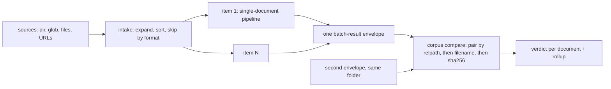

# Batch runs — a folder in, one JSON out

<sub>[Docs home](../README.md) · [← Compare](../comparison/README.md) · [The run ledger →](../ledger/README.md)</sub>

> **In one sentence.** Point `parse` at a directory, a glob, or several files and get one
> `batch-result` JSON with a full response per document; then compare two such runs document by
> document.

## What this gives you

One invocation over many documents. Each document runs the ordinary single-document pipeline on
its own. One failure never stops the rest. A file the backend (the parser you chose) cannot read
is skipped with a reason. The result is one envelope: the response JSON, with a fixed shape. It
carries a complete `response` per succeeded item, a summary, and warnings. Run the same folder
with two backends and `compare` the envelopes to learn which backend is better on your documents.

## Mental model

The batch layer wraps the single-document path and never changes it. Intake expands your sources
into a sorted list. Each item then runs exactly as `parse one.pdf` would, with its own routing and
compliance check.



Batch or single is decided by input form, not by count. A directory or a glob that expands to one
file is still a batch. A single named file is always the single `response`, byte for byte.

## Walkthrough

Start from the root README's sample, then build a folder with one file the backend cannot read:

```bash
uv run python -c 'from openreading.testing.sample_pdf import build_sample_pdf; open("sample.pdf","wb").write(build_sample_pdf())'
mkdir -p corpus && cp sample.pdf corpus/a.pdf && cp sample.pdf corpus/b.pdf && echo hi > corpus/c.txt
```

### 1. Parse a directory and read the envelope

```bash
uv run openreading parse corpus/ --backend pymupdf --save-dir out > batch.json
```
```text
[1/3] c.txt skipped unsupported_format
Consider using the pymupdf_layout package for a greatly improved page layout analysis.
[2/3] a.pdf succeeded
[3/3] b.pdf succeeded
```

**You should see** one progress line per file on stderr, exit 0, and pure JSON in `batch.json`.
The `.txt` is a skip with a reason, never a crash. `--save-dir` also wrote `out/a.pdf.json` and
`out/b.pdf.json`: each item's own `response`, with subdirectories preserved. `batch.json` is a
`batch-result.v0.1`. Here it is with the two inner responses cut out:

```json
{ "schema_version": "0.1", "status": { "state": "succeeded" },
  "request": { "backend": "pymupdf", "jobs": 1, "source_args": ["corpus/"] },
  "items": [
    { "source": { "filename": "a.pdf", "format": "pdf", "path": "corpus/a.pdf", "relpath": "a.pdf", "size_bytes": 8688, "sha256": "ac78b713…" },
      "state": "succeeded", "response": { "schema_version": "0.3", "…": "…" }, "transport": "platform" },
    { "source": { "relpath": "b.pdf", "…": "…" }, "state": "succeeded", "response": "…", "transport": "platform" },
    { "source": { "filename": "c.txt", "format": "txt", "path": "corpus/c.txt", "relpath": "c.txt", "size_bytes": 3 }, "state": "skipped", "skip_reason": "unsupported_format" } ],
  "summary": { "total": 3, "succeeded": 2, "failed": 0, "skipped": 1, "duration_ms": 67.0, "cost_bases": ["infra_only"], "pages_processed": 4, "backends": { "pymupdf": 2 } },
  "warnings": [ { "code": "items_skipped", "message": "1 file(s) skipped: 1 unsupported_format" } ] }
```

One item per file, in argument order; a directory's files come sorted by relative path (M1),
whatever order the progress lines finished in. Each item has a `relpath`, the pairing key for
corpus compare. Check: `jq -r '.items[] | "\(.source.relpath) \(.state)"' batch.json`.

### 2. A single file, a glob, several files, `--jobs`, the size guard, a strategy

```bash
uv run openreading parse corpus/a.pdf --backend pymupdf | jq -c '{schema_version, state: .status.state}'
uv run openreading parse 'corpus/*.pdf' --backend pymupdf --jobs 4 | jq -c '{jobs: .request.jobs, total: .summary.total}'
uv run openreading parse corpus/a.pdf corpus/b.pdf --backend pymupdf | jq -c '.summary | {total, succeeded}'
uv run openreading parse corpus/ --backend pymupdf --max-items 1; echo "exit=$?"
uv run openreading parse corpus/ --strategy offline_first | jq -c '.request, [.items[] | select(.state=="succeeded") | .response.orchestration.outcome]'
```
```text
{"schema_version":"0.3","state":"succeeded"}
{"jobs":4,"total":2}
{"total":2,"succeeded":2}
[batch] batch expansion is 3 files, over the max-items limit (1); raise it with --max-items / max_items= if this is intended
exit=2
{"backend":"strategy:offline_first","strategy":"offline_first","jobs":1,"source_args":["corpus/"]}
["ok","ok"]
```

**You should see** a `0.3` single response for the named file and batch envelopes for the glob and
the pair. Quote the glob. Unquoted, the shell expands it into two files, which is also a batch.
`--jobs N` runs N items at once. The default is 1: serial, and safe under rate limits. `--jobs 0`
clamps to 1; above `--max-jobs` (32) exits 2. `--max-items` (default 200) refuses before any file
is read. Under `--strategy` each succeeded item carries its own `orchestration` block, because the
strategy runs per document ([Strategies](../strategies/README.md)).

### 3. The payoff: compare two runs of the same folder

```bash
uv run openreading parse corpus/ --backend tesseract > batchB.json
uv run openreading compare batch.json batchB.json --format table
```
```text
CORPUS COMPARE — batch vs batchB
2 document(s): 0 equivalent · 0 divergent · 2 mixed · 0 unpaired

  [     mixed] a.pdf
  [     mixed] b.pdf

FINDINGS (across paired documents)
     4  type_conflict
     2  block_unique
     2  table_shape_mismatch
```

**You should see** one verdict line per document and a rollup of finding codes. A verdict is the
compare judgement on one pair. `--format diffs` prints what each side captured that the other
missed. `--format json` is the schema-valid `corpus-report`, with the same numbers under `.rollup`.
A document in one run but not the other is `unpaired`: a finding, not a crash. Mixing a batch
envelope with a single response is exit 2. Verdicts and codes: [Compare](../comparison/README.md).

## Recipes

**Find out which documents failed, and why.**
```bash
mkdir -p broken && cp sample.pdf broken/good.pdf && echo 'not a pdf' > broken/bad.pdf
uv run openreading parse broken/ --backend pymupdf > broken.json; echo "exit=$?"
jq -c '.items[] | select(.state=="failed") | {relpath: .source.relpath, error}' broken.json
```
```text
[1/2] bad.pdf failed FileDataError: PyMuPDF failed: Failed to open stream
[2/2] good.pdf succeeded
exit=4
{"relpath":"bad.pdf","error":{"code":"FileDataError","message":"PyMuPDF failed: Failed to open stream"}}
```
Exit 4 is `partial`: some items failed, and the good document still has its full response.

**Run from Python.**
```python
import openreading
env = openreading.run_batch(["corpus/"], backend="pymupdf", jobs=2)
print(env["status"]["state"], env["summary"]["succeeded"], env["summary"]["backends"])   # succeeded 2 {'pymupdf': 2}
```
Same envelope, same intake rules. `max_items=` and `max_jobs=` are the keyword forms of the flags.

**Batch over HTTP.**
```bash
uv run openreading serve &      # http://127.0.0.1:8787
curl -s -X POST http://127.0.0.1:8787/v1/batch -H 'content-type: application/json' \
  -d '{"documents": [{"path": "'"$PWD"'/corpus/a.pdf"}, {"path": "'"$PWD"'/corpus/b.pdf"}], "backend": "pymupdf", "jobs": 2}' \
  | jq -c '{state: .status.state, request, transports: [.items[].transport]}'
```
```json
{"state":"succeeded","request":{"backend":"pymupdf","jobs":2,"source_args":["doc-0","doc-1"]},"transports":["platform","platform"]}
```
`backend` is a slug string here, not the `{"id": …}` object `/v1/parse` takes. The object form
returns a 500 today. Expand directories on the client side. See [The HTTP
server](../server/README.md).

**Mix files, folders, and URLs; use a hosted backend's native batch.** (shape shown, not run)
`uv run openreading parse https://example.com/loan.pdf corpus/ extra/w2.png --backend pymupdf`. A
URL passes through to its item as `document.url`, with no `sha256` at intake. Hidden files and
symlinks inside a directory are skipped. With a hosted key, `--backend anthropic-claude` over a
directory sends one vendor batch job, and each item reports `"transport": "native"`. `--deadline
SECONDS` overrides its one-hour wait. More than 10 live items on a directly named hosted backend
print a `[preflight]` cost line on stderr first, never a prompt.

## How it decides

Each rule names the failure it avoids. The full set is M1–M10 in the package docstring.

Source: `src/openreading/batch/__init__.py` (the M1–M10 invariants). Live truth: `uv run python -m
pydoc openreading.batch`. If this table and that text disagree, the text is right; fix the table.

| Rule | What it avoids | Where |
|---|---|---|
| `M2` envelope by input form, not count | An envelope type that flips with how many files a folder holds | `batch.sources.looks_batch` |
| `M1` sorted, recursive, deterministic expansion | Two runs of one folder that pair differently | `batch.sources.resolve_intake` |
| `M3` unsupported format is a skip with a reason | A `.docx` crashing the run, or vanishing silently | `batch.sources.resolve_intake` |
| `M4` item and jobs ceilings refuse before reading | A home directory, or an accidental hosted spend | `batch.sources`, `batch.runner.bound_jobs` |
| `M6` per-item isolation | One bad file taking the corpus down | `batch.runner` |
| `M7` per-item routing and compliance, no batch-level cache | A cached decision widening the compliant set | `batch.runner`, `openreading.api` |

Status: `succeeded` means at least one item succeeded and none failed (exit 0). `partial` means
some of each (exit 4). `failed` means nothing succeeded (exit 1). Skips alone never fail a batch
that produced something. An all-skipped or empty batch is `failed`, with an `items_skipped` or
`empty_batch` warning saying why. Silence is never mistaken for a hang.

## Reference

- `uv run python -m pydoc openreading.batch` — the layer, M1–M10, the envelope, native batch,
  surfaces and exits.
- `uv run python -m pydoc openreading.comparison.corpus` — pairing precedence and verdicts.
- `uv run openreading parse --help` — every batch flag.
- `src/openreading/schemas/batch-result.v0.1.json`, `corpus-report.v0.1.json` —
  [JSON Schemas](../schemas/README.md); `scripts/batch_demo.sh` — the larger local demo.

## Not built yet

- `--retry-failed <batch.json>`, a merge-rerun of failed items (`openreading.batch` docstring,
  "Deferred").
- Webhook-mode batches; server-side directory upload as a multipart bundle (same).
- Corpus-level evals, `--truth` per document; native batch for providers that stage through GCS or
  blob containers (same).
- Batch-level resume: Ctrl-C with `OPENREADING_LEDGER` set exits 6 — even for a `--backend` batch
  that journaled nothing — and names no run id (`openreading.cli` docstring, exit codes).

## See also

- [Docs home](../README.md)
- [Compare](../comparison/README.md) — the verdicts a corpus report rolls up.
- [The run ledger](../ledger/README.md) — one journaled run per item.
- [The HTTP server](../server/README.md) — `POST /v1/batch`.
- [Backend adapters](../adapters/README.md) · [JSON Schemas](../schemas/README.md)

<sub>[Docs home](../README.md) · [← Compare](../comparison/README.md) · [The run ledger →](../ledger/README.md)</sub>
