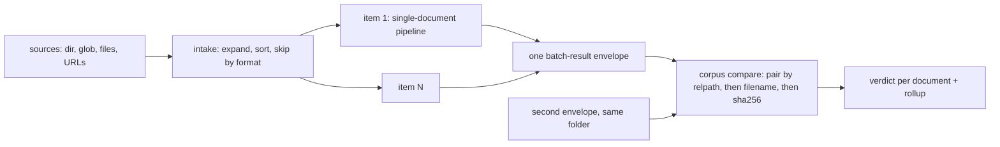

# Batch runs: a folder in, one JSON out

<sub>[Docs home](../README.md) · [← Compare](../comparison/README.md) · [The run ledger →](../ledger/README.md)</sub>

> **In one sentence.** Point `parse` at a folder, a glob, or several files and get one
> `batch-result` JSON holding a full response per document.

## What this gives you

You have a folder of two hundred documents and one parser that works well on a single file. Running
it in a shell loop means two hundred output files, a crash halfway that stops everything, and no
summary at the end. A backend is one parser, such as the local `pymupdf` library or a hosted API.
`openreading parse corpus/ --backend pymupdf > batch.json` runs the whole folder in one invocation
and prints one JSON document. Each document runs the ordinary single-document pipeline on its own,
so one failure never stops the rest. A file the backend cannot read is skipped with a reason such as
`unsupported_format`. The result is one envelope, meaning one JSON document with a fixed shape, and
this one is called `batch-result`. It carries a complete `response` per succeeded item, a summary
with counts, and warnings. Run the same folder with a second backend and `compare` the two envelopes
to learn which backend is better on your documents. You need `sample.pdf` from the root README, a
folder to copy it into, and no key for the local backends.

## Mental model

The batch layer wraps the single-document path and never changes what that path does. Intake is the
first step, and it expands your sources into one sorted list of files. Each item then runs exactly
as `parse one.pdf` would, with its own routing and its own compliance check.



Whether a run is a batch is decided by the form of the input and never by the count. A directory or
a glob that expands to a single file is still a batch with one item. A single named file always
yields the ordinary single `response`, byte for byte.

## Walkthrough

Start from the root README's sample, then build a folder with one file the backend cannot read:

```bash
uv run python -c 'from openreading.testing.sample_pdf import build_sample_pdf; open("sample.pdf","wb").write(build_sample_pdf())'
mkdir -p corpus && cp sample.pdf corpus/a.pdf && cp sample.pdf corpus/b.pdf && echo hi > corpus/c.txt
```

### 1. Parse a directory and read the envelope

```bash
uv run openreading parse corpus/ --backend pymupdf --save-dir out > batch.json
```
```text
[1/3] c.txt skipped unsupported_format
Consider using the pymupdf_layout package for a greatly improved page layout analysis.
[2/3] a.pdf succeeded
[3/3] b.pdf succeeded
```

**You should see** one progress line per file on stderr, exit 0, and pure JSON in `batch.json`.
The `.txt` is a skip with a reason, never a crash. `--save-dir` also wrote `out/a.pdf.json` and
`out/b.pdf.json`, each item's own `response`, with subdirectories preserved. Those files appear
once, after the last item finishes and the envelope is assembled, rather than as each item
completes. An interrupted run therefore writes none of them, however many items already succeeded,
so `--save-dir` is a convenience and not a crash-safety mechanism. [Sizing a large
run](#sizing-a-large-run) has the shard recipe that does protect a long run. `batch.json` is a
`batch-result.v0.1`. Here it is with the two inner responses cut out:

```json
{ "schema_version": "0.1", "status": { "state": "succeeded" },
  "request": { "backend": "pymupdf", "jobs": 1, "source_args": ["corpus/"] },
  "items": [
    { "source": { "filename": "a.pdf", "format": "pdf", "path": "corpus/a.pdf", "relpath": "a.pdf", "size_bytes": 8688, "sha256": "ac78b713…" },
      "state": "succeeded", "response": { "schema_version": "0.3", "…": "…" }, "transport": "platform" },
    { "source": { "relpath": "b.pdf", "…": "…" }, "state": "succeeded", "response": "…", "transport": "platform" },
    { "source": { "filename": "c.txt", "format": "txt", "path": "corpus/c.txt", "relpath": "c.txt", "size_bytes": 3 }, "state": "skipped", "skip_reason": "unsupported_format" } ],
  "summary": { "total": 3, "succeeded": 2, "failed": 0, "skipped": 1, "duration_ms": 67.0, "cost_bases": ["infra_only"], "pages_processed": 4, "backends": { "pymupdf": 2 } },
  "warnings": [ { "code": "items_skipped", "message": "1 file(s) skipped: 1 unsupported_format" } ] }
```

The envelope holds one item per file, in argument order. A directory's files come sorted by
relative path, whatever order the progress lines finished in, and that ordering is rule M1 under
How it decides. Each item has a `relpath`, the path relative to the folder you passed, and corpus
compare pairs documents by it.
Check: `jq -r '.items[] | "\(.source.relpath) \(.state)"' batch.json`.

### 2. A single file, a glob, several files, `--jobs`, the size guard, a strategy

```bash
uv run openreading parse corpus/a.pdf --backend pymupdf | jq -c '{schema_version, state: .status.state}'
uv run openreading parse 'corpus/*.pdf' --backend pymupdf --jobs 4 | jq -c '{jobs: .request.jobs, total: .summary.total}'
uv run openreading parse corpus/a.pdf corpus/b.pdf --backend pymupdf | jq -c '.summary | {total, succeeded}'
uv run openreading parse corpus/ --backend pymupdf --max-items 1; echo "exit=$?"
uv run openreading parse corpus/ --strategy offline_first | jq -c '.request, [.items[] | select(.state=="succeeded") | .response.orchestration.outcome]'
```
```text
{"schema_version":"0.3","state":"succeeded"}
{"jobs":4,"total":2}
{"total":2,"succeeded":2}
[batch] batch expansion is 3 files, over the max-items limit (1); raise it with --max-items / max_items= if this is intended
exit=2
{"backend":"strategy:offline_first","strategy":"offline_first","jobs":1,"source_args":["corpus/"]}
["ok","ok"]
```

**You should see** a `0.3` single response for the named file and batch envelopes for the glob and
the pair. Quote the glob, because the shell expands an unquoted one into two files, which is also a
batch. `--jobs 0` clamps to 1, and a value above `--max-jobs` (32) exits 2. Under `--strategy` each
succeeded item carries its own `orchestration` block, because the strategy runs per document
([Strategies](../strategies/README.md)).

`--jobs N` runs items in a thread pool of N workers, so how much it buys you depends on the
backend. A backend that spends its time waiting on a network call gains most of the N. A backend
that spends its time computing in Python gains nothing, because the workers take turns on the
interpreter lock. Measured here on 64 twelve-page PDFs, `pymupdf` took 4.62 s at `--jobs 1` and
4.67 s at `--jobs 16`, which is no speedup at all. Measured on 16 of the same documents,
`tesseract` fell from 43.4 s to 15.6 s and then stopped improving above `--jobs 4`.

It stops there because a backend may declare its own concurrency ceiling, and `tesseract` declares
4. Asking for more workers than that ceiling changes nothing, and the run tells you so on stderr.

```bash
uv run openreading parse corpus/ --backend tesseract --jobs 8 | jq -c .request
```
```text
[preflight] --jobs 8 requested; tesseract caps platform concurrency at 4 (descriptor.batch.max_concurrency), so this run uses 4
[1/3] c.txt skipped unsupported_format
…
{"backend":"tesseract","jobs":4,"source_args":["corpus/"]}
```

**You should see** the notice on stderr and `jobs: 4` in the envelope. That field always echoes the
value the run used, never the one you asked for. Every backend's ceiling is in the [cost and limits
table](../adapters/README.md#what-each-backend-charges-and-the-ceilings-on-one-request), and the
useful ceiling sits far below the `--max-jobs` limit of 32. The notice stays silent under `auto`
and `--strategy`, which resolve a backend per item, so no single ceiling is knowable up front.

`--max-items` (default 200) refuses before any file is read. It guards against a mistyped path and
against unintended spend, and it is also the only thing bounding the run's memory. The batch holds
every item's full response until the last one finishes, so peak memory grows with the corpus and
never levels off. Raising the limit for a large corpus is therefore not free, and
[Sizing a large run](#sizing-a-large-run) gives the numbers for choosing a safe value.

### 3. The payoff: compare two runs of the same folder

Two batch envelopes of the same folder tell you which backend is better, document by document.

```bash
uv run openreading parse corpus/ --backend tesseract > batchB.json
uv run openreading compare batch.json batchB.json --format table
```
```text
CORPUS COMPARE — batch vs batchB
2 document(s): 0 equivalent · 0 divergent · 2 mixed · 0 unpaired

  [     mixed] a.pdf
  [     mixed] b.pdf

FINDINGS (across paired documents)
     4  type_conflict
     2  block_unique
     2  table_shape_mismatch
```

**You should see** one verdict line per document and a rollup of finding codes. A verdict is the
compare judgement on one pair, such as `mixed` when the texts agree but the tables do not.
`--format diffs` prints what each side captured that the other missed. `--format json` is the
schema-valid `corpus-report`, with the same numbers under `.rollup`. A document in one run but not
the other is `unpaired`, which is a finding and not a crash. Mixing a batch envelope with a single
response exits 2. The verdicts and codes are in [Compare](../comparison/README.md).

## Recipes

**Find out which documents failed, and why.**
```bash
mkdir -p broken && cp sample.pdf broken/good.pdf && echo 'not a pdf' > broken/bad.pdf
uv run openreading parse broken/ --backend pymupdf > broken.json; echo "exit=$?"
jq -c '.items[] | select(.state=="failed") | {relpath: .source.relpath, error}' broken.json
```
```text
[1/2] bad.pdf failed FileDataError: PyMuPDF failed: Failed to open stream
[2/2] good.pdf succeeded
exit=4
{"relpath":"bad.pdf","error":{"code":"FileDataError","message":"PyMuPDF failed: Failed to open stream"}}
```
Exit 4 means `partial`. Some items failed, and the good document still has its full response.

**Load a batch result into a warehouse table.**
Flatten one row per item from `items[]`, and run three assertions on every load before anything
queries the result.

```bash
jq -e '.schema_version == "0.1"' batch.json > /dev/null || echo "schema bumped, re-check the loader"
jq -r '[.items[] | select(.state == "partial" or .state == "failed") | .source.relpath] | @csv' batch.json
jq -r '.summary.cost_bases' batch.json
```

Assert `schema_version` first, because a bump is the one signal that the shape may have moved
under you. Triage every item whose `state` is not `succeeded` next, since a partial item still
carries a response and a failed one carries an `error` instead. Read `summary.cost_bases` last,
and refuse to sum `cost_usd` as spend unless every basis in it is `billed`. An `estimated` basis
is a rate card applied to a page count rather than money anyone was charged, and
[JSON Schemas](../schemas/README.md#what-a-response-guarantees) defines all four values in its
`usage.cost_basis` row. Three columns are absent rather than null when they have no value, which
are `warnings`, per-block `confidence`, and `typed_fields`, so read them with a default and make
the column nullable.

**Run from Python.**
```python
import openreading
env = openreading.run_batch(["corpus/"], backend="pymupdf", jobs=2)
print(env["status"]["state"], env["summary"]["succeeded"], env["summary"]["backends"])   # succeeded 2 {'pymupdf': 2}
```
Python returns the same envelope under the same intake rules. `max_items=` and `max_jobs=` are the
keyword forms of the flags.

**Batch over HTTP.**
```bash
uv run openreading serve &      # http://127.0.0.1:8787
curl -s -X POST http://127.0.0.1:8787/v1/batch -H 'content-type: application/json' \
  -d '{"documents": [{"path": "'"$PWD"'/corpus/a.pdf"}, {"path": "'"$PWD"'/corpus/b.pdf"}], "backend": "pymupdf", "jobs": 2}' \
  | jq -c '{state: .status.state, request, transports: [.items[].transport]}'
```
```json
{"state":"succeeded","request":{"backend":"pymupdf","jobs":2,"source_args":["doc-0","doc-1"]},"transports":["platform","platform"]}
```
`backend` is a plain string here, such as `"pymupdf"`, not the `{"id": …}` object `/v1/parse`
takes. The object form is refused with a 400 naming the fix, not run. Expand directories on the
client side. See [The HTTP server](../server/README.md).

**Mix files, folders, and URLs, or use a hosted backend's native batch.** (shape shown, not run)
Run `uv run openreading parse https://example.com/loan.pdf corpus/ extra/w2.png --backend pymupdf`.
A URL passes through to its item as `document.url`, with no `sha256` at intake. Hidden files and
symlinks inside a directory are skipped. A native batch is the vendor's own bulk endpoint, which
takes the whole folder as one job. With a hosted key, `--backend anthropic-claude` over a directory
sends one vendor batch job, and each item reports `"transport": "native"`. `--deadline SECONDS`
overrides its one-hour wait.

**Read the cost preflight before a hosted run.** More than 10 live items on a directly named hosted
backend print a `[preflight]` estimate on stderr first, and never a prompt. The rate it quotes is
per page and not per item. A corpus of twelve-page documents therefore costs twelve times the total
the second line shows.

```bash
uv run openreading parse c16/ --backend reducto > /dev/null
```
```text
[preflight] 16 items → hosted backend reducto: ~$0.015-$0.06 per page-equiv, not per item
[preflight] 16 items would cost ~$0.24-$0.96 if every item is one page; multiply by your average page count (pages are not counted before the run)
…
```

**You should see** two lines, the second of which multiplies the rate by the item count and labels
the result a single-page floor. Intake opens no files, so no page count exists yet and the run
cannot do that multiplication for you. The threshold is 10 live items, counting neither skipped
files nor a directly named single file. The preflight stays silent under `auto` and under
`--strategy`, which is the shape a production backfill usually takes. Price those runs yourself
from the [cost and limits
table](../adapters/README.md#what-each-backend-charges-and-the-ceilings-on-one-request). `c16/`
above is any folder of sixteen documents. With no `REDUCTO_API_KEY` set, every item fails on
missing credentials and the batch exits 1, after the preflight has printed.

### Sizing a large run

A corpus larger than a few hundred documents needs a number before it needs a command. One
invocation holds every response in memory until the last item finishes. Peak memory is therefore a
straight line in the item count. On this machine it measured 82 MB of base plus 1.47 MB per
twelve-page PDF. That line predicted 269.2 MB at 128 documents where the run measured 269.1 MB, so
it is worth planning against. Each document also adds about 274 KiB to the single JSON document on
stdout. A very large batch is therefore awkward to read back as well as to run.

Turn that into a ceiling by subtracting the base from your budget and dividing by the per-document
cost. For a 4 GB budget, `(4096 - 82) / 1.47` is about 2,700 documents. For 16 GB it is about
11,000. Halve those if your documents run to twenty-five pages rather than twelve. Better still,
measure your own figure with `/usr/bin/time -l` over a few hundred of your real files. Nothing
warns you when you pass the ceiling, and `--max-items 100000` is accepted in silence. The ceiling
you compute is the only one there is.

**Shard the corpus, and treat one shard as the retry unit.** Batch-level resume does not exist, so
an interrupted run loses every item it had finished. Splitting the corpus into shards small enough
to re-run whole turns that from a lost day into a lost shard.

```bash
mkdir -p shards shard-out
find corpus/ -name '*.pdf' | split -l 2000 - shards/shard_
for s in shards/shard_*; do
  uv run openreading parse $(tr '\n' ' ' < "$s") --backend pymupdf --max-items 2000 \
    > "shard-out/$(basename $s).json"
done
```

Pick the shard size from the arithmetic above, and keep it well under your ceiling so a long
document cannot push one shard over. Each shard writes its own envelope, so a shard that fails
re-runs on its own while the shards that succeeded keep their JSON. Keeping the file lists and the
outputs in separate directories makes the loop safe to run again over the same shards.

> [!WARNING]
> An interrupted shard has already spent whatever a hosted backend charged for the items it
> parsed, and the re-run pays for them a second time. Size shards small on a hosted backend for
> that reason, not only for memory.

## How it decides

These rules are why a batch never surprises you with a different envelope shape, a crash, or a
widened compliance set. Each rule names the failure it avoids. The full set is M1–M10 in the
package docstring.

Source: `src/openreading/batch/__init__.py` (the M1–M10 invariants). Live truth: `uv run python -m
pydoc openreading.batch`. If this table and that text disagree, the text is right. Fix the table.

| Rule | What it avoids | Where |
|---|---|---|
| `M2` envelope by input form, not count | An envelope type that flips with how many files a folder holds | `batch.sources.looks_batch` |
| `M1` sorted, recursive, deterministic expansion | Two runs of one folder that pair differently | `batch.sources.resolve_intake` |
| `M3` unsupported format is a skip with a reason | A file the chosen backend cannot read crashing the run, or vanishing silently | `batch.sources.resolve_intake` |
| `M4` item and jobs ceilings refuse before reading | A home directory, an accidental hosted spend, or a corpus whose responses exhaust memory | `batch.sources`, `batch.runner.bound_jobs` |
| `M6` per-item isolation | One bad file taking the corpus down | `batch.runner` |
| `M7` per-item routing and compliance, no batch-level cache | A cached decision widening the compliant set | `batch.runner`, `openreading.api` |

The batch status has three values. `succeeded` means at least one item succeeded and none failed
(exit 0). `partial` means some of each (exit 4). `failed` means nothing succeeded (exit 1). Skips
alone never fail a batch that produced something. An all-skipped or empty batch is `failed`, with
an `items_skipped` or `empty_batch` warning saying why. Silence is never mistaken for a hang.

## Reference

- `uv run python -m pydoc openreading.batch` covers the layer, M1–M10, the envelope, native batch,
  surfaces, and exits.
- `uv run python -m pydoc openreading.comparison.corpus` covers pairing precedence and verdicts.
- `uv run openreading parse --help` lists every batch flag.
- `src/openreading/schemas/batch-result.v0.1.json` and `corpus-report.v0.1.json` are described in
  [JSON Schemas](../schemas/README.md). `scripts/batch_demo.sh` is the larger local demo.

## Not built yet

- `--retry-failed <batch.json>`, a merge-rerun of failed items (`openreading.batch` docstring,
  "Deferred").
- Webhook-mode batches, and server-side directory upload as a multipart bundle (same).
- Corpus-level evals with `--truth` per document, and native batch for providers that stage through
  GCS or blob containers (same).
- Batch-level resume. Ctrl-C with `OPENREADING_LEDGER` set exits 6 and names no run id, even for a
  `--backend` batch that journaled nothing (`openreading.cli` docstring, exit codes). Shard the
  corpus instead, as [Sizing a large run](#sizing-a-large-run) shows.

## See also

- [Docs home](../README.md)
- [Compare](../comparison/README.md): the verdicts a corpus report rolls up.
- [The run ledger](../ledger/README.md): one journaled run per item.
- [The HTTP server](../server/README.md): `POST /v1/batch`.
- [Backend adapters](../adapters/README.md) · [JSON Schemas](../schemas/README.md)

<sub>[Docs home](../README.md) · [← Compare](../comparison/README.md) · [The run ledger →](../ledger/README.md)</sub>
