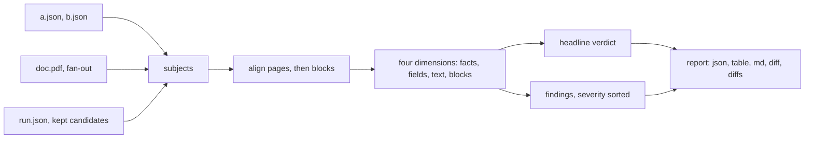

# Compare — what differs between two backends' outputs

<sub>[Docs home](../README.md) · [← Strategies](../strategies/README.md) · [Batch runs →](../batch/README.md)</sub>

> **In one sentence.** Hand `compare` two or more saved responses and it tells you, as a typed
> verdict plus a severity-sorted list of findings, exactly where the backends disagree, without
> running or billing anything.

## What this gives you

One command over N response files (the JSON envelope every backend returns). It prints a
scoreboard, a one-word verdict (`equivalent`, `mixed`, `divergent`), and findings such as
`table_shape_mismatch` with a snippet of the block. It picks no winner unless you bring a baseline
or a golden file (expected values). Python: `openreading.compare()`. HTTP: `POST /v1/compare`.

## Mental model

The question this page answers, from someone who has just run two backends over one invoice:
"Both say `succeeded`. One of them lost the table. How do I see that without reading two 40 KB
JSON files by hand?"

A response envelope is the one JSON shape every backend returns ([JSON
Schemas](../schemas/README.md)). Because the shapes match, comparing them is a pure function: same
inputs in, byte-identical report out. Compare never runs a backend, so it costs nothing and needs no
key. Subjects (the responses being compared) arrive three ways, and all three end in the same pure
step.



Files are `source: file`. Fan-out (`compare doc.pdf --backends a,b`) runs each backend once,
one after another, then compares. It is the only mode that spends money (`source: fanout`).
`parse --keep-candidates` keeps a strategy's losing branches for `compare --from` (`candidate`).

Compare then looks at four dimensions: run facts (the scoreboard), typed fields, text, and blocks
with tables. A backend that cannot produce one is marked `not_capable`, never blamed for missing it.
Human-readable formats show only differences by default, because agreement is noise in a delta.

## Walkthrough

Start from the root README's sample document and two local parses.

### 1. Parse twice, then compare as a table

```bash
uv run python -c 'from openreading.testing.sample_pdf import build_sample_pdf; open("sample.pdf","wb").write(build_sample_pdf())'
uv run openreading parse sample.pdf --backend pymupdf > pymupdf.json
uv run openreading parse sample.pdf --backend tesseract > tesseract.json
```

**You should see** one stderr line from PyMuPDF about `pymupdf_layout`. It is advice, not an
error. Compare the two files. This is mode (a), the base step every other mode reduces to.

```bash
uv run openreading compare pymupdf.json tesseract.json --format table
```
```text
COMPARE — 2 subjects (pairwise)

SUBJECT             TYPE             PAGES BLOCKS  CHARS FIELDS      COST    TIME
pymupdf             oss_library          2      9    336      0         -       -
tesseract           oss_library          2      9    336      0         -       -

CONTENT: MIXED  (text:agree  table_cells:diverge)

text similarity: 0.93
block alignment: text_first/v1  unaligned=0.06

FINDINGS (4)
  [ warn] table_shape_mismatch  {pymupdf, tesseract}  — table counts differ: {'pymupdf': 1, 'tesseract': 0}
  [ warn] type_conflict p1  {pymupdf, tesseract}  — pymupdf calls it title, tesseract calls it text  "OpenReading Test Document"
  …
WARNINGS
  confidence_unavailable [pymupdf]
```

**You should see** the same text on both sides and the table kept only by pymupdf. The last
line says pymupdf reports no confidence, so it is not faulted for missing confidences. JSON is
the default format, and every report is schema-validated before it is printed.

### 2. Read the JSON, the diff, and the diffs

```bash
uv run openreading compare pymupdf.json tesseract.json --format json > report.json
uv run python -c "import json; r = json.load(open('report.json')); print(list(r), r['headline']['verdict'])"
# ['schema_version', 'mode', 'subjects', 'alignment', 'headline', 'fields', 'text', 'blocks', 'findings', 'warnings'] mixed
```

Read the two-way text diff (exactly two subjects, git style), then the four-section view.

```bash
uv run openreading compare pymupdf.json tesseract.json --format diff
uv run openreading compare pymupdf.json tesseract.json --format diffs
```
```diff
@@ -1,20 +1,10 @@
 OpenReading Test Document
 …
-Region
-Units
…
+Region Units Revenue
+North 120 4400
```
```text
① CONTENT — real text/values either side missed
   ✔ EQUIVALENT   content shared by all: 1.00  ·  0 real misses
② TABLES — 1 table(s)
   table counts differ: {'pymupdf': 1, 'tesseract': 0}
…
④ GRANULARITY
   pymupdf 9 blocks  ·  tesseract 9 blocks
```

**You should see** pymupdf emitting one cell per line and tesseract one row per line in the
diff, then `EQUIVALENT` under CONTENT. Neither backend lost a word. Tesseract lost the grid. `diffs`
(plural) separates content from packaging, two axes a raw finding list mixes together.

### 3. Fan out, save, and re-render

Try mode (b), fan-out, and keep each response so you can replay the comparison later. Then
re-render the saved report. `explain` recognizes a comparison report by its shape.

```bash
uv run openreading compare sample.pdf --backends pymupdf,tesseract --save-dir out/ --format table
ls out/
uv run openreading explain report.json
```

**You should see** the same table twice, with `pymupdf.json` and `tesseract.json` listed in
between. `compare out/pymupdf.json out/tesseract.json` now reproduces the report offline.
`--all-ready` fans out over every ready backend. `--format md` renders the same view as markdown.

## Recipes

**Score both subjects against a golden file.**
```bash
uv run python -c "import json; c = json.load(open('src/openreading/evals/sample/loan_page1/case.json')); json.dump(c['expected'], open('golden.json', 'w'))"
uv run openreading compare pymupdf.json tesseract.json --truth golden.json --format json | uv run python -c "import json, sys; print(json.load(sys.stdin)['truth']['by_subject'])"
# {'pymupdf': {'overall': 1.0, 'dimensions': {'text_contains': 1.0, 'table_cell_accuracy': 1.0}}, 'tesseract': {'overall': 0.5, 'dimensions': {'text_contains': 1.0, 'table_cell_accuracy': 0.0}}}
```
The golden file is the `expected` object of an evals case ([Evals](../evals/README.md)). The evals
scorer scores each subject against it. The `table` renderer prints no truth section, so read JSON.

**Sign every field delta against one backend.**
```bash
uv run openreading compare pymupdf.json tesseract.json --baseline pymupdf --format json | uv run python -c "import json, sys; print(json.load(sys.stdin)['baseline'])"
# {'baseline': 'pymupdf', 'fields': []}
```
Each typed field becomes match, differ, missing, or extra relative to the baseline. The sample
has no typed fields, so the list is empty. A path instead of a label adds that file as a subject.

**Check whether a backend drifts between two runs.**
```bash
uv run openreading parse sample.pdf --backend pymupdf > pymupdf2.json
uv run openreading compare pymupdf.json tesseract.json pymupdf2.json --format table | head -6
# SUBJECT … pymupdf … tesseract … pymupdf#2
```
Subjects may repeat a backend. The second pymupdf becomes `pymupdf#2`. At three or more
subjects the JSON gains a `consensus` section: the majority value per field and the outliers.

**Compare what a strategy discarded.**
```yaml
version: 1
strategies:
  duel:
    compare: [pymupdf, tesseract]    # run both, keep the better one
```
```bash
uv run openreading parse sample.pdf --strategy duel --keep-candidates > strat.json
uv run openreading compare --from strat.json --format table | head -5
# SUBJECT … pymupdf … tesseract          (both carry source: candidate)
```
Save the YAML as `openreading.yaml` in the working directory. Without `--keep-candidates` the
loser is dropped and `compare --from` exits 5 with the fix in the message. Parallel-style
branches are kept; superseded cascade rungs are not ([Strategies](../strategies/README.md)).

**Compare two batch runs of the same folder.**
```bash
mkdir -p docs && cp sample.pdf docs/invoice.pdf && cp sample.pdf docs/letter.pdf
uv run openreading parse docs/ --backend pymupdf > runA.json
uv run openreading parse docs/ --backend tesseract > runB.json
uv run openreading compare runA.json runB.json --format table
```
```text
CORPUS COMPARE — runA vs runB
2 document(s): 0 equivalent · 0 divergent · 2 mixed · 0 unpaired

  [     mixed] invoice.pdf
  …
```
When every subject is a batch result, documents pair by `relpath`, then `filename`, then
`sha256`. A document in only one run is `unpaired`, not an error. `--format diffs` prints the
values one run captured and the other missed. `--format diff` is refused (exit 2).

**Branch on a verdict in Python.**
```python
import openreading

report = openreading.compare(["pymupdf.json", "tesseract.json"])   # dicts or paths
codes = {f["code"] for f in report["findings"]}
print(report["headline"]["verdict"])                                 # mixed
if report["headline"]["verdict"] == "equivalent":
    print("any backend will do")
elif "table_shape_mismatch" in codes:
    print("pick the backend that kept the table")                    # printed
```
There is no fan-out in Python. Call `openreading.run()` per backend yourself, then compare.

> [!WARNING]
> Fan-out over hosted backends bills once per backend. Files and `--from` never bill.

## How it decides

Each rule names the failure it prevents. The full list is the `Laws` section of
`uv run python -m pydoc openreading.comparison`.

- Compare is pure. It never runs, retries, or bills, so a report can never quietly cost money.
- A report never feeds routing or `pick: best`. A feedback loop could widen which backends run.
- Same inputs, same bytes. No timestamps, randomness, or LLM calls, so drift detection is sound.
- A backend that cannot produce a dimension is `not_capable`, never `missed`. Blaming pymupdf
  for missing confidences would make every report about it wrong.
- One metric stack. Truth mode imports the evals scorer rather than writing a second one.
- Generative backends cap content findings at `info`: run-to-run drift looks like a real difference.
- Exit codes: `0` report, `2` misuse, `3` fan-out cannot run, `5` invalid input or no
  candidates, `1` anything else. Details: `uv run python -m pydoc openreading.cli`, `compare`.

### Verdict vocabulary

Source: `src/openreading/schemas/comparison-report.v0.2.json` (`headline.verdict`,
`HeadlineChannel.agreement`, `FieldRow.verdict`) and `corpus-report.v0.1.json` (`verdict`). Live
truth: `uv run python -c "import openreading.schemas as s; r = s.comparison_report_schema();
print(r['properties']['headline']['properties']['verdict']['enum'],
r['\$defs']['FieldRow']['properties']['verdict']['enum'])"`. If this table and that output disagree,
the output is right. Fix the table.

| Word | Where | Meaning |
|---|---|---|
| `equivalent` | `headline.verdict`, corpus document | every guaranteed channel agrees |
| `mixed` | `headline.verdict`, corpus document | anything else: channels split between agree and diverge, or any channel is `partial` |
| `divergent` | `headline.verdict`, corpus document | every channel diverges |
| `unpaired` | corpus document only | present in some batch runs, not all |
| `agree` / `partial` / `diverge` | `headline.channels.<name>.agreement` | one word per channel: text, typed fields, table cells |
| `agree` | `fields.rows[].verdict` | every capable subject produced an equivalent value |
| `partial` | `fields.rows[].verdict` | the values present agree, but a capable subject has none |
| `disagree` | `fields.rows[].verdict` | two present values are not equivalent on any ladder tier |
| `unique` | `fields.rows[].verdict` | only one subject produced the key |
| `not_capable` | `fields.rows[].verdict` | that backend cannot produce typed fields at all |

### Findings taxonomy

Source: `src/openreading/schemas/comparison-report.v0.2.json` (`Finding.code`, `Finding.severity`),
thresholds in `comparison/text.py`, `blocks.py`, `align.py`, `report.py`. Live truth: `uv run python
-c "import openreading.schemas as s;
print(s.comparison_report_schema()['\$defs']['Finding']['properties']['code']['enum'])"`. If this
table and that output disagree, the output is right. Fix the table.

| Code | Axis | What it means |
|---|---|---|
| `field_value_conflict` | fields | the same key, values not equivalent |
| `field_missed` | fields | a capable subject has no value for the key |
| `text_divergence` | text | pairwise text similarity below 0.5 |
| `block_missed` | blocks | some capable subjects have the block, others do not |
| `block_unique` | blocks | one subject alone has the block |
| `structure` | blocks | same content, different packaging (not a loss) |
| `type_conflict` | blocks | one says `title`, another `text` |
| `position_conflict` | blocks | text matched, bbox overlap below 0.3 |
| `table_shape_mismatch` | tables | table counts or grid shapes differ |
| `confidence_gap` | blocks | matched blocks, confidences 0.2 or more apart |
| `page_count_mismatch` | pages | subjects disagree on page count |
| `cost_outlier` | facts | one subject cost at least 3 times the others' mean |
| `empty_output` | facts | a subject produced no text, blocks, or fields |

## Reference

- `uv run python -m pydoc openreading.comparison` — sections `Acquisition`, `The four
  dimensions`, `Alignment`, `Stances`, `The report`, `Corpus compare`. The equivalence ladder
  is `uv run python -m pydoc openreading.comparison.equivalence`.
- `uv run openreading compare --help` and `uv run openreading explain --help`.
- `src/openreading/schemas/comparison-report.v0.2.json`, `corpus-report.v0.1.json`, and
  `uv run python -m pydoc openreading.server` for `POST /v1/compare`.

## Not built yet

From the `openreading.comparison` docstring (`Enterprise builds on top`, `Deliberately deferred`):

- A run store with drift detection across time.
- A visual bbox-overlay delta view.
- An LLM equivalence judge for fields.
- Threshold flags (`TAU_TEXT`, `IOU_MIN` stay module constants), chunk-level comparison, and
  page-provenance-aware comparison of `granularity: page` runs.
- A `compare:` node inside a strategy YAML that emits a report.

## See also

- [Docs home](../README.md)
- [Strategies](../strategies/README.md) — `--keep-candidates` and the parallel constructs.
- [Batch runs](../batch/README.md) — the batch-result envelope corpus mode consumes.
- [Evals](../evals/README.md) — the scorer behind `--truth`.

<sub>[Docs home](../README.md) · [← Strategies](../strategies/README.md) · [Batch runs →](../batch/README.md)</sub>
