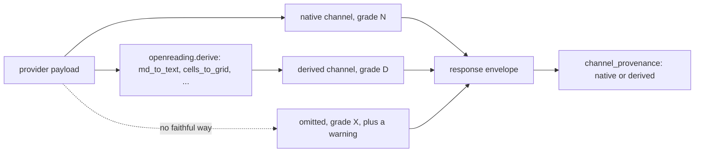

# The channel contract — why a response never lies about what it could not produce

<sub>[Docs home](../README.md) · [← The HTTP server](../server/README.md) · [Evals →](../evals/README.md)</sub>

> **In one sentence.** Every channel in a response is measured, computed by one shared package,
> or left out with a warning that names it, so an empty field never means "we made something up".

## What this gives you

A rule set (C1 to C11) every backend's (parser's) output is checked against, and the one package,
`openreading.derive`, that computes the channels a backend does not emit itself. You get plain
text that is really plain, tables that are in the text, and a `channel_provenance` map. C12,
listed beside them, is a schema-file rule, not a channel check.

## Mental model

The question this page answers, from someone reading their first response: "pymupdf gives me
`confidence: null` on every block. Is the parser broken, or is my document bad?"

Neither. A channel is one kind of output: `text`, `blocks`, `table_cells`, and so on. Each backend
grades each channel once. `N` (native): the backend emits it. `D` (derived): this package computes
it from what the backend emits. `X` (impossible): there is no faithful way, so never filled in.



PyMuPDF is a deterministic parser with no notion of "how sure am I". A fabricated 0.95 would look
exactly like a measured 0.95 to a strategy gate, a rule that escalates below 0.8. So the channel
stays `null` and `warnings[]` says why. A missing number is honest. A made-up one compounds.

## Walkthrough

Build the root README's sample document, then read the grades two local adapters declare.

```bash
uv run python -c 'from openreading.testing.sample_pdf import build_sample_pdf; open("sample.pdf","wb").write(build_sample_pdf())'
uv run openreading parse sample.pdf --backend pymupdf > pymupdf.json
uv run openreading parse sample.pdf --backend tesseract > tesseract.json
uv run python -c "from openreading.adapters.registry import make_adapter; print(make_adapter('pymupdf').descriptor.to_schema_dict()['output']['channels'])"
uv run python -c "from openreading.adapters.registry import make_adapter; print(make_adapter('tesseract').descriptor.to_schema_dict()['output']['channels'])"
```
```text
{'markdown': 'D', 'text': 'N', 'blocks': 'N', 'block_bbox': 'N', 'block_confidence': 'X', 'typed_fields': 'X', 'table_cells': 'N'}
{'markdown': 'D', 'text': 'N', 'blocks': 'N', 'block_bbox': 'N', 'block_confidence': 'N', 'typed_fields': 'X', 'table_cells': 'X'}
```

**You should see** mirror images: pymupdf has tables and no confidence, tesseract the reverse.

```bash
uv run python -c "import json; r = json.load(open('pymupdf.json')); print(r['warnings']); print(r['channel_provenance'])"
uv run python -c "import json; r = json.load(open('tesseract.json')); print(r['channel_provenance'])"
```
```text
[{'code': 'confidence_unavailable', 'message': 'PyMuPDF is a deterministic parser; per-element confidence does not exist', 'field': 'block_confidence'}]
{'markdown': 'derived', 'text': 'native', 'blocks': 'native', 'block_bbox': 'native', 'table_cells': 'native'}
{'text': 'native', 'markdown': 'derived', 'blocks': 'native', 'block_bbox': 'native', 'block_confidence': 'native'}
```

**You should see** the `X` channel absent from provenance and named in a warning instead. That is
C4/C5: an `X` channel is never filled in, and a warning names it; C6 is the same promise for
`N`/`D` channels. Both say `markdown: derived`: the markdown was built here, from native text.
Check: `grep -c confidence_unavailable pymupdf.json` prints `1`.

## Recipes

**Turn a markdown table into plain text.**
```bash
uv run python -c "from openreading.derive import md_to_text; print(repr(md_to_text('| Region | Units |\n| --- | --- |\n| North | 120 |')))"
# 'Region\tUnits\nNorth\t120'
```
C1 and C2 together: no pipes survive, every cell is still there, one row per line, tab-joined.

**Round-trip the sample's table.**
```bash
uv run python -c "import json; from openreading.types import Table; from openreading.derive import table_to_text, table_to_pipe_md, md_table_to_table; t = Table.model_validate(next(b for b in json.load(open('pymupdf.json'))['document']['pages'][0]['blocks'] if b['type'] == 'table')['table']); print(repr(table_to_text(t))); print(md_table_to_table(table_to_pipe_md(t)).rows == t.rows)"
# 'Region\tUnits\tRevenue\nNorth\t120\t4400\nSouth\t85\t3100\nWest\t42\t1650'
# True
```
One `Table` model is the only structured form. Pipe markdown and tab text are projections of it.

**Build a grid with a merged cell.**
```bash
uv run python -c "from openreading.derive import GridCell, cells_to_grid; t = cells_to_grid([GridCell(row=0, col=0, col_span=2, text='Q1'), GridCell(row=1, text='Jan'), GridCell(row=1, text='Feb')]); print(t.rows)"
# [['Q1', None], ['Jan', 'Feb']]
```
`Q1` spans two columns: its value sits at the span origin and the covered slot is `None`, not empty.

**Segment markdown into blocks without inventing geometry.**
```bash
uv run python -c "from openreading.derive import md_to_blocks; [print(b.reading_order, b.type.value, b.bbox) for b in md_to_blocks('# Invoice\n\nTotal due is 40 dollars.\n\n| Item | Qty |\n| --- | --- |\n| Pen | 2 |')]"
# 0 title None
# 1 text None
# 2 table None
```
Typed blocks with a reading order and no bbox: `blocks` can be `D` while `block_bbox` stays `X`.

**Slice by byte offsets, count pages.**
```bash
uv run python -c "from openreading.derive import utf8_slice; s = 'café au lait'; print(repr(s[5:7]), repr(utf8_slice(s, 5, 7)))"
# 'au' ' a'
uv run python -c "from openreading.derive import pdf_page_count; print(pdf_page_count(open('sample.pdf', 'rb').read()))"
# 2
```
Providers report byte offsets; Python slices by code point. After the first `é` they drift by one.

## How it decides

Each rule names the failure it prevents. The authoritative text of C1 to C12 is the `channel
contract` section of `uv run python -m pydoc openreading.derive`. Four of them by example:

- C1, plain text is plain: no pipes, headings, fences, or HTML in `text`. Search never hits markup.
- C2, text is complete: table rows and captions appear in `text` as lines, so cells are searchable.
- C6, deliver or warn. A channel graded N or D is populated, or a warning names it. Without
  this rule a backend could declare `D`, derive nothing, and pass every check.
- C9, page numbers are source pages. Requesting pages 3 to 4 reports 3 and 4, never 1 and 2.
  Page-less blocks live in one synthetic page 1 plus a `page_attribution_unavailable` warning.

Also C7: every confidence is a float in `[0, 1]`. Word confidences roll up to a block by minimum,
because a mean hides one garbage word. Downgrades land at once, upgrades only with their
implementation. The kit (`openreading.testing.conformance`) enforces this in the adapter tests.

## Reference

- `uv run python -m pydoc openreading.derive` — sections `Grades`, `The channel contract`,
  `Function contracts`, `Enforcement and rollout`.
- `uv run python -m pydoc openreading.testing.conformance` — the kit and its strict defaults.
- `src/openreading/schemas/response.v0.3.json` — `channel_provenance`, `warnings`.

## Not built yet

- `TypedField.type` is filled only by `anthropic_claude`, `google_document_ai` and
  `azure_document_intelligence` (`openreading.derive` docstring, the `typed_fields` paragraph).
- C11 (text and blocks agree) is permanently advisory (same docstring, C11).
- No per-case suppression for the C1 false positive on a real ASCII pipe table (same docstring).
- `channel_provenance` is experimental and may change shape (`openreading.schemas` docstring).

## See also

- [Docs home](../README.md)
- [JSON Schemas](../schemas/README.md) — the response envelope these channels live in.
- [Compare](../comparison/README.md) — `not_capable` comes from these grades.

<sub>[Docs home](../README.md) · [← The HTTP server](../server/README.md) · [Evals →](../evals/README.md)</sub>
