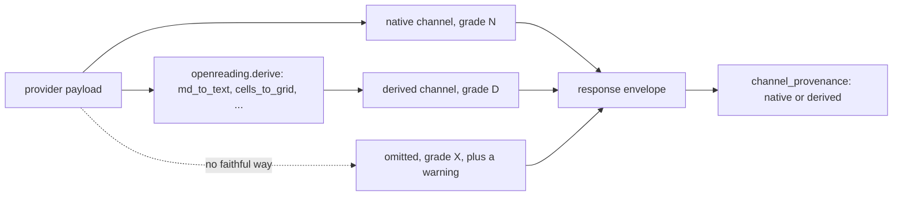

# The channel contract: why a response never lies about what it could not produce

<sub>[Docs home](../README.md) · [← The HTTP server](../server/README.md) · [Evals →](../evals/README.md)</sub>

> **In one sentence.** Every channel in a response is measured, computed by one shared package, or
> left out and marked absent in `channel_provenance`, so nothing in it is invented.

## What this gives you

You parsed a document with `pymupdf`, every block has `confidence: null`, and you cannot tell
whether the parser or the document is at fault. A backend is one parser, such as the local `pymupdf`
library or a hosted API. A channel is one kind of output inside the response, such as `text`,
`blocks`, `table_cells`, or per-block confidence. This page gives you the rule set, C1 to C11, that
every backend's output is checked against. It also describes the one package, `openreading.derive`,
that computes the channels a backend does not emit itself. In practice you get plain text that is
really plain and tables that also appear in the text. A `channel_provenance` map says which channels
this package derived and which the backend emitted. C12 is listed beside the others, but it is a
rule about schema files rather than a channel check. You need one saved response, such as
`pymupdf.json` from the root README, and no key at all.

## Mental model

The answer to the question above is that neither the parser nor the document is broken. Each backend
grades each channel once, and the grade says how the channel can be filled. Grade `N` (native) means
the backend emits the channel itself in its own payload. Grade `D` (derived) means this package
computes it from what the backend emits. Grade `X` (impossible) means there is no faithful way to
produce it, so it is never filled in.



PyMuPDF is a deterministic parser with no notion of how sure it is, so confidence is grade `X` for
it. A strategy gate is a rule that switches to another backend when a value falls below a threshold
such as 0.8. A fabricated 0.95 would look exactly like a measured 0.95 to that gate. So the channel
stays `null` and `warnings[]` says why. A missing number is honest, where a made-up one compounds
downstream.

## Walkthrough

Build the root README's sample document, then read the grades two local adapters declare.

```bash
uv run python -c 'from openreading.testing.sample_pdf import build_sample_pdf; open("sample.pdf","wb").write(build_sample_pdf())'
uv run openreading parse sample.pdf --backend pymupdf > pymupdf.json
uv run openreading parse sample.pdf --backend tesseract > tesseract.json
uv run python -c "from openreading.adapters.registry import make_adapter; print(make_adapter('pymupdf').descriptor.to_schema_dict()['output']['channels'])"
uv run python -c "from openreading.adapters.registry import make_adapter; print(make_adapter('tesseract').descriptor.to_schema_dict()['output']['channels'])"
```
```text
{'markdown': 'D', 'text': 'N', 'blocks': 'N', 'block_bbox': 'N', 'block_confidence': 'X', 'typed_fields': 'X', 'table_cells': 'N'}
{'markdown': 'D', 'text': 'N', 'blocks': 'N', 'block_bbox': 'N', 'block_confidence': 'N', 'typed_fields': 'X', 'table_cells': 'X'}
```

**You should see** mirror images. pymupdf has tables and no confidence, and tesseract has
confidence and no tables.

```bash
uv run python -c "import json; r = json.load(open('pymupdf.json')); print(r['warnings']); print(r['channel_provenance'])"
uv run python -c "import json; r = json.load(open('tesseract.json')); print(r.get('warnings', 'no warnings key at all')); print(r['channel_provenance'])"
```
```text
[{'code': 'confidence_unavailable', 'message': 'PyMuPDF is a deterministic parser; per-element confidence does not exist', 'field': 'block_confidence'}]
{'markdown': 'derived', 'text': 'native', 'blocks': 'native', 'block_bbox': 'native', 'table_cells': 'native'}
no warnings key at all
{'text': 'native', 'markdown': 'derived', 'blocks': 'native', 'block_bbox': 'native', 'block_confidence': 'native'}
```

**You should see** an `X` channel missing from provenance on both runs, and a warning about it on
only one of them. pymupdf names its missing confidence in `warnings`. tesseract has no `warnings`
key at all, and its missing `table_cells` is announced nowhere except by its absence from
provenance. Both outputs say `markdown: derived`, because the markdown was built here from native
text. Check: `grep -c confidence_unavailable pymupdf.json` prints `1`.

### Which signal to trust when a channel is missing

Provenance is the reliable signal and `warnings[]` is not. A channel graded `X` is always missing
from `channel_provenance`, on every run, whatever you asked for. A channel graded `X` is only
sometimes named in `warnings[]`, and the difference is not documented anywhere in a backend's
output. Code that checks `warnings[]` to find out whether it lost its tables is code that will
silently lose its tables.

Compare the two grades that go missing here:

| the missing channel | provenance | `warnings[]` |
|---|---|---|
| pymupdf `block_confidence` | always absent | always warns, `confidence_unavailable` |
| pymupdf and tesseract `typed_fields` | always absent | warns only when the request asked for them |
| tesseract `table_cells` | always absent | never warns on a default run |

So the honest form of the never-fabricate promise is narrower than "a channel a backend cannot
produce is named in `warnings[]`". A channel a backend cannot produce is never invented, and it is
always missing from `channel_provenance`. It may or may not also be named in `warnings[]`. To
decide whether you got a channel, compare the provenance map against the grades the backend
declares, which the first command in this walkthrough prints.

The normative rule is C4 and C5 in `uv run python -m pydoc openreading.derive`, and it reads "an
`X` channel is never populated; a requested `X` channel warns". The first half holds everywhere.
The second half depends on how you asked, which the next section measures.

### Asking for a channel: `outputs` and `features`

A request can say which channels it wants, through two separate fields that neither README nor
help text has described until now. `outputs` names the channels to fill. `features` turns on
capabilities that produce them. They are not interchangeable, and which one a backend watches
decides whether you get a warning.

| field | keys | default |
|---|---|---|
| `outputs` | `markdown`, `text`, `blocks`, `typed_fields` (booleans), `tables` (`none`, `cells`, `markdown`, `html`), `chunking`, `include_backend_raw` | `markdown`, `text`, `blocks` and `include_backend_raw` on, `typed_fields` off, `tables: markdown` |
| `features` | `ocr`, `ocr_languages`, `layout`, `reading_order`, `tables`, `forms_key_value`, `figures_images`, `signatures`, `classification`, `handwriting` | the schema documents per-key defaults such as `tables: true`, and the object itself is absent unless you pass it |

Requesting `typed_fields` from a backend that cannot produce them does warn:

```bash
uv run python -c "import openreading; r = openreading.run('sample.pdf', backend='tesseract', outputs={'typed_fields': True}); print([w['code'] for w in r['warnings']])"
uv run python -c "import openreading; r = openreading.run('sample.pdf', backend='tesseract', outputs={'tables': 'cells'}); print(r.get('warnings', 'no warnings key at all'))"
uv run python -c "import openreading; r = openreading.run('sample.pdf', backend='tesseract', features={'tables': True}); print([w['code'] for w in r['warnings']])"
```
```text
['typed_fields_unsupported']
no warnings key at all
['tables_unsupported']
```

**You should see** a warning on the first and third calls and silence on the second. Asking
tesseract for table cells through `outputs` changes nothing, because the tesseract adapter reads
its table ask from `features.tables` rather than from `outputs.tables`. Pass `features` explicitly
when you need to be told that a table request could not be met.

> [!WARNING]
> An adapter tests whether you sent a `features` object at all, and a default request sends none.
> So a default run gets no `tables_unsupported` warning however badly it needed one, and the
> per-key default of `tables: true` in the schema does not change that. Check
> `channel_provenance` rather than relying on this warning to fire.

## Recipes

**Turn a markdown table into plain text.**
```bash
uv run python -c "from openreading.derive import md_to_text; print(repr(md_to_text('| Region | Units |\n| --- | --- |\n| North | 120 |')))"
# 'Region\tUnits\nNorth\t120'
```
This shows C1 and C2 together. No pipes survive, every cell is still there, and each row becomes
one tab-joined line.

**Round-trip the sample's table.**
```bash
uv run python -c "import json; from openreading.types import Table; from openreading.derive import table_to_text, table_to_pipe_md, md_table_to_table; t = Table.model_validate(next(b for b in json.load(open('pymupdf.json'))['document']['pages'][0]['blocks'] if b['type'] == 'table')['table']); print(repr(table_to_text(t))); print(md_table_to_table(table_to_pipe_md(t)).rows == t.rows)"
# 'Region\tUnits\tRevenue\nNorth\t120\t4400\nSouth\t85\t3100\nWest\t42\t1650'
# True
```
One `Table` model is the only structured form. Pipe markdown and tab text are projections of it.

**Build a grid with a merged cell.**
```bash
uv run python -c "from openreading.derive import GridCell, cells_to_grid; t = cells_to_grid([GridCell(row=0, col=0, col_span=2, text='Q1'), GridCell(row=1, text='Jan'), GridCell(row=1, text='Feb')]); print(t.rows)"
# [['Q1', None], ['Jan', 'Feb']]
```
`Q1` spans two columns, so its value sits at the span origin and the covered slot is `None` rather
than an empty string.

**Segment markdown into blocks without inventing geometry.**
```bash
uv run python -c "from openreading.derive import md_to_blocks; [print(b.reading_order, b.type.value, b.bbox) for b in md_to_blocks('# Invoice\n\nTotal due is 40 dollars.\n\n| Item | Qty |\n| --- | --- |\n| Pen | 2 |')]"
# 0 title None
# 1 text None
# 2 table None
```
You get typed blocks with a reading order and no bbox, which is how `blocks` can be `D` while
`block_bbox` stays `X`.

**Slice by byte offsets, count pages.**
```bash
uv run python -c "from openreading.derive import utf8_slice; s = 'café au lait'; print(repr(s[5:7]), repr(utf8_slice(s, 5, 7)))"
# 'au' ' a'
uv run python -c "from openreading.derive import pdf_page_count; print(pdf_page_count(open('sample.pdf', 'rb').read()))"
# 2
```
Providers report byte offsets, but Python slices by code point. After the first `é` the two drift
apart by one.

## How it decides

Each rule names the failure it prevents, so you can tell which rule a warning is enforcing. The
authoritative text of C1 to C12 is the `channel contract` section of
`uv run python -m pydoc openreading.derive`. Four of them, by example, are these.

- C1, plain text is plain. No pipes, headings, fences, or HTML appear in `text`, so a search never
  hits markup.
- C2, text is complete. Table rows and captions appear in `text` as lines, so cells are searchable.
- C6, deliver or warn. A channel graded N or D is populated, or a warning names it. Without
  this rule a backend could declare `D`, derive nothing, and pass every check.
- C9, page numbers are source pages. Requesting pages 3 to 4 reports 3 and 4, never 1 and 2.
  Page-less blocks live in one synthetic page 1 plus a `page_attribution_unavailable` warning.

C7 adds that every confidence is a float in `[0, 1]`. Word confidences roll up to a block by
minimum, because a mean hides one garbage word. A grade downgrade lands at once, and an upgrade
lands only with its implementation. The conformance kit, `openreading.testing.conformance`,
enforces all of this in the adapter tests.

### A confidence is comparable inside one backend, not across two

C7 puts every confidence on the same number line, and it does not put them on the same meaning.
Each backend reports its own quantity. Tesseract's 0.8 is a per-word OCR posterior rolled up by
minimum. A hosted model's 0.8 is that vendor's own score, produced by a different model against a
different definition of confident. Converting a percent scale to `[0, 1]` fixes the range and
leaves the meaning alone. So you can rank two of one backend's blocks by confidence, and you cannot
read one backend's 0.8 as better than another's 0.7.

Two places in this repo compare confidences anyway, and both need reading with that in mind.
Compare's `confidence_gap` finding flags matched blocks whose confidences sit 0.2 or more apart,
across two different backends' scales ([Compare](../comparison/README.md)). Treat it as a pointer
at a block worth opening, never as a measurement of which backend is more sure. A strategy gate
such as `confidence_below: 0.85` is fitted to whichever backend produced the numbers you swept.
Re-derive it for every rung that runs a different backend. Carrying one threshold down a ladder
applies one vendor's cut to another vendor's scale ([Strategies](../strategies/README.md)).

## Reference

- `uv run python -m pydoc openreading.derive` has the sections `Grades`, `The channel contract`,
  `Function contracts`, and `Enforcement and rollout`.
- `uv run python -m pydoc openreading.testing.conformance` describes the kit and its strict
  defaults.
- `src/openreading/schemas/response.v0.3.json` defines `channel_provenance` and `warnings`.

## Not built yet

- `TypedField.type` is filled only by `anthropic_claude`, `google_document_ai` and
  `azure_document_intelligence` (`openreading.derive` docstring, the `typed_fields` paragraph).
- C11 (text and blocks agree) is permanently advisory (same docstring, C11).
- No per-case suppression for the C1 false positive on a real ASCII pipe table (same docstring).
- `channel_provenance` is experimental and may change shape (`openreading.schemas` docstring).

## See also

- [Docs home](../README.md)
- [JSON Schemas](../schemas/README.md) describes the response envelope these channels live in.
- [Compare](../comparison/README.md) explains `not_capable`, which comes from these grades.

<sub>[Docs home](../README.md) · [← The HTTP server](../server/README.md) · [Evals →](../evals/README.md)</sub>
