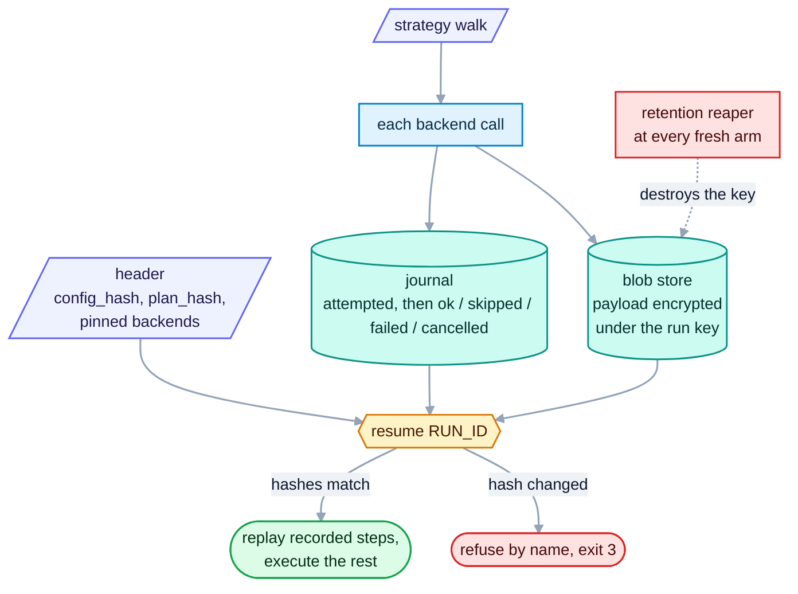

# The run ledger: resume, replay offline, erase

<sub>[Docs home](../README.md) · [← Batch runs](../batch/README.md) · [The HTTP server →](../server/README.md)</sub>

> **In one sentence.** With `OPENREADING_LEDGER` set, every strategy run leaves a journal you can
> resume after an interruption, replay with no network, and erase by destroying one key.
> One strategy run over one document resumes, a batch of them does not, and a `--backend` run
> writes no journal at all.

## What this gives you

A long run was interrupted after two hosted backends had already been called and billed. You want to
finish it without paying for those calls again, and later to reproduce it for an audit with no
network at all. A backend is one parser, such as a local library or a hosted API. A strategy is a
named plan over one or more backends, and only strategy runs are journaled. With
`OPENREADING_LEDGER` set to a directory, every strategy run writes a journal into it. A journal is
an append-only record of what was attempted and what came back. Every payload in it is encrypted
under a key made for that run, and destroying that one key makes those payloads unreadable in every
copy at once, backups included. The key sits in the same ledger root as the payloads, so the
encryption buys you erasure rather than protection from someone who can already read that root.
`openreading resume <RUN_ID>` re-drives the run from that record
instead of from scratch. A recorded step replays from the journal with zero network calls, and
returns the payload it returned the first time, byte for byte. Anything the first run never reached
runs for real. The resumed envelope as a whole is not byte-identical to the original, because it
records how long the replay took rather than how long the original call took. [Is a resumed run
byte-identical](#is-a-resumed-run-byte-identical) names the fields that differ. A resume that would amount to a different run, for
example after the config changed, refuses by name. Payloads expire on a retention clock, and erasing
a run destroys the key its payloads were encrypted under. You need `sample.pdf` from the root README
and nothing else, because the walkthrough runs a local strategy.

## Mental model



Arming means setting `OPENREADING_LEDGER=<dir>` in the environment, and there is no flag for it.
Only strategy runs journal, meaning `--strategy NAME` or `auto` with `defaults.strategy`, on every
surface. A strategy batch journals one run per item rather than one for the whole batch. `--backend
<id>`, `--no-strategy`, and a native batch journal nothing, even with the variable set. When the
variable is unset, every surface behaves byte-identically to a build with no ledger at all.

Arming turns the journal into a hard dependency rather than a side-car. A ledger path the process
cannot write stops the whole parse, and no partial answer reaches stdout:

```bash
OPENREADING_LEDGER=./sample.pdf uv run openreading parse sample.pdf --strategy offline_first > nd.json; echo "exit=$?"
```

```text
[strategy:offline_first] cannot use the run journal at OPENREADING_LEDGER='./sample.pdf': Not a directory. Point it at a writable directory, or unset it to run without a journal (an unjournalled run is not resumable).
exit=3
```

**You should see** exit 3 and an empty `nd.json`. A read-only mount, a wrong volume path and a
directory that is really a file all take this row, and each one fails every parse on that host
rather than degrading to an unjournalled run. Confirm the path is a writable directory before you
arm a scheduled job, and treat the ledger volume as part of that job's critical path.

## Walkthrough

```bash
uv run python -c 'from openreading.testing.sample_pdf import build_sample_pdf; open("sample.pdf","wb").write(build_sample_pdf())'
export OPENREADING_LEDGER=./.openreading
```

### 1. A backend run journals nothing, a strategy run leaves a record

```bash
uv run openreading parse sample.pdf --backend pymupdf > /dev/null; ls .openreading
uv run openreading parse sample.pdf --strategy offline_first > run.json; find .openreading | sort
```
```text
ls: .openreading: No such file or directory
.openreading/7dbf6b71-adb5-4e90-9188-a184fdba9d05.header.json
.openreading/7dbf6b71-adb5-4e90-9188-a184fdba9d05.jsonl
.openreading/blobs/7dbf6b71-adb5-4e90-9188-a184fdba9d05/33afeebb….bin
.openreading/blobs/7dbf6b71-adb5-4e90-9188-a184fdba9d05/49e166b7….bin
.openreading/keys/7dbf6b71-adb5-4e90-9188-a184fdba9d05.key
.openreading/retention/7dbf6b71-adb5-4e90-9188-a184fdba9d05.json
```

**You should see** nothing after the backend run and six files after the strategy run. The six
files are of five kinds: a header, a journal (`.jsonl`), two blobs (the input document and the
response), a key (mode 0600 in a 0700 directory), and a retention stamp. Capture the run id for the
next steps with `RUN_ID=$(basename .openreading/*.header.json .header.json)`.

### 2. What a record looks like

```bash
jq -c . .openreading/$RUN_ID.jsonl
jq -c '{strategy_name, config_hash, plan_hash, journal_version, slim_request}' .openreading/$RUN_ID.header.json
```
```json
{"step_id":"bcfe2aac…","status":"attempted","attempt":1,"run_id":"769d5f06-…","step_path":"root.steps[0]","step_seq":0,"backend_id":"pymupdf","idempotency_key":"om_868044b9…","content_key":"om_868044b9…","started_epoch_ms":1788036714842,"journal_seq":0}
{"step_id":"bcfe2aac…","status":"ok","attempt":1,"run_id":"769d5f06-…","step_path":"root.steps[0]","step_seq":0,"backend_id":"pymupdf","idempotency_key":"om_868044b9…","content_key":"om_868044b9…","payload":{"run_id":"769d5f06-…","digest":"sha256:49e166b7…","size_bytes":17091,"media_type":"application/json","store":"localfs"},"ended_epoch_ms":1788036714899,"journal_seq":1}
{"strategy_name":"offline_first","config_hash":"sha256:4b081150…","plan_hash":"sha256:3e0803c8…","journal_version":1,"slim_request":{"backend":{"id":"strategy:offline_first"},"document":{"filename":"sample.pdf","mime_type":"application/pdf"},"schema_version":"0.1"}}
```

**You should see** two journal lines that share one `step_id`. The `attempted` line is written
before the backend call, and the `ok` line after it points at a blob. The header pins what the run
was, so a later resume can check it. `slim_request` records the document's filename and MIME type,
and never its bytes, a URL, or a password. The header's own `document` block holds the digest and
size of those bytes, which is what erasure leaves behind.

`started_epoch_ms` and `ended_epoch_ms` are absolute UTC epoch milliseconds, so
`1788036714842` reads as 2026-08-29T20:51:54.842Z and you can load them as timestamps directly.
They carry wall time because they leave the process and a later reader has to make sense of them.
Durations the engine measures for itself use a monotonic clock instead, which no clock adjustment
can move, so subtracting these two gives elapsed wall time rather than the engine's own
`duration_ms`.

### 3. Resume a completed run without a backend call

```bash
uv run openreading resume $RUN_ID > resumed.json
diff <(jq -S .document run.json) <(jq -S .document resumed.json) && echo identical
uv run openreading explain resumed.json
```
```text
identical
strategy offline_first  →  pymupdf (ok)
  root.steps[0]    pymupdf      succeeded                      1ms  $0
      scanned_pages_detected     obs=False thr=True  ok
      …
```

**You should see** the same document and a 1ms attempt, because the step was served from the
journal. `resume` takes only the run id, and every option comes from the ledger. From Python,
`openreading.resume(run_id)` returns the same dict and arms from the environment as the CLI does.

The two files are not byte-identical, and [Is a resumed run
byte-identical](#is-a-resumed-run-byte-identical) below says which field differs and why.

### 4. Interrupt a run, then resume it

Make a slower document and a two-rung strategy. A rung is one backend in the order the strategy
tries them. Press <kbd>Ctrl</kbd>+<kbd>C</kbd> about two seconds in, while tesseract is still
working. A scheduler's `SIGTERM` takes the same path and prints the same two lines, so a
supervised run parks the same way an interactive one does ([The command
line](../cli/README.md#operations) has the full signal table).

```bash
uv run python -c 'import fitz; s=fitz.open("sample.pdf"); o=fitz.open(); [o.insert_pdf(s) for _ in range(8)]; o.save("slow.pdf")'
printf 'version: 1\nstrategies:\n  slow:\n    try: [tesseract, pymupdf]\n' > openreading.yaml
uv run openreading parse slow.pdf --strategy slow > interrupted.json; echo "exit=$?"
```
```text
[parse] interrupted; run dcb81857-018f-4e30-8e12-e91d915a1d64 is resumable
[parse] resume with: openreading resume dcb81857-018f-4e30-8e12-e91d915a1d64
exit=6
```

**You should see** exit 6 and an empty `interrupted.json`. Now resume the run and read the journal:

```bash
uv run openreading resume dcb81857-018f-4e30-8e12-e91d915a1d64 > resumed-slow.json; echo "exit=$?"
jq -c '{status, step_path, backend_id, journal_seq}' .openreading/dcb81857-018f-4e30-8e12-e91d915a1d64.jsonl
```
```text
exit=0
{"status":"attempted","step_path":"root.steps[0]","backend_id":"tesseract","journal_seq":0}
{"status":"cancelled","step_path":"root.steps[0]","backend_id":"tesseract","journal_seq":1}
{"status":"attempted","step_path":"root.steps[1]","backend_id":"pymupdf","journal_seq":2}
{"status":"ok","step_path":"root.steps[1]","backend_id":"pymupdf","journal_seq":3}
```

**You should see** the interrupted rung recorded as `cancelled` at interrupt time. On resume that
rung replays as `cancelled` rather than running again, and the next rung executes for real.
`explain` labels the replayed rung `skipped(missing_credentials)`. A resumed step that runs pymupdf
live sends PyMuPDF's advisory to stderr like every other verb, so `resume … | jq` is safe.

That replay rule has a consequence worth planning for. The rung that was interrupted never runs, so
a resumed document is answered by the rung behind it, which is the weaker backend the strategy would
otherwise have reached only on a failure:

```bash
uv run openreading parse slow.pdf --strategy slow 2>/dev/null | jq -r '.backend.id'
jq -r '.backend.id' resumed-slow.json
```

```text
tesseract
pymupdf
```

**You should see** two different backends for one document. Across a corpus with a few
interruptions the output is no longer homogeneous, and `backend.id` on each response is the field
that says which items are affected. Group a finished corpus by that field before you report on it,
and re-run from scratch the documents that came back from the wrong backend.

### 5. Refusal by name

Edit the strategy this run used, then resume it:

```bash
printf 'version: 1\nstrategies:\n  slow:\n    try: [pymupdf, tesseract]\n' > openreading.yaml
uv run openreading resume dcb81857-018f-4e30-8e12-e91d915a1d64 > /dev/null; echo "exit=$?"
```
```text
[resume] refused: openreading.yaml changed since dcb81857-… (sha256:b3e321e0… -> sha256:2f2891ca…)
[resume] refused: plan_hash changed since dcb81857-… (sha256:e03796fc… -> sha256:744d5551…)
[resume] a resumed run replays recorded decisions; start a new run instead
exit=3
```

**You should see** exit 3 with both hashes named. Restore the strategy body and add an unrelated
strategy to the file, and the resume succeeds. The hash covers the compiled strategy this run used,
not the file's bytes. Two other refusals also exit 3. `resume nope` prints
`no recorded run 'nope' under .openreading`, and any `resume` with the variable unset prints
`OPENREADING_LEDGER is not set`.

### Is a resumed run byte-identical

The parsed content is. The whole envelope is not, so do not hash the two files and expect a match.
Diff them and you get one hunk:

```bash
diff <(jq -S . run.json) <(jq -S . resumed.json)
```
```text
1311c1311
<         "duration_ms": 57,
---
>         "duration_ms": 1,
```

**You should see** a single difference, at `orchestration.attempts[].duration_ms`. That field
records how long this execution took, and a replay from the journal really is faster than the
original backend call. A resume that reported the original 57ms would be the dishonest answer.
Everything else matches, including the document, the recorded decisions, the chosen backends, the
costs, and the per-step statuses.

An audit control that hashes a whole envelope will therefore fire on every resume. Hash
`.document` for the content alone, or drop the timing first when you want the decisions covered
too:

```bash
jq -S 'del(.orchestration.attempts[].duration_ms)' run.json | shasum -a 256
jq -S 'del(.orchestration.attempts[].duration_ms)' resumed.json | shasum -a 256
```
```text
52785254a9f9a18f15a0c25ef2a60c684086f785b9b2eb1bad82bf1cd1001285  -
52785254a9f9a18f15a0c25ef2a60c684086f785b9b2eb1bad82bf1cd1001285  -
```

Byte stability differs by envelope type, and [JSON
Schemas](../schemas/README.md#clocks-and-byte-stability) carries the table. A `parse --backend`
response is stable across runs, while a `parse --strategy` response and a batch result are not.

## Recipes

**Erase a run: by the reaper, or by hand.**
```bash
OPENREADING_LEDGER_RETENTION_HOURS=0.000001 uv run openreading parse sample.pdf --strategy offline_first > short.json
SHORT=$(ls -t .openreading/*.header.json | head -1 | xargs basename | sed 's/.header.json//')
sleep 1; uv run openreading parse sample.pdf --strategy offline_first > /dev/null   # a fresh arm runs the reaper
uv run openreading resume $SHORT; echo "exit=$?"
rm .openreading/keys/$RUN_ID.key; uv run openreading resume $RUN_ID; echo "exit=$?"
```
```text
[resume] run '8d347957-93da-4ef2-a651-e58355760ce9': key destroyed, payload unrecoverable
exit=3
[resume] run '7dbf6b71-adb5-4e90-9188-a184fdba9d05': key destroyed, payload unrecoverable
exit=3
```
Deleting the key is exactly what the reaper does. The journal stays, so the run still answers what
happened, but not with what content. Retention defaults to 24 hours and is read at arm time. A
hosted backend's own retention limit can only tighten it per step. Raise it before the run, never
after.

Read the comment on the `sleep 1` line as a precondition rather than a decoration. The reaper runs
only when another run arms the ledger, so `OPENREADING_LEDGER_RETENTION_HOURS` sets the earliest
moment a payload may be destroyed and never the moment it is. Nothing sweeps on a timer, and there
is no purge verb to call. A run whose window expired on Friday keeps its key and its document bytes
all weekend if nothing else runs, which is exactly the quiet period a retention promise is written
for. When you owe someone a deletion deadline, schedule a sweep of your own that does not depend on
how often the pipeline runs: a cron entry that arms the ledger against the sample every hour is
enough to fire the reaper, and deleting the file under `keys/` yourself has the same effect as the
last line above.

Destroying the key deletes one file, the key itself. Every other file stays where it was, and the
blobs stay on disk as ciphertext nothing can now read. The header keeps `document.digest`, which is
the SHA-256 of the document's own bytes, along with `document.size_bytes`, `document.media_type`,
`slim_request.document.filename`, its MIME type, `config_hash`, `plan_hash`, and the pinned backend
set. The journal keeps each step's backend, status, timing, and cost. What survives is therefore a
permanent index of which documents this machine processed and when.

Treat that index as regulated data if the documents were. A filename can name a person before
anything inside the file is read, and this repository's own example document is
`examples/john_smith_1000_2026_01.pdf`. A digest identifies a document exactly to anyone who already
holds a copy of it. Back up `*.jsonl`, `*.header.json`, and `blobs/` on those terms, and never back
up `keys/` alongside them.

**Replay decisions against a new document.**
`uv run openreading replay other.pdf --trace run.json` re-executes the strategy. It takes each
logged decision from `run.json`'s `orchestration` block, not from the journal. Replay belongs to
[Strategies](../strategies/README.md), and resume belongs to this page.

## How it decides

The rules below explain every refusal and replay you met in the walkthrough. All nine laws, L1–L9,
are in `uv run python -m pydoc openreading.ledger`. The ones you meet are these.

- Zero delta (L1). When the ledger is unarmed, no file is touched and every byte of output is
  unchanged. Without this rule a ledger would change behaviour for people who never asked for one.
  L1 says nothing about the armed case, and the armed case is the opposite: a journal that cannot
  be written fails the parse, as [Mental model](#mental-model) shows.
- An `attempted` record is written before dispatch and a terminal record after it. A crash between
  the two leaves an orphan, and the idempotency key, one value per identical request, lets a retry
  reconcile it. Without this rule a vendor job could bill and never be recorded.
- Refuse rather than diverge (L5). A mismatch in `config_hash`, `plan_hash`, or `journal_version`
  refuses the resume outright. Without this rule a resume could silently become a different run.
- Secrets never enter a payload (L6), so a presigned URL never lands in a backup. Blobs are
  addressed by `(run_id, digest)` under the run's own directory and encrypted under the run's own
  key, so a replay reads only the bytes its own run wrote. That isolation comes from the
  addressing rather than from a check. `BlobStore.get` takes no requesting-run argument and does
  not yet refuse a foreign `run_id`, which is the cross-run rejection listed under [Not built
  yet](#not-built-yet).
- Erasure is crypto-shredding rather than deletion, because a delete would have to reach every
  replica and backup one file at a time. Each blob is encrypted with a stdlib SHA-256 counter-mode
  stream cipher under a fresh 32-byte key per run. That cipher is unauthenticated, and integrity
  comes from the digest the journal recorded rather than from the cipher.
- The key protects backups, not the ledger root. `keys/` is mode 0700 and each key file is 0600,
  while the blobs beside them are 0644, all under the one directory `OPENREADING_LEDGER` names.
  Anyone who can read that whole directory can read the payloads, so give it the filesystem and
  full-disk protection you would give the documents themselves.
- A recorded outcome is final. A `skipped` for missing credentials replays as a skip even if the key
  exists now, and the cascade still falls to the next rung. Without this rule a resume could quietly
  dispatch to a vendor the original run never used.
- The compliance gate runs once and its output is pinned (L2). The compliance gate is the filter
  that drops backends your policy forbids. Each replayed step checks its backend against the pin, so
  a backend that drifted out of policy is never readmitted on resume.

## Reference

- `uv run python -m pydoc openreading.ledger` covers arming, exit codes, the nine laws, the journal
  contract, resume, retention and erasure.
- `uv run python -m pydoc openreading.api`, section "Environment variables read by this module",
  lists which runs journal.
- `uv run openreading resume --help` and `uv run python -m pydoc openreading.cli` document exit 6.
- `src/openreading/schemas/step.v0.1.json` and `journal.v0.1.json` hold the record shapes,
  described in [JSON Schemas](../schemas/README.md).

## Not built yet

Each line names the `openreading.ledger` docstring section that records it.

- The `submit` / `drive` / `emit` step decomposition. Today each rung is one `submit` step ("The
  step contract").
- The endpoint term of the compliance pin (L2) and checking the trace against the journal by
  sequence (L3) ("The nine Ledger laws").
- Executor limit and capability enforcement ("The port surface"). The executor conformance kit and
  any distributed executor ("The substrate contract").
- Executor id, descriptor digest, and `key_id` in the header ("Resume"). Batch child runs and
  batch-level `resume` ("The journal contract").
- `DELETE /v1/jobs/{job_id}`, a durable job store, and `openreading.run(..., ledger=)` ("Surfaces").
- Whole-path zero-data-retention shipped per step, and cross-run rejection in `BlobStore.get`
  ("Retention, ZDR, erasure").
- A verb that lists resumable runs. After a `SIGKILL` the only way back to a run id is reading
  `$OPENREADING_LEDGER/*.header.json` by hand ("Operational contract").
- A retention sweep on a timer. The reaper runs at arm time only, as the recipe above shows
  ("Retention, ZDR, erasure").

## See also

- [Docs home](../README.md)
- [Strategies](../strategies/README.md) for `replay`, `explain`, and the trace.
- [Batch runs](../batch/README.md), which journals one run per item.
- [The HTTP server](../server/README.md), where `/v1/jobs` is in-memory and never resumed.
- [JSON Schemas](../schemas/README.md)

<sub>[Docs home](../README.md) · [← Batch runs](../batch/README.md) · [The HTTP server →](../server/README.md)</sub>
