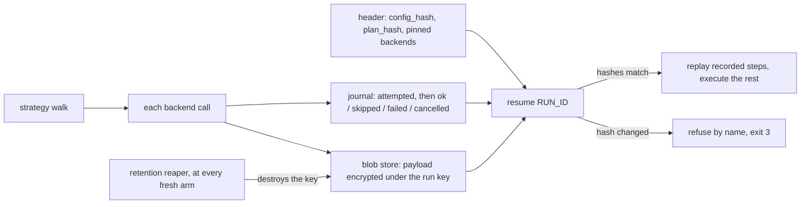

# The run ledger — resume, replay offline, erase

<sub>[Docs home](../README.md) · [← Batch runs](../batch/README.md) · [The HTTP server →](../server/README.md)</sub>

> **In one sentence.** With `OPENREADING_LEDGER` set, every strategy run leaves a journal you can
> resume after an interruption, replay with no backend calls, and erase by destroying one key.

## What this gives you

A journal for each strategy run: the append-only record of what was attempted, what came back,
and the payloads, encrypted under a per-run key. A strategy is a named plan over one or more
backends. `openreading resume <RUN_ID>` re-drives the run from that record. Recorded steps replay
byte-identical with zero network calls. Anything unreached runs for real. A resume that would mean
a different run refuses by name. Payloads expire on a retention clock; erasure destroys its key.

## Mental model



Arming means setting `OPENREADING_LEDGER=<dir>` in the environment. There is no flag. Only
strategy runs journal: `--strategy NAME`, or `auto` with `defaults.strategy`, on every surface, and
one run per item in a strategy batch. `--backend <id>`, `--no-strategy`, and a native batch journal
nothing, even with the variable set. Unarmed, every surface is byte-identical to a build with no
ledger.

## Walkthrough

```bash
uv run python -c 'from openreading.testing.sample_pdf import build_sample_pdf; open("sample.pdf","wb").write(build_sample_pdf())'
export OPENREADING_LEDGER=./.openreading
```

### 1. A backend run journals nothing; a strategy run leaves a record

```bash
uv run openreading parse sample.pdf --backend pymupdf > /dev/null; ls .openreading
uv run openreading parse sample.pdf --strategy offline_first > run.json; find .openreading | sort
```
```text
ls: .openreading: No such file or directory
.openreading/7dbf6b71-adb5-4e90-9188-a184fdba9d05.header.json
.openreading/7dbf6b71-adb5-4e90-9188-a184fdba9d05.jsonl
.openreading/blobs/7dbf6b71-adb5-4e90-9188-a184fdba9d05/33afeebb….bin
.openreading/blobs/7dbf6b71-adb5-4e90-9188-a184fdba9d05/49e166b7….bin
.openreading/keys/7dbf6b71-adb5-4e90-9188-a184fdba9d05.key
.openreading/retention/7dbf6b71-adb5-4e90-9188-a184fdba9d05.json
```

**You should see** nothing after the backend run and six files, of five kinds, after the strategy
run: a header, a journal (`.jsonl`), two blobs (the input document and the response), a key (mode
0600 in a 0700 directory), and a retention stamp. Read the id: `RUN_ID=$(basename
.openreading/*.header.json .header.json)`.

### 2. What a record looks like

```bash
jq -c . .openreading/$RUN_ID.jsonl
jq -c '{strategy_name, config_hash, plan_hash, journal_version, slim_request}' .openreading/$RUN_ID.header.json
```
```json
{"step_id":"ac395956…","status":"attempted","attempt":1,"run_id":"7dbf6b71-…","step_path":"root.steps[0]","step_seq":0,"backend_id":"pymupdf","idempotency_key":"om_bae9f534…","content_key":"om_bae9f534…","started_epoch_ms":1387091881,"journal_seq":0}
{"step_id":"ac395956…","status":"ok","attempt":1,"run_id":"7dbf6b71-…","step_path":"root.steps[0]","step_seq":0,"backend_id":"pymupdf","idempotency_key":"om_bae9f534…","content_key":"om_bae9f534…","payload":{"run_id":"7dbf6b71-…","digest":"sha256:49e166b7…","size_bytes":17091,"media_type":"application/json","store":"localfs"},"ended_epoch_ms":1387091939,"journal_seq":1}
{"strategy_name":"offline_first","config_hash":"sha256:4b081150…","plan_hash":"sha256:3e0803c8…","journal_version":1,"slim_request":{"backend":{"id":"strategy:offline_first"},"document":{"filename":"sample.pdf","mime_type":"application/pdf"},"schema_version":"0.1"}}
```

**You should see** two journal lines with one `step_id`: `attempted` before the backend call, `ok`
after it, pointing at a blob. The header pins what the run was. `slim_request` carries no bytes,
URL, or password.

### 3. Resume a completed run: replay, no backend call

```bash
uv run openreading resume $RUN_ID > resumed.json
diff <(jq -S .document run.json) <(jq -S .document resumed.json) && echo identical
uv run openreading explain resumed.json
```
```text
identical
strategy offline_first  →  pymupdf (ok)
  root.steps[0]    pymupdf      succeeded                      1ms  $0
      scanned_pages_detected     obs=False thr=True  ok
      …
```

**You should see** the same document and a 1ms attempt: the step was served from the journal.
`resume` takes only the run id. Every option comes from the ledger. From Python,
`openreading.resume(run_id)` returns the same dict and arms from the environment as the CLI does.

### 4. Interrupt a run, then resume it

Make a slower document and a two-rung strategy; each backend it tries is one rung. Press
<kbd>Ctrl</kbd>+<kbd>C</kbd> about two seconds in, while tesseract is still working:

```bash
uv run python -c 'import fitz; s=fitz.open("sample.pdf"); o=fitz.open(); [o.insert_pdf(s) for _ in range(8)]; o.save("slow.pdf")'
printf 'version: 1\nstrategies:\n  slow:\n    try: [tesseract, pymupdf]\n' > openreading.yaml
uv run openreading parse slow.pdf --strategy slow > interrupted.json; echo "exit=$?"
```
```text
[parse] interrupted; run dcb81857-018f-4e30-8e12-e91d915a1d64 is resumable
[parse] resume with: openreading resume dcb81857-018f-4e30-8e12-e91d915a1d64
exit=6
```

**You should see** exit 6 and an empty `interrupted.json`. Now resume, and read the journal:

```bash
uv run openreading resume dcb81857-018f-4e30-8e12-e91d915a1d64 > resumed-slow.json; echo "exit=$?"
jq -c '{status, step_path, backend_id, journal_seq}' .openreading/dcb81857-018f-4e30-8e12-e91d915a1d64.jsonl
```
```text
exit=0
{"status":"attempted","step_path":"root.steps[0]","backend_id":"tesseract","journal_seq":0}
{"status":"cancelled","step_path":"root.steps[0]","backend_id":"tesseract","journal_seq":1}
{"status":"attempted","step_path":"root.steps[1]","backend_id":"pymupdf","journal_seq":2}
{"status":"ok","step_path":"root.steps[1]","backend_id":"pymupdf","journal_seq":3}
```

**You should see** the interrupted rung recorded `cancelled` at interrupt time. On resume it
replays as that outcome, not re-run, and the next rung executes for real. `explain` labels the
replayed rung `skipped(missing_credentials)`. When a resumed step runs pymupdf live, PyMuPDF's
advisory line lands on stdout before the JSON; strip it with `tail -n +2 resumed-slow.json`.

### 5. Refusal by name

Edit the strategy this run used, then resume it:

```bash
printf 'version: 1\nstrategies:\n  slow:\n    try: [pymupdf, tesseract]\n' > openreading.yaml
uv run openreading resume dcb81857-018f-4e30-8e12-e91d915a1d64 > /dev/null; echo "exit=$?"
```
```text
[resume] refused: openreading.yaml changed since dcb81857-… (sha256:b3e321e0… -> sha256:2f2891ca…)
[resume] refused: plan_hash changed since dcb81857-… (sha256:e03796fc… -> sha256:744d5551…)
[resume] a resumed run replays recorded decisions; start a new run instead
exit=3
```

**You should see** exit 3 with both hashes named. Restore the body and add an unrelated strategy
to the file: the resume succeeds. The hash covers the compiled strategy this run used, not the
file's bytes. Also exit 3: `resume nope` (`no recorded run 'nope' under .openreading`) and any
`resume` with the variable unset (`OPENREADING_LEDGER is not set`).

## Recipes

**Erase a run: by the reaper, or by hand.**
```bash
OPENREADING_LEDGER_RETENTION_HOURS=0.000001 uv run openreading parse sample.pdf --strategy offline_first > short.json
SHORT=$(ls -t .openreading/*.header.json | head -1 | xargs basename | sed 's/.header.json//')
sleep 1; uv run openreading parse sample.pdf --strategy offline_first > /dev/null   # a fresh arm runs the reaper
uv run openreading resume $SHORT; echo "exit=$?"
rm .openreading/keys/$RUN_ID.key; uv run openreading resume $RUN_ID; echo "exit=$?"
```
```text
[resume] run '8d347957-93da-4ef2-a651-e58355760ce9': key destroyed, payload unrecoverable
exit=3
[resume] run '7dbf6b71-adb5-4e90-9188-a184fdba9d05': key destroyed, payload unrecoverable
exit=3
```
Deleting the key is exactly what the reaper does. The journal stays, so the run still answers what
happened, just not with what content. Retention (default 24 hours) is read at arm time. Each
dispatched hosted backend's own limit can only tighten it per step. Raise it before the run, never
after. Back up `*.jsonl`, `*.header.json`, and `blobs/`; never `keys/` alongside them.

**Replay decisions against a new document.**
`uv run openreading replay other.pdf --trace run.json` re-executes the strategy. It takes each
logged decision from `run.json`'s `orchestration` block, not from the journal. Replay is the
[Strategies](../strategies/README.md) mechanism; resume is this one.

## How it decides

The nine laws are L1–L9 in `uv run python -m pydoc openreading.ledger`. The ones you meet:

- Zero delta (L1). Unarmed, no file is touched and every byte of output is unchanged. Avoids: a
  ledger that changes behaviour for people who never asked for one.
- `attempted` before dispatch, terminal after. A crash between the two leaves an orphan reconciled
  by idempotency key. Avoids: a vendor job that billed and was never recorded.
- Refuse rather than diverge (L5). `config_hash`, `plan_hash`, and `journal_version` are hard
  fields. Avoids: a resume that silently becomes a different run.
- Secrets never enter a payload (L6); blobs are addressed by `(run_id, digest)` and never shared
  across runs (L7). Avoids: a presigned URL in every backup; replay serving another run's bytes.
- A recorded outcome is final. A `skipped` for missing credentials replays as a skip even if the key
  exists now. The cascade still falls to the next rung. Avoids: a resume that quietly dispatches
  to a vendor the original run never used.
- The compliance gate runs once and its output is pinned (L2). Each replayed step checks its backend
  against the pin. Avoids: a drifted backend readmitted on resume.

## Reference

- `uv run python -m pydoc openreading.ledger` — arming, exit codes, the nine laws, the journal
  contract, resume, retention and erasure.
- `uv run python -m pydoc openreading.api` — "Environment variables read by this module": which
  runs journal.
- `uv run openreading resume --help`; `uv run python -m pydoc openreading.cli` — exit 6.
- `src/openreading/schemas/step.v0.1.json`, `journal.v0.1.json` — record shapes;
  [JSON Schemas](../schemas/README.md).

## Not built yet

Each line names the `openreading.ledger` docstring section that records it.

- The `submit` / `drive` / `emit` step decomposition; today each rung is one `submit` step ("The
  step contract").
- The endpoint term of the compliance pin (L2) and checking the trace against the journal by
  sequence (L3) ("The nine Ledger laws").
- Executor limit and capability enforcement ("The port surface"); the executor conformance kit and
  any distributed executor ("The substrate contract").
- Executor id, descriptor digest, and `key_id` in the header ("Resume"); batch child runs and
  batch-level `resume` ("The journal contract").
- `DELETE /v1/jobs/{job_id}`, a durable job store, and `openreading.run(..., ledger=)` ("Surfaces").
- Whole-path zero-data-retention, shipped per step; cross-run rejection in `BlobStore.get`
  ("Retention, ZDR, erasure").
- SIGTERM handling; only Ctrl-C is caught ("Operational contract").

## See also

- [Docs home](../README.md)
- [Strategies](../strategies/README.md) — `replay`, `explain`, the trace.
- [Batch runs](../batch/README.md) — one journaled run per item.
- [The HTTP server](../server/README.md) — `/v1/jobs` is in-memory, never resumed.
- [JSON Schemas](../schemas/README.md)

<sub>[Docs home](../README.md) · [← Batch runs](../batch/README.md) · [The HTTP server →](../server/README.md)</sub>
