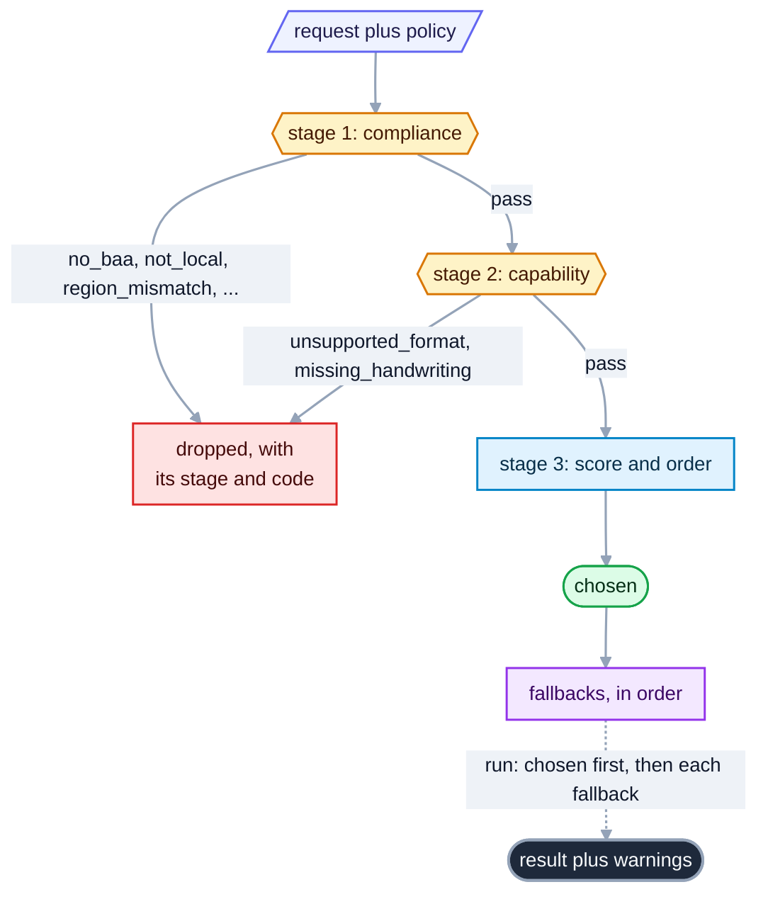

# Routing and keys: pick a backend under a compliance policy, with your own key

<sub>[Docs home](../README.md) · [← The command line](../cli/README.md) · [Strategies →](../strategies/README.md)</sub>

> **In one sentence.** Give the router a policy and it prints which backends survive, why the rest
> were dropped, and the order to try them, before anything runs.

## What this gives you

A backend is one parser, whether a local library, a self-hosted model, or a hosted API, and you have
several to choose from. Some documents carry data only certain vendors may see, so you need to know
which backends qualify before a page leaves your machine. `openreading route sample.pdf` prints
that plan without running any backend at all. A policy is the `policy:` block of your
`openreading.yaml`, a short list of requirements, for example `require_baa: true` to admit only
vendors that advertise a BAA. A BAA
(Business Associate Agreement) is the HIPAA contract a vendor signs before it may see protected
health information. That gate reads what each vendor publishes about its own BAA, so passing it is
necessary and not sufficient. The agreement your organisation actually signed is yours to confirm
out of band, because no backend tells the router about your paperwork. The plan names the chosen
backend, the fallback chain behind it, and a coded reason for every backend the router refused.
A fallback is the next backend tried when one fails, and a strategy is a named plan over backends.
Neither of those, and no named `--backend` either, can readmit a dropped backend, because
compliance is a filter and never a score. Keys are read from your environment per request and go
nowhere but the provider. You need `sample.pdf` and the `openreading.yaml` from the root README
and no key.

## Mental model

The router works in three stages, and the first two are gates while the third only orders the
survivors. A gate means each backend either passes or is dropped with a coded reason.



Stage 1 asks whether a backend may see the document at all, and it fails closed. Failing closed
means a fact the backend leaves `unverified`, such as an unconfirmed region or retention claim,
counts as no. Your own policy can relax that, with one of the three keys named under
[How it decides](#how-it-decides). Stage 2 asks whether the backend can do the job, which means
the input format and every requested feature. Stage 3 scores the survivors on quality, cost, and
locality, and that score sets the order. Adding `--run` walks the chain in that order and stops at
the first backend that succeeds. A backend with no key is skipped, and the skip lands in the
result's `warnings[]`. Alert on the `fallback_used` warning in an unattended run, because a
switched backend still exits 0 while returning a weaker answer than the one you planned for.

## Walkthrough

Seven steps take you from a baseline plan to the same answers from Python. Every command below
was run on 2026-09-06 from an empty directory. Only `pymupdf` and `tesseract` were available, and
no keys were set. Outputs are pasted and trimmed with `…`, never edited. The checks use `jq`
(`brew install jq` or `apt install jq` if `which jq` prints nothing). If `sample.pdf` and
`openreading.yaml` already exist from the root README, skip the first two commands.

### 1. The sample, a PHI policy, and the baseline plan

The baseline plan shows which backends a PHI policy admits before anything runs.

```bash
uv run python -c 'from openreading.testing.sample_pdf import build_sample_pdf; open("sample.pdf","wb").write(build_sample_pdf())'
cat > openreading.yaml <<'YAML'
version: 1
policy:
  require_baa: true
  no_train_on_data: true
YAML
uv run openreading route sample.pdf
```

```json
{
  "chosen": "pymupdf",
  "fallbacks": ["docling", "azure-document-intelligence", "google-document-ai", "tesseract", "qwen-vl", "anthropic-claude"],
  "dropped": {
    "aws-textract": {"stage": 1, "code": "trains_on_data", "reason": "no_train_on_data set but trains_on_customer_data='opt_out'"},
    "chunkr": {"stage": 1, "code": "no_baa", "reason": "require_baa set but hipaa_baa='tier_gated' and 'chunkr' is not in baa_tier_confirmed"},
    …
  },
  "terminal_reason": null
}
```

**You should see** `pymupdf` chosen and exit 0. No flag names the policy: `route` finds
`openreading.yaml` in the working directory, and every other verb finds the same file the same
way. As a check, `uv run openreading route sample.pdf | jq -c '[.dropped[].code] | unique'` prints
`["no_baa","trains_on_data"]`. A local backend never needs a BAA, so `pymupdf`, `docling`,
`tesseract`, and `qwen-vl` survive. The three hosted survivors pass for the other reason:
`azure-document-intelligence`, `google-document-ai`, and `anthropic-claude` each declare
`hipaa_baa: yes`, which records that the vendor publishes a BAA. [The
catalog](../adapters/README.md#catalog) names the page each claim was read from and the date it
was read.

Failure note: the router checks your `policy:` block against the keys in
[How it decides](#how-it-decides) before it routes, so a typo cannot quietly empty the filter.
`printf 'version: 1\npolicy: {require_baaa: true}\n' > typo.yaml` then `uv run openreading route
sample.pdf --config typo.yaml` exits 3 and names the key on stderr.

```text
[route] typo.yaml: invalid policy: unknown policy key: 'require_baaa' (did you mean 'require_baa'?); valid keys: allow_unverified_compliance, …
```

A block that is a list, a string or `null` is refused the same way, with `invalid config at
'policy': [] is not of type 'object'`. Read `dropped` on the runs that matter even so, because a
policy can be spelled correctly and still admit more than you intended.

### 2. Vary the policy: local only, region, retention

Each policy axis has its own pair of drop codes, and this step shows all three axes. A different
posture is a different file, named with `--config`:

```bash
printf 'version: 1\npolicy:\n  require_local: true\n' > local.yaml
printf 'version: 1\npolicy:\n  data_region: eu\n' > eu.yaml
printf 'version: 1\npolicy:\n  max_retention: 1h\n' > retention.yaml
for p in local eu retention; do uv run openreading route sample.pdf --config $p.yaml | jq -c '{chosen, fallbacks, dropped: (.dropped | map_values(.code))}'; done
```

```json
{"chosen":"pymupdf","fallbacks":["docling","tesseract","qwen-vl"],"dropped":{"anthropic-claude":"not_local","aws-textract":"not_local",…}}
{"chosen":"pymupdf","fallbacks":[…],"dropped":{"anthropic-claude":"region_mismatch","aws-textract":"region_mismatch","chunkr":"region_mismatch","google-gemini":"region_unverified","nuextract":"region_unverified",…}}
{"chosen":"pymupdf","fallbacks":[…],"dropped":{"aws-textract":"retention_unverified","azure-document-intelligence":"retention_exceeds","chunkr":"retention_unverified","google-document-ai":"retention_exceeds",…}}
```

**You should see** only local backends survive `require_local`, and two different codes on each
other axis. `region_mismatch` is a stated "no", because the backend lists regions and `eu` is not
among them. `region_unverified` is silence, because the backend lists none, and silence fails
closed. Retention pairs the same way. The region match is exact, so `eu` does not satisfy
`eu-west-1`.

Failure note: `max_retention: soon` drops every hosted backend with `retention_unparseable`.
That is your input, not the vendor's, so no switch relaxes it.

### 3. Attestations, then the tolerance switch

An attestation tells the router about paperwork it cannot see, such as a BAA you signed on a
higher plan. `reducto` drops at `no_baa` because its BAA is `tier_gated`, offered only on a higher
plan. If you signed it, say so. Then admit the vendors that were silent on region and retention:

```bash
printf 'version: 1\npolicy:\n  require_baa: true\n  no_train_on_data: true\n  baa_tier_confirmed: [reducto]\n' > phi-reducto.yaml
printf 'version: 1\npolicy:\n  data_region: eu\n  max_retention: 1h\n  allow_unverified_compliance: true\n' > tolerant.yaml
uv run openreading route sample.pdf --config phi-reducto.yaml | jq -c '{fallbacks, dropped: (.dropped | keys)}'
uv run openreading route sample.pdf --config tolerant.yaml | jq -c '.dropped | map_values(.code)'
```

```json
{"fallbacks":["docling","azure-document-intelligence","google-document-ai","reducto","tesseract","qwen-vl","anthropic-claude"],"dropped":["aws-textract","chunkr","google-gemini","mistral-ocr","nuextract","open-ocr","pulse"]}
{"anthropic-claude":"region_mismatch","aws-textract":"region_mismatch","azure-document-intelligence":"retention_exceeds","chunkr":"region_mismatch","google-document-ai":"retention_exceeds"}
```

**You should see** `reducto` in the fallbacks and gone from `dropped`. In the second plan, every
`*_unverified` drop is gone while every stated "no" remains. The first plan runs offline as-is.
`pymupdf` is chosen and answers, and the response carries no attestation warning. The
`baa_tier_confirmed` warning appears only when `reducto` itself answers. To name it, run
`uv run openreading parse sample.pdf --backend reducto --config phi-reducto.yaml` (needs
`REDUCTO_API_KEY`). The response's `warnings[]` then gains `{"code": "baa_tier_confirmed",
"field": "reducto", …}`. `train_optout_confirmed: [aws-textract]` does the same for
`trains_on_customer_data='opt_out'`. `aws-textract` joins the chain under `no_train_on_data`,
while `google-gemini`, `mistral-ocr`, `nuextract`, `open-ocr`, and `pulse` drop as
`trains_unverified`.

### 4. Run the plan, then watch it fall back

`--run` executes the plan in order, and a backend that cannot answer is skipped rather than
crashing the run. `pymupdf` reads PDFs, not images. Run the PHI plan, then render one page as a
PNG and run the local plan on it:

```bash
uv run openreading route sample.pdf --run > run.json
jq -c '{keys: keys, backend: .result.backend.id, warnings: [.result.warnings[].code]}' run.json
uv run python -c 'import fitz; fitz.open("sample.pdf")[0].get_pixmap(dpi=120).save("sample.png")'
uv run openreading route sample.png --config local.yaml --run | jq -c '{chosen, pymupdf: .dropped.pymupdf.code, ran: .result.backend.id, warning: .result.warnings[0].message}'
```

```json
{"keys":["chosen","dropped","fallbacks","result","terminal_reason"],"backend":"pymupdf","warnings":["confidence_unavailable"]}
{"chosen":"docling","pymupdf":"unsupported_format","ran":"tesseract","warning":"docling skipped (missing_credentials) → fell back to tesseract"}
```

**You should see** the plan gain a `result`, which is the envelope, with exit 0. A
`pymupdf_layout` advisory goes to stderr, so stdout stays pure JSON. On the PNG, `pymupdf` is a
stage-2 drop and `docling` is chosen. `docling` has no `DOCLING_SERVE_URL` set, so it is skipped
and `tesseract` answers. The skip is recorded as `fallback_used`, and nothing outside the plan is
tried. If the whole chain fails, `--run` exits 3, prints the plan anyway, and names each failure
on stderr.

### 5. Configured is not reachable

`backends` tells you which variables are set, and `--check` tells you whether a backend answers.

```bash
uv run openreading backends
uv run openreading backends --check pymupdf
```

```text
BACKEND                        TYPE               CONFIGURED  MISSING
…
docling                        oss_library        no          DOCLING_SERVE_URL
…
pymupdf                        oss_library        yes         -
qwen-vl                        self_hosted_model  no          QWEN_VL_ENDPOINT
reducto                        hosted_api         no          REDUCTO_API_KEY
tesseract                      oss_library        yes         -
BACKEND                        PROBE      STATUS                 MEASURED  LATENCY   DETAIL
pymupdf                        local      live                   yes       0ms       responding — the library imports and runs in this process
```

**You should see** variable names, never values. `CONFIGURED yes` means every required variable
was found, offline. `--check` probes the backend, and only when you type it. `MEASURED yes`
separates a real round trip from an inference. `--check all` with no keys prints `not_configured`
for the hosted rows and spends no network call on them.

### 6. Bring a key

This step shows where a key comes from and which source wins when two are set.

```bash
uv run openreading parse sample.pdf --backend reducto; echo "exit=$?"
OPENREADING_REDUCTO_API_KEY=not-a-real-key uv run openreading backends | grep reducto
printf 'REDUCTO_API_KEY=from-the-file\n' > .env
uv run python -c 'import os; from openreading.credentials import load_dotenv; print(load_dotenv(".env"), os.environ["REDUCTO_API_KEY"])'
REDUCTO_API_KEY=from-the-shell uv run python -c 'import os; from openreading.credentials import load_dotenv; print(load_dotenv(".env"), os.environ["REDUCTO_API_KEY"])'
rm .env
```

```text
[reducto] missing required credentials/config: REDUCTO_API_KEY. Sign up / configure: https://platform.reducto.ai
exit=3
reducto                        hosted_api         yes         -
1 from-the-file
0 from-the-shell
```

**You should see** exit 3 naming the variable, `yes` from a fake value, and `.env` setting one
variable the first time and none the second. Configured means found, not accepted. A rejected key
fails at submit with the sentence below, and the provider's body is dropped rather than echoed.

```text
key was found but rejected by reducto — check REDUCTO_API_KEY
```

The precedence for secrets, highest first, is a request's `credentials_ref` alias (only if the
operator allow-listed it), then `OPENREADING_<SLUG>_<KEY>`, then the native variable
(`REDUCTO_API_KEY`), then the provider SDK's own chain. An exported shell variable always beats
`.env`, so a value exported earlier in the session wins over the file you edited a moment ago. The
CLI loads `./.env` (or `--env-file`) on every call.

### 7. The same answers from Python

The Python API returns the same plan and raises the same refusal as the CLI.

```bash
uv run python -c '
import openreading
plan = openreading.route("sample.pdf")                          # finds ./openreading.yaml
print(plan.chosen.descriptor.id, plan.dropped["reducto"].code)  # pymupdf no_baa
try:
    openreading.run("sample.pdf", backend="reducto",
                    config={"version": 1, "policy": {"require_local": True}})
except Exception as e:
    print(type(e).__name__, e.constraint)                       # ComplianceRefused not_local
'
```

**You should see** the values in the two comments. The first call names no file and finds the
one in the directory. The second passes the file's own shape inline, which is what a caller with
no file on disk writes: same keys, same validation, same refusal. Naming a backend does not bypass
the policy, and `ComplianceRefused` is raised before any credential is looked up.

## Recipes

**Reorder the survivors by cost or accuracy.** Put `optimize_for: cost` in the block, then
`uv run openreading route sample.pdf | jq -c .fallbacks`. Under `cost` the local backends lead
(`docling`, `tesseract`, `qwen-vl`). Under `accuracy` the order follows
`router.integration_priority`, the descriptor field stage 3 uses as its quality proxy
(`_QUALITY_BY_PRIORITY` in `router/router.py`). The P0 backends lead, with `docling` first, then
the hosted P0s (`azure-document-intelligence`, `google-document-ai`, `chunkr`, `aws-textract`,
`reducto`, `nuextract`), ahead of every P1 (`tesseract`, `qwen-vl`, `open-ocr`, `pulse`,
`anthropic-claude`). Stage 3 changes the order, never the set.

**Route PHI through a vendor whose BAA you signed.** (needs the hosted key `REDUCTO_API_KEY`, so
the shape is shown, not run) Use step 3's file plus a request that names `reducto`, either
`openreading parse sample.pdf --backend reducto --config phi-reducto.yaml` or a strategy rung
`reducto` under that file. The response's `warnings[]` gains `{"code": "baa_tier_confirmed",
"field": "reducto", "message": "require_baa satisfied for reducto by operator confirmation alone:
…"}`, so a PHI run never rests silently on paperwork. `route --run` alone is answered by `pymupdf`
and carries no such warning.

**Apply a policy to a whole folder.** The file gates every verb, so a batch needs nothing extra:

```bash
mkdir corpus && cp sample.pdf corpus/a.pdf && cp sample.pdf corpus/b.pdf
printf 'version: 1\npolicy:\n  require_local: true\nstrategies:\n  local_only:\n    steps:\n      - backend: pymupdf\n' > folder.yaml
uv run openreading parse corpus/ --strategy local_only --config folder.yaml | jq -c .summary
uv run openreading parse corpus/ --backend reducto --config folder.yaml | jq -c '{summary, first_error: .items[0].error}'
```

```json
{"total":2,"succeeded":2,"failed":0,"skipped":0,"duration_ms":60.0,"cost_bases":["infra_only"],"pages_processed":4,"backends":{"pymupdf":2}}
{"summary":{"total":2,"succeeded":0,"failed":2,"skipped":0,"duration_ms":2.0,"cost_bases":[],"backends":{}},"first_error":{"code":"ComplianceRefused","message":"require_local set but backend is not fully local"}}
```

The block gates every item on both runs. That is the change to know about: a `--backend` run in a
directory whose `openreading.yaml` says `require_local: true` is refused now and ran before. It is
the reason the file exists, and the refusal names the key. One document rather than a folder is
the same refusal at exit 3, `[reducto] require_local set but backend is not fully local`. From
Python the equivalent is `openreading.run_batch(["corpus/"], config="folder.yaml")`, or the same
keys inline as `config={"version": 1, "policy": {"require_local": True}}`. A typo in the block is
refused before any document opens.

**Prove a backend answers, not only that it is configured.** `uv run openreading backends --check
all` probes only backends that declare a probe. A dead `DOCLING_SERVE_URL` reports `unreachable`
with `MEASURED yes` (the `openreading.liveness` docstring's acceptance case). A `vendor` probe
such as `anthropic-claude` leaves your network, and the PROBE column says so first.

**Read an empty plan (exit 4).** This is the shape only, because a local backend is the guaranteed
floor for `require_local` and `require_baa` and no policy on a default install reaches it. When
every backend is dropped, `route` still prints the plan and exits 4:

```json
{"chosen": null, "fallbacks": [], "dropped": {"…": {"stage": 1, "code": "…", "reason": "…"}}, "terminal_reason": "no_compliant_backend"}
```

## Policies people write

A policy never names a backend. It names a requirement, and each backend's descriptor either meets
it or does not. That is what lets you read the eleven blocks below without knowing which vendors
are installed: the same block over a different registry keeps whatever meets it. Every block below
went into an `openreading.yaml` and was run against `sample.pdf` on 2026-09-06, with 15 backends
registered and no keys set. `Keeps` counts the chosen backend plus its fallbacks. `Drops` is
`uv run openreading route sample.pdf | jq -c '.dropped | map_values(.code)'`, with the backends
sharing a code collapsed into a count.

| # | `policy:` | Keeps | Drops, by code |
|---|---|---|---|
| 1 | `require_local: true` | 4 | 11 `not_local` |
| 2 | `no_train_on_data: true` | 8 | aws-textract, chunkr `trains_on_data`; google-gemini, mistral-ocr, nuextract, open-ocr, pulse `trains_unverified` |
| 3 | `data_region: eu` | 8 | anthropic-claude, aws-textract, chunkr `region_mismatch`; 4 `region_unverified` |
| 4 | `max_retention: zero` | 6 | azure-document-intelligence, google-document-ai `retention_exceeds`; 7 `retention_unverified` |
| 5 | `max_retention: 48h` | 8 | 7 `retention_unverified` |
| 6 | `optimize_for: cost` | 15 | none; the chain is reordered |
| 7 | `no_train_on_data: true` + `train_optout_confirmed: [aws-textract]` | 9 | as row 2, with aws-textract readmitted |
| 8 | `require_baa: true` + `baa_tier_confirmed: [reducto]` | 9 | chunkr, google-gemini, mistral-ocr, nuextract, open-ocr, pulse `no_baa` |
| 9 | `data_region: eu` + `allow_unverified_compliance: true` | 12 | the 3 `region_mismatch` only |
| 10 | rows 2, 3 and 8 composed, plus `optimize_for: accuracy` | 7 | each constraint drops independently |
| 11 | no `policy:` block | 15 | none |

Rows 1 to 5 are constraints, and each one subtracts. Rows 7 to 9 are the three attestation keys,
and they are the only keys that add: each one tells the router about paperwork it cannot see.
Row 6 changes nothing about who may run and only reorders the survivors. Row 11 is the behaviour
of a directory with no file at all, which is what you get if you never write one.

Row 10 is the one to read twice. Composing constraints does not compose their drop codes: a
backend dropped by two of them still appears once, under whichever code the gate reached first,
so the seven survivors are the intersection and not a sum you can add up from the rows above.

A strategy names backends and runs inside whatever the policy left. A step the policy dropped is
pruned before anything runs, and `strategy validate` says so:

```bash
cat > pruned.yaml <<'YAML'
version: 1
policy:
  require_local: true
strategies:
  cheap_first:
    steps: [pymupdf, reducto]
    escalate_if: default
YAML
uv run openreading strategy validate --config pruned.yaml
uv run openreading strategy plan sample.pdf --strategy cheap_first --config pruned.yaml \
  | jq -c '{eligible: (.eligible|length), dropped: [.dropped[] | {backend, code}]}'
```

```text
WARNING pruned.yaml:strategies.cheap_first.steps[1].backend: 'reducto' is filtered out by the policy (not_local). This step can never run in that compliance context. Remove it or relax the policy
```

```json
{"eligible":4,"dropped":[{"backend":"reducto","code":"not_local"}]}
```

The warning goes to stdout and does not fail the exit code, because a file with an unreachable
step is legal and worth telling you about. The plan is where the pruning is a fact: `reducto` is
gone from `eligible` and carries its drop reason. Nothing later readmits it.

Two postures are two files, not two blocks in one:

```bash
uv run openreading route sample.pdf --config phi-reducto.yaml   # what the BAA lane allows
uv run openreading route sample.pdf --config local.yaml         # what the air-gapped lane allows
```

The file in the working directory is the default, and `--config` names another. There is no way to
select between policies inside one file, and that is deliberate: a selection grammar is one more
thing to spell a policy in, which is what this file exists to end.

## How it decides

Five rules shape the router, and each one exists to avoid a specific failure.

| Rule | Failure it avoids | Enforced in |
|---|---|---|
| Compliance is a filter, never a score. | A fallback that "helpfully" readmits a non-BAA backend leaks PHI. | `router/router.py` (`Router.route`, `_apply_explicit_fallback`) |
| Unverified fails closed; a conditional yes needs your confirmation. | A silent vendor treated as one that said yes; PHI routed to a BAA nobody signed. | `router/compliance.py` (`evaluate`, `RouterConfig`) |
| A named backend is policy-gated before any credential check. | `--backend reducto` as a way around `require_local`. | `router/router.py` (`Router.check_eligible`), called from `api.py` |
| No key means skip; a rejected key names its variable, never its value. | A crash mid-chain, or a secret echoed from a vendor body. | `router/executor.py`, `readiness.py` |
| Configured and reachable are different columns. | A dead URL rendered as a green "ready". | `readiness.py`, `liveness.py` |

The next table lists every policy key and where each lands. Source: `src/openreading/config.py`
(`apply`, `router_config`). Live truth: `uv run python -m pydoc openreading.cli` → `route` (the
`policy:` keys paragraph).

| Key | Becomes | Effect |
|---|---|---|
| `require_baa` | request compliance | Non-local backends need `hipaa_baa: yes`, or `tier_gated` plus `baa_tier_confirmed`. |
| `no_train_on_data` | request compliance | Needs `trains_on_customer_data: no`; `opt_out` needs `train_optout_confirmed`. |
| `data_region` | request compliance | Exact, case-insensitive match against the backend's declared regions. |
| `require_local` | request compliance | Only `runs_fully_local` backends survive. |
| `max_retention` | request compliance | `"0"`, `"zero"`, `"48h"`; backend retention must be known and not higher. |
| `optimize_for` | request routing | `accuracy`, `cost`, `latency`, `offline`: stage-3 weights only. |
| `doc_type_hint` | request routing | Carried on the request; none of the three stages reads it. |
| `allow_unverified_compliance` | router config | Admits `*_unverified` drops. Never a stated "no", never `retention_unparseable`. |
| `train_optout_confirmed` | router config | Backend ids whose training opt-out you applied. |
| `baa_tier_confirmed` | router config | Backend ids whose tier-gated BAA you signed. |

Your policy is the only thing that sets the eligible set, and exactly three of its keys widen that
set. Each of the three is an attestation, which means you are telling the router about paperwork it
cannot see. `allow_unverified_compliance` admits the backends that stayed silent on a fact instead
of answering no. `baa_tier_confirmed` admits the named backends whose tier-gated BAA you signed.
`train_optout_confirmed` admits the named backends whose training opt-out you applied. Nothing
after the policy widens the set again, so a fallback, a named `--backend`, a strategy rung and a
resume can only work inside it. That downstream half is what other pages mean by compliance never
being widened, and it is the part you can promise an auditor.

The last table lists the drop codes seen in this guide. Source:
`src/openreading/router/compliance.py` (`evaluate`), `src/openreading/router/router.py`
(`_capability_drop`). Live truth: `uv run openreading route sample.pdf --config <file> | jq
.dropped`. If this table and that output disagree, the output is right. Fix the table. A dash in
the Step column means no step in this guide triggers the code.

| Code | Stage | Trigger | Step |
|---|---|---|---|
| `not_local` | 1 | `require_local` and the backend is not fully local | 2 |
| `no_baa` | 1 | `require_baa`; BAA is `no`, or `tier_gated` without confirmation | 1 |
| `trains_on_data` | 1 | `no_train_on_data`; backend says `opt_out` or `yes` | 1 |
| `trains_unverified` | 1 | `no_train_on_data`; backend says `unverified` | 3 |
| `region_mismatch` | 1 | `data_region` not in the declared list | 2 |
| `region_unverified` | 1 | `data_region` set; backend declares no regions | 2 |
| `retention_exceeds` | 1 | backend retains longer than `max_retention` | 2 |
| `retention_unverified` | 1 | `max_retention` set; backend retention unknown | 2 |
| `retention_unparseable` | 1 | `max_retention` does not parse | 2, failure note |
| `unsupported_format` | 2 | MIME type not in the backend's `input_formats` | 4 |
| `missing_<capability>` | 2 | a `features` flag the backend lacks, sent in the request body (`POST /v1/route`) or on a hand-built `OpenReadingRequest`; no CLI flag, and `openreading.route()` takes none (seen: `missing_handwriting`) | - |

## Reference

- `uv run python -m pydoc openreading.router.router` prints the stages and their invariants.
- `uv run python -m pydoc openreading.router.compliance` prints the stage-1 gate and the
  attestations.
- `uv run python -m pydoc openreading.router.executor` prints the chain, the skips, and
  `fallback_used`.
- `uv run python -m pydoc openreading.credentials` prints the precedence, `.env`, and the
  per-backend variables.
- `uv run python -m pydoc openreading.readiness` and `openreading.liveness` print the status
  ladder.
- `uv run openreading route --help`, `uv run openreading backends --help`, `.env.example`.
- [Backend adapters](../adapters/README.md): "Reading the compliance columns", "Override form".

## Not built yet

- Server-side `deadline_ms` does not exist, so `/v1/parse` and `/v1/jobs` cannot raise the 120 s
  budget (`openreading.server`, "Timeouts").
- Webhook wait mode has no push path and degrades to polling (`openreading.router.driver`).
- Stage 3 has no latency term. No descriptor field exists, so `optimize_for: latency` weights
  quality and cost only (`router/router.py`, `_WEIGHTS`).
- `MISSING` stays `-` for `anthropic-claude` and `aws-textract` when unconfigured ([Not built
  yet](../adapters/README.md#not-built-yet)).
- No policy key gates on a descriptor's `soc2`, `gdpr`, `pci` or `phi_path_constraints` fields.
  Backends record them and stage 1 reads none of them, so a SOC 2 or GDPR requirement has no gate
  of its own (`router/compliance.py`, `evaluate`). `data_region` is the nearest thing, and it
  matches declared regions rather than any legal posture.

## See also

- [Docs home](../README.md)
- [The command line](../cli/README.md)
- [Strategies](../strategies/README.md) runs cascades and races over the same compliance filter.
- [The HTTP server](../server/README.md) puts the same router behind `POST /v1/parse`.
- [Backend adapters](../adapters/README.md) · [JSON Schemas](../schemas/README.md)

<sub>[Docs home](../README.md) · [← The command line](../cli/README.md) · [Strategies →](../strategies/README.md)</sub>
