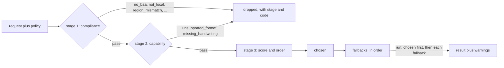

# Routing and keys — pick a backend under a compliance policy, with your own key

<sub>[Docs home](../README.md) · [← The command line](../cli/README.md) · [Strategies →](../strategies/README.md)</sub>

> **In one sentence.** Give the router a policy. It prints which backends survive, why the rest
> were dropped, and the order it will try them, before anything runs.

## What this gives you

A plan, not a guess. `openreading route` reads a policy file and prints the chosen backend, the
fallback chain, and a coded reason for every backend it refused. Compliance is a filter, never a
score. No fallback, strategy, or named `--backend` can readmit a backend the policy dropped. Keys
are read from your environment per request and go nowhere but the provider.

## Mental model

Three stages. The first two are yes/no gates. The third only orders the survivors.



A backend is one parser: a library, a self-hosted model, or a hosted API. A BAA (Business
Associate Agreement) is the HIPAA contract a vendor signs before it may see PHI (protected health
information). Stage 1 asks whether a backend may see the document at all. It fails closed: a fact
the backend leaves `unverified` counts as no. Stage 2 asks whether the backend can do the job
(input format, requested features). Stage 3 scores the survivors on quality, cost, and locality.
`--run` walks the chain in that order until one backend succeeds. A backend with no key is
skipped, and the skip lands in the result's `warnings[]`.

## Walkthrough

Every command below was run on 2026-08-28 from an empty directory. Only `pymupdf` and `tesseract`
were available, and no keys were set. Outputs are pasted and trimmed with `…`, never edited. The
checks use `jq` (`brew install jq` or `apt install jq` if `which jq` prints nothing).
Continuing from the root README: if `sample.pdf` and `phi.json` exist, skip the first two lines.

### 1. The sample, a PHI policy, and the baseline plan

```bash
uv run python -c 'from openreading.testing.sample_pdf import build_sample_pdf; open("sample.pdf","wb").write(build_sample_pdf())'
echo '{"require_baa": true, "no_train_on_data": true}' > phi.json
uv run openreading route sample.pdf --policy phi.json
```

```json
{
  "chosen": "pymupdf",
  "fallbacks": ["docling", "azure-document-intelligence", "google-document-ai", "tesseract", "qwen-vl", "anthropic-claude"],
  "dropped": {
    "aws-textract": {"stage": 1, "code": "trains_on_data", "reason": "no_train_on_data set but trains_on_customer_data='opt_out'"},
    "chunkr": {"stage": 1, "code": "no_baa", "reason": "require_baa set but hipaa_baa='tier_gated' and 'chunkr' is not in baa_tier_confirmed"},
    …
  },
  "terminal_reason": null
}
```

**You should see** `pymupdf` chosen and exit 0. Check: `uv run openreading route sample.pdf
--policy phi.json | jq -c '[.dropped[].code] | unique'` prints `["no_baa","trains_on_data"]`. A
local backend never needs a BAA, so `pymupdf`, `docling`, `tesseract`, and `qwen-vl` survive.

Failure note: a misspelled key (`"require_baaa": true`) is ignored without a message, and every
backend survives. If `dropped` is `{}` under a policy you expected to bite, check the spelling.

### 2. Vary the policy: local only, region, retention

```bash
echo '{"require_local": true}' > local.json
echo '{"data_region": "eu"}' > eu.json
echo '{"max_retention": "1h"}' > retention.json
for p in local eu retention; do uv run openreading route sample.pdf --policy $p.json | jq -c '{chosen, fallbacks, dropped: (.dropped | map_values(.code))}'; done
```

```json
{"chosen":"pymupdf","fallbacks":["docling","tesseract","qwen-vl"],"dropped":{"anthropic-claude":"not_local","aws-textract":"not_local",…}}
{"chosen":"pymupdf","fallbacks":[…],"dropped":{"anthropic-claude":"region_mismatch","aws-textract":"region_mismatch","chunkr":"region_mismatch","nuextract":"region_unverified","open-ocr":"region_unverified"}}
{"chosen":"pymupdf","fallbacks":[…],"dropped":{"aws-textract":"retention_unverified","azure-document-intelligence":"retention_exceeds","chunkr":"retention_unverified","google-document-ai":"retention_exceeds",…}}
```

**You should see** only local backends survive `require_local`, and two different codes on each
other axis. `region_mismatch` is a stated "no": the backend lists regions and `eu` is not among
them. `region_unverified` is silence: it lists none, and silence fails closed. Retention pairs
the same way. The region match is exact: `eu` does not satisfy `eu-west-1`.

Failure note: `{"max_retention": "soon"}` drops every hosted backend with `retention_unparseable`.
That is your input, not the vendor's, so no switch relaxes it.

### 3. Attestations, then the tolerance switch

`reducto` drops at `no_baa` because its BAA is `tier_gated`, offered only on a higher plan. If you
signed it, say so. Then admit the vendors that were silent on region and retention:

```bash
echo '{"require_baa": true, "no_train_on_data": true, "baa_tier_confirmed": ["reducto"]}' > phi-reducto.json
echo '{"data_region": "eu", "max_retention": "1h", "allow_unverified_compliance": true}' > tolerant.json
uv run openreading route sample.pdf --policy phi-reducto.json | jq -c '{fallbacks, dropped: (.dropped | keys)}'
uv run openreading route sample.pdf --policy tolerant.json | jq -c '.dropped | map_values(.code)'
```

```json
{"fallbacks":["docling","azure-document-intelligence","google-document-ai","reducto","tesseract","qwen-vl","anthropic-claude"],"dropped":["aws-textract","chunkr","nuextract","open-ocr","pulse"]}
{"anthropic-claude":"region_mismatch","aws-textract":"region_mismatch","azure-document-intelligence":"retention_exceeds","chunkr":"region_mismatch","google-document-ai":"retention_exceeds"}
```

**You should see** `reducto` in the fallbacks and gone from `dropped`. In the second plan, every
`*_unverified` drop is gone while every stated "no" remains. The first plan runs offline as-is —
`pymupdf` is chosen and answers, and the response carries no attestation warning. The
`baa_tier_confirmed` warning appears only when `reducto` itself answers. Name it:
`openreading.run("sample.pdf", backend="reducto", policy={"require_baa": True, "no_train_on_data":
True, "baa_tier_confirmed": ["reducto"]})` (needs `REDUCTO_API_KEY`). The response's `warnings[]`
then gains `{"code": "baa_tier_confirmed", "field": "reducto", …}`. `train_optout_confirmed:
["aws-textract"]` does the same for `trains_on_customer_data='opt_out'`. `aws-textract` joins the
chain under `no_train_on_data`, while `nuextract`, `open-ocr`, and `pulse` drop as
`trains_unverified`.

### 4. Run the plan, then watch it fall back

`pymupdf` reads PDFs, not images. Run the PHI plan, then render one page as a PNG and run the local
plan on it:

```bash
uv run openreading route sample.pdf --policy phi.json --run > run.json
jq -c '{keys: keys, backend: .result.backend.id, warnings: [.result.warnings[].code]}' run.json
uv run python -c 'import fitz; fitz.open("sample.pdf")[0].get_pixmap(dpi=120).save("sample.png")'
uv run openreading route sample.png --policy local.json --run | jq -c '{chosen, pymupdf: .dropped.pymupdf.code, ran: .result.backend.id, warning: .result.warnings[0].message}'
```

```json
{"keys":["chosen","dropped","fallbacks","result","terminal_reason"],"backend":"pymupdf","warnings":["confidence_unavailable"]}
{"chosen":"docling","pymupdf":"unsupported_format","ran":"tesseract","warning":"docling skipped (missing_credentials) → fell back to tesseract"}
```

**You should see** the plan gain a `result` (the normalized response, or envelope) with exit 0. A
`pymupdf_layout` advisory goes to stderr, so stdout stays pure JSON. On the PNG, `pymupdf` is a
stage-2 drop and `docling` is chosen. `docling` has no `DOCLING_SERVE_URL` set, so it is skipped
and `tesseract` answers. The skip is recorded as `fallback_used`, and nothing outside the plan is
tried. If the whole chain fails, `--run` exits 3, prints the plan anyway, and names each failure
on stderr.

### 5. Configured is not reachable

```bash
uv run openreading backends
uv run openreading backends --check pymupdf
```

```text
BACKEND                        TYPE               CONFIGURED  MISSING
…
docling                        oss_library        no          DOCLING_SERVE_URL
…
pymupdf                        oss_library        yes         -
qwen-vl                        self_hosted_model  no          QWEN_VL_ENDPOINT
reducto                        hosted_api         no          REDUCTO_API_KEY
tesseract                      oss_library        yes         -
BACKEND                        PROBE      STATUS                 MEASURED  LATENCY   DETAIL
pymupdf                        local      live                   yes       0ms       responding — the library imports and runs in this process
```

**You should see** variable names, never values. `CONFIGURED yes` means every required variable
was found, offline. `--check` probes the backend, and only when you type it. `MEASURED yes`
separates a real round trip from an inference. `--check all` with no keys prints `not_configured`
for the hosted rows and spends no network call on them.

### 6. Bring a key

```bash
uv run openreading parse sample.pdf --backend reducto; echo "exit=$?"
OPENREADING_REDUCTO_API_KEY=not-a-real-key uv run openreading backends | grep reducto
printf 'REDUCTO_API_KEY=from-the-file\n' > .env
uv run python -c 'import os; from openreading.credentials import load_dotenv; print(load_dotenv(".env"), os.environ["REDUCTO_API_KEY"])'
REDUCTO_API_KEY=from-the-shell uv run python -c 'import os; from openreading.credentials import load_dotenv; print(load_dotenv(".env"), os.environ["REDUCTO_API_KEY"])'
rm .env
```

```text
[reducto] missing required credentials/config: REDUCTO_API_KEY. Sign up / configure: https://platform.reducto.ai
exit=3
reducto                        hosted_api         yes         -
1 from-the-file
0 from-the-shell
```

**You should see** exit 3 naming the variable, `yes` from a fake value, and `.env` setting one
variable the first time and none the second. Configured means found, not accepted: a rejected key
fails at submit with `key was found but rejected by reducto — check REDUCTO_API_KEY`, and the
provider's body is dropped, not echoed.

For secrets, highest first: a request's `credentials_ref` alias (only if the operator allow-listed
it), `OPENREADING_<SLUG>_<KEY>`, the native variable (`REDUCTO_API_KEY`), then the provider SDK's
own chain. An exported shell variable always beats `.env`, so a value exported earlier in the
session wins over the file you just edited. The CLI loads `./.env` (or `--env-file`) on every call.

### 7. The same answers from Python

```bash
uv run python -c '
import openreading
plan = openreading.route("sample.pdf", policy={"require_baa": True, "no_train_on_data": True})
print(plan.chosen.descriptor.id, plan.dropped["reducto"].code)          # pymupdf no_baa
try:
    openreading.run("sample.pdf", backend="reducto", policy={"require_local": True})
except Exception as e:
    print(type(e).__name__, e.constraint)                                # ComplianceRefused not_local
'
```

**You should see** the values in the two comments. Naming a backend does not bypass the policy:
`ComplianceRefused` is raised before any credential is looked up.

## Recipes

**Reorder the survivors by cost or accuracy.** `echo '{"optimize_for": "cost"}' > opt.json`, then
`uv run openreading route sample.pdf --policy opt.json | jq -c .fallbacks`. Under `cost` the local
backends lead (`docling`, `tesseract`, `qwen-vl`). Under `accuracy` the P0 backends lead:
`docling`, then the hosted P0s (`azure-document-intelligence`, `google-document-ai`, `chunkr`,
`aws-textract`, `reducto`, `nuextract`), ahead of every P1 (`tesseract`, `qwen-vl`, `open-ocr`,
`pulse`, `anthropic-claude`). P0/P1 is the descriptor's `router.integration_priority`, the stage-3
quality proxy (`_QUALITY_BY_PRIORITY` in `router/router.py`). Stage 3 changes the order, never the
set.

**Route PHI through a vendor whose BAA you signed.** (needs a hosted key: `REDUCTO_API_KEY`; shape
shown, not run) Step 3's policy plus a request that names `reducto`: `openreading.run("sample.pdf",
backend="reducto", policy=…)` from Python, or a strategy rung `reducto` under that policy. The
response's `warnings[]` gains `{"code": "baa_tier_confirmed", "field": "reducto", "message":
"require_baa satisfied for reducto by operator confirmation alone: …"}`, so a PHI run never rests
silently on paperwork. `route --run` alone is answered by `pymupdf` and carries no such warning.

**Prove a backend answers, not only that it is configured.** `uv run openreading backends --check
all` probes only backends that declare a probe. A dead `DOCLING_SERVE_URL` reports `unreachable`
with `MEASURED yes` (the `openreading.liveness` docstring's acceptance case). A `vendor` probe
such as `anthropic-claude` leaves your network, and the PROBE column says so first.

**Read an empty plan (exit 4).** Shape only. A local backend is the guaranteed floor for
`require_local` and `require_baa`, so no policy on a default install reaches it. When every
backend is dropped, `route` still prints the plan and exits 4:

```json
{"chosen": null, "fallbacks": [], "dropped": {"…": {"stage": 1, "code": "…", "reason": "…"}}, "terminal_reason": "no_compliant_backend"}
```

## How it decides

| Rule | Failure it avoids | Enforced in |
|---|---|---|
| Compliance is a filter, never a score. | A fallback that "helpfully" readmits a non-BAA backend leaks PHI. | `router/router.py` (`Router.route`, `_apply_explicit_fallback`) |
| Unverified fails closed; a conditional yes needs your confirmation. | A silent vendor treated as one that said yes; PHI routed to a BAA nobody signed. | `router/compliance.py` (`evaluate`, `RouterConfig`) |
| A named backend is policy-gated before any credential check. | `--backend reducto` as a way around `require_local`. | `router/router.py` (`Router.check_eligible`), called from `api.py` |
| No key means skip; a rejected key names its variable, never its value. | A crash mid-chain, or a secret echoed from a vendor body. | `router/executor.py`, `readiness.py` |
| Configured and reachable are different columns. | A dead URL rendered as a green "ready". | `readiness.py`, `liveness.py` |

Policy keys and where each lands. Source: `src/openreading/api.py` (`build_request`,
`router_config`). Live truth: `uv run python -m pydoc openreading.cli` → `route` (the `policy.json`
keys paragraph).

| Key | Becomes | Effect |
|---|---|---|
| `require_baa` | request compliance | Non-local backends need `hipaa_baa: yes`, or `tier_gated` plus `baa_tier_confirmed`. |
| `no_train_on_data` | request compliance | Needs `trains_on_customer_data: no`; `opt_out` needs `train_optout_confirmed`. |
| `data_region` | request compliance | Exact, case-insensitive match against the backend's declared regions. |
| `require_local` | request compliance | Only `runs_fully_local` backends survive. |
| `max_retention` | request compliance | `"0"`, `"zero"`, `"48h"`; backend retention must be known and not higher. |
| `optimize_for` | request routing | `accuracy`, `cost`, `latency`, `offline`: stage-3 weights only. |
| `doc_type_hint` | request routing | Carried on the request; none of the three stages reads it. |
| `allow_unverified_compliance` | router config | Admits `*_unverified` drops. Never a stated "no", never `retention_unparseable`. |
| `train_optout_confirmed` | router config | Backend ids whose training opt-out you applied. |
| `baa_tier_confirmed` | router config | Backend ids whose tier-gated BAA you signed. |

Drop codes seen in this guide. Source: `src/openreading/router/compliance.py` (`evaluate`),
`src/openreading/router/router.py` (`_capability_drop`). Live truth: `uv run openreading route
sample.pdf --policy <file> | jq .dropped`. If this table and that output disagree, the output is
right — fix the table.

| Code | Stage | Trigger | Step |
|---|---|---|---|
| `not_local` | 1 | `require_local` and the backend is not fully local | 2 |
| `no_baa` | 1 | `require_baa`; BAA is `no`, or `tier_gated` without confirmation | 1 |
| `trains_on_data` | 1 | `no_train_on_data`; backend says `opt_out` or `yes` | 1 |
| `trains_unverified` | 1 | `no_train_on_data`; backend says `unverified` | 3 |
| `region_mismatch` | 1 | `data_region` not in the declared list | 2 |
| `region_unverified` | 1 | `data_region` set; backend declares no regions | 2 |
| `retention_exceeds` | 1 | backend retains longer than `max_retention` | 2 |
| `retention_unverified` | 1 | `max_retention` set; backend retention unknown | 2 |
| `retention_unparseable` | 1 | `max_retention` does not parse | 2, failure note |
| `unsupported_format` | 2 | MIME type not in the backend's `input_formats` | 4 |
| `missing_<capability>` | 2 | a `features` flag the backend lacks, sent in the request body (`POST /v1/route`) or on a hand-built `OpenReadingRequest`; no CLI flag, and `openreading.route()` takes none (seen: `missing_handwriting`) | — |

## Reference

- `uv run python -m pydoc openreading.router.router` — the stages and their invariants.
- `uv run python -m pydoc openreading.router.compliance` — the stage-1 gate and the attestations.
- `uv run python -m pydoc openreading.router.executor` — the chain, skips, `fallback_used`.
- `uv run python -m pydoc openreading.credentials` — precedence, `.env`, per-backend variables.
- `uv run python -m pydoc openreading.readiness` and `openreading.liveness` — the status ladder.
- `uv run openreading route --help`, `uv run openreading backends --help`, `.env.example`.
- [Backend adapters](../adapters/README.md): "Reading the compliance columns", "Override form".

## Not built yet

- Server-side `deadline_ms`: `/v1/parse` and `/v1/jobs` cannot raise the 120 s budget
  (`openreading.server`, "Timeouts").
- Webhook wait mode has no push path and degrades to polling (`openreading.router.driver`).
- A latency term in stage 3: no descriptor field exists, so `optimize_for: latency` weights quality
  and cost only (`router/router.py`, `_WEIGHTS`).
- `MISSING` stays `-` for `anthropic-claude` and `aws-textract` when unconfigured ([Known
  gaps](../adapters/README.md#known-gaps)).

## See also

- [Docs home](../README.md)
- [The command line](../cli/README.md)
- [Strategies](../strategies/README.md) — cascades and races over the same compliance filter.
- [The HTTP server](../server/README.md) — the same router behind `POST /v1/parse`.
- [Backend adapters](../adapters/README.md) · [JSON Schemas](../schemas/README.md)

<sub>[Docs home](../README.md) · [← The command line](../cli/README.md) · [Strategies →](../strategies/README.md)</sub>
