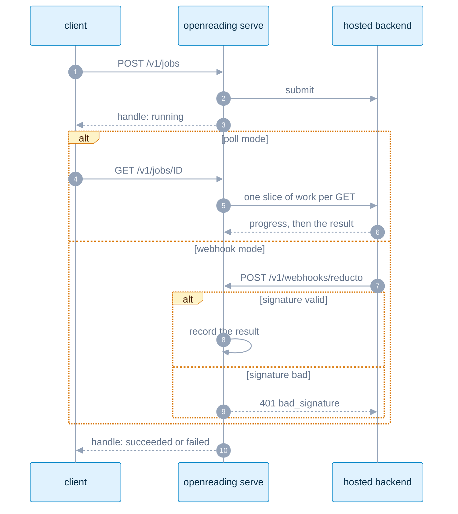

# The HTTP server: the same engine over HTTP, with auth

<sub>[Docs home](../README.md) · [← The run ledger](../ledger/README.md) · [The channel contract →](../derive/README.md)</sub>

> **In one sentence.** `openreading serve` puts parse, compare, batch, and async jobs behind a JSON
> API on `127.0.0.1:8787`, with bearer auth one variable turns on.

## What this gives you

You have the CLI working, and now a service in another language or on another machine needs the same
results. You do not want to shell out to a binary from a web handler, and you do not want a hosted
service holding your keys. `openreading serve` is one process, run by you, that accepts the packaged
request schema and returns the response envelope. An envelope is the one JSON shape every surface
returns, so a client over HTTP gets the same shape the CLI prints. A backend is one parser, such as
a local library or a hosted API. For example, `POST /v1/parse` with a body naming `sample.pdf` and
`pymupdf` returns an envelope with the same fields as the CLI prints. This repository ships no
hosted version, so the process runs on your own machine or network. A few control-plane endpoints
report readiness and routing plans, and they never run a backend. Keys come from the server's
environment and never from a request body. You need `sample.pdf` and the install from the root
README, which includes the server's dependencies.

```bash
uv run openreading serve
```

```text
[serve] listening on http://127.0.0.1:8787 — readiness: GET /healthz
INFO:     Started server process [85094]
INFO:     Waiting for application startup.
INFO:     Application startup complete.
```

## Mental model

An adapter is the code package that drives one backend, and the server builds a fresh adapter per
request. `POST /v1/parse` blocks until the envelope is ready, which is the simplest way to call it.
`POST /v1/jobs` returns a job handle at once, and you poll `GET /v1/jobs/{id}` until `state` is
`succeeded` or `failed`. A hosted backend can instead call back to `POST /v1/webhooks/{backend_id}`
when the submit request names that URL.



## Walkthrough

Start a server in a second terminal with `uv run openreading serve`. Every command below ran
against that server. Generate the root README's sample first:

```bash
uv run python -c 'from openreading.testing.sample_pdf import build_sample_pdf; open("sample.pdf","wb").write(build_sample_pdf())'
```

### 1. Health, readiness, parse

```bash
curl -s localhost:8787/healthz
curl -s localhost:8787/v1/backends | jq -c '.[] | select(.slug=="pymupdf" or .slug=="reducto")'
curl -s -X POST localhost:8787/v1/parse -H 'content-type: application/json' \
  -d '{"document": {"path": "'"$PWD"'/sample.pdf"}, "backend": {"id": "pymupdf"}}' > server-pymupdf.json
jq -c '{state: .status.state, backend: .backend.id, pages: .document.page_count, warnings: [.warnings[].code]}' server-pymupdf.json
```

```json
{"status":"ok","version":"0.3.0"}
{"slug":"pymupdf","type":"oss_library","extra_installed":true,"creds_found":[],"creds_missing":[],"ready":true,"liveness_probe":"local"}
{"slug":"reducto","type":"hosted_api","extra_installed":true,"creds_found":[],"creds_missing":["REDUCTO_API_KEY","REDUCTO_WEBHOOK_SECRET"],"ready":false,"liveness_probe":"none"}
{"state":"succeeded","backend":"pymupdf","pages":2,"warnings":["confidence_unavailable"]}
```

**You should see** `ready: true` for `pymupdf`, the missing variables named for `reducto`, and the
envelope the CLI prints. `ready` means the backend is configured, not that it was reached. To send
the file inline instead of by `path`, put it in `document.bytes_base64`. Check:
`jq .schema_version server-pymupdf.json` is `"0.3"`.

### 2. Let the cache replay an `auto` run

```bash
for i in 1 2; do curl -s -X POST localhost:8787/v1/parse -H 'content-type: application/json' \
  -d '{"document": {"path": "'"$PWD"'/sample.pdf"}, "backend": {"id": "auto"}, "compliance": {"require_local": true}}' \
  | jq -c '{backend: .backend.id, warnings: [.warnings[].code]}'; done
```

```json
{"backend":"pymupdf","warnings":["confidence_unavailable"]}
{"backend":"pymupdf","warnings":["confidence_unavailable","idempotent_replay"]}
```

**You should see** `idempotent_replay` on the second call. `auto` runs are cached for 15 minutes,
keyed on content plus options, and the cache dies with the process. `POST /v1/route` with the same
body returns the routing plan without running a backend. `"id": "strategy:offline_first"` runs a
preset with no config file. A strategy is a named plan over one or more backends, and a preset is
one built into the package. Your own strategies load only from the file `OPENREADING_CONFIG` names.

### 3. Compare, batch, and an async job

```bash
curl -s -X POST localhost:8787/v1/parse -H 'content-type: application/json' \
  -d '{"document": {"path": "'"$PWD"'/sample.pdf"}, "backend": {"id": "tesseract"}}' > server-tesseract.json
jq -n --slurpfile a server-pymupdf.json --slurpfile b server-tesseract.json '{responses: [$a[0], $b[0]]}' \
  | curl -s -X POST localhost:8787/v1/compare -H 'content-type: application/json' -d @- \
  | jq -c '{schema_version, subjects: [.subjects[].label], findings: (.findings | length)}'
mkdir -p docs && printf 'not a pdf' > docs/bad.pdf
curl -s -o server-batch.json -w 'HTTP %{http_code}\n' -X POST localhost:8787/v1/batch -H 'content-type: application/json' \
  -d '{"documents": [{"path": "'"$PWD"'/sample.pdf"}, {"path": "'"$PWD"'/docs/bad.pdf"}], "backend": "pymupdf", "jobs": 2}'
jq -c '{state: .status.state, summary: .summary, items: [.items[] | {relpath: .source.relpath, state, code: .error.code}]}' server-batch.json
curl -s -o job.json -X POST localhost:8787/v1/jobs -H 'content-type: application/json' \
  -d '{"document": {"path": "'"$PWD"'/sample.pdf"}, "backend": {"id": "pymupdf"}}'
curl -s localhost:8787/v1/jobs/$(jq -r .job_id job.json) | jq -c '{job_id, state, response_state: .response.status.state, error}'
```

```json
{"schema_version":"0.2","subjects":["pymupdf","tesseract"],"findings":4}
HTTP 200
{"state":"partial","summary":{"total":2,"succeeded":1,"failed":1,"skipped":0,"duration_ms":19.0,"cost_bases":["infra_only"],"pages_processed":2,"backends":{"pymupdf":1}},"items":[{"relpath":"0","state":"succeeded","code":null},{"relpath":"1","state":"failed","code":"FileDataError"}]}
{"job_id":"omjob_86129928b4744727b9f5a2001ddb265c","state":"succeeded","response_state":"succeeded","error":null}
```

**You should see** three results. The first is a compare report built only from saved envelopes.
The second is HTTP 200 with `state: partial`, because one failed item never fails the batch, and
items are named by index. The third is a job that already `succeeded`, because a local backend
finishes before the first poll. Each GET advances a poll-mode job by one slice, so keep polling
until `state` is not `running`. An empty `documents: []` returns 200 with an `empty_batch` warning.
`jobs` above 32 or more than 200 documents returns 400 with no override.

### 4. Read the error ladder

Every error the server raises deliberately has one shape, so one parser reads all of them. The
shape is `{"error": {"category", "message", "backend_code"?, "missing_env"?, "trail"?}}`. A failed
job's `error` is that same body, fetched with 200. Give your client one branch outside that parser
all the same, because an error no handler catches falls through to the web framework, which answers
`500` with the plain text `Internal Server Error`. Each row in the table below was triggered
against the running server, except where the row says otherwise.

```bash
curl -s -w '\nHTTP %{http_code}\n' -X POST localhost:8787/v1/parse -H 'content-type: application/json' \
  -d '{"document": {"path": "'"$PWD"'/sample.pdf"}, "backend": {"id": "reducto"}}'
```

```json
{"error":{"category":"terminal","message":"missing required credentials/config: REDUCTO_API_KEY. Sign up / configure: https://platform.reducto.ai","backend_code":"missing_credentials","missing_env":["REDUCTO_API_KEY"]}}
HTTP 424
```

Source: `src/openreading/server/__init__.py` ("HTTP status codes") and
`src/openreading/server/app.py` (`_error_envelope`, module docstring). Live truth: `uv run python -m
pydoc openreading.server` → "HTTP status codes". If this table and that text disagree, the text is
right, so fix the table.

| Status | `category` | When | Trigger (offline unless noted) |
|---|---|---|---|
| `200` | none | success; also `GET /v1/jobs/{id}` of a failed job, and every liveness probe result | any step above |
| `400` | `bad_request`, `unknown_strategy` | body not JSON, fails the request schema, unknown `strategy:<name>`, bad `jobs` or `timeout_s`, `/v1/jobs` with `auto` | `"backend": {"id": "strategy:nope"}` |
| `401` | `unauthorized`, `bad_signature` | auth on and no valid bearer, on every endpoint but the two named below; webhook signature invalid or its secret unset | `POST /v1/webhooks/reducto` with any body and no `REDUCTO_WEBHOOK_SECRET` |
| `403` | `compliance_refused`, `scope_denied` | the policy leaves nothing to run; the token is not scoped to the backend it named, or scope empties that request's router chain or strategy walk | `"backend": {"id": "reducto"}, "compliance": {"require_baa": true}` |
| `404` | `unknown_backend`, `unknown_job` | the id names nothing | `"backend": {"id": "nope"}`; `GET /v1/jobs/j_nope` |
| `413` | `terminal` (`doc_too_large`) | document over the backend's size limit | needs a hosted key; shape shown, not run |
| `422` | `unsupported_feature` | the named backend cannot produce what you asked for | `"backend": {"id": "pymupdf"}, "extraction_schema": {"instructions": "totals"}` |
| `424` | `terminal` (`missing_credentials`, `auth_rejected`) | named backend has no key (`missing_env[]`), or the provider rejected it | `"backend": {"id": "reducto"}` with no `REDUCTO_API_KEY` |
| `502` | `plan_exhausted`, `terminal` | every backend in the plan failed (`trail` lists them). Two request-shape refusals also land here rather than at 400: `credentials_ref_alias_not_allowed` (the body's `credentials_ref` named an alias the operator has not allow-listed) and `endpoint_not_request_configurable` (the body set `runtime.endpoint`). Both are permanent, so read `backend_code` before retrying a 502 | `"credentials_ref": "env:OPENREADING_REDUCTO"`; `"runtime": {"endpoint": "https://example.com"}` |
| `504` | `retryable_exhausted` | deadline passed or retries exhausted | needs a hosted key; shape shown, not run |
| `500` | none; the body is the plain text `Internal Server Error`, not JSON | an error no handler caught | no trigger known today; it is the framework's own fallback, so parse defensively anyway |

`/v1/batch` takes `backend` as one bare string where `/v1/parse` takes an object, which is the
easiest mistake to make when moving between the two endpoints. The refusal names the fix:

```bash
curl -s -w '\nHTTP %{http_code}\n' -X POST localhost:8787/v1/batch -H 'content-type: application/json' \
  -d '{"documents": [{"path": "'"$PWD"'/sample.pdf"}], "backend": {"id": "pymupdf"}}'
```

```json
{"error":{"category":"bad_request","message":"\"backend\" on this endpoint is one string shared by every item, not /v1/parse's object — send \"backend\": \"pymupdf\""}}
HTTP 400
```

**You should see** 400 in the enveloped shape rather than a bare 500. Sending
`"backend": "pymupdf"` answers 200 for the same documents.

Two endpoints answer without a bearer even when auth is on: `GET /healthz` and
`POST /v1/webhooks/{backend_id}`. A vendor holds no token of yours, so a callback could never
present one. With auth on and no bearer, `/healthz` returns 200, and
`POST /v1/webhooks/chunkr -d '{"task_id":"forged-1"}'` returns 404 `unknown_job`. That 404 means the
request reached the handler and looked the job up rather than being challenged for a token.

A webhook is closed instead by its signature, and only `reducto` declares a signing secret today.
The same unauthenticated call to `POST /v1/webhooks/reducto` returns 401 `bad_signature`, which is
the row above. For `chunkr` and `open-ocr` the `openreading.server` docstring says both "verify
nothing (neither has a signature mechanism), so treat webhook mode on either as unauthenticated
until real verification ships". On a server reachable beyond loopback that is an unauthenticated and
unverified write path into the job store for those two backends. The same docstring states what
contains it: the lookup only considers jobs for the URL's own `{backend_id}` that are already
waiting in webhook mode, so "a forged chunkr/open-ocr event can only settle a chunkr/open-ocr
webhook-mode job whose id it names". It can reach no other backend's job and no polled job. Decide
your network policy for those two paths before you bind beyond loopback.

### 5. Turn on caller auth

Stop the server, mint a token, set it in the environment, and restart. The scope variable lists the
backends that token may reach. A token is never a flag, so it never lands in shell history.

```bash
export TOK=$(python3 -c 'import secrets; print(secrets.token_urlsafe(32))')
OPENREADING_API_KEYS="$TOK" OPENREADING_API_KEY_SCOPES="$TOK=pymupdf" uv run openreading serve
```

```bash
curl -s -w '\nHTTP %{http_code}\n' localhost:8787/v1/backends
curl -s -o /dev/null -w 'HTTP %{http_code}\n' -X POST localhost:8787/v1/parse -H 'content-type: application/json' \
  -H "Authorization: Bearer $TOK" -d '{"document": {"path": "'"$PWD"'/sample.pdf"}, "backend": {"id": "pymupdf"}}'
curl -s -w '\nHTTP %{http_code}\n' -X POST localhost:8787/v1/parse -H 'content-type: application/json' \
  -H "Authorization: Bearer $TOK" -d '{"document": {"path": "'"$PWD"'/sample.pdf"}, "backend": {"id": "tesseract"}}'
```

```json
{"error":{"category":"unauthorized","message":"missing or invalid API key"}}
HTTP 401
HTTP 200
{"error":{"category":"scope_denied","message":"this API key is not scoped to reach backend 'tesseract'","backend_code":"tesseract"}}
HTTP 403
```

**You should see** 401 without a bearer token, 200 with it, and 403 outside the scope. `/healthz`
and `POST /v1/webhooks/{backend_id}` stay open without a bearer, as the note under the ladder
explains. A malformed entry in either variable stops the server before it binds a socket:

```bash
OPENREADING_API_KEYS="$TOK" OPENREADING_API_KEY_SCOPES="$TOK=pymupdf,=tesseract" \
  uv run openreading serve; echo "exit=$?"
```
```text
[serve] OPENREADING_API_KEY_SCOPES entry 2 has an empty key before '='
exit=3
```

The line goes to stderr under the `[serve]` tag every other CLI failure uses, so one log rule
catches it. It names the entry's position and never its value, which keeps a startup log from
becoming the place a token leaks. A second scope for one key and a scope for a key that
`OPENREADING_API_KEYS` never listed are refused the same way.

A token listed in `OPENREADING_API_KEYS` but absent from `OPENREADING_API_KEY_SCOPES` is
unscoped, meaning it reaches every backend. That is deliberate, because a second key added for a
colleague is otherwise dead on arrival, and it is also the way an operator mints an unrestricted
token by accident. Give every token you add its own scope entry unless you mean it to reach
everything.

Startup checks the shape of a scope and not the backend ids inside it. A typo such as `pymupfd`
binds the socket with no warning and leaves that token able to reach nothing, so every request
under it answers 403 naming a backend you believe you allowed. Check each id against the `slug`
values `GET /v1/backends` returns.

## Recipes

**Receive a vendor webhook instead of polling.** (needs a hosted key; shape shown, not run)
```json
{"document": {"url": "https://example.com/loan.pdf"}, "backend": {"id": "reducto"},
 "async": {"mode": "async", "webhook_url": "https://your-host/v1/webhooks/reducto"}}
```
Reducto signs the callback. The server verifies it with `REDUCTO_WEBHOOK_SECRET` and answers 401
when the secret is unset. You always supply the callback URL.

**Expose the server beyond localhost.** Any `--host` other than the literal `127.0.0.1` warns on
stderr, so the check is broader than a genuinely reachable address. Spelling the loopback address
differently is enough to see it:
```bash
uv run openreading serve --host localhost
```
```text
[serve] warning: binding localhost exposes the server — anyone who can reach it spends your vendor keys. Put it behind your own auth/proxy.
[serve] listening on http://127.0.0.1:8787 — readiness: GET /healthz
…
```
`--host 0.0.0.0` prints the same line with its own address, and that one really does reach every
interface. Set `OPENREADING_API_KEYS` before you bind anywhere but the default, and terminate TLS
in front of it.

**Probe whether a backend answers.**
`curl -s -X POST localhost:8787/v1/backends/pymupdf/liveness -d '{}'` returns
`"status":"live","measured":true`. The probe always returns 200, because a backend being down is a
successful diagnostic. `measured: false` means the status was inferred from configuration, with no
round trip.

**Smoke-test the whole stack.** `make serve-smoke` boots a server on a free port, posts the
sample through `/v1/parse` and `/v1/batch`, asserts schema-valid responses, and shuts down.

## How it decides

- Auth is off by default and the server binds to loopback only. This avoids a default token nobody
  rotates and an open port that spends your credits. `openreading.server.app` enforces it.
- Tokens, keys and compliance attestations come from the environment only, never a body or a
  flag. A compliance attestation is the operator's declaration that a backend meets a requirement,
  such as a signed business associate agreement (BAA). Nothing lands in `ps` or shell history, and
  no caller can attest on the operator's behalf.
- A scope only narrows what compliance and routing already allow. A directly named backend is
  checked at the door, before any adapter is built, so an out-of-scope name never resolves a
  vendor credential.
- An `auto` request runs on the router's fallback chain pruned to the token's backends. That chain
  is the backend the router picks plus every backend it would fall back to, and an out-of-scope
  member is removed before the run rather than reached. A token scoped to `pymupdf` and
  `tesseract` is refused `docling` by name, and its `auto` request on a file neither can parse
  fails with a trail naming those two backends alone.
- An `auto` request whose top pick alone is out of scope is rerouted, not refused. That is a
  change in behaviour. The old check read the router's first pick and nothing behind it, which
  refused the request over a choice the caller never made. Worse, it left every fallback behind
  that pick unchecked. A token scoped to `tesseract` is still refused `pymupdf` by name, and the
  same token's `auto` request answers 200 on `tesseract`.
- A `strategy:<name>` request is checked too, from inside the walk, because a walk chooses its own
  backends and cannot be judged at the door. Every out-of-scope rung is pruned before it runs, and
  an `auto` rung resolves only against what is left. A token scoped to `pymupdf` that names
  `strategy:offline_first` therefore runs `pymupdf` alone, and the response's
  `orchestration.dropped` lists `docling` and `tesseract` with code `scope_denied` at stage 0.
- Pruning a walk or a chain down to nothing is a refusal, never a 502 and never a silent run on
  nothing. A token scoped to `reducto` that names `strategy:offline_first` answers 403 with `this
  API key is not scoped to reach any backend strategy 'offline_first' can run (denied: docling,
  pymupdf, tesseract)`. The same token sending `auto` under `require_local` answers 403 with `this
  API key is not scoped to reach backend 'pymupdf'`, which names the backend the router would have
  used rather than the ones the token allows.
- Only a strategy records what the scope removed. A pruned `auto` chain leaves no
  `orchestration.dropped` block on the envelope. You see what survived, in `backend.id` on success
  or in a 502 `trail`, but never a list of what was pruned.
- `/v1/parse`, `/v1/batch` and `/v1/compare` responses are schema-validated before they leave the
  process. The server owns the only result cache, so a replayed item never hides a billed call.

## Operations

This section is for whoever runs the process and watches it. It covers where the log lines go, what
a restart does to work already in flight, and what there is to measure.

### Read the logs

The server writes to both streams and splits them by kind, which a log-shipping config has to
account for. Start it with the streams apart and drive one request through:

```bash
uv run openreading serve --port 8901 > access.log 2> lifecycle.log &
sleep 3
curl -s -o /dev/null -X POST localhost:8901/v1/parse -H 'content-type: application/json' \
  -d '{"document": {"path": "'"$PWD"'/sample.pdf"}, "backend": {"id": "pymupdf"}}'
sleep 1; cat access.log; echo '--- stderr ---'; cat lifecycle.log
```

```text
Consider using the pymupdf_layout package for a greatly improved page layout analysis.
INFO:     127.0.0.1:58618 - "POST /v1/parse HTTP/1.1" 200 OK
--- stderr ---
[serve] listening on http://127.0.0.1:8901 — readiness: GET /healthz
INFO:     Started server process [85067]
INFO:     Waiting for application startup.
INFO:     Application startup complete.
```

**You should see** one access line per request on stdout and the whole lifecycle on stderr. Three
properties follow. A backend's own chatter lands in the stdout access log between access lines, so
that stream is not uniform and a strict parser will choke on the advisory. There is no request id
and no timestamp on an access line, so a slow request cannot be traced back to a caller. There is
no log-level knob and no structured output, so filtering happens in your shipper rather than here.

The `[serve] listening on …` line prints only once the port is genuinely claimed, and it names the
readiness check for the same reason. A port already in use produces one tagged line and exit 3
rather than a healthy-looking startup followed by a silent death:

```bash
uv run openreading serve --port 8901; echo "exit=$?"
```

```text
[serve] cannot bind 127.0.0.1:8901: Address already in use — free it or pass a different --port
exit=3
```

Gate readiness on `GET /healthz` answering 200 all the same, because no log line is a readiness
contract and the uvicorn lines below it are still printed by the library rather than by this
process.

### Restart, and what it costs a client

The job store lives in the process, so a restart erases it. A job id that answered `succeeded` a
moment ago answers 404 afterwards, with the same category a typo gets:

```bash
curl -s localhost:8901/v1/jobs/omjob_bad0f7e7accf4b528a55c88496545946
```

```json
{"error":{"category":"unknown_job","message":"omjob_bad0f7e7accf4b528a55c88496545946"}}
```

**You should see** `unknown_job` for both a dropped job and an id that never existed. A client
cannot tell "we lost your finished result, resubmit" from "you asked for something that never
existed, do not retry", and no field distinguishes them today. Treat 404 on an id your own code
minted as a resubmit, and reserve the do-not-retry reading for an id you did not mint.

That matters more than it looks, because each `GET /v1/jobs/{id}` is what advances a poll-mode job
by one slice. Nothing progresses the job in the background. A rolling restart in the middle of a
poll therefore strands work a vendor has already accepted and will still bill, and no record of it
survives the process.

### Measure what you can

There is no metrics or tracing surface here, and the "Not built yet" list says so. Three things are
worth collecting instead. The stdout access log gives request counts and status codes. `uv run
openreading backends --check <slug>` measures whether a backend really answers and belongs on a
schedule as a vendor-degradation canary ([Routing and keys](../router/README.md)). Each envelope
carries `usage.cost_usd`, which is the only per-request spend figure the process produces, so a
consumer that wants a spend total sums it as responses arrive.

### Load and time budgets

One `openreading serve` is one uvicorn process, and it exposes no worker count and no queue depth.
Concurrency inside a request is bounded per backend, which [Batch runs](../batch/README.md#sizing-a-large-run)
measures along with the memory a corpus costs. A request over HTTP is capped at the generic 120
second budget with no field to raise it, so a long hosted document answers 504 here and needs the
CLI or the Python API instead. Nothing rate-limits callers and nothing caps spend, so put your own
proxy in front before more than one client can reach the port.

## Reference

- `uv run python -m pydoc openreading.server` has the sections "Endpoints", "HTTP status codes",
  "Timeouts", and "Security". `uv run python -m pydoc openreading.server.app` lists every
  environment variable.
- `uv run openreading serve --help` documents `--host`, `--port`, `--cors-origin`, and `--env-file`.
  It says nothing about authentication, which is off until `OPENREADING_API_KEYS` names at least
  one token. Read step 5 above before you start a key-holding process.
- [JSON Schemas](../schemas/README.md), and the OpenAPI page at `/docs`. It answers 200 while auth
  is off. Once step 5 turns auth on, `/docs` and `/openapi.json` both answer 401 without a bearer,
  so a browser tab cannot open them and a client must send the header itself.

## Not built yet

- Rate limiting, spend accounting, and TLS are not provided here by design. Put your own reverse
  proxy in front (`openreading.server` docstring, "Security": "What this does NOT add: rate
  limiting, spend accounting, transport encryption").
- A metrics or tracing surface. There is no `/metrics`, no counters, no request id, and no trace
  hook, and with auth on an unknown path answers 401 rather than 404, so a probe cannot tell "not
  implemented" from "wrong token". [Measure what you can](#measure-what-you-can) names what to
  collect instead.
- A durable job store and server-side resume. The `openreading.server` docstring says under
  "Endpoints", `POST /v1/jobs`: "there is no server-side resume". The `openreading.ledger`
  docstring says under "The substrate contract": "The `/v1/jobs` store stays in-memory,
  per-process". [Restart, and what it costs a client](#restart-and-what-it-costs-a-client) shows
  what a client sees when that store goes away.
- A `deadline_ms` field over HTTP, so a long hosted job hits 504 at 120 s (`openreading.server`
  docstring, "HTTP status codes", the Timeouts paragraph: "no `deadline_ms` field or query param").
- Webhook signature verification for `chunkr` and `open-ocr` (`openreading.server` docstring,
  "Endpoints", `POST /v1/webhooks/{backend_id}`: "verify nothing"). What that exposes today, and
  what contains it, is under the error ladder above.

## See also

- [Docs home](../README.md)
- [The command line](../cli/README.md) has the same surfaces as verbs and exit codes.
- [Routing and keys](../router/README.md) explains the compliance stages behind `auto` and 403.
- [The run ledger](../ledger/README.md) covers resume, which the server does not offer.
- [Backend adapters](../adapters/README.md) lists which backend needs which variable.

<sub>[Docs home](../README.md) · [← The run ledger](../ledger/README.md) · [The channel contract →](../derive/README.md)</sub>
