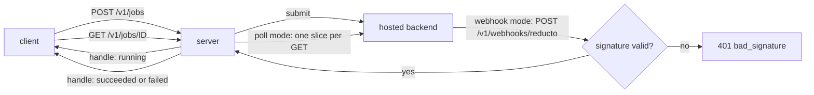

# The HTTP server: the same engine over HTTP, with auth

<sub>[Docs home](../README.md) · [← The run ledger](../ledger/README.md) · [The channel contract →](../derive/README.md)</sub>

> **In one sentence.** `openreading serve` puts parse, compare, batch, and async jobs behind a JSON
> API on `127.0.0.1:8787`, with bearer auth one variable turns on.

## What this gives you

You have the CLI working, and now a service in another language or on another machine needs the same
results. You do not want to shell out to a binary from a web handler, and you do not want a hosted
service holding your keys. `openreading serve` is one process, run by you, that accepts the packaged
request schema and returns the response envelope. An envelope is the one JSON shape every surface
returns, so a client over HTTP gets the same shape the CLI prints. A backend is one parser, such as
a local library or a hosted API. For example, `POST /v1/parse` with a body naming `sample.pdf` and
`pymupdf` returns an envelope with the same fields as the CLI prints. This repository ships no
hosted version, so the process runs on your own machine or network. A few control-plane endpoints
report readiness and routing plans, and they never run a backend. Keys come from the server's
environment and never from a request body. You need `sample.pdf` and the install from the root
README, which includes the server's dependencies.

```bash
uv run openreading serve
```

```text
INFO:     Uvicorn running on http://127.0.0.1:8787 (Press CTRL+C to quit)
```

## Mental model

An adapter is the code package that drives one backend, and the server builds a fresh adapter per
request. `POST /v1/parse` blocks until the envelope is ready, which is the simplest way to call it.
`POST /v1/jobs` returns a job handle at once, and you poll `GET /v1/jobs/{id}` until `state` is
`succeeded` or `failed`. A hosted backend can instead call back to `POST /v1/webhooks/{backend_id}`
when the submit request names that URL.



## Walkthrough

Start a server in a second terminal with `uv run openreading serve`. Every command below ran
against that server. Generate the root README's sample first:

```bash
uv run python -c 'from openreading.testing.sample_pdf import build_sample_pdf; open("sample.pdf","wb").write(build_sample_pdf())'
```

### 1. Health, readiness, parse

```bash
curl -s localhost:8787/healthz
curl -s localhost:8787/v1/backends | jq -c '.[] | select(.slug=="pymupdf" or .slug=="reducto")'
curl -s -X POST localhost:8787/v1/parse -H 'content-type: application/json' \
  -d '{"document": {"path": "'"$PWD"'/sample.pdf"}, "backend": {"id": "pymupdf"}}' > server-pymupdf.json
jq -c '{state: .status.state, backend: .backend.id, pages: .document.page_count, warnings: [.warnings[].code]}' server-pymupdf.json
```

```json
{"status":"ok","version":"0.3.0"}
{"slug":"pymupdf","type":"oss_library","extra_installed":true,"creds_found":[],"creds_missing":[],"ready":true,"liveness_probe":"local"}
{"slug":"reducto","type":"hosted_api","extra_installed":true,"creds_found":[],"creds_missing":["REDUCTO_API_KEY","REDUCTO_WEBHOOK_SECRET"],"ready":false,"liveness_probe":"none"}
{"state":"succeeded","backend":"pymupdf","pages":2,"warnings":["confidence_unavailable"]}
```

**You should see** `ready: true` for `pymupdf`, the missing variables named for `reducto`, and the
envelope the CLI prints. `ready` means the backend is configured, not that it was reached. To send
the file inline instead of by `path`, put it in `document.bytes_base64`. Check:
`jq .schema_version server-pymupdf.json` is `"0.3"`.

### 2. Let the cache replay an `auto` run

```bash
for i in 1 2; do curl -s -X POST localhost:8787/v1/parse -H 'content-type: application/json' \
  -d '{"document": {"path": "'"$PWD"'/sample.pdf"}, "backend": {"id": "auto"}, "compliance": {"require_local": true}}' \
  | jq -c '{backend: .backend.id, warnings: [.warnings[].code]}'; done
```

```json
{"backend":"pymupdf","warnings":["confidence_unavailable"]}
{"backend":"pymupdf","warnings":["confidence_unavailable","idempotent_replay"]}
```

**You should see** `idempotent_replay` on the second call. `auto` runs are cached for 15 minutes,
keyed on content plus options, and the cache dies with the process. `POST /v1/route` with the same
body returns the routing plan without running a backend. `"id": "strategy:offline_first"` runs a
preset with no config file. A strategy is a named plan over one or more backends, and a preset is
one built into the package. Your own strategies load only from the file `OPENREADING_CONFIG` names.

### 3. Compare, batch, and an async job

```bash
curl -s -X POST localhost:8787/v1/parse -H 'content-type: application/json' \
  -d '{"document": {"path": "'"$PWD"'/sample.pdf"}, "backend": {"id": "tesseract"}}' > server-tesseract.json
jq -n --slurpfile a server-pymupdf.json --slurpfile b server-tesseract.json '{responses: [$a[0], $b[0]]}' \
  | curl -s -X POST localhost:8787/v1/compare -H 'content-type: application/json' -d @- \
  | jq -c '{schema_version, subjects: [.subjects[].label], findings: (.findings | length)}'
mkdir -p docs && printf 'not a pdf' > docs/bad.pdf
curl -s -o server-batch.json -w 'HTTP %{http_code}\n' -X POST localhost:8787/v1/batch -H 'content-type: application/json' \
  -d '{"documents": [{"path": "'"$PWD"'/sample.pdf"}, {"path": "'"$PWD"'/docs/bad.pdf"}], "backend": "pymupdf", "jobs": 2}'
jq -c '{state: .status.state, summary: .summary, items: [.items[] | {relpath: .source.relpath, state, code: .error.code}]}' server-batch.json
curl -s -o job.json -X POST localhost:8787/v1/jobs -H 'content-type: application/json' \
  -d '{"document": {"path": "'"$PWD"'/sample.pdf"}, "backend": {"id": "pymupdf"}}'
curl -s localhost:8787/v1/jobs/$(jq -r .job_id job.json) | jq -c '{job_id, state, response_state: .response.status.state, error}'
```

```json
{"schema_version":"0.2","subjects":["pymupdf","tesseract"],"findings":4}
HTTP 200
{"state":"partial","summary":{"total":2,"succeeded":1,"failed":1,"skipped":0,"duration_ms":19.0,"cost_bases":["infra_only"],"pages_processed":2,"backends":{"pymupdf":1}},"items":[{"relpath":"0","state":"succeeded","code":null},{"relpath":"1","state":"failed","code":"FileDataError"}]}
{"job_id":"omjob_86129928b4744727b9f5a2001ddb265c","state":"succeeded","response_state":"succeeded","error":null}
```

**You should see** three results. The first is a compare report built only from saved envelopes.
The second is HTTP 200 with `state: partial`, because one failed item never fails the batch, and
items are named by index. The third is a job that already `succeeded`, because a local backend
finishes before the first poll. Each GET advances a poll-mode job by one slice, so keep polling
until `state` is not `running`. An empty `documents: []` returns 200 with an `empty_batch` warning.
`jobs` above 32 or more than 200 documents returns 400 with no override.

### 4. Read the error ladder

Every error body has one shape, so a client needs one parser for all of them. The shape is
`{"error": {"category", "message", "backend_code"?, "missing_env"?, "trail"?}}`. A failed job's
`error` is that same body, fetched with 200. Each row in the table below was triggered against the
running server.

```bash
curl -s -w '\nHTTP %{http_code}\n' -X POST localhost:8787/v1/parse -H 'content-type: application/json' \
  -d '{"document": {"path": "'"$PWD"'/sample.pdf"}, "backend": {"id": "reducto"}}'
```

```json
{"error":{"category":"terminal","message":"missing required credentials/config: REDUCTO_API_KEY. Sign up / configure: https://platform.reducto.ai","backend_code":"missing_credentials","missing_env":["REDUCTO_API_KEY"]}}
HTTP 424
```

Source: `src/openreading/server/__init__.py` ("HTTP status codes") and
`src/openreading/server/app.py` (`_error_envelope`, module docstring). Live truth: `uv run python -m
pydoc openreading.server` → "HTTP status codes". If this table and that text disagree, the text is
right, so fix the table.

| Status | `category` | When | Trigger (offline unless noted) |
|---|---|---|---|
| `200` | none | success; also `GET /v1/jobs/{id}` of a failed job, and every liveness probe result | any step above |
| `400` | `bad_request`, `unknown_strategy` | body not JSON, fails the request schema, unknown `strategy:<name>`, bad `jobs` or `timeout_s`, `/v1/jobs` with `auto` | `"backend": {"id": "strategy:nope"}` |
| `401` | `unauthorized`, `bad_signature` | auth on and no valid bearer; webhook signature invalid or its secret unset | `POST /v1/webhooks/reducto` with any body and no `REDUCTO_WEBHOOK_SECRET` |
| `403` | `compliance_refused`, `scope_denied` | the policy leaves nothing to run; the token is not scoped to that backend | `"backend": {"id": "reducto"}, "compliance": {"require_baa": true}` |
| `404` | `unknown_backend`, `unknown_job` | the id names nothing | `"backend": {"id": "nope"}`; `GET /v1/jobs/j_nope` |
| `413` | `terminal` (`doc_too_large`) | document over the backend's size limit | needs a hosted key; shape shown, not run |
| `422` | `unsupported_feature` | the named backend cannot produce what you asked for | `"backend": {"id": "pymupdf"}, "extraction_schema": {"instructions": "totals"}` |
| `424` | `terminal` (`missing_credentials`, `auth_rejected`) | named backend has no key (`missing_env[]`), or the provider rejected it | `"backend": {"id": "reducto"}` with no `REDUCTO_API_KEY` |
| `502` | `plan_exhausted`, `terminal` | every backend in the plan failed (`trail` lists them) | needs a hosted key; shape shown, not run |
| `504` | `retryable_exhausted` | deadline passed or retries exhausted | needs a hosted key; shape shown, not run |

### 5. Turn on caller auth

Stop the server, mint a token, set it in the environment, and restart. The scope variable lists the
backends that token may reach. A token is never a flag, so it never lands in shell history.

```bash
export TOK=$(python3 -c 'import secrets; print(secrets.token_urlsafe(32))')
OPENREADING_API_KEYS="$TOK" OPENREADING_API_KEY_SCOPES="$TOK=pymupdf" uv run openreading serve
```

```bash
curl -s -w '\nHTTP %{http_code}\n' localhost:8787/v1/backends
curl -s -o /dev/null -w 'HTTP %{http_code}\n' -X POST localhost:8787/v1/parse -H 'content-type: application/json' \
  -H "Authorization: Bearer $TOK" -d '{"document": {"path": "'"$PWD"'/sample.pdf"}, "backend": {"id": "pymupdf"}}'
curl -s -w '\nHTTP %{http_code}\n' -X POST localhost:8787/v1/parse -H 'content-type: application/json' \
  -H "Authorization: Bearer $TOK" -d '{"document": {"path": "'"$PWD"'/sample.pdf"}, "backend": {"id": "tesseract"}}'
```

```json
{"error":{"category":"unauthorized","message":"missing or invalid API key"}}
HTTP 401
HTTP 200
{"error":{"category":"scope_denied","message":"this API key is not scoped to reach backend 'tesseract'","backend_code":"tesseract"}}
HTTP 403
```

**You should see** 401 without a bearer token, 200 with it, and 403 outside the scope. `/healthz`
stays open without a bearer. A malformed scope entry stops the server at startup with a
`ServerConfigError` that names the entry position, never the value.

## Recipes

**Receive a vendor webhook instead of polling.** (needs a hosted key; shape shown, not run)
```json
{"document": {"url": "https://example.com/loan.pdf"}, "backend": {"id": "reducto"},
 "async": {"mode": "async", "webhook_url": "https://your-host/v1/webhooks/reducto"}}
```
Reducto signs the callback. The server verifies it with `REDUCTO_WEBHOOK_SECRET` and answers 401
when the secret is unset. You always supply the callback URL.

**Expose the server beyond localhost.** `uv run openreading serve --host 0.0.0.0` prints:
```text
[serve] warning: binding 0.0.0.0 exposes the server — anyone who can reach it spends your vendor keys. Put it behind your own auth/proxy.
```
Set `OPENREADING_API_KEYS` first, and terminate TLS in front of it.

**Probe whether a backend answers.**
`curl -s -X POST localhost:8787/v1/backends/pymupdf/liveness -d '{}'` returns
`"status":"live","measured":true`. The probe always returns 200, because a backend being down is a
successful diagnostic. `measured: false` means the status was inferred from configuration, with no
round trip.

**Smoke-test the whole stack.** `make serve-smoke` boots a server on a free port, posts the
sample through `/v1/parse` and `/v1/batch`, asserts schema-valid responses, and shuts down.

## How it decides

- Auth is off by default and the server binds to loopback only. This avoids a default token nobody
  rotates and an open port that spends your credits. `openreading.server.app` enforces it.
- Tokens, keys and compliance attestations come from the environment only, never a body or a
  flag. A compliance attestation is the operator's declaration that a backend meets a requirement,
  such as a signed business associate agreement (BAA). Nothing lands in `ps` or shell history, and
  no caller can attest on the operator's behalf.
- A scope only narrows what compliance and routing already allow. It is checked before any adapter
  is built, so an out-of-scope request never resolves a vendor credential.
- `/v1/parse`, `/v1/batch` and `/v1/compare` responses are schema-validated before they leave the
  process. The server owns the only result cache, so a replayed item never hides a billed call.

## Reference

- `uv run python -m pydoc openreading.server` has the sections "Endpoints", "HTTP status codes",
  "Timeouts", and "Security". `uv run python -m pydoc openreading.server.app` lists every
  environment variable.
- `uv run openreading serve --help` documents `--host`, `--port`, `--cors-origin`, and `--env-file`.
- [JSON Schemas](../schemas/README.md), and the OpenAPI page at `/docs` (200).

## Not built yet

- Rate limiting, spend accounting, and TLS are not provided here by design. Put your own reverse
  proxy in front (`openreading.server` docstring, "Security": "What this does NOT add: rate
  limiting, spend accounting, transport encryption").
- A durable job store and server-side resume. The `openreading.server` docstring says under
  "Endpoints", `POST /v1/jobs`: "there is no server-side resume". The `openreading.ledger`
  docstring says under "The substrate contract": "The `/v1/jobs` store stays in-memory,
  per-process".
- A `deadline_ms` field over HTTP, so a long hosted job hits 504 at 120 s (`openreading.server`
  docstring, "HTTP status codes", the Timeouts paragraph: "no `deadline_ms` field or query param").
- Webhook signature verification for `chunkr` and `open-ocr` (`openreading.server` docstring,
  "Endpoints", `POST /v1/webhooks/{backend_id}`: "verify nothing").
- Scope checks across a `strategy:<name>` walk (`openreading.server` docstring, "Security": "not
  scope-checked in this version").

## See also

- [Docs home](../README.md)
- [The command line](../cli/README.md) has the same surfaces as verbs and exit codes.
- [Routing and keys](../router/README.md) explains the compliance stages behind `auto` and 403.
- [The run ledger](../ledger/README.md) covers resume, which the server does not offer.
- [Backend adapters](../adapters/README.md) lists which backend needs which variable.

<sub>[Docs home](../README.md) · [← The run ledger](../ledger/README.md) · [The channel contract →](../derive/README.md)</sub>
