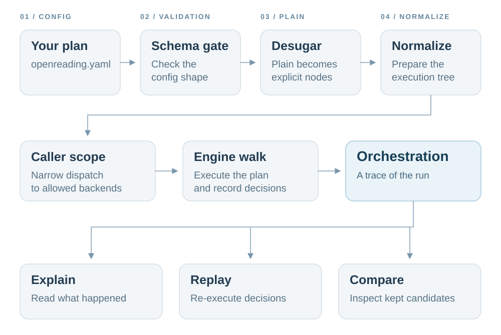
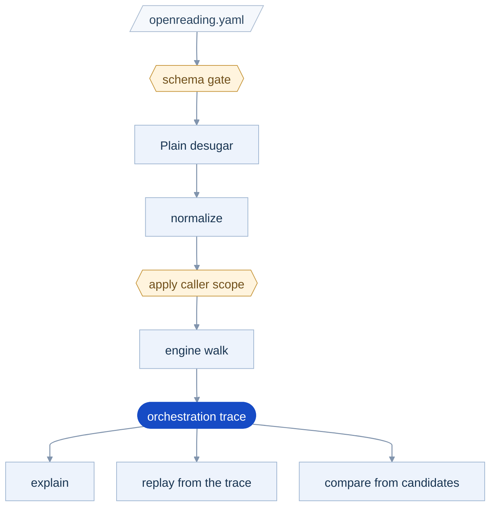
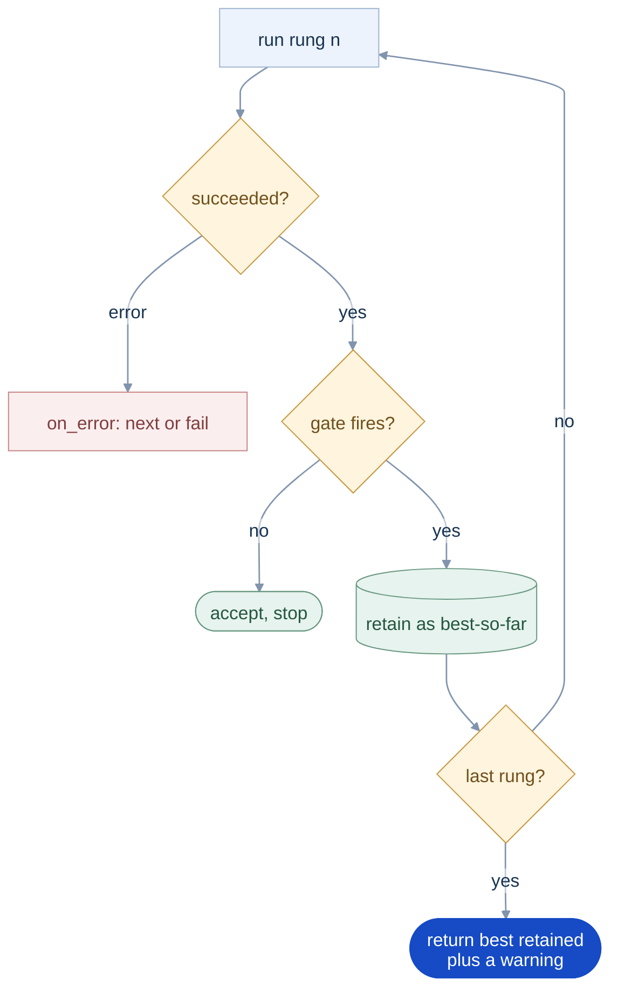

# Strategies: cascades, races, and compares under quality gates

<sub>[Docs home](../README.md) · [← Routing and keys](../router/README.md) · [Compare →](../comparison/README.md)</sub>

> **In one sentence.** A strategy in `openreading.yaml` says which backends run, in order or at
> once, and when to move on. Every run leaves a replayable trace.

## What this gives you

You have a local parser that is right on documents made by software and wrong on scans. A backend is
one parser, whether a local library, a self-hosted model, or a hosted API. A stronger backend reads
the scans well, but it is slower or bills every call. You want the cheap one first, the strong one
only when the cheap result cannot be trusted, and a record of why each call happened. A strategy is
that rule written once in `openreading.yaml` and invoked by name from the CLI, Python, or HTTP. For
example, `try: [pymupdf, tesseract]` with `escalate_when: looks_bad` runs `pymupdf` first and moves
on only when its output looks garbled or near-empty.

The engine walks the strategy, tests each result against quality gates, and keeps the best result so
far. A gate is one test on one result, for example whether the text is near-empty, judged against a
threshold. The response is the envelope, the one JSON document every backend returns. The engine
writes an `orchestration` block, the trace, onto that envelope. The trace records every attempt and
every gate with its observed value and threshold. It also records every backend dropped by
backend selection and every decision point an LLM was allowed to take. A decision point is a place in the
strategy where an LLM may choose, and step 7 builds one. You need `sample.pdf` from the root
README, and the walkthrough needs no key.

## Mental model

Your selected reading keeps the [same response JSON](../schemas/README.md#understanding-the-response-json), with `orchestration` explaining how the strategy chose it.
Check parse status separately from quality outcome, because a successful parse can still fall below your thresholds.

<!-- diagram:src-openreading-strategies-1 -->
<p align="center"><a href="../../../assets/diagrams/src-openreading-strategies-1.svg"></a></p>

<details>
<summary>Logical flow (Mermaid)</summary>



</details>

Hold the four facts below in mind, and every command on this page follows from them.

1. A strategy is a tree of five node kinds. A leaf runs one backend, and a cascade (`steps`) runs
   its children in order. A parallel node runs them at once and picks one. A route dispatches on
   facts known before parsing, and a decide node names a choice. Plain, the six-key short form you
   write, compiles to those nodes. `strategy show <name> --longhand` prints the result.
2. A gate is a verdict on one attempt, never on the document. `escalate_when: looks_bad` asks
   openreading's own probe about this backend's output. Is it garbled, near-empty, or a text-layer
   read of a scanned page? A gate that fires keeps the result as best-so-far and moves to the next
   rung. A rung is one step of a cascade, so the next rung is the next backend in order.
3. Every node runs the backend it names. Nothing in a strategy file infers a backend, so what a
   run will dispatch is what you can read in the file.
4. Every run leaves the same trace, whoever decided. The engine, a replayed trace, or an enabled LLM
   decider walk the same rails and write the same records. That is why `explain` narrates any run
   and `replay` reproduces one.

Plain is the short form you write, and it has six keys: `try`, `race`, `compare`, `then`,
`escalate_when`, `max_time`. `escalate_when` takes one or more of four judgment words: `looks_bad`,
`low_confidence`, `missing: [field]`, and `disagree`. There are no reserved words: every rung
names a backend or another strategy. `uv run openreading strategy --help` prints the whole
language, and each key is shown in use below.

## Walkthrough

Start from the root README's sample document. Write four strategies over `pymupdf` and `tesseract`,
the two local backends the root README sets up. Neither needs a key, though `tesseract` needs its
system binary. Run `uv run openreading backends` and check that both say `yes` under CONFIGURED.
Work in `scratch/`, which `.gitignore` already covers, so the walkthrough leaves your clone clean.
Timings vary between runs.

```bash
mkdir -p scratch && cd scratch
uv run python -c 'from openreading.testing.sample_pdf import build_sample_pdf; open("sample.pdf","wb").write(build_sample_pdf())'
```

### 1. Write the file and validate it

Save this as `openreading.yaml` in `scratch/`. Commands find `./openreading.yaml` in the directory
you run them from, and `--config PATH` points them elsewhere.

```yaml
version: 1                          # required, the config format version
strategies:                         # the library of named strategies
  main:
    try: [pymupdf, tesseract]       # run in order
    escalate_when: looks_bad        # move on when the quality probe distrusts a result
    max_time: "2m"                  # give up after this long, for the whole strategy
  quick:
    race: [pymupdf, tesseract]      # run at once, first success wins
  both:
    compare: [pymupdf, tesseract]   # run at once, keep the one that passes more quality checks
    then: aws-textract              # where compare sends the document when it cannot trust the winner
  fields:
    try: [pymupdf, tesseract]
    escalate_when:
      missing: [total]              # a typed field you asked for did not come back
```

In `compare:`, "better" means "passes more of the default quality bundle", not "read the document
more accurately". The engine runs both backends and scores each result against that bundle, which
asks four questions. Is this a scan, is the text garbled, are too many pages near-empty, and is the
backend's own confidence low? A result's score is the fraction of those four it passes, counting
only the ones that backend can answer. None of the four checks the output against what the document
says, so two clean results tie at 1.0. A tie goes to the cheaper backend, and then to whichever you
listed first. Step 4 shows that happening on `sample.pdf`. When the question is which backend is
correct, run `leaderboard` against labels you wrote ([Evals](../evals/README.md)).

```bash
uv run openreading strategy validate
```
```text
WARNING …/openreading.yaml:strategies.fields.steps[0].escalate_if: missing: 'pymupdf' cannot produce typed fields, so this criterion fires on every document. This rung will always escalate
  main: dialect: plain
      try: [pymupdf, tesseract]
      escalate_when: looks_bad
      max_time: 2m
    → Tries pymupdf, then tesseract, moving on when a step fails, or the result looks bad. Stops after 2m.
  …
…/openreading.yaml: 0 error(s), 1 warning(s)
```

<details><summary>Full output</summary>

```text
WARNING …/openreading.yaml:strategies.fields.steps[0].escalate_if: missing: 'pymupdf' cannot produce typed fields, so this criterion fires on every document. This rung will always escalate
  main: dialect: plain
      try: [pymupdf, tesseract]
      escalate_when: looks_bad
      max_time: 2m
    → Tries pymupdf, then tesseract, moving on when a step fails, or the result looks bad. Stops after 2m.
  …
  both: dialect: plain
      compare: [pymupdf, tesseract]
      then: aws-textract
    → Runs pymupdf and tesseract at once and keeps the better result; if they disagree or the winner looks bad, sends the document to aws-textract.
  …
  what the words mean:
    looks bad       openreading's quality probe flags the result: garbled text, over 20% near-empty pages,
    …
…/openreading.yaml: 0 error(s), 1 warning(s)
```

</details>

**You should see** a dialect badge, the body as written, and one plain-English sentence per
strategy. A warning never fails validation, so the exit code is 0. The warning is right, and step 5
shows what it predicts. A gate that can never fire on a rung is an error, and the exit code is 3:

```bash
printf 'version: 1\nstrategies:\n  trusting:\n    try: [pymupdf, tesseract]\n    escalate_when: {low_confidence: 0.7}\n' > lowconf.yaml
uv run openreading strategy validate --config lowconf.yaml
```
```text
ERROR lowconf.yaml:strategies.trusting.steps[0].escalate_if: the low_confidence check can never fire on 'pymupdf', which reports no confidence. Add a criterion that works everywhere, e.g. `looks_bad: true`
…
lowconf.yaml: 1 error(s), 0 warning(s)
```

The `ERROR` line goes to stderr and the summary goes to stdout, so redirect both when you save the
output.

### 2. See what Plain compiles to

Longhand shows you exactly which checks a Plain word turned into. A preset is a strategy that
ships with openreading, ready to run by name. `strategy list` prints every preset, then your
four strategies with the file they came from. `strategy show main` prints the Plain body as you
wrote it, and the `--longhand` flag prints what it became:

```bash
uv run openreading strategy show main --longhand
```
```yaml
main:
  steps:
  - backend: pymupdf
    escalate_if:
      any_of:
      - all_of:
        - scanned_pages_detected: true
        - chars_per_page_below: 100
      - garbled: true
      - empty_pages_over: 0.2
  - backend: tesseract
  budget:
    max_duration: 2m
```

**You should see** `looks_bad` become four predicates under one `any_of`, attached to `pymupdf`
only. The scan pair is bound by `all_of`, so a scan counts only when the page also came back
near-empty. A predicate is one named check with a threshold, such as `empty_pages_over: 0.2`.
`max_time` becomes a `budget:` on the root. Plain hangs its gate on every rung but the last, so a
Plain cascade always accepts what its final backend returned. A gate written on the last rung in
longhand does fire. `strategy normalize` prints every strategy in the file this way. A preset
prints its built-in longhand, which carries an `intent:` line Plain cannot spell:

```bash
uv run openreading strategy show cost_saver
```
```yaml
cost_saver:
  intent: Local parse first; escalate to a hosted backend only on bad quality.
  steps:
  - pymupdf
  - docling
  - aws-textract
  escalate_if: default
```

Source: `src/openreading/strategies/presets.py` (`PRESETS` and the "≈" equivalence table). Live
truth: `uv run openreading strategy show <preset>`. If this table and that output disagree, the
output is right. Fix the table.

| Preset | Plain near-equivalent | Differs from Plain in |
|---|---|---|
| `cost_saver` | `try: [pymupdf, docling, aws-textract]` + `escalate_when: {looks_bad: true, low_confidence: true}` | `intent:`, and a bare `scanned_pages_detected` instead of the scan pair |
| `max_accuracy` | `try:` naming the two backends you trust most + the same `escalate_when` | same |
| `offline_first` | `try: [pymupdf, tesseract, docling]` + the same `escalate_when` | same, and what keeps a run local is `policy: {backends: [pymupdf, tesseract, docling]}`, not the preset |
| `fast` | `race: [pymupdf, tesseract]` | `intent:` only |

### 3. Run a strategy and read the explanation

`explain` tells you why a run chose the backend it did, one gate at a time.

```bash
uv run openreading parse sample.pdf --strategy main > main.json
uv run openreading explain main.json
```
```text
strategy main  →  pymupdf (ok)
  root.steps[0]    pymupdf      succeeded                     55ms  $0
      looks_bad
        scanned_pages_detected   obs=False thr=True  ok
        chars_per_page_below     obs=167.0 thr=100  ok
        garbled                  obs=0.0073 thr=True  ok
        empty_pages_over         obs=0.0 thr=0.2  ok
```

**You should see** the gate rows grouped under the Plain word you wrote, each with its observed
value and threshold. Every row is `ok`, so `tesseract` never runs. Check: `jq -c '{outcome:
.orchestration.outcome, chosen: .orchestration.chosen_backend}' main.json` prints
`{"outcome":"ok","chosen":"pymupdf"}`. The same two commands with `--strategy quick` show a race.
`pymupdf` shows `succeeded`, `tesseract` shows `raced_lost`, and no gate rows appear because a race
has no gates.

### 4. Compare two backends, keep the loser, and diff them

One run with `--keep-candidates` gives you both outputs to diff, with no second run. The flag
retains every branch's output under `orchestration.candidates[]`, and `compare --from` reads the
winner and the losers from that one file.

```bash
uv run openreading parse sample.pdf --strategy both --keep-candidates > both.json
uv run openreading explain both.json
uv run openreading compare --from both.json --format table
```
```text
strategy both  →  pymupdf (ok)
  root.steps[0].parallel[0] pymupdf      succeeded                        -  $0
      disagree
        disagreement_over        obs=0.0 thr=0.3  ok
      …
  root.steps[0].parallel[1] tesseract    judged_lost                      -  $0
```
```text
COMPARE — 2 subjects (pairwise)
…
CONTENT: MIXED  (text:agree  table_cells:diverge)
…
  [ warn] table_shape_mismatch  {pymupdf, tesseract}  — table counts differ: {'pymupdf': 1, 'tesseract': 0}
```

**You should see** a `disagree` row of `0.0` and the `then:` rung never reached. The two texts
share every word, so nothing disagrees. The findings below the trace are the subject of
[Compare](../comparison/README.md).

Now write the same pair the other way round and run it again.

```bash
printf 'version: 1\nstrategies:\n  flipped:\n    compare: [tesseract, pymupdf]\n' > flipped.yaml
uv run openreading parse sample.pdf --config flipped.yaml --strategy flipped > flipped.json
uv run openreading explain flipped.json
```
```text
strategy flipped  →  tesseract (ok)
  root.parallel[0] tesseract    succeeded                        -  $0
  root.parallel[1] pymupdf      judged_lost                      -  $0
```

**You should see** the winner change to `tesseract` on the same document, and this is the tie from
step 1 resolving to list order. Compare's output two blocks up says tesseract lost the whole table,
so the winner here is not the better read of the document. Order the list by which backend you
would rather have when the quality checks cannot separate them.

`judged_lost` is also the entire record of that choice. Check: `jq -c '.orchestration.decisions'
flipped.json` prints `[]`. `decisions[]` records only the decision points an LLM is allowed to take
over. Those are a `decide:` node and a `review_if:` gray band, both built in step 7. A gray band is
a range of scores where a result is neither clearly good nor clearly bad. A plain `pick: best`
selection with no `judge:` block is neither. It leaves no decision record and no quality number
anywhere in the trace. What you can audit is which backend won, which lost, and under which
category.

### 5. Escalate on a missing field

A typed field you asked for and did not get can send a document up the ladder by itself.

```bash
uv run openreading parse sample.pdf --strategy fields > fields.json && uv run openreading explain fields.json
```
```text
strategy fields  →  tesseract (ok)
  root.steps[0]    pymupdf      quality_escalated             56ms  $0
      missing
        fields_required          obs=['total'] thr=['total']  FIRED
  root.steps[1]    tesseract    succeeded                    473ms  $0
```

**You should see** what the step-1 warning predicted. `pymupdf` returns no typed fields, so `total`
is missing. The gate fires, and the document climbs to `tesseract`. `jq -c '[.warnings[].code]'
fields.json` prints `["quality_escalated"]`. An escalation is a warning on the envelope, never an
error.

### 6. Set the default backend chain

The `policy:` block supplies the ordered chain an unnamed request walks. A strategy leaf names
its own backend and runs it, list or no list. Save this as `local.yaml`:

```yaml
version: 1
policy:
  backends: [pymupdf, tesseract]
strategies:
  onprem:
    try: [pymupdf, reducto, tesseract]
    escalate_when: looks_bad
```

```bash
uv run openreading route sample.pdf --config local.yaml
uv run openreading strategy plan sample.pdf --config local.yaml --strategy onprem
```
```json
{ "chosen": "pymupdf", "fallbacks": ["tesseract"], "dropped": {}, "terminal_reason": null }
```
```json
{ "strategy": "onprem", "config_hash": "sha256:…",
  "eligible": ["pymupdf", "tesseract"],
  "dropped": [],
  "tree": { "steps": [ { "backend": "pymupdf", "escalate_if": { "any_of": [ "…" ] } },
                       { "backend": "reducto" }, { "backend": "tesseract" } ] } }
```

**You should see** your two-name list as the chain in `route`, and all three rungs still standing
in the plan. That is the distinction worth learning here, and it is not a bug.

`policy.backends` is the chain a request that names NO backend resolves to. `routing.fallback`
reorders within it and never adds to it. But naming a backend, whether with `--backend reducto` or
as a rung inside your own strategy, is an explicit act by the author of that file, and it runs. On
one machine the operator and the caller are the same person, and refusing what they just wrote
helps nobody. What stops the reducto rung here is that no `REDUCTO_API_KEY` is set, which the
attempt reports as `skipped (missing_credentials)` before anything leaves the machine.

> [!IMPORTANT]
> The enforcement boundary, for the case where the operator and the caller are two different
> people, is the server's API-key scope. `OPENREADING_API_KEY_SCOPES` refuses a backend outside a
> token's scope with `scope_denied` before any credential is resolved, whatever the request named,
> and prunes a strategy's rungs to what that token may reach. [The HTTP
> server](../server/README.md) has the walkthrough.
>
> This file used to prune a rung against a compliance policy instead: `require_local: true`
> dropped `reducto` with `not_local`, from a per-vendor table core kept in its own source. Core
> holds no fact it cannot verify, and it could verify none of that.

### 7. Declare a decision point, run it without an LLM, replay it

A decision point lets an LLM choose between strategies while the engine keeps a safe default. A
`decide:` node names a choice among strategies, and the engine always takes `otherwise:` unless an
enabled LLM decider picks instead. The other decision point is a `review_if:` gray band on a rung.
Inside that band, accepting the result or escalating becomes a choice rather than a rule. Save this
as `choose.yaml`:

```yaml
version: 1
decider:                                        # the LLM decider, inert until OPENREADING_LLM_DECIDER=1 is also set
  llm: { backend: anthropic-claude, timeout: 5s }
strategies:
  text_layer: { steps: [pymupdf], escalate_if: off }
  ocr: { steps: [tesseract], escalate_if: off }
  choose:
    decide:
      among: [strategy:text_layer, strategy:ocr]  # the closed candidate list
      otherwise: strategy:text_layer              # the engine's answer, always present
    intent: Photographed pages do better on OCR, and born-digital pages on the text layer.
  band:
    steps:
      - backend: pymupdf
        review_if:                                # gray band: accept or escalate is a decision
          confidence_below: { value: 0.85, on_missing: escalate }
      - tesseract
```

```bash
uv run openreading parse sample.pdf --config choose.yaml --strategy choose > choose.json && uv run openreading explain choose.json
OPENREADING_LLM_DECIDER=1 uv run openreading parse sample.pdf --config choose.yaml --strategy choose > choose2.json && uv run openreading explain choose2.json
```
```text
strategy choose  →  pymupdf (ok)
  root.decide.otherwise->text_layer.steps[0] pymupdf      succeeded                     63ms  $0
  decision root                 point=decide  chosen=otherwise  decider=engine  downgraded=env_disabled
```

**You should see** the same choice both times, with a different reason. The first run ends
`downgraded=env_disabled`, and the second ends `downgraded=unavailable`. With
`OPENREADING_LLM_DECIDER=1` set, the decider is switched on and allowed to choose. A wire executor
is the code that makes the real LLM call, and none ships yet. The engine default stands, and the
record says so. Replay the second run, and every decision point takes the choice logged in the
trace:

```bash
uv run openreading replay sample.pdf --config choose.yaml --trace choose2.json > replay.json
jq -c '.orchestration.decisions[] | {point, chosen, decider, downgraded}' replay.json
```

**You should see** `{"point":"decide","chosen":"otherwise","decider":"trace","downgraded":null}`.
The decider is now the trace itself, and no downgrade applies. The gray band on `pymupdf`, which
reports no confidence, escalates by its `on_missing` rule and records a `gate_band` decision:

```bash
uv run openreading parse sample.pdf --config choose.yaml --strategy band > band.json && uv run openreading explain band.json
```
```text
strategy band  →  tesseract (ok)
  root.steps[0]    pymupdf      review_escalated              55ms  $0
      confidence_below           obs=None thr=0.85  FIRED
  root.steps[1]    tesseract    succeeded                    473ms  $0
  decision root.steps[0].review_if point=gate_band  chosen=escalate  decider=engine  downgraded=env_disabled
```

**You should see** `tesseract` answer after `pymupdf` ends `review_escalated`, with the band's
`confidence_below` gate `FIRED` on `obs=None`. Check: `jq -c '.orchestration.decisions[0] | {point,
chosen}' band.json` prints `{"point":"gate_band","chosen":"escalate"}`.

### 8. Ask for thresholds from a sample

`calibrate` proposes thresholds measured on your own documents instead of leaving you to guess. It
runs the strategy's first rung over a dataset and scores the results with the eval scorers. It then
sweeps each gated threshold across its range and proposes an `escalate_if:` block. It never
rewrites your file. Point it at `main`, the Plain strategy from step 1.

```bash
uv run openreading calibrate ../src/openreading/evals/sample --strategy main --target-escalation 0.15
```
```json
{ "strategy": "main", "n_docs": 1, "n_scored": 1,
  "rung1_backend": "pymupdf", "rung2_backend": "tesseract",
  "target_escalation": 0.15,
  "sweeps": [], "recommended": {} }
```

**You should see** an empty report, and more documents will not fill it. `calibrate` sweeps exactly
one shape of gate, a numeric predicate written directly under `escalate_if` on the first rung. Step
2 showed what `looks_bad` compiles to, an `any_of` block, and `calibrate` never looks inside an
`any_of` or an `all_of`. Every Plain judgment word compiles that way, so a strategy written in
Plain has nothing to sweep at any sample size. Six predicates qualify:
`confidence_below`, `page_confidence_below`, `chars_per_page_below`, `table_sanity_below`,
`empty_pages_over`, `garble_score_over`. Source: `openreading.strategies.calibrate`
(`_PREDICATE_SIGNAL`).

Write the gate flat, and the same one case sweeps.

```bash
cat > longhand.yaml <<'YAML'
version: 1
strategies:
  sweepable:
    steps:
      - backend: pymupdf
        escalate_if:
          chars_per_page_below: 100   # flat and numeric, so calibrate can sweep it
      - tesseract
YAML
uv run openreading calibrate ../src/openreading/evals/sample --strategy sweepable \
  --config longhand.yaml --target-escalation 0.15 \
  | jq -c '{n_docs, n_scored, points: (.sweeps[0].points[0:4]), n_points: (.sweeps[0].points|length), recommended}'
```
```json
{"n_docs":1,"n_scored":1,"points":[{"threshold":0.0,"escalation_rate":0.0,"scorer_agreement":1.0},{"threshold":100.0,"escalation_rate":0.0,"scorer_agreement":1.0},{"threshold":200.0,"escalation_rate":0.0,"scorer_agreement":1.0},{"threshold":300.0,"escalation_rate":1.0,"scorer_agreement":0.0}],"n_points":31,"recommended":{"escalate_if":{"chars_per_page_below":0.0}}}
```

**You should see** 31 operating points where there were none, from the same single document. A
point is one candidate threshold with what it would have done to this sample. `escalation_rate` is
the share of documents that would have climbed to rung 2, which is the figure you multiply by
your own rung-2 rate. A point used to carry a `cost_per_doc` doing that multiplication for you,
from a rate this package had written down about a vendor; it is gone.
`scorer_agreement` is how often the gate agreed with the labels.

Two terms decide that last number and neither has a flag. `quality_bar` is the eval score below
which a document counts as one that should have escalated, and it is fixed at 0.8 in
`openreading.strategies.calibrate`. `scorer_agreement` is then the fraction of labeled documents
where the gate's decision to fire matched that label. An unlabeled case is left out of the fraction
rather than counted as agreeing.

The `recommended` block is picked by one of two rules. With `--target-escalation`, the winner is
the point whose escalation rate is closest to your target, and agreement only breaks a tie between
equally close points. Without the flag, the winner is the point with the highest agreement. The
flag asks for a rate you can afford. Omitting it asks for the threshold that best matches your
labels. The two often disagree, so run it both ways and look at both.

Three reports deserve suspicion before you paste one into your file.

- **A degenerate threshold.** `chars_per_page_below: 0.0` above is a gate that can never fire.
  Achievable escalation rates come in steps of one over the sample size. A target between two of
  them lands on the nearest point, and at the bottom of the range that point disables the gate.
  Nothing in the report marks this, so read the threshold before pasting it.
- **A flat sweep.** Every point in the sweep carrying the same escalation rate and the same
  agreement means the predicate separated nothing at this sample. A recommendation is emitted
  anyway. A gate on a signal the rung-1 backend never reports does this every time. Collapse the
  points and count what is left:
  ```bash
  printf 'version: 1\nstrategies:\n  nosignal:\n    steps:\n      - backend: pymupdf\n        escalate_if: {confidence_below: 0.6, garbled: true}\n      - tesseract\n' > nosignal.yaml
  uv run openreading calibrate ../src/openreading/evals/sample --strategy nosignal --config nosignal.yaml \
    | jq -c '[.sweeps[0].points[] | {escalation_rate, scorer_agreement}] | unique'
  ```
  ```json
  [{"escalation_rate":0.0,"scorer_agreement":1.0}]
  ```
  One element from 21 thresholds means `pymupdf` reports no confidence, so the gate never fires
  anywhere and the sweep measured nothing.
- **No labels at all.** A dataset whose cases carry no recognized `expected` dimension reports
  `n_scored: 0` and `scorer_agreement: 0.0` at every point, and still recommends. That zero means
  nothing was measured, not that the gate is wrong.

Build a dataset with [Evals](../evals/README.md), and calibrate on documents you did not also score
the leaderboard on.

## Recipes

**Apply a preset when no backend is named.** Put `defaults: {strategy: offline_first}` above
`strategies:`. A request with `backend.id: null`, or `openreading.run("sample.pdf",
backend=None, config="defaults.yaml")`, then runs `offline_first`. `backend.id: "strategy:none"` or
`--no-strategy` forces the plain router. The CLI needs exactly one of `--backend`, `--strategy`,
`--no-strategy`. Use it to change a fleet's default without touching callers.

**Hedge a slow primary.** Put `{backend: tesseract, start_after: 5s}` beside `pymupdf` in a
`parallel:` node with `pick: fastest` and `on_win: cancel`. `explain` shows `pymupdf succeeded` and
`tesseract raced_lost`. `jq '.orchestration.attempts[1].detail'` says `"cancelled"`, because the
hedge was parked and never ran. Use it when a primary is usually fast but sometimes stalls.

**Shadow a second backend for audit.** Put `{backend: tesseract, shadow: true}` beside `pymupdf`
in a `parallel:` node with `pick: best`. `explain` shows `pymupdf succeeded` and `tesseract shadow`.
The shadow is fully recorded and its cost is counted, but it is never allowed to win. Use it to
gather calibration evidence on a slice of traffic.

**Route by document type from Python.** Use the advanced grammar `route: {rules: [{when: {doc_type:
[invoice]}, use: strategy:ocr_only}], default: strategy:text_first}` with those two strategies
defined. `openreading.run("sample.pdf", strategy="front", config="advanced.yaml",
routing={"doc_type_hint": "invoice"})["orchestration"]["chosen_backend"]` prints `tesseract`.
Without the hint it prints `pymupdf`. A PyMuPDF deprecation line precedes each answer on stdout. It
comes from the library, not from openreading. An uncomputable fact never errors, because `default:`
catches it.

**Climb to a hosted rung only on bad quality** (needs `REDUCTO_API_KEY`, a hosted key, so the shape
is shown and not run). Write `try: [pymupdf, reducto]` with `escalate_when: looks_bad`. On a
born-digital PDF the trace ends at `pymupdf` and no hosted call leaves your machine. On a scan the
`cheap_first` example in the `openreading.strategies.presets` docstring shows `pymupdf
quality_escalated`, then `reducto succeeded`, with the credits Reducto reported in
`usage.credits`. To have an LLM judge a `compare` instead of the
engine's score, add `judge: {backend: anthropic-claude, intent: "Prefer complete line-item
tables."}` beside `pick: best` in the longhand. Without `OPENREADING_LLM_DECIDER=1` the record says
`downgraded=env_disabled`.

> [!WARNING]
> Every hosted rung that runs is a call on your key, losers, shadows, and judges included. The
> trace names each one, and core quotes no price for any of them.

**Audit one agent's run from another.** A second agent can check a strategy run without trusting
the first. The trace carries everything the check needs. `config_hash` pins the config that ran.
`eligible` is the candidate list the engine enumerated, so `chosen in eligible` proves the
choice was in bounds. `decision_id` is byte-stable across a run and its replay, so a replay that
produces different ids means the inputs were not the same. Gate records carry `skipped` when a
signal could not be measured, which is what stops an unmeasurable gate from reading as a passing
one. Save this as `verify_run.py`, using the `choose.yaml` from step 7:

```python
import json, sys
run, rep = json.load(open(sys.argv[1])), json.load(open(sys.argv[2]))
a, b = run["orchestration"], rep["orchestration"]
assert a["config_hash"] == b["config_hash"], "config differs"
for d in a["decisions"]:
    if d["point"] == "route":            # different record shape, no candidate list
        continue
    assert d["chosen"] in d["eligible"], f'out of bounds: {d["chosen"]}'
ids = [d.get("decision_id") for d in a["decisions"]]
assert ids == [d.get("decision_id") for d in b["decisions"]], "replay diverged"
for at in a["attempts"]:
    for g in at.get("gates", []):
        if g.get("skipped"):
            print(f'  unmeasured gate {g["predicate"]}: {g["skipped"]}')
print(f'ok: {len(ids)} decision(s) in bounds, ids stable, config {a["config_hash"][:14]}…')
```

```bash
uv run openreading parse sample.pdf --config choose.yaml --strategy band > band.json
uv run openreading replay sample.pdf --config choose.yaml --strategy band --trace band.json > band-replay.json
uv run python verify_run.py band.json band-replay.json
```
```text
  unmeasured gate confidence_below: signal_unavailable
ok: 1 decision(s) in bounds, ids stable, config sha256:…
```

**You should see** the gray band's gate reported as unmeasured, because `pymupdf` emits no
confidence, and the one decision confirmed in bounds. Replay needs the document and the config, not
only the trace. A `route:` node's record is skipped by the loop above because it is a different
shape, with an integer `chosen` and no `eligible`.

## How it decides

These rules keep a strategy within its explicit plan, expose failures, and record each attempt.
Each rule names the failure it avoids and where it is enforced.

- Without a config file, nothing changes. The strategy package is not even imported, so an upgrade
  cannot alter a request that named its backend. The rule lives in `openreading.strategies`
  ("Two invariants"), and a subprocess test proves it.
- Every leaf runs the backend it names, and no leaf resolves one at dispatch. `policy.backends`
  is the chain an unnamed request walks, never a rung's target.
- Deciders choose, and they never widen the set. Candidates are enumerated after pruning, and the
  decider's tool schema is that list as an enum (`openreading.strategies.decider` §3). An out-of-set
  choice is impossible, not merely discouraged.
- The engine keeps the best result. A result that fails a gate is retained, never discarded. When
  rungs run out, the best retained result returns with `orchestration.outcome: degraded` and a
  `quality_below_threshold` warning. The docs home tells an agent to escalate on that row. When
  the time budget ends the walk instead, the same result returns with a `budget_exhausted` warning.
  The two codes are distinct, so you can count each cause separately. Escalating to a stronger
  backend is right for the first and wrong for the second. If nothing is retained, the engine
  raises `PlanExhaustedError` with the full trail (`openreading.strategies.engine`, Laws 1 to 4).
  Silence is never an outcome.
- A missing signal is never guessed. A criterion the backend cannot report is skipped and traced,
  for example `low_confidence` on `pymupdf`, which reports no confidence
  (`openreading.strategies.signals` §6). A fabricated verdict would be indistinguishable from a
  measured one.
- Thresholds err toward escalation. A false escalation costs one extra call, but a false
  acceptance costs correctness (`openreading.strategies.signals` §1).
- Turning the decider on takes two separate steps. It runs only with a `decider:` block and
  `OPENREADING_LLM_DECIDER` set, and no request field can enable it
  (`openreading.strategies.decider` §1). A caller cannot talk a service into consulting an LLM its
  operator did not deploy.
- Every attempt is on the record, and none of them carries a price. The trace names every
  backend that ran, winners, losers, shadows and judges alike, so a reader can count the calls a
  run made (`openreading.strategies.plain`, "Guardrails"). It used to also total them as
  `usage.cost_usd`, folding a `cost_basis` across rungs. Most of what that summed was a published
  rate this package had typed into its own source and applied to a page count, indistinguishable
  once totalled from money someone was actually charged. Both are gone: count the attempts here,
  and price them from your provider invoice.

Every threshold this page prints has a written derivation, and they all live in one document. `uv
run python -m pydoc openreading.strategies.signals` is that catalog. It gives each signal's formula,
the cut its default sits at, and the field-tested source behind that cut. It also names the failure
the signal is known to have. It is what makes `garbled obs=0.0073 thr=True` in step 3 readable.
The garble score is a weighted blend of character-level tells, and `garbled: true` fires above 0.3.
The word-like test inside it assumes Latin script, so healthy Cyrillic or CJK text scores above
that cut. Read the catalog before you change one of these numbers, and before you defend one.

This is the ladder a `try` with `escalate_when` walks for each rung:

<!-- diagram:src-openreading-strategies-2 -->
<p align="center"><a href="../../../assets/diagrams/src-openreading-strategies-2.svg"></a></p>

<details>
<summary>Logical flow (Mermaid)</summary>



</details>

The category column in `explain` is the closed vocabulary `CATEGORIES` in
`openreading.strategies.trace`. This page showed `succeeded`, `quality_escalated`,
`review_escalated`, `raced_lost`, `judged_lost`, and `shadow`.

## Reference

- `uv run python -m pydoc openreading.strategies` prints the map, discovery, precedence, and the
  FAQ.
- `uv run python -m pydoc openreading.strategies.plain` prints the whole language, what `looks_bad`
  checks, the desugaring table, and the validation catalog.
- `uv run python -m pydoc openreading.strategies.model` prints the full grammar, with the node
  kinds, every predicate, `on_error`, budgets, and `limits:`.
- `uv run python -m pydoc openreading.strategies.signals` is the threshold catalog: every signal's
  formula, its default cut, the field-tested source behind that cut, and its known failure mode.
- Also under `openreading.strategies` are `presets` (the cookbook) and `engine` (Outcomes and
  laws, including the score behind `pick: best`). The other two are `decider` (decision points,
  downgrades) and `calibrate` (the sweep report and `quality_bar`).
- The schema is `src/openreading/schemas/strategy-config.v0.4.json`. The trace rides on
  `response.v0.3.json`.
- `uv run openreading strategy --help`, `explain --help`, `replay --help`, and `calibrate --help`
  document the flags. The exit codes are in `uv run python -m pydoc openreading.cli`, section
  "strategy <verb> / explain / replay / calibrate".

## Not built yet

- The decider wire executor: every enabled, eligible decision point resolves to its engine default
  as `downgraded=unavailable` (`openreading.strategies.decider`, "Status").
- A `compare_degraded` warning when a `compare` branch fails. Today only the attempt trail shows
  the failure (`openreading.strategies.plain`, "Semantics").
- A `hedged_start` warning, and a hedge that launches early when the primary fails
  (`openreading.strategies.presets`, cookbook 6).
- A bespoke message when one body mixes Plain and advanced keys. Today it is the generic located
  schema error (`openreading.strategies.plain`, "The boundary").
- `extends:` in a user file. The v0.2 schema rejects the key, so fork a preset by copying `strategy
  show` (`openreading.strategies`, "The five node types").
- The signal snapshot as trace telemetry. A signal reaches the trace only through a gate that names
  it (`openreading.strategies.signals` §1).
- The decider `timeout`, which is reserved and never fired (`openreading.strategies.decider` §3.3).
- Calibration over the full threshold vector. Each predicate sweeps independently
  (`openreading.strategies.calibrate`).

## See also

- [Docs home](../README.md)
- [Routing and keys](../router/README.md): the `policy.backends` default chain and credentials.
- [Compare](../comparison/README.md): the verdicts behind `compare --from`.
- [Evals](../evals/README.md): building the dataset `calibrate` needs.
- [The run ledger](../ledger/README.md): resuming and replaying whole runs.
- [Backend adapters](../adapters/README.md) · [JSON Schemas](../schemas/README.md)

<sub>[Docs home](../README.md) · [← Routing and keys](../router/README.md) · [Compare →](../comparison/README.md)</sub>
