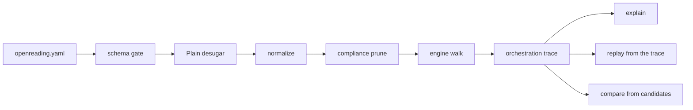
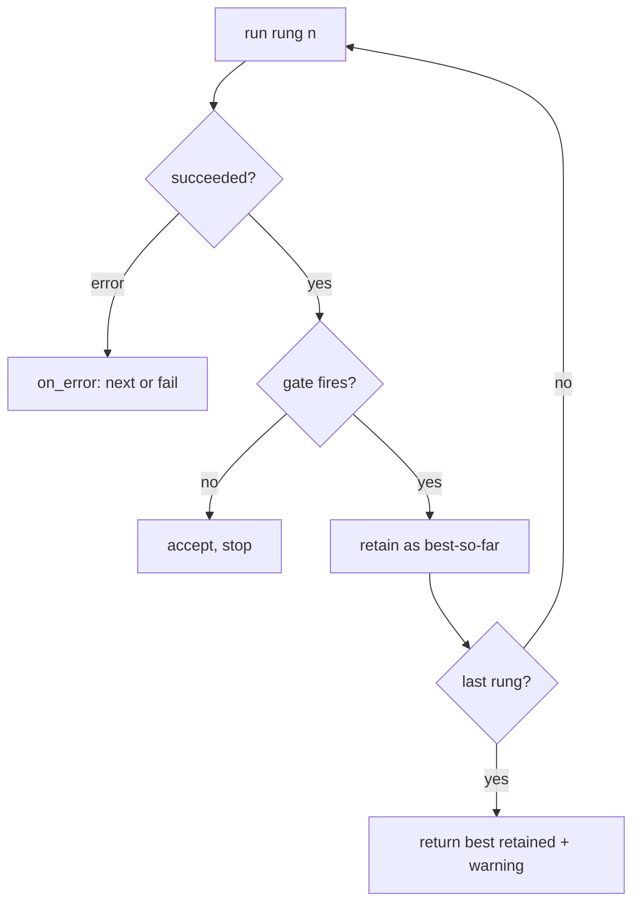

# Strategies: cascades, races, and compares under quality gates

<sub>[Docs home](../README.md) · [← Routing and keys](../router/README.md) · [Compare →](../comparison/README.md)</sub>

> **In one sentence.** A strategy in `openreading.yaml` says which backends run, in order or at
> once, and when to move on, and every run leaves a replayable trace.

## What this gives you

You have a local parser that is right on documents made by software and wrong on scans. A backend is
one parser, whether a local library, a self-hosted model, or a hosted API. A stronger backend reads
the scans well, but it is slower or bills every call. You want the cheap one first, the strong one
only when the cheap result cannot be trusted, and a record of why each call happened. A strategy is
that rule written once in `openreading.yaml` and invoked by name from the CLI, Python, or HTTP. For
example, `try: [pymupdf, tesseract]` with `escalate_when: looks_bad` runs `pymupdf` first and moves
on only when its output looks garbled or near-empty.

The engine walks the strategy, tests each result against quality gates, and keeps the best result so
far. A gate is one test on one result, for example whether the text is near-empty, judged against a
threshold. The response is the envelope, the one JSON document every backend returns. The engine
writes an `orchestration` block, the trace, onto that envelope. The trace records every attempt,
every gate with its observed value and threshold, every decision, and every backend dropped by
compliance. You need `sample.pdf` from the root README, and the walkthrough needs no key.

## Mental model



Hold the four facts below in mind, and every command on this page follows from them.

1. A strategy is a tree of five node kinds. A leaf runs one backend, and a cascade (`steps`) runs
   its children in order. A parallel node runs them at once and picks one. A route dispatches on
   facts known before parsing, and a decide node names a choice. Plain, the six-key short form you
   write, compiles to those nodes. `strategy show <name> --longhand` prints the result.
2. A gate is a verdict on one attempt, never on the document. `escalate_when: looks_bad` asks
   openreading's own probe about this backend's output. Is it garbled, near-empty, or a text-layer
   read of a scanned page? A gate that fires keeps the result as best-so-far and moves to the next
   rung. A rung is one step of a cascade, so the next rung is the next backend in order. The last
   rung is never gated.
3. Compliance prunes the tree before anything runs. The request's policy, `--policy`, and the file's
   own `policy:` block are combined, and the most restrictive wins. A dropped backend lands in
   `orchestration.dropped[]`. Nothing in the file can bring it back.
4. Every run leaves the same trace, whoever decided. The engine, a replayed trace, or an enabled LLM
   decider walk the same rails and write the same records. That is why `explain` narrates any run
   and `replay` reproduces one.

Plain is the short form you write, and it has six keys: `try`, `race`, `compare`, `then`,
`escalate_when`, `max_time`. `escalate_when` takes one or more of four judgment words: `looks_bad`,
`low_confidence`, `missing: [field]`, and `disagree`. `auto` is the one reserved word, and it stands
for the router's best remaining pick. `uv run openreading strategy --help` prints the whole
language, and each key is shown in use below.

## Walkthrough

Start from the root README's sample document. Write four strategies over the two backends every
install has, `pymupdf` and `tesseract`. Timings vary between runs.

```bash
uv run python -c 'from openreading.testing.sample_pdf import build_sample_pdf; open("sample.pdf","wb").write(build_sample_pdf())'
```

### 1. Write the file and validate it

Save this as `openreading.yaml` in the repo root. Commands find it there automatically, and
`--config PATH` points them elsewhere.

```yaml
version: 1                          # required; the config format version
strategies:                         # the library of named strategies
  main:
    try: [pymupdf, tesseract]       # run in order
    escalate_when: looks_bad        # move on when the quality probe distrusts a result
    max_time: "2m"                  # give up after this long, for the whole strategy
  quick:
    race: [pymupdf, tesseract]      # run at once, first success wins
  both:
    compare: [pymupdf, tesseract]   # run at once, keep the better result
    then: auto                      # if the winner cannot be trusted, the router's best remaining pick
  fields:
    try: [pymupdf, tesseract]
    escalate_when:
      missing: [total]              # a typed field you asked for did not come back
```

```bash
uv run openreading strategy validate
```
```text
WARNING …/openreading.yaml:strategies.fields.steps[0].escalate_if: missing: 'pymupdf' cannot produce typed fields, so this criterion fires on every document — this rung will always escalate
  main: dialect: plain
      try: [pymupdf, tesseract]
      escalate_when: looks_bad
      max_time: 2m
    → Tries pymupdf, then tesseract, moving on when a step fails, or the result looks bad. Stops after 2m.
  …
…/openreading.yaml: 0 error(s), 1 warning(s)
```

<details><summary>Full output</summary>

```text
WARNING …/openreading.yaml:strategies.fields.steps[0].escalate_if: missing: 'pymupdf' cannot produce typed fields, so this criterion fires on every document — this rung will always escalate
  main: dialect: plain
      try: [pymupdf, tesseract]
      escalate_when: looks_bad
      max_time: 2m
    → Tries pymupdf, then tesseract, moving on when a step fails, or the result looks bad. Stops after 2m.
  …
  both: dialect: plain
      compare: [pymupdf, tesseract]
      then: auto
    → Runs pymupdf and tesseract at once and keeps the better result; if they disagree or the winner looks bad, sends the document to the best available backend.
  …
  what the words mean:
    looks bad       openreading's quality probe flags the result: garbled text, over 20% near-empty pages,
    …
…/openreading.yaml: 0 error(s), 1 warning(s)
```

</details>

**You should see** a dialect badge, the body as written, and one plain-English sentence per
strategy. A warning never fails validation, so the exit code is 0. The warning is right, and step 5
shows what it predicts. A gate that can never fire on a rung is an error, and the exit code is 3:

```bash
printf 'version: 1\nstrategies:\n  trusting:\n    try: [pymupdf, tesseract]\n    escalate_when: {low_confidence: 0.7}\n' > lowconf.yaml
uv run openreading strategy validate --config lowconf.yaml
```
```text
ERROR lowconf.yaml:strategies.trusting.steps[0].escalate_if: the low_confidence check can never fire on 'pymupdf' — it reports no confidence; add a criterion that works everywhere, e.g. `looks_bad: true`
…
lowconf.yaml: 1 error(s), 0 warning(s)
```

### 2. See what Plain compiles to

Longhand shows you exactly which checks a Plain word turned into. A preset is a strategy that
ships with openreading, ready to run by name. `strategy list` prints every preset, then your
four strategies with the file they came from. `strategy show main` prints the Plain body as you
wrote it, and the `--longhand` flag prints what it became:

```bash
uv run openreading strategy show main --longhand
```
```yaml
main:
  steps:
  - backend: pymupdf
    escalate_if:
      any_of:
      - all_of:
        - scanned_pages_detected: true
        - chars_per_page_below: 100
      - garbled: true
      - empty_pages_over: 0.2
  - backend: tesseract
  budget:
    max_duration: 2m
```

**You should see** `looks_bad` become four predicates joined by `any_of`, attached to `pymupdf`
only. A predicate is one named check with a threshold, such as `empty_pages_over: 0.2`. `max_time`
becomes a `budget:` on the root. `strategy normalize` prints every strategy in the file this way. A
preset prints its built-in longhand, which carries an `intent:` line Plain cannot spell:

```bash
uv run openreading strategy show cost_saver
```
```yaml
cost_saver:
  intent: Local parse first; escalate to the router's best remaining pick only on
    bad quality.
  steps:
  - pymupdf
  - docling
  - auto
  escalate_if: default
```

Source: `src/openreading/strategies/presets.py` (`PRESETS` and the "≈" table). Live truth: `uv run
openreading strategy show <preset>`. If this table and that output disagree, the output is right.
Fix the table.

| Preset | Plain near-equivalent | Differs from Plain in |
|---|---|---|
| `cost_saver` | `try: [pymupdf, docling, auto]` + `escalate_when: {looks_bad: true, low_confidence: true}` | `intent:`; a bare `scanned_pages_detected` instead of the scan pair |
| `max_accuracy` | `try: [auto, auto]` + the same `escalate_when` | same |
| `offline_first` | `try: [pymupdf, tesseract, docling]` + the same `escalate_when` | same; enforcement is `policy: {require_local: true}`, not the preset |
| `fast` | `race: [pymupdf, tesseract]` | `intent:` only |

### 3. Run a strategy and read the explanation

`explain` tells you why a run chose the backend it did, one gate at a time.

```bash
uv run openreading parse sample.pdf --strategy main > main.json
uv run openreading explain main.json
```
```text
strategy main  →  pymupdf (ok)
  root.steps[0]    pymupdf      succeeded                     55ms  $0
      looks_bad
        scanned_pages_detected   obs=False thr=True  ok
        chars_per_page_below     obs=167.0 thr=100  ok
        garbled                  obs=0.0073 thr=True  ok
        empty_pages_over         obs=0.0 thr=0.2  ok
```

**You should see** the gate rows grouped under the Plain word you wrote, each with its observed
value and threshold. Every row is `ok`, so `tesseract` never runs. Check: `jq -c '{outcome:
.orchestration.outcome, chosen: .orchestration.chosen_backend}' main.json` prints
`{"outcome":"ok","chosen":"pymupdf"}`. The same two commands with `--strategy quick` show a race.
`pymupdf` shows `succeeded`, `tesseract` shows `raced_lost`, and no gate rows appear because a race
has no gates.

### 4. Compare two backends, keep the loser, and diff them

One run with `--keep-candidates` gives you both outputs to diff, with no second run. The flag
retains every branch's output under `orchestration.candidates[]`, and `compare --from` reads the
winner and the losers from that one file.

```bash
uv run openreading parse sample.pdf --strategy both --keep-candidates > both.json
uv run openreading explain both.json
uv run openreading compare --from both.json --format table
```
```text
strategy both  →  pymupdf (ok)
  root.steps[0].parallel[0] pymupdf      succeeded                        -  $0
      disagree
        disagreement_over        obs=0.0 thr=0.3  ok
      …
  root.steps[0].parallel[1] tesseract    judged_lost                      -  $0
```
```text
COMPARE — 2 subjects (pairwise)
…
CONTENT: MIXED  (text:agree  table_cells:diverge)
…
  [ warn] table_shape_mismatch  {pymupdf, tesseract}  — table counts differ: {'pymupdf': 1, 'tesseract': 0}
```

**You should see** a `disagree` row of `0.0` and the `then: auto` rung never reached. The two texts
share every word, so nothing disagrees. The findings below the trace are the
[Compare guide](../comparison/README.md)'s subject.

### 5. Escalate on a missing field

A typed field you asked for and did not get can send a document up the ladder by itself.

```bash
uv run openreading parse sample.pdf --strategy fields > fields.json && uv run openreading explain fields.json
```
```text
strategy fields  →  tesseract (ok)
  root.steps[0]    pymupdf      quality_escalated             56ms  $0
      missing
        fields_required          obs=['total'] thr=['total']  FIRED
  root.steps[1]    tesseract    succeeded                    473ms  $0
```

**You should see** what the step-1 warning predicted. `pymupdf` returns no typed fields, so `total`
is missing. The gate fires, and the document climbs to `tesseract`. `jq -c '[.warnings[].code]'
fields.json` prints `["quality_escalated"]`. An escalation is a warning on the envelope, never an
error.

### 6. Prune a rung with a policy inside the file

A policy inside the file removes a backend from the tree before anything runs. Compliance is the
set of rules about which backends may see a document, such as requiring a fully local one. Save
this as `local.yaml`. The `policy:` block is compliance, and it sits outside the strategy tree.

```yaml
version: 1
policy:
  require_local: true               # only fully-local backends may see the document
strategies:
  onprem:
    try: [pymupdf, reducto, tesseract]
    escalate_when: looks_bad
```

```bash
uv run openreading strategy validate --config local.yaml
uv run openreading strategy plan sample.pdf --config local.yaml --strategy onprem
```
```text
WARNING local.yaml:strategies.onprem.steps[1].backend: 'reducto' is filtered out by the policy (not_local); this step can never run in that compliance context — remove it or relax the policy
…
```
```json
{ "strategy": "onprem", "config_hash": "sha256:a2597d74…",
  "eligible": ["pymupdf", "docling", "tesseract", "qwen-vl"],
  "dropped": [ { "backend": "reducto", "stage": 1, "code": "not_local", "detail": "require_local set but backend is not fully local" } ],
  "tree": { "steps": [ { "backend": "pymupdf", "escalate_if": { "any_of": [ "…" ] } }, { "backend": "tesseract" } ] } }
```

**You should see** a two-rung tree where you wrote three. `plan` prints the pruned tree for this
document and policy, with no execution. Run it with `parse sample.pdf --config local.yaml --strategy
onprem > onprem.json`. `explain onprem.json` ends with the line `dropped reducto (stage 1:
not_local)`, and `jq -c '.orchestration.dropped' onprem.json` prints the same record. `--policy
phi.json` on `strategy plan`, `replay`, or `calibrate` combines with the file's block the same way.
`parse` has no `--policy` flag, so a parse gets its policy from the file or from Python's
`run(policy=)`.

> [!IMPORTANT]
> Nothing in the file can re-admit a dropped backend. A later rung, `then:`, `auto`, and an
> `intent:` line all leave the drop in place. A BAA is the signed agreement that lets a vendor
> handle protected health data. Drop codes and how to attest one are in the
> [Routing and keys guide](../router/README.md).

### 7. Declare a decision point, run it without an LLM, replay it

A decision point lets an LLM choose between strategies while the engine keeps a safe default. A
`decide:` node names a choice among strategies, and the engine always takes `otherwise:` unless an
enabled LLM decider picks instead. The other decision point is a `review_if:` gray band on a rung.
A gray band is a range of values where a result is neither clearly good nor clearly bad, so accept
or escalate becomes a choice. Save this as `choose.yaml`:

```yaml
version: 1
decider:                                        # the LLM decider; inert until the env gate is also set
  llm: { backend: anthropic-claude, timeout: 5s }
strategies:
  text_layer: { steps: [pymupdf], escalate_if: off }
  ocr: { steps: [tesseract], escalate_if: off }
  choose:
    decide:
      among: [strategy:text_layer, strategy:ocr]  # the closed candidate list
      otherwise: strategy:text_layer              # the engine's answer, always present
    intent: Photographed pages do better on OCR; born-digital pages on the text layer.
  band:
    steps:
      - backend: pymupdf
        review_if:                                # gray band: accept or escalate is a decision
          confidence_below: { value: 0.85, on_missing: escalate }
      - tesseract
```

```bash
uv run openreading parse sample.pdf --config choose.yaml --strategy choose > choose.json && uv run openreading explain choose.json
OPENREADING_LLM_DECIDER=1 uv run openreading parse sample.pdf --config choose.yaml --strategy choose > choose2.json && uv run openreading explain choose2.json
```
```text
strategy choose  →  pymupdf (ok)
  root.decide.otherwise->text_layer.steps[0] pymupdf      succeeded                     63ms  $0
  decision root                 point=decide  chosen=otherwise  decider=engine  downgraded=env_disabled
```

**You should see** the same choice both times, with a different reason. The first run ends
`downgraded=env_disabled`, and the second ends `downgraded=unavailable`. With the env gate set, the
decider is enabled and eligible. A wire executor is the code that makes the real LLM call, and none
ships yet, so the engine default stands and the record says so. Replay the second run, and every
decision point takes the choice logged in the trace:

```bash
uv run openreading replay sample.pdf --config choose.yaml --trace choose2.json > replay.json
jq -c '.orchestration.decisions[] | {point, chosen, decider, downgraded}' replay.json
```

**You should see** `{"point":"decide","chosen":"otherwise","decider":"trace","downgraded":null}`.
The decider is now the trace itself, and no downgrade applies. The gray band on `pymupdf`, which
reports no confidence, escalates by its `on_missing` rule and records a `gate_band` decision:

```bash
uv run openreading parse sample.pdf --config choose.yaml --strategy band > band.json && uv run openreading explain band.json
```
```text
strategy band  →  tesseract (ok)
  root.steps[0]    pymupdf      review_escalated              55ms  $0
      confidence_below           obs=None thr=0.85  FIRED
  root.steps[1]    tesseract    succeeded                    473ms  $0
  decision root.steps[0].review_if point=gate_band  chosen=escalate  decider=engine  downgraded=env_disabled
```

**You should see** `tesseract` answer after `pymupdf` ends `review_escalated`, with the band's
`confidence_below` gate `FIRED` on `obs=None`. Check: `jq -c '.orchestration.decisions[0] | {point,
chosen}' band.json` prints `{"point":"gate_band","chosen":"escalate"}`.

### 8. Ask for thresholds from a sample

`calibrate` proposes thresholds measured on your own documents instead of leaving you to guess. It
runs the strategy's first rung over a dataset, scores the results with the eval scorers, sweeps each
gated threshold, and proposes an `escalate_if:` block. It never rewrites your file.

```bash
uv run openreading calibrate src/openreading/evals/sample --strategy main --target-escalation 0.15
```
```json
{ "strategy": "main", "n_docs": 1, "n_scored": 1,
  "rung1_backend": "pymupdf", "rung2_backend": "tesseract",
  "target_escalation": 0.15, "max_cost_per_doc": null,
  "sweeps": [], "recommended": {} }
```

**You should see** the empty shape. The shipped sample has one case, and one point is not a curve to
sweep. Build a dataset of your own documents with the [Evals guide](../evals/README.md) and pass its
directory here.

## Recipes

**Opt `auto` traffic into a preset.** Put `defaults: {strategy: offline_first}` above `strategies:`.
A request with `backend.id: "auto"`, or `openreading.run("sample.pdf", backend="auto",
config="defaults.yaml")`, then runs `offline_first`. `backend.id: "strategy:none"` or
`--no-strategy` forces the plain router. The CLI needs exactly one of `--backend`, `--strategy`,
`--no-strategy`. Use it to change a fleet's default without touching callers.

**Hedge a slow primary.** Put `{backend: tesseract, start_after: 5s}` beside `pymupdf` in a
`parallel:` node with `pick: fastest` and `on_win: cancel`. `explain` shows `pymupdf succeeded` and
`tesseract raced_lost`. `jq '.orchestration.attempts[1].detail'` says `"cancelled"`, because the
hedge was parked and never ran. Use it when a primary is usually fast but sometimes stalls.

**Shadow a second backend for audit.** Put `{backend: tesseract, shadow: true}` beside `pymupdf`
in a `parallel:` node with `pick: best`. `explain` shows `pymupdf succeeded` and `tesseract shadow`.
The shadow is fully recorded and its cost is counted, but it is never allowed to win. Use it to
gather calibration evidence on a slice of traffic.

**Route by document type from Python.** Use the advanced grammar `route: {rules: [{when: {doc_type:
[invoice]}, use: strategy:ocr_only}], default: strategy:text_first}` with those two strategies
defined. `openreading.run("sample.pdf", strategy="front", config="advanced.yaml",
routing={"doc_type_hint": "invoice"})["orchestration"]["chosen_backend"]` prints `tesseract`.
Without the hint it prints `pymupdf`. An uncomputable fact never errors, because `default:` catches
it.

**Climb to a hosted rung only on bad quality** (needs `REDUCTO_API_KEY`, a hosted key, so the shape
is shown and not run). Write `try: [pymupdf, reducto]` with `escalate_when: looks_bad`. On a
born-digital PDF the trace ends at `pymupdf`, cost `$0`. On a scan the docstring's example shows
`pymupdf quality_escalated`, then `reducto succeeded` with its billed cost in `usage.cost_usd`. To
have an LLM judge a `compare` instead of the engine's score, add `judge: {backend: anthropic-claude,
intent: "Prefer complete line-item tables."}` beside `pick: best` in the longhand. Without
`OPENREADING_LLM_DECIDER=1` the record says `downgraded=env_disabled`.

> [!WARNING]
> Every hosted rung that runs is billed to your key, losers, shadows, and judges included.
> `usage.cost_usd` sums all of them.

## How it decides

These rules keep a strategy from widening compliance, hiding a failure, or spending money it did
not record. Each rule names the failure it avoids and where it is enforced.

- Without a file, nothing changes. Without a config the strategy package is not even imported, so
  an upgrade cannot alter a request that named its backend. The rule lives in
  `openreading.strategies` ("Two invariants"), and a subprocess test proves it.
- Compliance is outside the tree. Pruning happens in `openreading.strategies.prune` before the walk,
  and naming `compliance` in `on_error` is a load error. A file authored far from its deployment
  cannot leak a document to a backend the policy dropped.
- Deciders choose, and they never widen the set. Candidates are enumerated after pruning, and the
  decider's tool schema is that list as an enum (`openreading.strategies.decider` §3). An out-of-set
  choice is impossible, not merely discouraged.
- The engine keeps the best result. A result that fails a gate is retained, never discarded. When
  rungs run out, the best retained result returns with a `quality_below_threshold` warning. If
  nothing is retained, the engine raises `PlanExhaustedError` with the full trail
  (`openreading.strategies.engine`, Laws 1 to 4). Silence is never an outcome.
- A missing signal is never guessed. A criterion the backend cannot report is skipped and traced,
  for example `low_confidence` on `pymupdf`, which reports no confidence
  (`openreading.strategies.signals` §6). A fabricated verdict would be indistinguishable from a
  measured one.
- Thresholds err toward escalation. A false escalation costs one extra call, but a false
  acceptance costs correctness (`openreading.strategies.signals` §1).
- The decider needs two keys to turn on. It runs only with a `decider:` block and
  `OPENREADING_LLM_DECIDER` set, and no request field can enable it
  (`openreading.strategies.decider` §1). A caller cannot talk a service into consulting an LLM its
  operator did not deploy.
- The cost is honest. `usage.cost_usd` totals every attempt that ran, including winners, losers,
  shadows, and judges. The engine never estimates a price (`openreading.strategies.plain`,
  "Guardrails").

This is the ladder a `try` with `escalate_when` walks for each rung:



The category column in `explain` is the closed vocabulary `CATEGORIES` in
`openreading.strategies.trace`. This page showed `succeeded`, `quality_escalated`,
`review_escalated`, `raced_lost`, `judged_lost`, and `shadow`.

## Reference

- `uv run python -m pydoc openreading.strategies` prints the map, discovery, precedence, and the
  FAQ.
- `uv run python -m pydoc openreading.strategies.plain` prints the whole language, what `looks_bad`
  checks, the desugaring table, and the validation catalog.
- `uv run python -m pydoc openreading.strategies.model` prints the full grammar, with the node
  kinds, every predicate, `on_error`, budgets, and `limits:`.
- Also under `openreading.strategies` are `presets` (the cookbook), `engine` (Outcomes and laws),
  `decider` (decision points, downgrades), `signals` (the catalog), and `calibrate` (the sweep
  report).
- The schema is `src/openreading/schemas/strategy-config.v0.2.json`. The trace rides on
  `response.v0.3.json`.
- `uv run openreading strategy --help`, `explain --help`, `replay --help`, and `calibrate --help`
  document the flags. The exit codes are in `uv run python -m pydoc openreading.cli`, section
  "strategy <verb> / explain / replay / calibrate".

## Not built yet

- The decider wire executor: every enabled, eligible decision point resolves to its engine default
  as `downgraded=unavailable` (`openreading.strategies.decider`, "Status").
- A `compare_degraded` warning when a `compare` branch fails. Today only the attempt trail shows
  the failure (`openreading.strategies.plain`, "Semantics").
- A `budget_exhausted` warning on deadline. Today the engine emits `quality_below_threshold` only
  (`openreading.strategies.plain`, "Semantics").
- A `hedged_start` warning, and a hedge that launches early when the primary fails
  (`openreading.strategies.presets`, cookbook 6).
- A bespoke message when one body mixes Plain and advanced keys. Today it is the generic located
  schema error (`openreading.strategies.plain`, "The boundary").
- `extends:` in a user file. The v0.2 schema rejects the key, so fork a preset by copying `strategy
  show` (`openreading.strategies`, "The five node types").
- The signal snapshot as trace telemetry. A signal reaches the trace only through a gate that names
  it (`openreading.strategies.signals` §1).
- The decider `timeout`, which is reserved and never fired (`openreading.strategies.decider` §3.3).
- Calibration over the full threshold vector. Each predicate sweeps independently
  (`openreading.strategies.calibrate`).

## See also

- [Docs home](../README.md)
- [Routing and keys](../router/README.md): drop codes, `--policy`, attesting a BAA, bringing a key.
- [Compare](../comparison/README.md): the verdicts behind `compare --from`.
- [Evals](../evals/README.md): building the dataset `calibrate` needs.
- [The run ledger](../ledger/README.md): resuming and replaying whole runs.
- [Backend adapters](../adapters/README.md) · [JSON Schemas](../schemas/README.md)

<sub>[Docs home](../README.md) · [← Routing and keys](../router/README.md) · [Compare →](../comparison/README.md)</sub>
